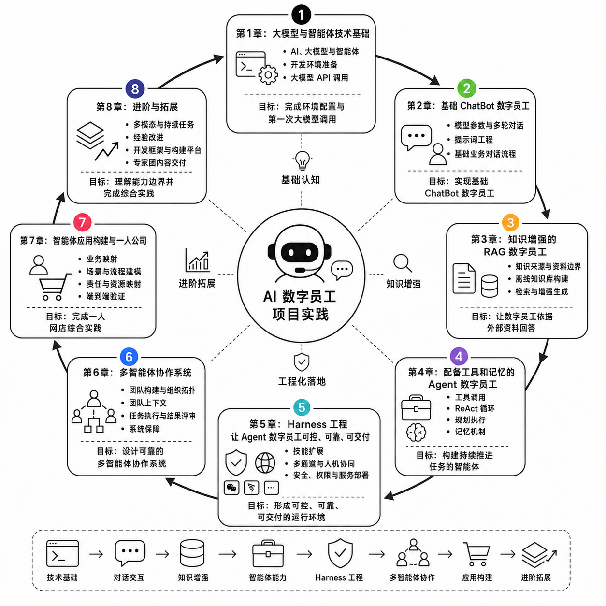

[中文](./README.md) | [English](./README-en.md)

# Hands-On Agent Building: From AI Digital Employees to One-Person Companies

This project is an open-source tutorial on building and developing agents for anyone interested in self-study. Across eight progressive chapters, it follows AI digital employees as a unifying theme and covers large language model calls, multi-turn conversations, RAG, tool calling, memory, Harness engineering, multi-agent collaboration, and application development. Each chapter includes foundational concepts, hands-on steps, and companion code. Basic proficiency in reading and running Python code is sufficient to get started.

This project grew out of an agent course I teach. Given the limits of my knowledge and experience, omissions and errors are inevitable. I am making it open source in the hope that we can learn, discuss, and improve it together.



## Content at a Glance

The tutorial follows the path “model calls → conversation → knowledge → action → governance → collaboration → application → extensions.”

| Chapter | Topic | Outcome | Text | Companion Code |
| --- | --- | --- | --- | --- |
| Chapter 1 | Foundations of Large Language Models and Agents | Set up the development environment and make your first LLM API call | [Read](./chapter1_basics/README-en.md) | [Code](./chapter1_basics/code/README-en.md) |
| Chapter 2 | A Basic ChatBot Digital Employee | Build a digital employee with a role prompt and multi-turn context | [Read](./chapter2_chatbot/README-en.md) | [Code](./chapter2_chatbot/code/README-en.md) |
| Chapter 3 | A Knowledge-Augmented RAG Digital Employee | Build a digital employee that answers questions using external materials | [Read](./chapter3_rag/README-en.md) | [Code](./chapter3_rag/code/README-en.md) |
| Chapter 4 | An Agent Digital Employee with Tools and Memory | Build an agent with tool calling, a ReAct loop, and long-term memory | [Read](./chapter4_agent_memory_tools/README-en.md) | [Code](./chapter4_agent_memory_tools/code/README-en.md) |
| Chapter 5 | Harness Engineering | Build a controllable, reliable, and traceable agent service | [Read](./chapter5_harness/README-en.md) | [Code](./chapter5_harness/code/README-en.md) |
| Chapter 6 | Multi-Agent Collaboration Systems | Build an agent team with specialized roles and task dependencies | [Read](./chapter6_multi_agent_collaboration/README-en.md) | [Code](./chapter6_multi_agent_collaboration/code/README-en.md) |
| Chapter 7 | Building Agent Applications and a One-Person Company | Build an integrated one-person online store application using the capabilities from earlier chapters | [Read](./chapter7_opc_applications/README-en.md) | [Code](./chapter6_multi_agent_collaboration/code/README-en.md) |
| Chapter 8 | Advanced Topics and Extensions | Understand multimodality, continuous tasks, open frameworks, and agent platforms | [Read](./chapter8_advanced/README-en.md) | Integrated platform practice |

## How to Use This Tutorial

We recommend studying the chapters in order. Before running the code, read the corresponding chapter and its `code/README-en.md`. Requirements vary slightly by chapter, but most projects can be started as follows:

```bash
cd chapterN_xxx/code
cp .env.example .env
python -m pip install -r requirements.txt
python -m uvicorn app.main:app --reload
```

Chapter 1 uses a Python script and does not require a web service. Follow the instructions in each chapter for the exact procedure.

When running the exercises, place model service settings in a local `.env` file or system environment variables. Do not commit real API keys, databases containing secrets, or runtime logs.

## Project Structure

```text
.
├── README.md                         # Tutorial home page and table of contents
├── assets/                           # Shared images for the tutorial
├── chapter1_basics/                  # Chapter 1 text, images, slides, and code
├── chapter2_chatbot/                 # Chapter 2 text, images, and code
├── chapter3_rag/                     # Chapter 3 text, images, and code
├── chapter4_agent_memory_tools/      # Chapter 4 text, images, and code
├── chapter5_harness/                 # Chapter 5 text, images, and code
├── chapter6_multi_agent_collaboration/ # Chapter 6 text, images, and code
├── chapter7_opc_applications/        # Chapter 7 text
└── chapter8_advanced/                # Chapter 8 text
```

## Discussion and Collaboration

Contributions through Issues and Pull Requests are welcome, including:

- Reporting typos, broken links, and technical errors
- Improving unclear explanations or hands-on steps
- Fixing issues in the companion code
- Adding test cases, teaching suggestions, or practice materials
- Improving images, tables, and Mermaid diagrams

Before submitting changes, please ensure that the content is accurate and the code runs correctly.

If you are interested in course development, teacher training, enterprise agent consulting, publication, technical talks, or joint projects related to this tutorial, please contact the author through a repository Issue. To make such requests easy to identify, include “Collaboration” in the title.

## License

This project is licensed under the [Apache License 2.0](./LICENSE). Unless otherwise stated for third-party components, the tutorial text, original images, and companion code are made available under this license.

Third-party components such as DOMPurify and Marked retain their original license files. Their respective license terms also apply.

Copyright 2026 Yong Zhang
