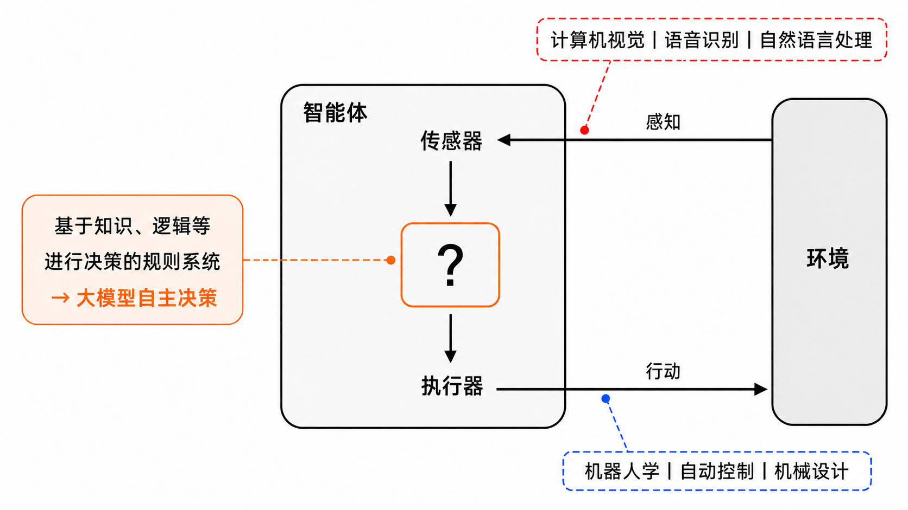
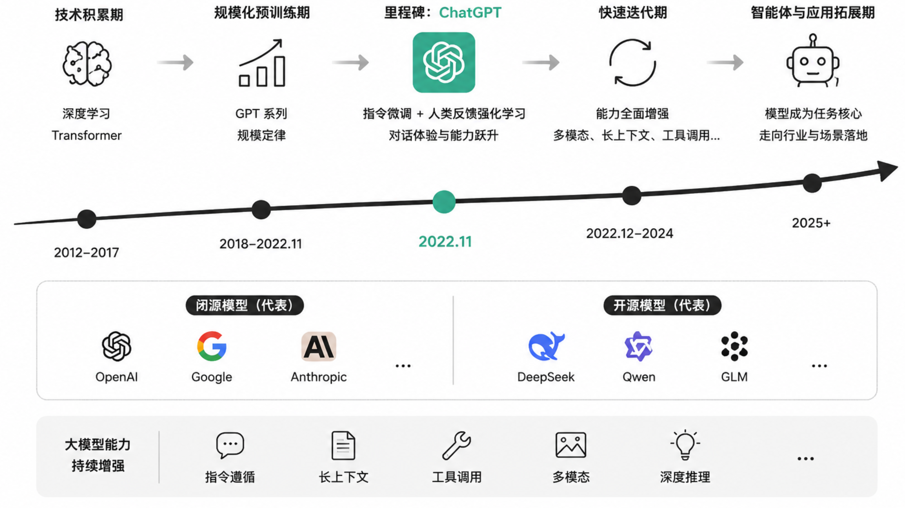
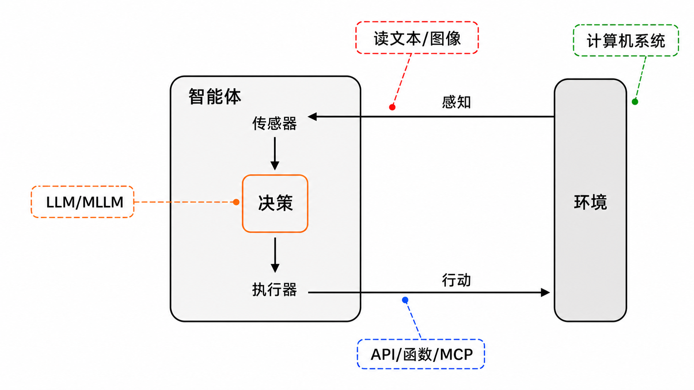
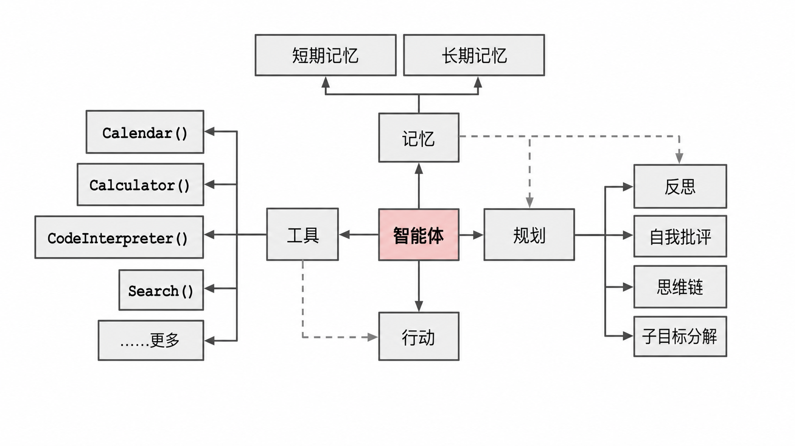
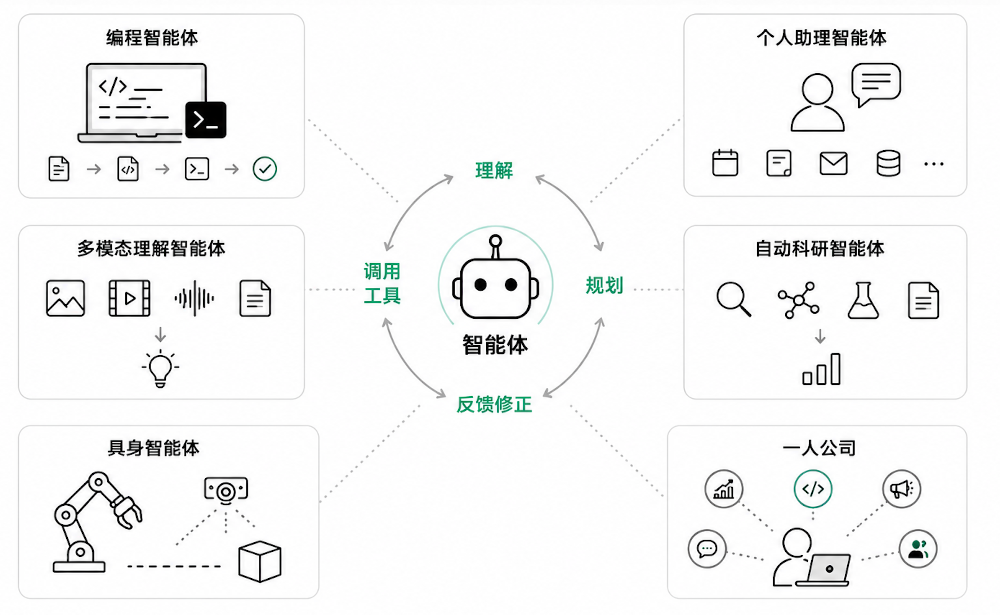

[中文](./README.md) | [English](./README-en.md)

[返回总目录](../README.md) | [下一章 →](../chapter2_chatbot/README.md)

> 本章配套代码：[进入 code 目录](./code/)

# 大模型与智能体技术基础

本章，我们将学习人工智能、大模型与智能体的基础概念，并完成第一次大模型 API 调用。
完成本章后，你应该能够说明 AI、大模型与 Agent 的关系，配置开发环境，并运行一个最小可用调用示例。
为了避免一开始就陷入工具和代码细节，本章先从智能体的基本思想讲起，再说明大模型为什么会改变智能体的构建方式，最后通过一个最小 Python 项目把概念落到可运行的程序上。

## 人工智能基础

### 人工智能与智能体

什么是人工智能（Artificial Intelligence, AI）？一个直观的理解是：让机器能够像一个“会做事的助手”一样，根据目标和环境做出合适的行动。历史上，人们对 AI 有很多不同定义。如表[1-1](#tab-ai-definition-perspectives)所示，有的关注机器能不能像人一样思考，有的关注机器能不能像人一样行动；也有的更关心机器是否一定要模仿人，还是只要能用合理方式完成任务即可。
在本教程中，我们采用一种更适合工程实践的理解：如果一个系统能够感知环境、根据目标做出判断，并采取相对合理的行动，我们就可以把它看作一种人工智能系统<sup>[1](#ref-russell2020aima)</sup>。这样的系统通常被称为智能体，即 Agent。

从这个角度看，AI 的核心目标就是构建能够完成任务的智能体。它不一定要和人类一模一样，也不一定要真正有意识。关键在于，它能否围绕一个目标，观察当前情况，选择合适方法，并把事情一步步做成。因此，人工智能的发展历史，也可以理解为人们不断构建更强智能体的历史。
下面这个表格展示了人工智能定义中的几种典型视角。它的作用不是要求记住每一种定义，而是帮助我们理解本教程为什么更关注“合理行动”这一角度，因为后续要构建的数字员工，本质上就是能围绕业务目标持续行动的软件智能体。

<a id="tab-ai-definition-perspectives"></a>

*表 1-1　人工智能定义的四种典型视角<sup>[1](#ref-russell2020aima)</sup>*

| **像人一样思考** | **合理地思考** |
| --- | --- |
| “使计算机思考的令人激动的新成就，…… 按完整的字面意思就是：有头脑的机器”（Haugeland，1985）<br><br>    “与人类思维相关的活动，诸如决策、问题求解、学习等活动的自动化”（Bellman，1978） | “通过使用计算模型来研究智力”（Charniak 和 McDermott，1985）<br><br>    “使感知、推理和行动成为可能的计算的研究”（Winston，1992） |
| **像人一样行动** | **合理地行动（本教程采用角度）** |
| “创造能执行一些功能的机器的技艺，当由人来执行这些功能时需要智能”（Kurzweil，1990）<br><br>    “研究如何使计算机能做那些目前人比计算机更擅长的事情”（Rich 和 Knight，1991） | “计算智能研究智能 Agent 的设计。”（Poole 等人，1998）<br><br>    “AI …… 关心人工制品中的智能行为。”（Nilsson，1998） |

智能体的发展脉络可以概括为：从人工规则驱动，到学习算法驱动，再到由大模型驱动的通用任务执行框架。早期人工智能主要依赖符号表示和规则推理来构建智能体。研究者希望把人类知识表示为逻辑规则、搜索空间或专家系统中的判断条件，再让机器根据这些规则完成推理、规划和决策。例如，在棋类游戏和专家诊断系统中，智能体的核心能力来自清晰定义的问题空间、可枚举的动作集合，以及人工设计的推理规则。
随后，人工智能体的研究逐渐从“写出完整规则”转向“让系统在环境中学习和适应”。反应式智能体强调根据当前感知快速行动，强化学习智能体通过试错学习在状态、动作和奖励之间建立策略，机器人和自动驾驶等领域则进一步要求智能体同时处理感知、控制、规划与安全约束。
近年来，大模型为智能体构建带来了新的可能。大模型本身具有语言理解、知识整合、代码生成和任务分解能力，可以在一定程度上充当智能体的“决策大脑”。当大模型进一步接入工具、记忆、知识库和外部系统后，智能体就不再只是回答问题，而可以围绕目标进行计划、调用工具、观察结果并持续调整行动。
因此，要理解今天的大模型智能体，不能只看模型会不会聊天，还要回到智能体的基本结构，理解它如何感知环境、做出决策并执行动作。

### 传统智能体的构建是复杂的系统工程

智能体并不是孤立存在的程序，它必须和环境进行交互，才能实现自己的目标。环境可以是一个简单的规则系统，例如棋盘游戏、网页表单或企业业务系统；也可以是一个复杂的物理世界，例如机器人所在的房间或真实生产线。无论环境简单还是复杂，智能体通常需要具备感知、规划、决策、行动等功能模块。而每一个模块的构建都涉及不同的学科，因此传统的智能体构建是一个非常复杂的工程。

<a id="fig-trad-agent"></a>



*图 1-1　传统的人工智能体结构示意图*

如图 [1-1](#fig-trad-agent) 所示，传统智能体本质上是一个“感知--决策--行动--反馈”的循环系统：智能体（Agent）通过传感器（Sensors）从环境（Environment）中获得感知（Percepts），经过内部决策后，再通过执行器（Actuators）产生行动（Actions），进而改变环境。
这个结构看似简单，但实现起来并不容易。感知模块可能涉及计算机视觉、语音识别或自然语言处理；决策模块需要知识、规则、搜索、规划或控制算法；行动模块还要对接软件接口、机械装置或真实业务流程。任何一个环节不稳定，都会影响整个智能体的表现。因此，传统智能体的构建不是单点功能开发，而是多个专业模块协同工作的系统工程。

后面我们将看到，由大模型驱动的智能体构建并不是推翻这个基本结构，而是用大模型显著简化其中最难的“理解、规划和决策”部分，再结合工具调用、记忆和反馈机制，形成更容易开发和迭代的新型智能体。

## 大模型与智能体

前面讨论的是智能体的通用结构。接下来要回答的问题是，大模型为什么能够成为新一代智能体的核心组件。为此，我们先简要回顾大模型技术的发展，再看它如何嵌入智能体循环。

### 大模型技术发展历程

2022 年底，美国 OpenAI 公司发布的 ChatGPT 产品[^1]，是大模型技术里程碑式的进展。它让普通用户第一次可以通过自然语言对话的方式，直接体验大模型在问答、写作、翻译、代码生成和任务辅助中的能力。ChatGPT 的发布，标志着大模型技术正式进入公众视野，也让大模型从实验室和专业开发者工具，开始进入教育、办公、研发、客服、营销等更广泛的应用场景。

在 ChatGPT 出现之前，大模型能力的形成经历了较长的技术积累。深度学习使神经网络模型能够从大量数据中自动学习复杂模式。Transformer 架构通过注意力机制显著提升了神经网络模型处理长文本和并行训练的能力<sup>[2](#ref-vaswani2017attention)</sup>。GPT 系列模型则进一步验证了先进行大规模预训练，再通过任务适配提升表现的技术路线。GPT-3 的出现表明，当模型参数、训练数据和计算资源持续扩大时，语言模型会表现出更强的少样本学习和通用语言处理能力<sup>[3](#ref-brown2020language)</sup>。这种随着规模扩大而能力提升的规律，通常被称为“规模定律"。
不过，仅有规模扩大并不足以让模型成为真正好用的产品。早期大语言模型虽然已经能够生成流畅文本，但在理解用户意图、遵循指令、拒绝不合理请求、保持回答稳定性等方面仍然存在明显不足。ChatGPT 的关键价值在于，它把大规模预训练模型、指令微调和人类反馈强化学习等方法结合起来，使模型更擅长按照人的自然语言指令完成任务。总体而言，模型架构、数据、算力、训练方法和产品交互共同成熟促成了 ChatGPT 的突破。

<a id="fig-llm-development"></a>



*图 1-2　大模型发展历程：以ChatGPT为里程碑*

在 ChatGPT 出现之后，大模型技术进入快速迭代阶段。国外的 OpenAI GPT、Google Gemini、Anthropic Claude 等闭源模型不断提升通用能力和产品化能力。国内的 DeepSeek、阿里 Qwen、智谱 GLM 等模型也在开源生态、中文能力、代码能力和行业应用上持续推进。开源模型降低了教学、研究和企业私有化部署的门槛，闭源模型则在前沿能力、稳定服务和生态集成方面保持快速演进。两类路线相互竞争，也共同推动了大模型技术的普及。
从技术角度看，近几年的大模型发展不只体现在回答更自然，也体现在模型作为任务执行核心的能力增强。指令遵循能力让模型能够理解用户目标和约束条件。长上下文能力让模型可以处理更长的文档、代码库和多轮对话记录。工具调用能力让模型能够连接搜索、数据库、代码解释器和业务系统。多模态能力让模型可以同时处理文本、图像、语音甚至视频。深度推理能力则提升了模型在复杂问题分解、方案比较和多步骤决策中的表现。这些能力共同构成了大模型驱动智能体的技术基础。

当前所谓的大模型，大致包括大语言模型（Large Language Model, LLM）、多模态大模型（Large Multimodal Model, LMM）和垂直领域大模型（Domain-Specific Large Model, DLM）几种类型。大语言模型主要处理文本和代码，多模态大模型可以同时理解文字、图片、音频或视频，垂直领域大模型则面向医疗、金融、法律、教育等特定行业进行优化。不同类型的大模型能力边界不同，但它们都可以通过 API 或本地部署的方式接入应用系统，成为智能体理解任务、生成方案和调用工具的基础。
理解这些类型之后，就可以进一步讨论本教程最关心的问题：当大模型不再只是生成文本，而是参与感知、规划、工具调用和反馈修正时，一个大模型驱动的智能体应该如何构建。

### 大模型驱动的智能体构建

大模型结合传统智能体的构建思想，为智能体开发提供了一种更简单、更通用的实现思路。如图 [1-3](#fig-trad-agent-using-llm) 所示，传统智能体中的感知、决策和行动循环仍然存在，只是其中最复杂的决策部分可以由大模型来承担。在软件系统中，环境信息往往不是物理传感器采集的数据，而是用户输入的文本、上传的图片、网页内容、数据库记录等。大模型负责理解这些信息，结合任务目标判断下一步应该做什么，再通过 API、函数调用等接口把决策转化为可执行动作。

从图中可以看出，大模型并不是孤立地生成一段回答，而是被放在智能体循环的核心位置。它一方面接收环境中的感知信息，例如读文本、看图像或理解系统状态。另一方面，它又连接外部工具，例如搜索、代码执行、文件读写、数据查询和业务系统接口。这样一来，开发者不必为每一种场景都手工编写完整的规则和决策树，而是可以把大量理解、推理和任务分解工作交给大模型完成。开发重点也随之发生变化，从编写复杂规则转向设计清晰的任务目标、工具接口、上下文组织方式和安全约束。

<a id="fig-trad-agent-using-llm"></a>



*图 1-3　大模型为智能体的构建提供简化方案*

进一步看，如图 [1-4](#fig-llm-agent) 所示[^2]，一个早期的关于大模型构建智能体的文章，将智能体拆解为规划、工具、动作和记忆等核心部分。其中，规划负责把一个较大的目标拆成可执行的子任务，并在执行过程中根据反馈调整步骤。工具负责扩展大模型自身能力，例如调用计算器、搜索引擎等。动作是智能体对外部环境产生影响的具体操作，例如发送请求、生成文件、修改数据或控制某个业务流程。记忆则保存短期上下文和长期经验，使智能体能够在多轮任务中保持连续性，也能在后续任务中复用已有信息。这几个部分共同形成了一个新的智能体工作循环。用户提出目标后，智能体先理解任务和当前状态，再制定计划，选择合适工具执行动作，观察执行结果，并把有价值的信息写入记忆。如果结果没有达到目标，智能体还可以继续反思、修正计划并再次行动。一些智能体框架所强调的推理与行动协同，正是这种循环思想的典型体现。

<a id="fig-llm-agent"></a>



*图 1-4　大模型驱动的智能体示意图*

总结而言，大模型为智能体构建中最核心、也最困难的自主决策大脑提供了强有力的替代方案。和传统智能体相比，大模型驱动的智能体并没有改变感知、决策、行动和反馈这一基本框架，真正的变化在于决策方式。过去的智能体主要依赖开发者预先写好的规则、流程和策略，现在的智能体可以根据任务目标、当前状态和工具反馈进行动态判断。正因为如此，大模型智能体更适合处理开放性强、步骤不固定、需要语言理解和多工具协同的复杂任务。
有了这个基本框架之后，我们再看智能体的应用场景，就不会把它简单理解为一个更会聊天的机器人，而会把它看成一种可以嵌入具体工作流程的任务执行系统。

### 智能体前沿应用

前面我们已经看到，大模型智能体的核心能力不是单纯聊天，而是围绕目标进行理解、规划、调用工具和反馈修正。把这些能力放到真实场景中，就会形成不同类型的应用。有的智能体帮助程序员写代码，有的帮助个人处理日常事务，有的能理解图片、视频和文件，还有的可以进入机器人、科研和企业运营等更复杂的任务。下面选取几个常见方向，先从用途和例子上建立直观认识。

<a id="fig-agent-applications"></a>



*图 1-5　智能体前沿应用*

**编程智能体。**
编程智能体就是会参与软件开发的智能体。它不只是补全一行代码，还可以阅读项目文件、理解需求、修改多个文件、运行测试，并根据报错继续修复问题。典型示例包括 Cursor[^3] 和 Claude Code[^4]。使用这类工具时，人仍然需要负责需求判断、代码审查和结果确认。

**个人助理智能体。**
个人助理智能体面向日常学习、办公和生活管理。它可以帮助用户整理资料、总结会议、规划日程、检索信息、生成文档、处理邮件或在多个应用之间完成重复操作。和普通聊天机器人相比，个人助理智能体更强调连续做事。OpenClaw[^5] 可以作为这类应用的代表之一，让用户更方便地搭建个人 AI 助理或数字员工。此类智能体越接近真实工作，就越需要注意隐私、权限和人工确认。

**多模态理解智能体。**
多模态理解智能体能够同时处理文字、图片、音频或视频等信息。它的价值在于，不再只看用户输入的一段文字，而是可以结合不同类型的材料完成判断。典型应用包括图片问答、视频摘要和文档图表理解。它能帮人更快理解复杂材料，但仍然可能看错细节，所以关键结论最好由人再检查一遍。

**自动科研智能体。**
自动科研智能体面向科研学习和实验流程，当前还处于实验阶段。它可以帮助检索论文、整理相关工作、提出实验思路、编写实验代码、分析实验结果和生成初步报告。它能提高资料整理和实验迭代效率，但研究问题是否有价值、实验设计是否公平、结论是否可信，仍然需要人来把关。

**具身智能体。**
具身智能体是把智能体能力放到机器人、自动驾驶、无人机或仿真环境中的应用。它不仅要理解语言，还要理解空间、物体和动作。例如，用户说把桌上的杯子拿到厨房，机器人需要识别杯子位置，规划移动路线，控制机械臂抓取，并在失败时重新尝试。和软件智能体相比，具身智能体的难点更大，因为物理世界有噪声、有碰撞风险，也有安全要求。目前很多应用还处在实验和特定场景阶段，但它展示了智能体从屏幕走向现实世界的可能性。

**一人公司。**
一人公司指的是一个人借助多个智能体完成过去需要小团队协作的工作。这里的重点不是 AI 完全代替人，而是把人的能力放大。一个创业者可以让不同智能体分别承担市场调研、产品原型、代码开发、宣传文案、客户回复和数据分析等任务，自己负责方向选择、关键决策和质量检查。这样的模式降低了小规模创新的门槛，但也要求使用者具备更强的判断力和责任意识。

这些应用方向虽然形态不同，但底层都离不开一个共同基础：能够稳定调用大模型，并把模型回答纳入自己的程序流程。后续章节会逐步加入提示词工程、知识库、工具、记忆和多智能体协同。本章的实践先从最小调用开始，让你先掌握数字员工项目的第一块积木。

## 动手实践：环境搭建与第一次大模型调用

<a id="sec-build-llm-dev-env"></a>

愿景很美好，但是万丈高楼平地起。前面的内容说明了大模型智能体的基本思想，但任何智能体系统都要从一次可靠的模型调用开始。本章的动手实践目标是完成一次大模型 API 调用，并在此基础上体验角色提示词对回答风格的影响。完成本节后，你应该能理解一个最小大模型应用由哪些部分组成：运行环境、依赖包、密钥配置、模型服务地址、模型名称和调用脚本。

Python 是大模型应用开发中最常用的语言之一，生态成熟，学习成本较低。很多模型服务、向量数据库、智能体框架和数据处理工具都提供了 Python SDK，因此用 Python 入门可以减少额外工具带来的学习负担。本教程默认你已经掌握 Python 的基本语法、数据类型、控制结构、函数、模块和文件操作。如果需要系统复习，可以参考 Python 官方教程[^6]。

### 第一步：安装 Python 并确认版本

建议使用 Python 3.11 或更高版本。版本过低时，部分 SDK 可能无法正常安装。在你的实验电脑打开终端，执行：

```bash
python --version
```

### 第二步：创建 Conda 虚拟环境

使用 Conda[^7] 创建独立虚拟环境。虚拟环境可以隔离不同项目的依赖，避免包版本互相影响。例如，一个项目可能依赖较新的 OpenAI SDK，另一个项目可能依赖旧版本。如果都安装在系统 Python 中，后续调试会变得很混乱。

```bash
conda create -n agent-book-ch1 python=3.11
conda activate agent-book-ch1
```

环境准备完成后，接下来进入具体项目。这里先不追求复杂功能，而是把模型调用所需的配置、依赖和代码组织清楚。只要这个最小项目能够稳定运行，后续扩展成销售或客服数字员工时，就有了可以继续迭代的基础。

### 第三步：进入参考代码目录

参考代码位于本章的 [`code/`](./code/) 目录。本节只保留最小可运行系统，不引入 Web 服务、数据库、前端界面或智能体框架。这样可以先把大模型调用链路跑通，再在后续章节逐步增加能力。目录结构如下：

```text
code/
  .env.example
  .gitignore
  main.py
  requirements.txt
```

### 第四步：安装依赖包

`requirements.txt` 记录项目所需的第三方依赖。本节只使用两个包：`openai` 用于调用兼容 OpenAI 接口的大模型服务，`python-dotenv` 用于从 `.env` 文件读取配置。

```bash
cd chapter1_basics/code
pip install -r requirements.txt
```

### 第五步：配置模型服务参数

创建 `.env` 文件并配置 API Key。API Key 相当于访问模型服务的身份凭证，不能直接写在代码中。把密钥放入 `.env` 文件，可以让代码和敏感配置分离，也方便在不同平台之间切换。先复制示例文件：

```bash
cp .env.example .env
```

然后根据自己使用的平台修改 `.env`。本章示例采用 OpenAI-compatible 接口，因此 Qwen、DeepSeek 和 OpenAI 可以使用同一份 Python 代码，只需要修改 `LLM_API_KEY`、`LLM_BASE_URL` 和 `LLM_MODEL`。其中，`LLM_API_KEY` 表示访问凭证，`LLM_BASE_URL` 表示服务地址，`LLM_MODEL` 表示要调用的模型名称。

```text
# OpenAI
LLM_API_KEY=your_openai_api_key
LLM_BASE_URL=https://api.openai.com/v1
LLM_MODEL=gpt-4.1-mini

# DeepSeek
LLM_API_KEY=your_deepseek_api_key
LLM_BASE_URL=https://api.deepseek.com
LLM_MODEL=deepseek-chat

# Qwen
LLM_API_KEY=your_qwen_api_key
LLM_BASE_URL=https://dashscope.aliyuncs.com/compatible-mode/v1
LLM_MODEL=qwen-plus
```

实际使用时只保留其中一组配置即可。不同平台的模型名称会随着产品更新而变化，如果运行时报模型不存在，应先到对应平台控制台确认可用模型。不要把 API Key 直接写进 Python 代码，也不要把 `.env` 提交到 Git 等版本管理系统中。

### 第六步：理解并运行调用脚本

阅读 `main.py`。脚本首先从 `.env` 读取配置，然后创建客户端对象，最后向模型发送消息并打印回答。一次最基本的对话请求通常包含两类信息：`system` 消息用于设定模型的角色和行为要求，`user` 消息用于表达用户当前的问题。这个脚本会先向大模型提出一个普通问题，再让模型以销售或客服数字员工的身份回答一个简单问题。

下面只选取 `main.py` 中的关键片段。每段代码都直接从源文件插入，因此会与学习者实际运行的代码保持一致。

首先，`require_env()` 用于读取并检查配置，`ask_model()` 则把一次模型请求封装成可重复调用的函数。

```python
def require_env(name: str) -> str:
    value = os.getenv(name, "").strip()
    if not value:
        raise RuntimeError(f"请在 .env 中配置 {name}")
    return value

def ask_model(client: OpenAI, model: str, system_prompt: str, user_prompt: str) -> str:
    response = client.chat.completions.create(
        model=model,
        messages=[
            {"role": "system", "content": system_prompt},
            {"role": "user", "content": user_prompt},
        ],
    )
    return response.choices[0].message.content or ""
```

[查看完整代码](code/main.py)

如果忘记填写 API Key、服务地址或模型名称，`require_env()` 会立即给出明确提示，而不是等到请求发出后才出现难以理解的错误。`messages` 是发送给模型的对话上下文，其中 `system` 消息说明模型的身份、语气和回答要求，`user` 消息给出本次任务。模型服务返回的 `response` 可能包含一个或多个候选回答，示例取出第一个回答的文本。

接着，主函数读取 `.env` 中的配置并创建客户端。`base_url` 让同一份调用逻辑能够适配不同的兼容 OpenAI 接口的模型平台；切换平台时，通常只需要修改配置文件，不需要改动程序。

```python
def main() -> None:
    load_dotenv()

    api_key = require_env("LLM_API_KEY")
    base_url = require_env("LLM_BASE_URL")
    model = require_env("LLM_MODEL")

    client = OpenAI(api_key=api_key, base_url=base_url)
```

[查看完整代码](code/main.py)

下面展示角色提示词问答。脚本前面还用同样的 `ask_model()` 函数完成了一次普通问答，这里不再重复列出。两次调用的主要差别在于 `system_prompt`：修改它可以让模型的表达更符合销售或客服场景。

```python
    role_answer = ask_model(
        client=client,
        model=model,
        system_prompt=(
            "你是一名销售和客服数字员工，回答要礼貌、清晰，"
            "并主动帮助用户理解产品价值。"
        ),
        user_prompt="用户问：你们的智能客服系统适合小公司使用吗？",
    )
    print("\n角色提示词问答：")
    print(role_answer)
```

[查看完整代码](code/main.py)

最后，脚本通过入口判断和异常处理启动主函数。网络、鉴权或配置错误会被输出到终端，便于初学者定位问题。

```python
if __name__ == "__main__":
    try:
        main()
    except Exception as exc:
        print(f"运行失败：{exc}")
```

[查看完整代码](code/main.py)

需要注意的是，这个程序还不是完整智能体。它能够接收问题并生成回答，但没有连接外部工具，也没有持续观察环境、保存记忆或根据执行结果再次调整行动。它的作用是先建立稳定的模型调用基础，后续章节将在此基础上逐步补充这些能力。

前面几步分别完成了环境创建、依赖安装、参数配置和脚本理解。最后一步是运行程序并观察输出。运行结果不仅能验证配置是否正确，也能帮助你直观看到普通问答和角色化问答之间的差异。

### 第七步：运行程序并观察输出

完成配置后，在 `code/` 目录下执行：

```bash
python main.py
```

如果配置正确，终端会打印两段回答。第一段是普通问答，第二段会带有销售或客服数字员工的语气。这个差异说明，提示词不只是提出问题，也可以约束模型的身份、语气、回答结构和服务目标。你可以修改 `main.py` 中的问题和角色提示词，观察模型回答的变化。

如果运行失败，可以按以下顺序排查：先确认虚拟环境已经激活，再确认依赖已经安装，然后检查 `.env` 是否填写了真实 API Key、服务地址和模型名称。如果错误信息中出现鉴权失败，通常是 API Key 不正确或没有开通对应服务。如果出现模型不存在，通常是模型名填写不正确。

## 作业与思考

本章作业既检查环境是否真正跑通，也帮助你把最小调用示例和智能体概念联系起来。完成时不要只提交运行结果，还要说明你对模型调用、提示词和智能体结构的理解。

1. 完成第 [1.3](#sec-build-llm-dev-env) 节中的实践任务。提交内容包括运行截图、`main.py` 代码，以及一段不超过 200 字的实验说明。运行截图应能看到两段模型回答，实验说明应简要说明普通提示词和角色提示词带来的输出差异。提交前请确认虚拟环境可以正常激活，`requirements.txt` 中的依赖已经安装，`.env` 配置可以成功调用模型，并且提交内容中不包含真实 API Key。
1. 结合本章对智能体的定义，分析 `main.py` 为什么更像一个简单聊天程序，而不是完整智能体。可以从目标、环境感知、决策、行动和反馈这几个角度进行说明。
1. 大模型驱动的智能体通常会接入工具、记忆和外部系统。如果要把本节脚本扩展成销售或客服数字员工，请列出至少三项需要增加的能力，并说明每项能力解决什么问题。
1. 从本章提到的编程智能体、个人助理智能体、多模态理解智能体、自动科研智能体和具身智能体中选择一个方向，说明它和本节最小大模型调用示例相比，多出了哪些关键技术要求。

## 参考文献

1. <a id="ref-russell2020aima"></a>Stuart Russell, Peter Norvig. Artificial Intelligence: A Modern Approach. Pearson. 2020.

2. <a id="ref-vaswani2017attention"></a>Ashish Vaswani, Noam Shazeer, Niki Parmar, Jakob Uszkoreit, Llion Jones, Aidan N Gomez, 等. Attention is all you need. Advances in neural information processing systems. 30, 2017.

3. <a id="ref-brown2020language"></a>Tom Brown, Benjamin Mann, Nick Ryder, Melanie Subbiah, Jared D Kaplan, Prafulla Dhariwal, 等. Language models are few-shot learners. Advances in neural information processing systems. 33, 1877–1901, 2020.

[^1]: https://chatgpt.com
[^2]: https://lilianweng.github.io/posts/2023-06-23-agent
[^3]: https://cursor.com
[^4]: https://code.claude.com
[^5]: https://openclaw.ai
[^6]: https://docs.python.org/zh-cn/3.13/tutorial/index.html
[^7]: 注：Conda是Python的虚拟环境构建和包管理工具，详细介绍见：https://anaconda.org/anaconda/conda

---

[返回总目录](../README.md) | [下一章 →](../chapter2_chatbot/README.md)
