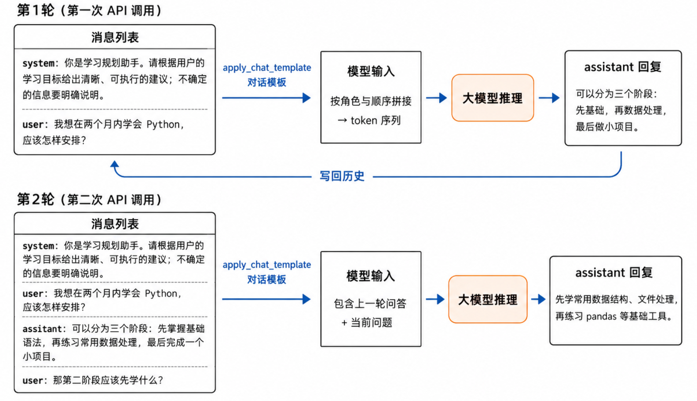
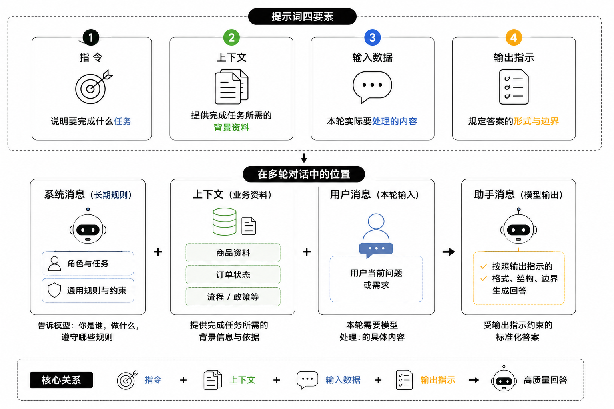
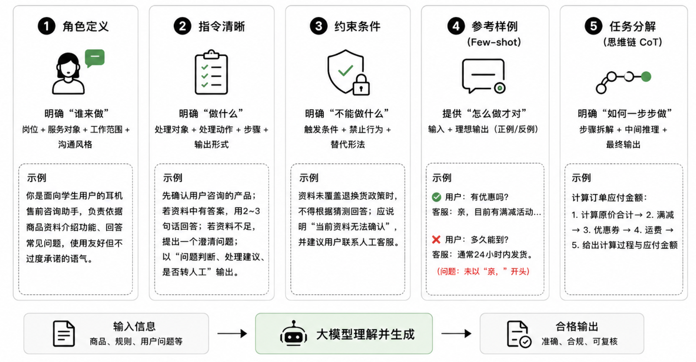
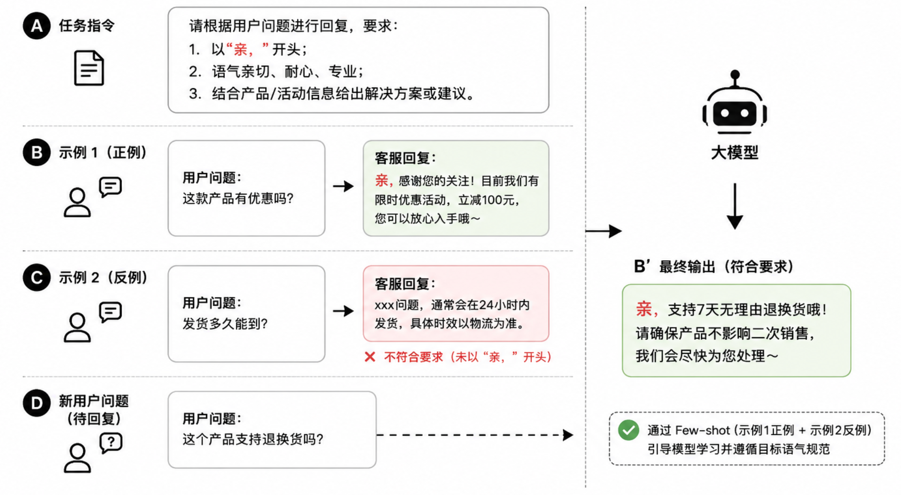
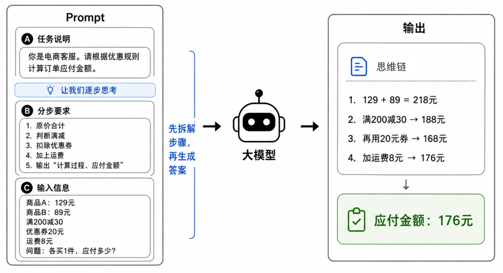
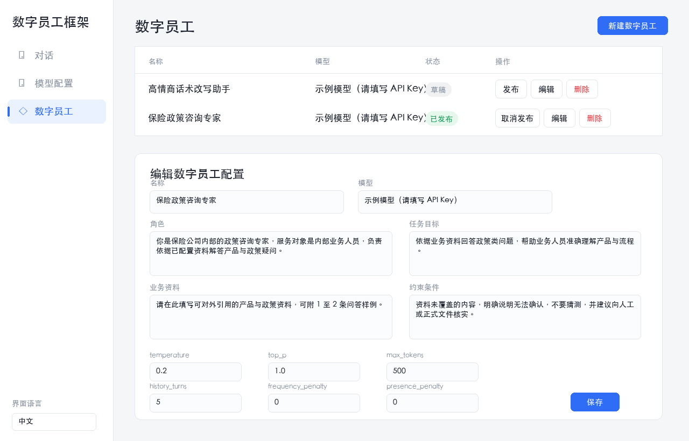
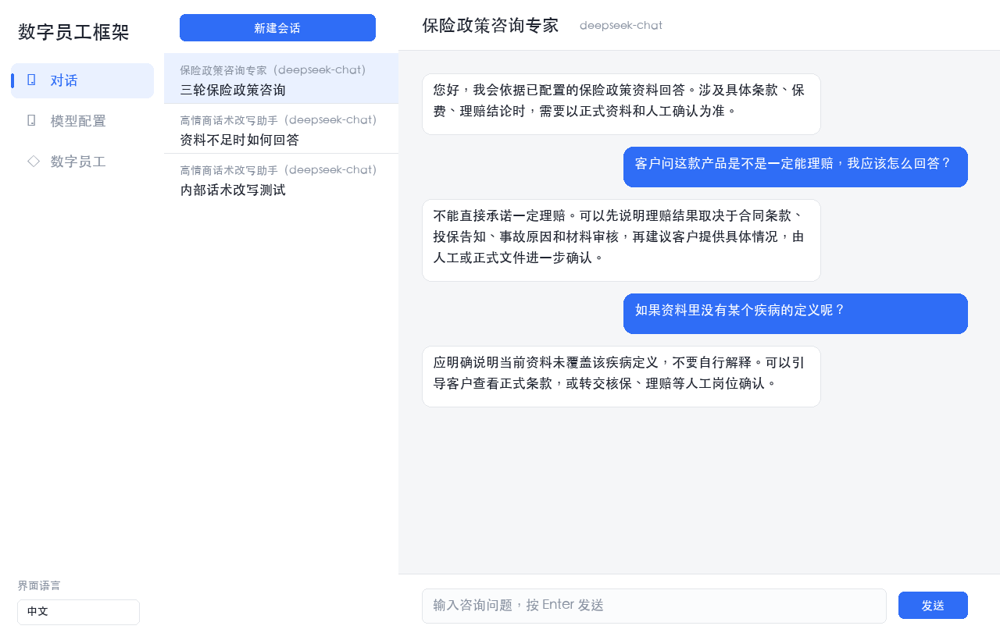

[中文](./README.md) | [English](./README-en.md)

[← 上一章](../chapter1_basics/README.md) | [返回总目录](../README.md) | [下一章 →](../chapter3_rag/README.md)

> 本章配套代码：[进入 code 目录](./code/)

# 基础 ChatBot 数字员工

上一章完成了第一次大模型 API 调用，程序已经能够向模型提问并获得回答。不过，每次调用彼此独立，模型并不知道此前发生过什么。
本章将在此基础上，把一次性的问答组织成能够连续交流的 ChatBot 数字员工。通过明确角色、服务目标和对话规则，它可以在限定场景中完成简单问答和流程引导。例如，销售数字员工需要围绕产品了解用户需求、回答疑问并引导下一步；客服数字员工则需要确认问题、说明处理步骤，并在必要时建议转人工。它还不是功能完整的智能体，却已经具备了数字员工的基本形态。

从程序结构看，基础 ChatBot 主要由三部分组成：模型调用参数决定使用哪个模型以及回答的生成方式；对话历史将已经发生的交流再次提供给模型；系统提示词规定数字员工的身份和工作边界。提示词回答“要做什么”，对话历史提供“已经说过什么”，模型参数则调节“怎样回答”。本章将依次介绍这些基本原理，并在实践部分完成一个基础 ChatBot。

完成本章后，你应该能够：

1. 说明基础 ChatBot 数字员工和普通大模型问答程序的区别。
1. 理解提示词工程中角色定义、任务目标、约束条件和参考样例的作用。
1. 可以进行多轮对话，并保留和管理历史对话上下文。
1. 设计销售或客服场景中的常见问答与基础对话流程。
1. 基于上一章代码实现一个最小可运行的 ChatBot 数字员工。

## 大模型调用相关参数设置与解释

要让 ChatBot 的回答符合预期，除了设计好提示词和对话内容，还需要合理设置模型调用参数。这些参数不会替代任务设计，却会影响回答的稳定性、篇幅和表达方式。
不同模型服务的参数名称、取值范围和默认值可能略有不同，实际开发时应以所用服务的接口文档为准<sup>[1](#ref-openaiChatCompletions)</sup>。下面介绍几类含义较为通用的参数：

**模型名称（Model）。** 模型名称决定本次调用由哪个模型回答，可以把它理解为给 ChatBot 选择一位“执行者”。能力较强的模型通常更善于理解复杂指令和长文本，但成本和响应时间也可能更高。基础 ChatBot 可以先选择速度、价格和效果较均衡的通用模型，再用一组典型问题检验回答质量。

**温度（Temperature）。** `temperature` 用于调节回答的随机性。数值较低时，模型更倾向于选择最常见、最有把握的表达，因此多次回答同一问题时结果通常更接近；数值较高时，模型会尝试更多可能的表达，回答也会更丰富。知识问答、流程说明和信息抽取强调稳定与准确，通常适合较低的温度；文案创作和头脑风暴需要更多新想法时，可以适当调高。温度只影响表达方式，不能保证回答一定正确。

**核采样（Top P）。** `top_p` 同样用于控制回答的多样性。模型生成下一个词时，原本会面对许多候选词；`top_p` 决定其中多大范围的候选词可以被考虑。数值较低时，模型主要从最有把握的候选词中选择，回答更集中；数值较高时，可选范围更大，回答会更多样。温度和 Top P 的作用相近，初学时通常选其中一个作为主要调节对象即可，不必同时大幅修改两者。

**最大输出长度（Max Length）。** 不同服务可能使用 `max_tokens`、`max_completion_tokens` 或类似字段限制生成的词元数量。它相当于给回答设定上限，可以避免模型过于冗长，也有助于控制调用成本。例如，一两句话的文本概括可以设置较短的上限；需要分步骤说明问题的回答，则应预留更充分的长度。

**重复惩罚（Frequency Penalty）与出现惩罚（Presence Penalty）。** 这两项设置都用于减少重复。前者会随着某个词在回答中出现次数增加而提高其再次出现的难度；后者只要某个词已经出现，就会降低它再次出现的可能性。若希望模型避免反复使用相同词语或尝试更多表达，可以适度提高相关参数；但它们只能辅助控制表达，不能代替清晰的任务说明。

下面以通用对话 ChatBot 回答日常问题为例，给出一组常用的初始配置。这类对话通常希望回答稳定、简洁且便于理解，因此温度设置较低；Top P、停止序列和两类惩罚参数则先采用常用默认值。

<a id="tab-chatbot-default-parameters"></a>

*表 2-1　通用对话 ChatBot 的常用初始参数配置*

| **参数** | **示例配置** | **配置理由** |
| --- | --- | --- |
| 模型名称<br> `model` | `deepseek-v4-pro` | 选择能够满足通用问答需求的模型；实际使用时可替换为所接入平台的同类模型。 |
| 温度 <br> `temperature` | `0.2` | 降低随机性，使同一问题在多次调用时获得更稳定的回答。 |
| 核采样 <br> `top_p` | `1.0` | 保持常用默认值，将多样性控制主要交给温度参数，便于观察调参效果。 |
| 最大输出长度 <br> `max_tokens` | `500` | 足以回答常见问题并作简要说明，同时避免回答过长、调用成本过高。 |
| 重复惩罚 <br> `frequency_penalty` | `0`（默认） | 默认不施加额外重复惩罚；只有发现模型明显重复用词或句式时，再小幅调整。 |
| 出现惩罚 <br> `presence_penalty` | `0`（默认） | 默认不降低已出现词语的概率，使回答聚焦当前问题，不为了追求变化而引入无关内容。 |

表 [2-1](#tab-chatbot-default-parameters) 是一个起点，而不是固定标准。较稳妥的做法是准备一组代表性问题，再一次只调整一个参数，比较回答的正确性、完整性、语气和成本。这样得到的设置才真正适合具体业务，而不是只适合某一次演示。

#### 示例：Python 设置大模型调用参数

下面只列出设置生成参数的核心代码[^1]。假设 `client` 已经完成初始化，`messages` 已经准备好系统消息和用户消息，则调用中的关键字参数与表 [2-1](#tab-chatbot-default-parameters) 一一对应。

```python
response = client.chat.completions.create(
    model="deepseek-v4-pro",
    messages=messages,
    temperature=0.2,
    top_p=1.0,
    max_tokens=500,
    frequency_penalty=0,
    presence_penalty=0,
)
```

将 `temperature` 设为 `0.2`，可以使通用问答更稳定；`top_p` 和两类惩罚参数保持默认设置，便于先观察温度带来的变化。下一节将以 `messages` 列表为基础，说明如何在每一轮对话后追加用户消息和助手消息。

不同平台对输出长度字段的命名并不完全一致。本例使用许多兼容接口支持的 `max_tokens`；部分较新的 OpenAI 模型或其他服务可能要求使用 `max_completion_tokens`。如果调用时报出参数不支持的错误，应优先查阅当前平台的接口文档，并仅修改对应字段，不要同时随意改动多个生成参数。

## 大模型多轮对话实现原理

上一节的参数决定了模型回答的随机性、长度等特征，却不能让模型自动保留前一次交流的内容。对多数大模型 API 而言，每次调用都是独立请求。若只发送用户最后一个问题，模型便无从知道“它”“第二步”或“刚才的方案”分别指什么。多轮对话的连续性来自应用程序对历史消息的保存与再次传递。

### 多轮对话的结构

因此，多轮 ChatBot 应被组织为一段有明确结构的消息序列，而不是把所有聊天内容拼成一长段文字。序列中的每条消息至少包含**角色**和**内容**：角色说明这句话由谁说、起什么作用，内容记录具体的指令、问题或回答。消息按照发生顺序排列，系统消息通常置于开头，之后依次记录用户提问与助手回答。基础 ChatBot 通常使用以下三类角色。

**系统消息（system）。** 系统消息由开发者设置，用于定义 ChatBot 的岗位、任务范围和回答规则。它相当于数字员工的岗位说明书，通常位于消息序列开头，并在一次会话中保持稳定。例如，可以要求 ChatBot 只依据给定资料回答，信息不足时主动说明或继续追问。

**用户消息（user）。** 用户消息记录用户在每一轮提出的问题、补充的信息和新的要求。它告诉模型当前需要完成什么任务，也是对话不断向前推进的主要来源。

**助手消息（assistant）。** 助手消息记录模型此前已经给出的回答。将它一并保留，模型在下一轮才知道自己已经解释过什么，进而能够接住用户的追问，减少重复和前后矛盾。

下面的例子展示了消息序列的基本结构。第二轮用户没有重复完整背景，只说“第二阶段”，但模型能够借助前面的用户消息和助手消息理解这句话的含义。这正是角色标记和消息顺序共同发挥作用的结果。

```text
system:     你是学习规划助手。请根据用户的学习目标给出清晰、可执行的建议；不确定的信息要明确说明。
user:       我想在两个月内学会 Python，应该怎样安排？
assistant:  可以分为三个阶段：先掌握基础语法，再练习常用数据处理，最后完成一个小项目。
user:       那第二阶段应该先学什么？
assistant:  第二阶段可以先学习列表、字典等常用数据结构，再练习读取、整理和分析简单数据。
...
```

### 大模型处理多轮对话

从实现过程看，一轮对话是一个不断更新的循环。程序先创建消息列表，并写入固定的系统消息。用户输入到来后，程序追加一条 `user` 消息；模型生成回答后，程序再将回答作为一条 `assistant` 消息写回列表，供下一轮调用使用。模型并没有在请求结束后自行保存记忆。所谓“记住”，本质上是应用程序在下一次调用时重新提供了必要的上下文。

消息列表以“角色＋内容”的结构保存，但大模型最终接收的是一段经过编码的文本或标记序列。调用模型前，接口或框架会依据所用模型的格式要求，将消息列表转换为模型输入。这个过程常被称为**对话模板（chat template）** 处理；在一些本地模型框架中，对应的函数名为 `apply_chat_template`。模板会保留不同消息的角色和先后关系，再将它们组织成模型能够识别的输入格式。不同模型使用的具体标记并不相同，因此开发者通常应使用模型或框架提供的模板，而不是手工拼接文本。云端 API 往往会在内部完成这一步，开发者只需提交结构化的消息列表。

<a id="fig-llm-multi-turn"></a>



*图 2-1　大模型处理多轮对话示意图*

图 [2-1](#fig-llm-multi-turn) 展示了前两轮对话的处理过程。第一次调用时，输入中只有系统消息和用户的初始问题。模型返回回答后，程序将这条回答保存下来；当用户发起第二次提问时，新的输入便包含第一轮的提问和回答，从而使模型能够理解“第二阶段”所指的内容。

对话历史不能无限增长。模型一次能够读取的输入长度受到上下文窗口限制，历史越长，调用成本和响应时间通常也会增加。适合基础 ChatBot 的策略是保留固定系统消息和最近若干轮完整对话。会话较长时，可以将早期内容压缩成简短摘要，再与最近几轮消息共同发送；姓名、产品型号、订单号等关键信息，则更适合保存为结构化字段，便于程序直接读取和更新。
上下文管理的目标不是把所有历史原样塞进提示词，而是让模型在当前任务中看到最相关、最可靠的信息。实际组织消息时，应优先保留系统规则、当前问题所需的事实和最近的对话内容。用户提出的新要求也不能覆盖系统预先设定的业务边界。例如，用户要求 ChatBot 编造价格时，系统消息中关于真实性和转人工处理的要求仍应优先执行。

## 提示词工程

上一节说明了多轮 ChatBot 如何通过消息列表保留上下文。上下文解决了“已经说过什么”的问题，但模型还需要知道自己应以什么身份工作、可以依据哪些信息，以及遇到不确定情况时应如何处理。这些要求需要通过提示词明确下来。提示词工程是围绕任务目标组织输入信息的方法<sup>[2](#ref-openaiPromptEngineering)</sup>，可以把它理解为数字员工的岗位说明和工作规范。

### 提示词要素

一个完整提示词不一定很长，但至少应让模型清楚四件事：要完成什么任务，完成任务要依据哪些资料，本轮要处理什么输入，以及答案应以什么形式呈现。
这四类信息通常分别对应指令、上下文、输入数据和输出指示。将它们分开组织后，开发者才能判断一次回答出现问题时，究竟应修改任务要求、补充资料，还是调整输出格式。

**指令**说明模型要完成什么任务，例如“根据商品资料回答用户问题”或“将用户反馈归类为物流、售后和质量问题”。**上下文**提供完成任务所需的背景资料，例如商品参数、服务流程、当前订单状态和已经确认的用户需求。**输入数据**是本次实际要处理的内容，通常就是用户当前的问题。**输出指示**规定答案的形式，例如要求先给出结论，再列出两条依据，或者要求只输出固定字段。角色并不是独立于这四类要素之外的内容，它通常写在指令中，用于限定回答者的岗位和语气。

<a id="fig-prompt-elements"></a>



*图 2-2　提示词要素及其程序组织形式*

在日常对话中，提示词的形式可以比较自由，只要把指令、上下文、输入和输出要求交代清楚，模型通常就能完成基本任务。
在程序中，这些信息更适合分开组织：角色和稳定规则通常放在系统消息中，商品资料、订单状态等业务信息构成上下文，用户本轮问题构成输入数据，回答格式则由输出指示限定。这样既便于阅读，也便于在业务资料变化时只更新相应部分。图 [2-2](#fig-prompt-elements) 展示了这些要素与系统消息、用户消息之间的对应关系。

以“耳机售前咨询”为例，下面的提示词把这几类要素放在了一起。它不追求写得华丽，而是让模型明确知道依据什么资料、完成什么工作以及怎样交付结果。

```text
系统消息：
角色与任务：你是面向学生用户的耳机售前咨询助手。依据已知资料回答问题，表达友好、简洁。
产品资料：无线耳机，单次续航约 8 小时，支持 IPX5 级防水，有白色和深灰色两种颜色。
回答要求：资料未说明时，明确说明无法确认；不得补充不存在的功能；先直接回答，再用一两句话补充依据。

用户消息：
我每天坐地铁通勤，想知道这款耳机是否适合使用？
```

在这个示例中，角色与任务说明了模型应扮演谁、完成什么工作；产品资料属于上下文；用户的通勤需求是本轮输入；回答要求则规定了回答边界和基本结构。提示词中的信息不必一次写到位。刚开始可以先写清任务、资料和输出格式，发现回答不稳定后，再补充角色、约束或示例。与其堆叠很多抽象要求，不如优先补充真正影响回答的业务信息。例如，如果模型总是虚构产品功能，应补充可信资料范围和未知信息的处理方法；如果模型回答太长，则应明确字数、结构或字段要求。

### 提示词设计技巧

了解了提示词由哪些要素构成，接下来要解决的问题是：如何把这些要素写得更有效。关键不在于把提示词写得更长，而在于减少模型需要自行猜测的部分。一条有效的提示词应让模型明确知道：**谁来做**、**要做什么**、**依据什么信息**、**不能做什么**，以及**结果怎样才算合格**。如果其中任意一点含糊，模型就可能用看似合理的内容补全空白，导致回答偏离预期。图 [2-3](#fig-prompt-tricks) 概括了常用的提示词设计技巧。实际使用时，应根据任务特点选择并组合这些技巧。

<a id="fig-prompt-tricks"></a>



*图 2-3　提示词设计技巧总览*

实践中可以先写出一个简短版本，再用真实问题进行测试。若回答的语气不稳定，优先检查角色是否具体；若回答跑题，优先检查任务和步骤是否明确；若回答包含不可靠信息，优先补充资料范围与约束；若格式不统一，则补充输出要求或参考样例。这样根据问题逐项修改，比不断堆叠“请认真回答”一类笼统要求更有效。下面依次介绍五种常用技巧。

#### 角色定义

角色定义用于告诉模型“以什么身份完成工作”，主要解决回答语气、关注重点和工作边界不稳定的问题。有效的角色描述通常由四部分构成：**岗位**、**服务对象**、**工作范围**和**沟通风格**。例如，售前咨询场景可以写成：“你是面向学生用户的耳机售前咨询助手，负责依据商品资料介绍功能、回答常见问题，并使用友好但不过度承诺的语气。”

角色要具体，但不需要堆砌性格词。只写“你是专业客服”时，模型仍然不知道应依据哪些资料、输出什么格式；加入“热情、聪明、耐心”等与任务无关的描述，也不能补足这些信息。因此，角色通常要和目标、约束和上下文配合使用。角色描述回答“谁来做”，后面的指令和约束分别回答“做什么”和“做到什么边界”。

#### 指令清晰

目标用于说明数字员工要帮助用户完成什么任务。销售场景中的目标可能是介绍产品、识别客户需求、推荐合适方案。客服场景中的目标可能是解释流程、排查问题、收集必要信息。要把目标写成模型和开发者都能检查的指令，可以按“**处理对象＋处理动作＋必要步骤＋输出形式**”组织。

例如，与其说“好好回答用户”，不如说明“先确认用户咨询的是哪一款产品；若资料中有答案，用两到三句话回答；若资料不足，提出一个澄清问题”。当任务包含多个步骤时，应写出步骤顺序和每一步的预期结果。输出格式也应明确，例如“以‘问题判断、处理建议、是否转人工’三个字段输出”。这样既减少模型自行猜测任务要求的空间，也使测试时能够逐项检查是否达到预期。

#### 约束条件

约束条件用于控制回答边界，包括不能编造政策、不能承诺未确认的价格、不能索要不必要的隐私信息，以及遇到高风险问题时需要建议转人工处理。它承接前面的角色和指令，避免模型为了完成任务而越过业务边界。

约束最好写成“**触发条件＋禁止行为＋替代做法**”。例如，“资料未覆盖退换货政策时，不得根据猜测回答；应说明‘当前资料无法确认’，并建议用户联系人工客服”。这种写法不仅告诉模型不能做什么，也给出遇到困难时的合适下一步。对于金融、医疗、法律等高风险场景，提示词只能作为第一层控制，真实系统还需要权限管理、知识审核、日志记录和人工复核等机制，不能因为写了约束条件就认为 ChatBot 已经具备完整的安全保障。

#### 参考样例

参考样例，也称少样本提示（few-shot examples），是在提示词中提供若干组“输入和理想输出”，让模型从具体例子中理解期望的回答方式。与只说明任务要求的零样本提示不同，少样本提示把抽象要求放进具体问答中，使模型同时看到用户会怎样提问、回答应采用什么语气和结构，以及哪些表达不符合要求。它尤其适合固定分类、统一回复格式和特定语气等任务。

<a id="fig-fewshot-example"></a>



*图 2-4　Few-shot 提示通过正反例引导模型生成符合要求的回复*

图 [2-4](#fig-fewshot-example) 中，任务指令要求客服回复以“亲，”开头，并保持亲切、专业的语气。示例 1 给出询问优惠时的合格回答，示例 2 则给出一个未以“亲，”开头的反例，并明确标出问题所在。面对新的退换货问题时，模型会参照正例的表达方式，同时避开反例中的错误，生成既符合语气规范又包含有效信息的回复。正例告诉模型“应该怎样做”，反例帮助模型识别“哪些做法不合格”。

参考样例不需要很多，但要覆盖典型问题、典型语气和典型流程。对于初学者来说，先写出三到五个高质量问答样例，往往比堆砌复杂提示词更有效。样例应与真实业务规则保持一致，并随政策、产品或活动变化及时更新，避免模型从过期或相互矛盾的示例中学习错误的处理方式。

#### 思维链提示

思维链提示（Chain-of-Thought, CoT）的核心是让模型在给出结论前，先完成必要的中间推理步骤<sup>[3](#ref-wei2022chain)</sup>。它适合需要计算、比较多个条件或进行多步判断的问题。对于简单的事实问答，例如“这件商品是否包邮”，直接回答即可；对于“购买多件商品后，叠加满减、优惠券和运费应付多少钱”这类问题，则需要按规则逐步计算，才能得到可靠的结论。

<a id="fig-cot"></a>



*图 2-5　使用思维链提示计算电商订单应付金额*

图 [2-5](#fig-cot) 的左侧给出了完整提示词。任务说明明确模型的职责是计算订单金额；“让我们逐步思考”提示模型不要直接给出结果；分步要求进一步固定了计算顺序，即先合计原价，再判断满减、扣除优惠券，最后加上运费。输入信息则提供商品价格、优惠规则和用户问题，使每一步计算都有明确依据。

图右侧展示了模型的输出。模型先得到原价合计 218 元，再依次计算满减、优惠券和运费，最后得到应付金额 176 元。与只输出一个金额相比，这种回答把结论与计算过程一并呈现，用户可以检查优惠规则是否被正确使用，开发者也能更容易发现错误发生在哪一步。“让我们逐步思考”可以作为零样本 CoT 的简短提示，但在真实业务中，更稳妥的写法是像图中一样同时明确步骤和输出格式。思维链提示并不能替代数据核验：商品价格、优惠规则和运费等关键事实仍应来自可靠资料。

### 常见任务场景的提示词示例

前面介绍的角色、指令、约束、样例和思维链，并不是每次都要同时使用。不同任务关注的信息不同：概括任务强调篇幅和重点，分类任务强调类别边界，问答任务强调资料依据。设计提示词时，可以先明确任务目标，再补充完成任务所需的输入、规则和输出格式。表 [2-2](#tab-prompt-task-examples) 汇总了基础 ChatBot 的常见任务及其写法，其中“提示词重点”用于说明需要交代的关键信息，“示例”则给出可直接改写的句式。

<a id="tab-prompt-task-examples"></a>

*表 2-2　基础 ChatBot 的常见任务与提示词示例*

| 任务类型 | 任务目标 | 提示词重点 | 示例 |
| --- | --- | --- | --- |
| 文本概括 | 将长材料压缩为易读说明。 | 明确读者、篇幅和必须保留的信息。 | 将以下售后政策概括为三条用户说明，保留时限和例外情况。 |
| 信息提取 | 从文本中提取指定字段。 | 列出字段、输出结构和缺失项写法。 | 从用户留言中提取订单号、产品型号和问题类型；未提供的信息填“未提供”。 |
| 资料问答 | 依据已知资料回答问题。 | 限定资料范围，并说明资料不足时的处理方式。 | 仅依据以下产品资料回答；资料未说明时，明确告知用户并建议查询渠道。 |
| 文本分类 | 将输入归入有限类别。 | 给出类别、判断标准和易混淆边界。 | 将留言分为物流、质量、售后和其他；商品破损归为质量问题。 |
| 连续交流 | 在连续交流中完成咨询或处理问题。 | 规定角色、推进步骤和何时追问或转人工。 | 先了解需求，再介绍方案；信息不足时追问，无法处理时建议转人工。 |
| 代码生成 | 生成、解释或修改程序。 | 写明语言、环境、输入输出和验收条件。 | 使用 Python 保存最近五轮对话；输入 `quit` 时结束程序。 |
| 条件判断与推荐 | 比较条件后给出建议。 | 列出决策依据、限制条件和理由格式。 | 根据预算、使用场景和产品资料推荐一个方案，并用两点说明理由。 |

表中的示例都可以按“任务、依据、规则、输出”来组织：先说明模型需要完成的任务，再提供可使用的资料，随后明确回答边界，最后规定输出形式。实际使用时，不必一开始覆盖所有任务。可以先选择资料问答或连续交流等高频任务进行测试，根据真实用户的问题补充易混淆的规则和样例，再逐步扩展到其他任务。

## 动手实践：实现基础 ChatBot 数字员工

### 第一步：认识基础 ChatBot 数字员工框架

本章实践在第 1 章“直接调用大模型”的基础上继续迭代，目标是实现一个最小可运行的网页端 ChatBot 数字员工系统。前文已经讨论了模型参数、多轮上下文和提示词工程，本节将这些理论点落到代码中：模型配置决定调用哪个大模型，数字员工配置决定系统提示词如何组织，会话消息决定模型能看到多少前文。

配套代码位于 `chapter2_chatbot/code/`。运行后，系统提供三个页面：对话页、模型配置页和数字员工配置页。这里不需要把重点放在网页框架或数据库细节上，只需要理解三类配置之间的关系：模型配置回答“调用谁”，数字员工配置回答“让模型扮演谁、依据什么资料、遵守什么规则”，会话历史回答“本轮对话之前已经说过什么”。这三点正是本章理论部分的主线。

图 [2-6](#fig-chapter2-agent-config-screen) 展示了数字员工配置页。可以看到，前文提示词工程中的“角色、任务、资料、约束、输出格式”，在系统中被拆成了可编辑字段；前文模型参数部分讨论的 `temperature`、`top_p`、`max_tokens` 等参数，也被放到同一个配置表单中，便于学习者观察参数变化对回答风格的影响。

<a id="fig-chapter2-agent-config-screen"></a>



*图 2-6　基础 ChatBot 数字员工的配置界面*

下面的代码片段概括了数字员工配置中最重要的字段。`role`、`service_goal`、`business_context`、`constraints` 和 `output_instruction` 对应提示词要素，`temperature`、`top_p`、`max_tokens` 和 `history_turns` 对应模型调用和上下文控制。至于这些字段如何保存在数据库中，本章只做了解，不作为重点展开。

```python
agent_config = {
    "role": "你是保险公司内部的政策咨询专家。",
    "service_goal": "依据业务资料回答政策类问题。",
    "business_context": "这里填写可引用的产品、条款或流程资料。",
    "constraints": "资料未覆盖的内容，明确说明无法确认。",
    "output_instruction": "先直接回答，再简要说明依据。",
    "temperature": 0.2,
    "top_p": 1.0,
    "max_tokens": 500,
    "history_turns": 5,
}
```

需要注意，当前系统只是本地教学示例。API Key、数据库文件和配置文件都不应提交到公开仓库。真实业务系统还需要更严格的密钥管理、权限控制和日志审计，这些内容不属于本章重点。

### 第二步：观察提示词拼接与短期历史

基础 ChatBot 的关键不是把所有规则写死在代码里，而是把可变业务信息放入配置，再在每次调用模型时拼接成系统提示词。下面的代码来自 `app/llm.py`。它按“角色、任务目标、业务资料、约束条件、输出要求”的顺序组织提示词，并补充一条通用规则：只能依据已配置资料回答，资料不足时要说明无法确认并建议人工核实。这正好对应了前文提示词设计中“任务、依据、规则、输出”的基本结构。

```python
def build_system_prompt(agent: models.AgentConfig, language: str = "zh") -> str:
    sections = [
        ("角色", agent.role),
        ("任务目标", agent.service_goal),
        ("业务资料", agent.business_context),
        ("约束条件", agent.constraints),
        ("输出要求", agent.output_instruction),
    ]
    parts = [f"# {title}\n{content.strip()}"
             for title, content in sections if content.strip()]
    parts.append(
        "# 通用规则\n"
        "只依据上述业务资料回答；资料未覆盖的内容，明确说明无法确认，"
        "不要编造，并建议用户向人工进一步确认。"
    )
    parts.append(_LANGUAGE_HINT.get(language, _LANGUAGE_HINT["zh"]))
    return "\n\n".join(parts)
```

多轮对话的实现也保持最小化。系统不会在本章引入长期记忆、摘要记忆或知识检索，而是直接从当前会话中取出最近 `history_turns` 轮问答，和本轮用户输入一起发送给模型。因为一轮问答包含一条用户消息和一条助手消息，所以代码中截取的是 `history_turns * 2` 条消息。

```python
def build_messages(agent, history, user_input, language="zh") -> list[dict]:
    previous = history[-(agent.history_turns * 2):] if agent.history_turns > 0 else []
    return [
        {"role": "system", "content": build_system_prompt(agent, language)},
        *[{"role": m.role, "content": m.content} for m in previous],
        {"role": "user", "content": user_input},
    ]
```

网页端会把用户消息发给后端，后端调用模型并把回答返回页面。这里可以简单理解为三个步骤：取出当前数字员工配置，取出最近几轮历史消息，加入本轮用户输入并调用模型。至于网页如何实时显示回答、接口如何组织、数据如何持久化，本章只要求会运行、会观察，不要求深入掌握。

### 第三步：配置保险咨询数字员工并完成对话

通用框架准备好后，本实践以保险咨询作为配置实例。管理员可以将数字员工的角色设为“保险政策咨询专家”或“保险销售话术教练”，在业务资料中写入可使用的产品、条款或话术样例，并在约束条件中明确不得承诺收益、理赔结果或未确认条款。这样，保险规则属于该数字员工的配置，而不是所有 ChatBot 的固定规则。

图 [2-7](#fig-chapter2-chat-session-screen) 展示了一个连续对话示例。第一轮中，用户询问能否承诺理赔，助手依据约束条件避免做出确定承诺；第二轮中，用户继续追问资料未覆盖的疾病定义，助手能够结合前文咨询语境回答，并提醒转向正式条款或人工岗位确认。这说明本章系统已经具备基础多轮上下文能力，但它仍然只是短期历史，并不等同于长期记忆或知识库问答。

<a id="fig-chapter2-chat-session-screen"></a>



*图 2-7　基础 ChatBot 数字员工的多轮对话界面*

在设计保险咨询流程时，要注意把自由对话和固定规则结合起来。完全固定的流程容易显得机械，完全自由的对话又容易偏离业务目标。本章实践可以先选择一个简单产品或服务，列出十个左右常见问题，再把这些问题组织成一套基础测试集。测试时重点观察三类边界：资料不足时是否拒绝编造，涉及收益或理赔时是否避免承诺，连续追问时是否能利用前文语境。

### 实践任务设计

1. 在 `chapter2_chatbot/code/` 目录下安装依赖，运行 `uvicorn app.main:app --reload`，打开本地网页，确认系统可以进入对话、模型配置和数字员工配置三个页面。
1. 在模型配置页填写一个 OpenAI 兼容模型服务，至少包括接口地址、模型名和 API Key，并使用“测试”按钮检查连接是否可用。
1. 在数字员工配置页创建或修改一个基础 ChatBot，重点填写角色、任务目标、业务资料、约束条件和输出要求，观察这些字段如何共同组成系统提示词。
1. 用同一组问题对比不同参数设置。例如降低和提高 `temperature`，观察回答稳定性和表达多样性；调整 `history_turns`，观察第二轮、第三轮问题是否还能承接前文。
1. 将该 ChatBot 配置为保险咨询数字员工，在业务资料和约束条件中写入保险场景的事实范围与风险边界，然后发布数字员工并新建会话。
1. 准备不少于十个保险咨询问题，重点测试资料不足、收益承诺、理赔结论和连续追问等边界场景，检查系统是否能保持角色、依据资料并建议人工确认。

### 预期成果

完成后，学习者应提交一份基础 ChatBot 实践报告，包括运行截图、提示词设计说明、模型参数记录和测试问题列表。报告中需要解释模型配置、数字员工配置和会话历史分别如何影响回答，并说明当前系统的能力边界：它能完成配置化提示词、模型参数调节和短期多轮上下文，但还不能自动检索企业知识库，不能调用业务系统，也不能形成长期记忆。第 3 章将加入知识检索，第 4 章讨论工具和记忆，后续章再进一步讨论多 Agent 编排与人工确认节点。

## 作业与思考

1. 选择一个具体产品或服务，设计一个销售或客服数字员工角色提示词。
1. 编写不少于十个常见问答，并说明这些问题分别需要哪些业务资料支持。
1. 运行基础 ChatBot 程序，记录三轮以上连续对话，分析回答是否保持角色一致性，并说明哪几轮回答依赖了历史上下文。
1. 选择两个模型参数进行对比实验，例如降低和提高 `temperature`，观察回答稳定性和表达多样性的变化。
1. 思考基础 ChatBot 为什么不能直接解决复杂业务问题，可以从知识更新、工具调用、长期记忆、权限控制和人工审核几个方面说明。

## 参考文献

1. <a id="ref-openaiChatCompletions"></a>OpenAI. [Chat Completions API Documentation](https://platform.openai.com/docs/guides/text). 2026.

2. <a id="ref-openaiPromptEngineering"></a>OpenAI. [Prompt Engineering Guide](https://platform.openai.com/docs/guides/prompt-engineering). 2026.

3. <a id="ref-wei2022chain"></a>Jason Wei, Xuezhi Wang, Dale Schuurmans, Maarten Bosma, Fei Xia, Ed Chi, 等. Chain-of-thought prompting elicits reasoning in large language models. Advances in neural information processing systems. 35, 24824–24837, 2022.

[^1]: 基于 OpenAI Python API 调用库 (https://github.com/openai/openai-python)

---

[← 上一章](../chapter1_basics/README.md) | [返回总目录](../README.md) | [下一章 →](../chapter3_rag/README.md)
