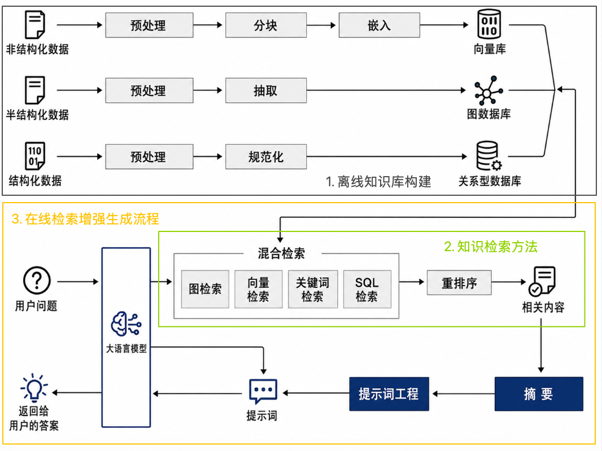
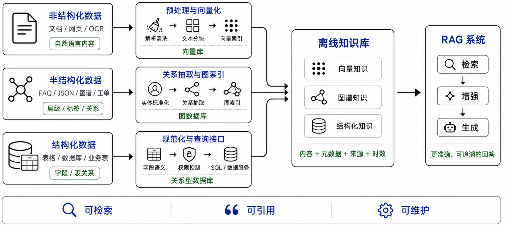
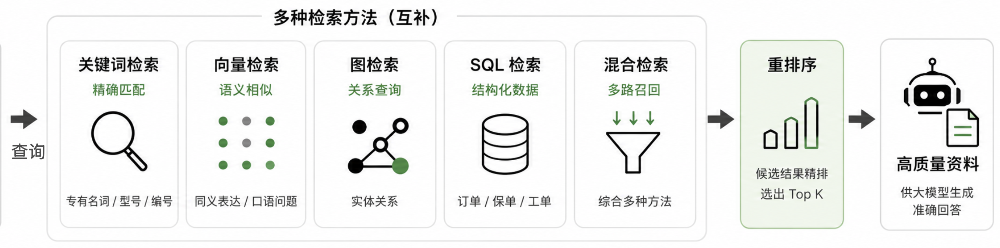
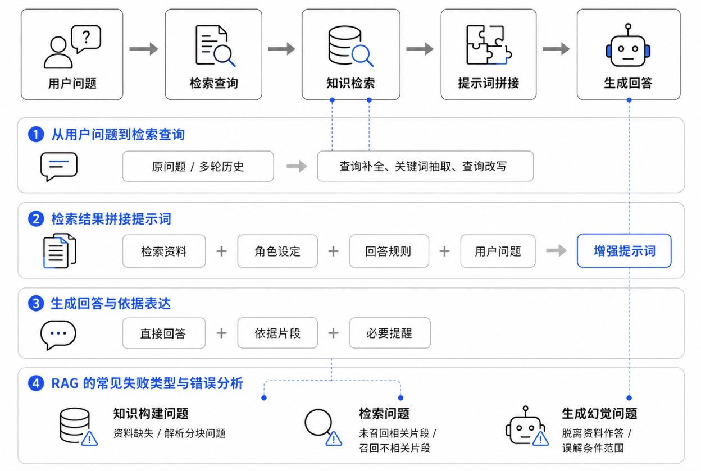
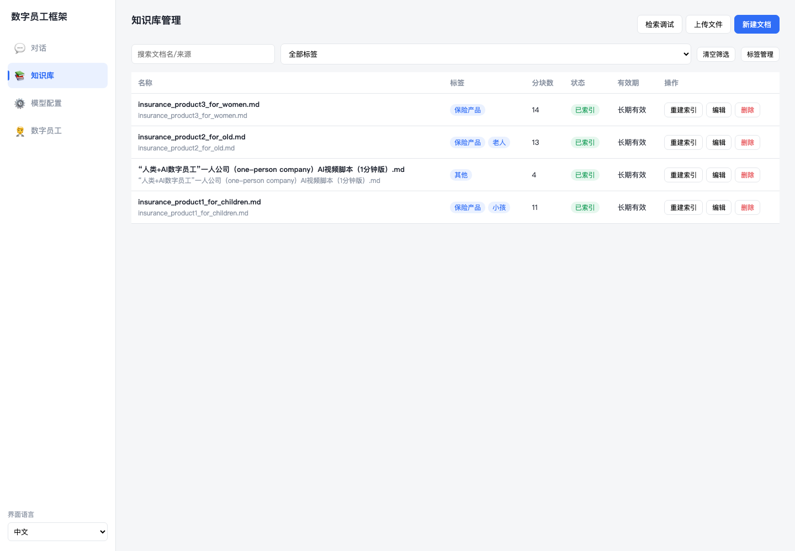
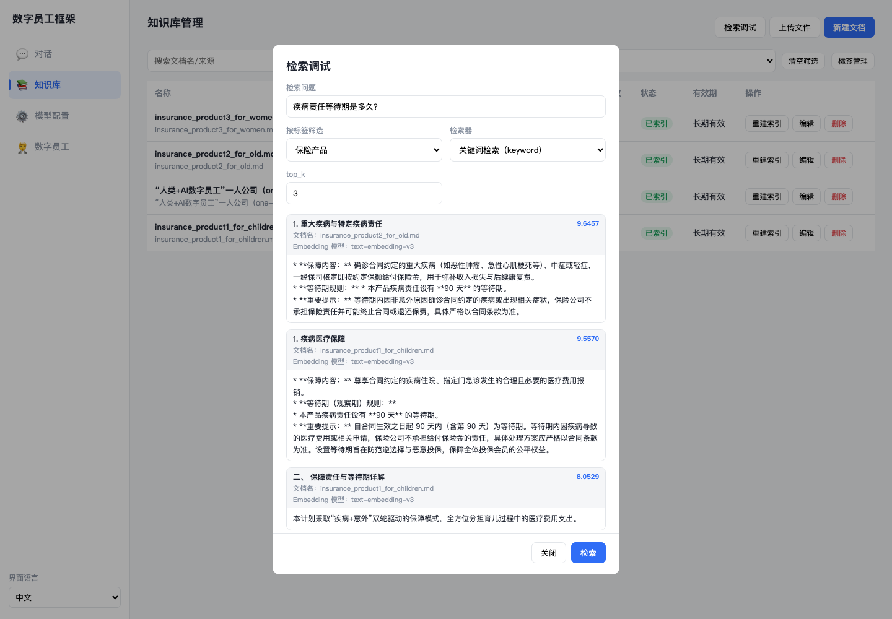
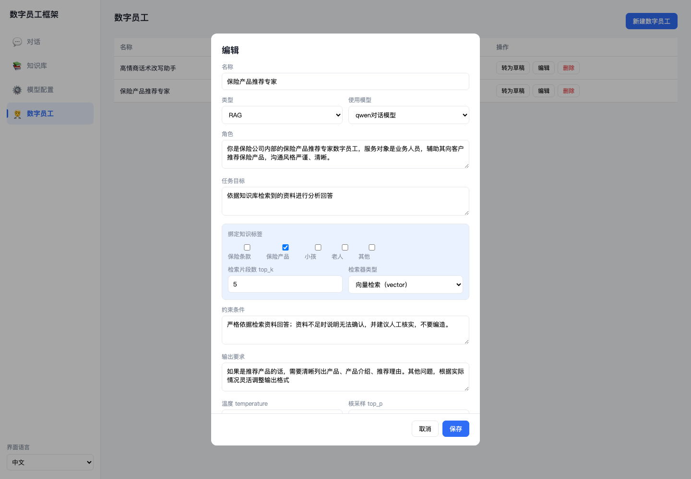
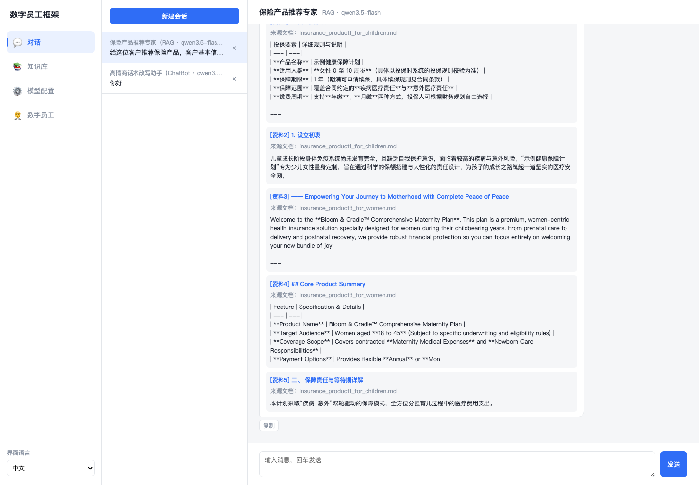

[← 上一章](../chapter2_chatbot/README.md) | [返回总目录](../README.md) | [下一章 →](../chapter4_agent_memory_tools/README.md)

> 本章配套代码：[进入 code 目录](./code/)

# 知识增强的 RAG 数字员工

第 2 章实现了基础 ChatBot 数字员工。它已经能够根据角色提示词、模型参数和短期历史进行连续交流，但知识来源仍然有限：一部分来自模型训练时形成的通用知识，一部分来自系统提示词中写入的资料。当资料较少、规则比较固定时，这种方式可以工作；一旦进入真实业务环境，问题就会变复杂。文档会更新，流程会调整，说明文件可能有多个版本，内部知识还可能分散在网页、PDF、表格和数据库中。如果把这些内容全部写进提示词，提示词会越来越长，维护也会越来越困难。

本章引入检索增强生成（Retrieval-Augmented Generation, RAG）。它的基本思路是：用户提问后，系统先从外部知识库中找出相关资料，再把资料和问题一起交给大模型，让模型基于可见依据回答。这样，数字员工不再只依赖模型自身记忆，而是可以围绕文档、知识库、业务规则和结构化数据工作。RAG 是从基础 ChatBot 走向知识型数字员工的关键一步。

完成本章后，你应该能够：

1. 说明 RAG 的基本思想，以及它和基础 ChatBot 的区别。
1. 理解预处理、分块、抽取、规范化、嵌入、索引和增强生成之间的关系。
1. 设计一个面向通用业务场景的知识库组织方案。
1. 比较关键词检索、向量检索、图检索和 SQL 检索的适用场景。
1. 解释为什么 RAG 能降低编造风险，但不能完全消除错误。
1. 基于上一章的 ChatBot 思路，完成一个带知识库检索能力的 RAG 数字员工。

## RAG 是什么？

RAG 指的是在大模型生成回答之前，先从外部知识库中检索相关内容，再把检索结果作为上下文提供给模型，让模型依据这些材料生成回答。RAG 最早作为一种把参数化记忆和非参数化外部知识结合起来的方法被系统讨论<sup>[1](#ref-lewis2020rag)</sup>。参数化记忆指的是模型训练后固化在参数中的知识，它覆盖面广，但更新不灵活，也很难说明具体依据。非参数化外部知识指的是文档、网页、数据库、知识图谱等可独立维护的资料，它可以更新、追溯和审核。

因此，RAG 的核心不是让模型记住更多内容，而是让模型在回答前先查资料。基础 ChatBot 更像闭卷回答，主要依赖模型已有知识和提示词。RAG 数字员工更像开卷回答，它先检索资料，再组织回答。这个变化看似简单，却改变了数字员工的知识来源、系统边界和维护方式。

<a id="fig-rag"></a>



*图 3-1　RAG 数字员工的知识构建、检索与生成流程*

图 [3-1](#fig-rag) 展示了 RAG 数字员工的完整工作链路。为了便于理解，本章按三段展开。第一段是离线知识库构建，把原始资料处理成可检索、可追溯、可维护的知识单元。第二段是知识检索，根据用户问题从向量库、图数据库、关系型数据库或检索引擎中找到候选资料。第三段是在线增强生成，把少量高质量检索结果组织到提示词中，引导大模型依据资料回答。

从第 2 章到第 3 章，系统主线发生了一个重要变化。基础 ChatBot 主要解决模型如何按角色和上下文说话，RAG 数字员工进一步解决模型回答时依据哪些外部资料。因此，本章不是简单增加一个数据库，而是增加一个新的工作环节：**检索**。数字员工要先找到资料，再组织回答。如果资料没有覆盖问题，系统应说明无法确认，而不是凭经验补全答案。

### 为什么需要 RAG？

对于数字员工来说，RAG 的价值主要体现在四个方面。

**第一，知识可以动态更新。**模型训练完成后，它自身的知识不会自动随外部世界变化而更新。业务制度、产品资料、技术文档、政策文件和操作流程却经常变化。使用 RAG 后，更新知识库通常比重新训练模型更轻量，也更符合资料管理流程。只要新的资料被纳入索引，系统就有机会在下一次检索中使用它。

**第二，回答可以更贴近指定资料。**基础 ChatBot 即使语气自然，也可能回答成通用建议。RAG 会把命中的文档片段放进上下文，使模型更容易围绕给定资料回答。例如，用户询问某个系统的权限配置，系统应优先检索当前版本的使用手册，而不是让模型根据一般经验猜测。

**第三，回答依据更容易检查。**RAG 可以把命中的知识片段、文档标题、章节位置和更新时间一并记录下来。开发者、业务人员或管理员可以查看数字员工到底依据了哪些资料，便于发现资料缺失、检索错误或回答误读。

**第四，提示词可以保持简洁。**第 2 章已经说明，提示词应包含角色、任务、资料、约束和输出要求。但如果把所有业务资料都写进系统提示词，提示词会变得冗长，也会增加模型忽略重点的风险。RAG 的做法是先筛选，再提供，使模型看到更少但更相关的材料。

### RAG 与 ChatBot 的区别

基础 ChatBot 和 RAG 数字员工都需要模型参数、系统提示词和多轮历史。它们的区别不在于是否使用大模型，而在于回答前是否进行知识检索。表 [3-1](#tab-chatbot-rag-diff) 对比了二者的关键差异。

<a id="tab-chatbot-rag-diff"></a>

*表 3-1　基础 ChatBot 与 RAG 数字员工的区别*

| **维度** | **ChatBot** | **RAG** |
| --- | --- | --- |
| 知识来源 | 主要来自模型自身知识和提示词中写入的资料。 | 来自模型能力、系统提示词和外部知识库检索结果。 |
| 适合任务 | 简单问答、固定流程引导、文本改写。 | 知识库问答、制度解释、文档助手、数据查询。 |
| 更新方式 | 修改提示词或代码中的资料。 | 更新知识库文档、重新分块和索引。 |
| 风险控制 | 依赖提示词约束模型不要编造。 | 在提示词约束之外，要求回答依据检索片段。 |
| 主要难点 | 角色、语气、历史上下文管理。 | 文档质量、分块策略、检索准确率和依据表达。 |

需要注意，RAG 不是“万能事实校验器”。如果知识库本身过期、片段切分不合理、检索结果不相关，模型仍然可能回答错误。RAG 只能让模型更容易接触到可靠资料，不能替代资料审核、业务规则和人工复核。

## 离线知识库构建

前一节说明了 RAG 为什么需要外部资料，接下来需要回答的是这些资料怎样进入知识库。图 [3-2](#fig-knowledge) 给出了本章的整体构建思路。原始资料先按形态进入不同处理路径，经过预处理、抽取、规范化和索引后，形成离线知识库中的向量知识、图谱知识和结构化知识。RAG 系统再围绕这些知识完成检索、增强和生成。这样构建知识库的目的，不只是把资料存起来，而是让知识单元具备明确的内容、元数据、来源和时效信息，便于后续检索、引用和维护。

<a id="fig-knowledge"></a>



*图 3-2　离线知识库构建框架*

### 知识来源与资料边界

知识来源可以是文档、网页、表格、数据库、FAQ、知识图谱、日志或历史问答记录。选择知识来源时，首先要确定资料边界：哪些资料可以被引用，哪些资料只能内部使用，哪些资料已经过期或需要人工确认。例如，正式发布的操作手册可以进入知识库，讨论中的草稿和旧版本文件则应隔离或标注状态。没有边界的知识库容易混入旧资料，导致回答看似有依据，实际却不可靠。

从处理方式看，知识来源可以分为三类。非结构化数据没有固定字段和表结构，主要依靠自然语言和版面表达含义，例如文档、网页和图片 OCR 文本。半结构化数据有一定层级、标签或关系，但格式不完全统一，例如 FAQ、JSON、XML、知识图谱和工单记录。结构化数据具有明确字段、类型和表间关系，例如电子表格、关系型数据库和数据仓库业务表。

<a id="tab-rag-knowledge-sources"></a>

*表 3-2　RAG 知识库的三类数据*

| **数据类型** | **典型来源** | **核心特点** | **处理重点** |
| --- | --- | --- | --- |
| 非结构化数据 | 文档、网页、图片 OCR 文本。 | 以自然语言和版面表达含义。 | 解析清洗、文本分块、向量索引。 |
| 半结构化数据 | FAQ、JSON、XML、知识图谱、工单记录。 | 有层级、标签或关系，但格式不完全统一。 | 标准化实体、抽取关系、建立图索引。 |
| 结构化数据 | 电子表格、关系型数据库、业务表。 | 有明确字段、类型和表间关系。 | 维护字段语义、权限和查询接口。 |

表 [3-2](#tab-rag-knowledge-sources) 概括了三类数据的区别。初学阶段可以先从结构清晰的非结构化文档开始，再逐步加入图数据、表格和数据库。下面按这三类知识分别说明构建方法。

### 非结构化知识构建

非结构化知识是 RAG 中最常见的知识来源。它内容丰富，但格式不统一，不能直接稳定检索。构建这类知识的关键，是把资料转换为标准化文本，并保留必要结构和元数据，供后续分块、嵌入和索引使用。例如，一份 PDF 手册不能只抽出正文，还应尽量保留标题层级、页码和表格表头，否则后续即使命中文本，也难以说明依据来自哪里。

#### 预处理：解析与清洗

文档解析的目标是把原始资料转换为可处理的文本。纯文本和 Markdown 较容易处理，PDF、Word 和网页则需要识别标题、段落、列表、表格等元素。对于扫描件或截图，需要先通过 OCR 获取文字。解析时应尽量保留标题、页码、章节编号等结构信息，便于后续检索和引用。

解析之后还要进行清洗。清洗不是润色文本，而是去掉会干扰检索的噪声，例如重复页眉页脚、乱码、广告语、无关导航和重复段落。对于表格内容，要保留表头和单元格之间的对应关系，避免数字脱离字段含义。

预处理结束后，应把正文和元数据一起保存。元数据包括文件名、来源地址、标题层级、页码、更新时间和访问权限等。它们可以帮助系统过滤资料、展示依据和排查问题。

#### 知识分块

大模型不能每次都读取整份知识库，检索系统也需要以较小的文本块为单位建立索引。因此，文本分块是 RAG 的关键步骤。分块太短会丢失上下文，分块太长会混入多个主题，都会降低检索准确性。

分块的目标不是追求更长，而是让每个文本块围绕相对明确的主题，并保留必要上下文。这样检索命中时，模型看到的是相关材料，而不是一大段混杂信息。常见分块方式主要有四类：

**按结构分块。**按照标题、章节、条款、问答对或段落切分，适合结构清晰的文档。

**按长度分块。**当结构不明显时，按固定字数或 token 数切分，并设置少量重叠。

**递归分块。**先按章节、段落等自然边界切分，片段过长时再继续细分。

**按语义分块。**根据主题变化切分，使每个片段尽量围绕一个完整语义单元。

<a id="tab-chunking-strategies"></a>

*表 3-3　常见文本分块策略比较*

| **策略** | **适合场景** | **优点** | **风险** |
| --- | --- | --- | --- |
| 标题或章节分块 | 结构清晰的手册、制度、条款。 | 保留文档逻辑，便于引用。 | 大章节可能过长。 |
| 问答对分块 | FAQ、知识库问答。 | 问题和答案天然对应。 | 覆盖面受问法限制。 |
| 固定长度分块 | 结构不明显的长文本。 | 实现简单，便于批量处理。 | 容易切断语义。 |
| 递归分块 | 层级结构不稳定的文档。 | 兼顾块大小和自然边界。 | 参数不当时仍会过细或过粗。 |
| 语义分块 | 主题变化明显的长文档。 | 块内语义一致性较好。 | 计算成本更高，结果不一定稳定。 |

表 [3-3](#tab-chunking-strategies) 给出几种分块策略的比较。初学时可以采用结构优先、长度兜底的策略：先按标题、章节或问答对切分，片段过长时再按长度细分，答案经常跨片段时设置少量重叠。切分后应保留标题、来源位置和更新时间。

分块质量需要通过测试问题验证。若经常召回主题相近但不能回答问题的片段，说明块可能过大。若经常漏掉答案，说明块可能过小，或者缺少必要上下文。

#### 向量表示与索引

文本分块之后，系统需要为每个片段建立可检索的表示。向量表示，也常称为 embedding，是把文本转换为一组数字，使语义相近的文本在向量空间中距离更近。用户问题也可以转换成向量，再和知识片段向量进行相似度比较。

可以把向量检索理解为按意思找资料。例如，“如何重置密码”和“忘记登录凭证时，可通过账号安全页面重新设置”字面不同，但语义相关，向量检索更容易匹配。

建立索引时，通常需要保存文本片段、片段向量和元数据。元数据包括文档名、章节名、页码、版本号、更新时间和访问权限等，用于追溯来源和展示依据。

到这里，非结构化知识已经完成从原始文档到向量索引的转换。但向量库不能替代所有知识存储。图数据库更适合实体关系，关系型数据库更适合结构化数据。不同问题需要不同检索入口。

### 半结构化知识构建

半结构化知识有一定层级、标签或关系，但不像关系型表格那样严格固定。典型形式包括知识图谱、FAQ、工单记录，以及从文档中抽取出的实体关系。它的重点不是保存一段文字，而是表达对象之间的关系。

图数据适合处理多跳查询和关系追踪。例如，某个功能依赖哪些模块，又会影响哪些流程，单个文本片段未必能完整覆盖，但图结构可以沿依赖、影响、包含等关系逐步查找。

#### 预处理

以图数据为例，构建的第一步是确定图谱范围，包括实体类型、关系类型、属性定义和资料来源。范围过宽会难以维护，范围过窄又会限制查询能力。

预处理还包括实体标准化和消歧。同一个对象可能有简称、别名或旧名称，如果不统一，图谱中会出现重复节点。对于时间敏感的关系，还应记录生效时间和来源。

#### 信息抽取

信息抽取是把文档中的实体、关系和事件提取出来。实体可以是系统、模块、人员、组织、概念或流程节点；关系可以是包含、依赖、属于、负责、前置、后置、引用等。抽取结果通常形成三元组，例如“模块 A 依赖 模块 B”。

信息抽取可以由规则、模型或人工审核共同完成。其目标是把段落中的隐含关系显式化，使系统检索时不仅能找文本，还能沿关系找到相关知识。

#### 图数据索引

图数据索引的目标是让系统快速找到实体、关系和相邻节点。与向量索引不同，图索引关注连接结构，常用于从一个实体扩展到相关概念、依赖对象或关联文档。

在 RAG 中，图数据通常作为检索增强的一部分：先找到入口实体，再沿关系扩展相关节点和文档，最后把结构化结果整理给大模型生成回答。它并不替代文本片段，而是帮助系统把相关文本组织到正确的关系范围内。

### 结构化知识构建

结构化知识指的是已经按照字段、行列、主键、外键等形式组织好的数据，例如电子表格、关系型数据库和数据仓库业务表。它的核心价值不在于相似文本，而在于字段关系和可计算性。状态查询、数量统计、范围筛选和时间聚合，通常更适合通过数据库查询完成。例如，查询某类记录本月新增数量，应读取数据库中的时间和类型字段，而不是在文档中寻找相似描述。

#### 预处理

结构化数据的预处理首先要明确表和字段的含义。系统需要知道每张表表示什么对象，每个字段表示什么含义，表之间如何关联。只给模型表名和字段名通常不够，因为真实数据库中常有缩写、历史命名和内部术语。

其次要处理数据质量和权限问题。空值、重复记录、异常值、编码不统一会影响查询结果；敏感字段、内部字段和高风险查询则需要脱敏和权限控制。

#### 规范化

规范化的目标是让结构化数据保持清晰、一致和可查询。对于表格或数据库，应保留字段、类型、主键、外键、时间范围和业务含义，而不是把它们切成普通文本片段。

规范化还包括建立业务术语和数据库字段之间的对应关系。实际系统通常会维护表结构、字段解释、同义词和示例查询，帮助模型理解自然语言问题与数据库结构之间的关系。

#### 关系型数据库存储

RAG 系统不一定需要新建关系型数据库，更常见的做法是通过安全接口接入已有数据库或数据服务。系统先判断问题是否需要查询结构化数据；如果需要，再根据表结构、字段解释和权限规则生成查询，并把结果整理给大模型。

这种方式通常被称为 Text2SQL 或 NL2SQL，即把自然语言问题转换为 SQL 查询。它的关键不只是语法正确，更要语义正确、权限合规、结果可解释。

## 知识检索方法

<a id="sec-ch3-knowledge-retrieval"></a>

离线知识库建好后，下一步是让系统在提问时找准资料。RAG 的回答质量很大程度上取决于检索质量。模型再强，如果取回的材料不相关、不完整或不可信，后续生成也很难可靠。本节围绕图 [3-3](#fig-retrieval-techs) 展开，先说明如何把用户问题构造成可检索的查询，再介绍关键词检索、向量检索、图检索和 SQL 检索，最后说明为什么需要混合检索和重排序。

<a id="fig-retrieval-techs"></a>



*图 3-3　知识检索方法*

### 查询构建

检索不是简单地把用户原话丢给数据库。用户问题往往口语化、上下文不完整，也可能同时包含多个意图。查询构建的作用，是把自然语言问题转换成适合不同知识库执行的检索请求。例如，用户问“上一版规则和现在有什么不同”，系统需要结合对话历史补全“哪一份规则”，还要判断应检索版本说明、正文条款，还是结构化的更新时间字段。

一个较稳妥的查询构建过程通常包括三步。第一步是意图识别，判断问题需要查文本、查关系、查表格，还是需要多路检索。第二步是查询改写，把口语表达改成更接近资料表述的检索语句，同时保留原问题，避免改写引入偏差。第三步是补充约束条件，例如时间范围、文档类型、版本号、权限范围和实体名称。这些约束条件通常来自元数据，比单纯依赖文本相似度更稳定。

如果问题较复杂，还可以进行查询拆解。比如“某制度的适用对象、审批流程和生效时间分别是什么”，可以拆成三个子问题分别检索，再把结果合并。这样做的好处是提高召回率，避免一个宽泛查询只命中其中一部分信息。需要注意的是，查询构建越复杂，越要保留中间结果，便于检查检索失败到底来自问题理解、查询改写，还是知识库本身缺失。

### 关键词检索

关键词检索根据词语匹配程度排序，核心基础是倒排索引。系统先记录每个词出现在哪些文档或字段中，查询时再根据词频、稀有程度和字段权重计算相关性。常见代表是 TF-IDF 和 BM25。BM25 基于概率检索框架，是信息检索中非常经典的排序方法<sup>[2](#ref-robertson2009bm25)</sup>。

关键词检索适合精确匹配，尤其适合编号、术语、人名、机构名、型号、标题和版本号。它的优点是速度快、可解释、便于加过滤条件。要检索得准，不能只看正文匹配，还应利用标题、章节、来源、时间、文档类型等元数据。例如，查询某个编号对应的说明时，编号命中标题通常比命中正文更重要。

关键词检索的局限是对同义表达和隐含语义不够敏感。如果用户说“多久能办完”，资料中写的是“处理时限”，只靠字面匹配可能漏掉。实际系统常用 ElasticSearch[^1]、OpenSearch[^2] 等检索引擎，配合分词、同义词词典、字段权重和过滤条件提升命中率。

### 向量检索

向量检索先用嵌入模型把问题和文本片段转换为向量，再用余弦相似度、内积或欧氏距离衡量语义接近程度。与关键词检索相比，向量检索更擅长处理同义表达、口语化问题和概念相近的问题。例如，用户问“账号进不去怎么办”，资料中写的是“登录失败处理步骤”，向量检索比单纯关键词匹配更容易命中。

向量检索主要用于非结构化文本，也可以用于半结构化知识中的说明文本。要检索得准，前提是离线阶段的分块合理，嵌入模型与资料语言和领域相匹配，并且元数据能够参与过滤。Top K 不是越大越好。Top K 太小可能漏掉关键材料，Top K 太大又会把主题相近但不能回答问题的片段带入上下文。

向量库通常会使用近似最近邻搜索提高效率，代表性工具包括 Milvus[^3]、FAISS[^4] 等。初学阶段不必一开始追求复杂部署，关键是理解问题向量和片段向量如何比较，以及为什么相似不一定等于可回答。

### 图检索

图检索面向半结构化知识，特别适合实体、关系和路径比较清楚的问题。它不只是问哪段文字相似，而是问哪些实体相连、关系是什么、路径如何展开。例如，用户问“某设备由哪些部件组成，相关维护要求在哪里”，系统可以先识别设备实体，再沿着“包含”“维护要求”“适用文档”等关系找到候选节点和文本依据。

图检索要检索得准，关键在于实体识别和关系建模。系统需要把问题中的实体名称链接到图中的标准实体，再根据关系类型进行一跳或多跳扩展。常见查询方式包括基于图数据库的 Cypher 查询、SPARQL 查询，以及由大模型辅助生成图查询语句。代表性工具包括 Neo4j[^5]、NebulaGraph[^6] 等。

图检索的优势是结构清晰，适合回答关系、层级、依赖和影响范围等问题。它的不足是构建成本较高，如果实体抽取或关系抽取质量不稳定，检索结果也会偏。实际系统常把图检索与向量检索结合使用，先用图确定实体和关系范围，再用文本片段提供可引用的解释。

### SQL 检索

SQL 检索面向结构化数据，适合回答数量、状态、时间、排名、明细列表和聚合统计等问题。用户如果询问某个记录的当前状态，系统应查询数据库中的实时字段，而不是从文档中寻找相似描述。这里的核心技术通常称为 Text2SQL 或 NL2SQL，即把自然语言问题转换为数据库查询。

SQL 检索要检索得准，首先要做好模式理解。系统需要知道有哪些表、字段含义是什么、表之间如何关联、哪些字段可以被查询。其次要做好问题和字段的对齐，例如把“负责人”对应到数据库中的 `owner_id` 或 `assignee` 字段。最后还要进行查询校验，避免生成越权、低效或语义错误的 SQL。

实际系统通常不会让模型直接访问全部数据库，而是提供只读接口、字段白名单、权限过滤和结果脱敏。对于高风险查询，可以先生成查询计划或 SQL 草稿，再经过规则校验或人工确认。这样既能利用结构化数据的准确性，也能降低错误查询带来的风险。

### 重排序

前面几种检索方法解决的问题不同。关键词检索擅长精确匹配，向量检索擅长语义召回，图检索擅长关系推理，SQL 检索擅长结构化查询。真实系统常采用混合检索，先让不同检索器分别召回候选结果，再合并为统一候选集。常见融合算法包括加权求和、按名次融合和倒数排名融合（Reciprocal Rank Fusion，RRF）。

混合检索解决的是“尽量找全”，重排序解决的是“把最有用的排在前面”。第一阶段通常召回较多候选，追求覆盖率。第二阶段使用更精细的规则或模型重新判断候选结果与问题的匹配程度。代表性方法包括基于交叉编码器的 reranker、基于大模型的相关性打分、基于元数据的规则排序，以及用于减少重复内容的最大边际相关性。

重排序时不能只看语义相似，还要看材料能否直接支持回答。一个片段可能主题相近，却没有答案；另一个片段语义分数稍低，但包含明确字段、时间或结论。较好的排序标准应综合相关性、权威性、时效性、完整性和多样性。经过重排序后，系统再选择少量高质量材料进入提示词，既减少噪声，也降低长上下文带来的注意力分散。

## 在线检索增强生成流程

前两节分别说明了知识如何准备、资料如何检索。本节把这些环节串成一次完整问答。图 [3-4](#fig-generation) 中，用户问题先被理解和整理，再进入检索模块，从知识库中取回相关依据，最后与问题一起交给大语言模型生成回答。一个基础 RAG 流程通常包括：接收问题、补全查询、检索知识、重排序、压缩资料、组织增强提示词、生成回答。

<a id="fig-generation"></a>



*图 3-4　在线检索增强生成流程*

### 从用户问题到检索查询

上一节已经介绍查询构建，这里强调它在在线流程中的作用。用户问题往往比较口语化，也可能依赖前文上下文。例如，用户先问“这个规则适用于哪些人”，第二轮又问“生效时间呢”。此时，第二轮问题本身不是完整查询，系统需要结合历史补全为“这个规则的生效时间是什么”。因此，RAG 仍然需要第 2 章介绍的多轮历史，只是历史的作用从辅助生成回答，进一步扩展为辅助形成检索问题。

在简单系统中，可以先直接使用用户原问题检索。进一步优化时，再加入查询补全、关键词抽取和查询改写。需要注意的是，改写后的查询不一定总是更好，可能遗漏用户原意。因此，较稳妥的做法是保留原问题和改写问题，并在检索结果中比较二者的效果。

### 检索结果拼接提示词

检索到知识片段后，系统需要把片段放入提示词。此时提示词通常包含四部分：角色设定、回答规则、检索资料和用户问题。与第 2 章不同的是，知识不再主要写死在系统提示词中，而是在每次问答时由检索模块动态提供。

当检索结果较多时，不能简单把所有内容塞进提示词。图 [3-4](#fig-generation) 中的摘要和提示词工程用于控制输入质量。摘要负责压缩重复和次要内容，提示词负责明确回答边界、依据表达和拒答规则。二者共同服务于一个目标：让模型看到足够相关、清楚且可追溯的依据。

下面是一个简化的增强提示词模板。

```text
系统消息：
你是知识问答助手。请只依据“检索资料”回答问题。
如果检索资料没有覆盖答案，请说明当前资料无法确认，并建议人工核实。
回答时先给出结论，再列出依据。不要编造未出现的事实、数字或承诺。

检索资料：
[资料1] 文档第 3 节：该规则自 2026 年 1 月 1 日起生效。
[资料2] FAQ：若用户询问规则生效时间，应以正式发布文件为准。

用户问题：
这个规则什么时候生效？
```

这个模板的关键是明确资料边界。模型可以组织语言，但不能把检索资料没有提供的信息说成事实。若资料之间存在冲突，回答应提示冲突并建议人工确认，而不是强行合并。

### 生成回答与依据表达

RAG 的回答不应只追求自然流畅，还应体现依据。一个适合教学阶段的回答结构是“直接回答、依据片段、必要提醒”。例如：

```text
该规则自 2026 年 1 月 1 日起生效。
依据是资料1中“该规则自 2026 年 1 月 1 日起生效”的说明。
需要注意，具体执行口径仍应以正式发布文件为准。
```

这种结构有三个好处。第一，用户能快速获得结论。第二，学习者或开发者能检查回答是否来自检索片段。第三，当知识库资料不足时，系统更容易稳定地拒绝编造。

### RAG 的常见失败类型与错误分析

最后还要看到，RAG 不是把资料接入系统就一定可靠。理解失败类型，比只看成功示例更重要。常见错误可以分为三类。

**知识构建问题。** 知识库中没有相关资料，或资料在解析、分块、清洗时出现缺失和错位。此时即使检索流程正确，也无法取回可靠依据。

**检索问题。** 知识库中有答案，但分块、关键词、向量表示或过滤条件不合适，导致相关片段没有被召回。也可能召回了主题相近但不能回答问题的片段。

**生成幻觉问题。** 检索结果不足或存在条件限制时，模型仍然给出看似确定的说法。也可能检索结果正确，但模型误解了条件、例外或时间范围，没有严格依据资料回答。

评估 RAG 时，应分别观察知识是否正确、检索是否命中、回答是否依据资料。入门实践不必实现复杂评估框架，但应建立这种拆分分析的意识。

## 动手实践：构建知识增强的 RAG 数字员工

本章实践项目延续第 2 章基础 ChatBot 的配置方式，在原有“角色、任务目标、约束条件、输出要求”之外，增加了知识库、检索调试和引用资料展示能力。场景仍然选用保险咨询，系统目标也很直接：先从知识库查到相关资料，再让数字员工依据资料回答，并把引用依据留给用户检查。

对初学者来说，本实践不要求掌握复杂后端工程，重点是看清 RAG 从资料到回答的基本链路。可以顺着四步来理解：先把业务文档整理成知识片段。用户提问时再检索相关片段。随后把片段放进提示词，让模型依据资料回答。最后在页面中展示引用资料，方便检查回答是否有依据。

这条实践主线与前文理论保持对应。文档整理对应离线知识库构建，涉及资料边界、文本清洗、分块和索引。问题检索对应知识检索方法，需要比较关键词检索、向量检索、混合检索以及 `top_k` 的影响。带着资料生成回答，则对应在线检索增强生成流程。后面分析结果时，也要用到前文的错误分析思路：答案不对时，先判断问题出在知识库、检索，还是模型生成。

### 第一步：启动系统并准备业务知识文档

进入代码目录后，先安装依赖并启动服务。

```bash
cd {本章项目代码目录}
pip install -r requirements.txt
uvicorn app.main:app --reload
```

启动后访问 `http://127.0.0.1:8000`。系统会自动创建本地 SQLite 数据库，并写入演示模型、示例数字员工、知识标签和示例保险文档。左侧页面包括“对话”“知识库”“模型配置”和“数字员工”。本节主要围绕“知识库”“数字员工”和“对话”三个页面展开。“模型配置”用于填写 OpenAI 兼容接口地址、模型名和 API Key。只有模型测试成功后，后面的 RAG 对话才能真正调用大模型生成回答。

如果希望体验向量检索，还需要在代码目录中配置 embedding 模型。项目允许暂时不配置 embedding，此时系统可以使用关键词检索完成主要流程。这样设计是为了让学习者先理解 RAG 的整体链路，再逐步比较关键词检索和向量检索的差异。

可以直接使用 `data/` 目录中的保险产品文档，也可以在网页中创建自己的文档。初学阶段建议使用 Markdown 或普通文本，因为这两类文件最容易看清标题、段落和分块结果。资料不必很长，但结构要清楚，最好包含基础介绍、适用人群、保障范围、等待期、理赔材料和未覆盖事项。

建议将文档整理成如下形式：

```text
# 产品基础信息
产品名称：示例健康保障计划
适用人群：18 至 55 周岁，具体以投保规则为准。

# 等待期
本产品疾病责任等待期为 90 天。等待期内发生的疾病相关申请，应以合同条款为准。

# 理赔材料
常见材料包括身份证明、保单信息、医疗票据、诊断证明和保险公司要求的其他材料。

# 未覆盖事项
本文档不包含具体费率、收益承诺和最终理赔结论。
```

这份资料故意写入“未覆盖事项”，是为了让学习者观察一种常见情况：知识库里没有具体费率、收益承诺或最终理赔结论时，系统应该说明无法确认，而不是补出一个看似完整的答案。真实项目中，文档还会保存名称、来源、版本、标签和有效期。这些信息不是装饰，而是用来限定检索范围，并帮助用户追溯回答依据。

### 第二步：构建离线知识库

在网页“知识库”页面中新建或上传文档后，系统会自动完成索引构建。这个过程对应前文的离线知识库构建，包括清洗文本、文本分块、生成向量或关键词索引、保存片段和来源信息。初学时可以先把它理解成把一整份文档拆成若干张资料卡片，每张卡片都保留正文、来源标题和所属文档，后续检索就是从这些卡片中找出最相关的几张。

```python
text = clean_text(document.content)
chunks = split_text(text, strategy="structure")
vectors = embed_texts([chunk.content for chunk in chunks])
save_chunks(document, chunks, vectors)
```

这段代码只保留关键逻辑。系统先清洗文档，去掉不必要的空白或格式噪声。接着按结构分块，优先利用 Markdown 标题和段落。随后把每个片段转换成向量，便于后续按语义检索。最后把片段、向量和来源信息一起保存下来。这里最重要的不是记住向量计算细节，而是理解系统为什么不能只保存向量。模型生成回答时需要看到原文，用户检查依据时也需要看到来源标题。

项目默认采用“结构优先、长度兜底”的分块策略。条款、说明书和 FAQ 往往有明显标题，按结构分块更容易保留语义完整性，也方便后面说明依据来自哪里。固定长度分块实现简单，但可能把“等待期规则”和“重要提示”切开，导致模型拿到的上下文不完整。实践时可以编辑同一份文档，再观察分块数量和检索结果是否发生变化。

本节中的“分块数”和“已索引”状态，是理解离线阶段的两个观察点。分块数说明一份文档被拆成了多少个检索单元，索引状态说明这些片段是否已经可以参与检索。如果文档内容已经保存，但索引失败，在线问答阶段就可能查不到正确资料，后续回答也很难可靠。

图 [3-5](#fig-rag-practice-knowledge-list) 展示了系统启动后的知识库页面。学习者可以先从这里观察文档名称、标签、分块数量、索引状态和有效期。这个页面对应前文的离线知识库构建结果，说明文档已经被系统拆成可检索的知识片段。

这里的“标签”和“有效期”就是资料边界在系统中的具体体现。知识库并不是简单地把资料放在一起，还要说明哪些资料属于同一类业务，哪些资料当前有效，哪些资料不应该被某个数字员工检索到。边界越清楚，进入提示词的无关片段就越少，旧资料误导回答的风险也会降低。

<a id="fig-rag-practice-knowledge-list"></a>



*图 3-5　配套系统中的知识库文档列表*

这一步和前文“知识来源与资料边界”直接相关。教学项目中的文档可以不长，但边界必须清楚。比如等待期、理赔材料属于可以回答的内容，具体保费和收益承诺则是当前资料没有覆盖的内容。只有先把这些边界写清楚，后面才能判断 RAG 是否真的在依据资料回答，而不是把通用常识包装成确定结论。

### 第三步：检索调试

知识库建好后，不要急着测试对话，应先在“知识库”页面点击“检索调试”。输入问题、选择标签、检索器类型和 `top_k`，观察命中的片段是否真的能回答问题。例如输入“疾病责任等待期是多久？”，理想结果应命中包含“90 天”等待期说明的片段。

图 [3-6](#fig-rag-practice-search-debug) 展示了一次检索调试结果。可以看到，系统返回了来源标题、文档名、嵌入模型和得分，并展示了命中的原文片段。学习者应先查看这些片段，再判断最终回答是否可信。这样可以避免只凭模型回答流畅程度判断系统效果。

<a id="fig-rag-practice-search-debug"></a>



*图 3-6　使用检索调试检查等待期问题的命中片段*

检索入口的设计思路很简单：先根据标签和有效期缩小资料范围，再按用户选择的检索器进行排序。如果向量检索不可用，系统可以退回关键词检索。下面的片段只保留了检索策略选择部分。

```python
chunks = load_chunks(tag_ids)
if retriever_type == "keyword":
    passages = keyword_search(query, chunks, top_k)
elif retriever_type == "vector":
    passages = vector_search(query, chunks, top_k)
else:
    passages = hybrid_search(query, chunks, top_k)
```

这段代码对应前文“知识检索方法”一节。关键词检索适合产品名、条款名、编号和明确术语。向量检索更适合字面不同但意思相近的问题。混合检索则希望同时利用二者的优势。初学阶段不必先纠结复杂算法，只要能解释清楚为什么不同问题可能适合不同检索方式，就达到了本节实践目标。

检索调试还可以帮助学习者理解前文的一个重要判断：相似不等于可回答。得分高的片段可能只是主题相近，但没有直接给出答案。比如用户问等待期，如果片段只说“保障责任与等待期详解”，却没有写出具体天数，它就不能直接支撑回答。调试时要同时看三件事：是否命中正确文档，是否命中正确标题，片段中是否真的包含回答所需的信息。

### 第四步：发布 RAG 数字员工

在第 2 章中，数字员工配置主要包括角色、任务目标、业务资料、约束条件和输出要求。加入 RAG 后，“业务资料”不再写成长提示词，而是通过知识标签动态绑定。可以简单理解为：提示词规定怎么回答，知识库提供依据什么回答。

一个 RAG 数字员工的核心配置可以概括为：

```python
rag_agent_config = {
    "role": "你是保险咨询数字员工。",
    "service_goal": "依据知识库资料回答保险咨询问题。",
    "knowledge_tag_ids": [2],
    "retrieval_top_k": 3,
    "retriever_type": "vector",
    "constraints": "只依据检索资料回答，资料不足时说明无法确认。",
    "output_instruction": "先给结论，再列依据，最后给出必要提醒。",
}
```

这段配置里，`knowledge_tag_ids` 决定数字员工能查哪些资料，`retrieval_top_k` 决定每次取回多少个片段，`retriever_type` 决定使用哪种检索方式。实践可以从 `top_k=3` 开始，再调整为 1 或 5，观察回答是否漏掉关键信息或引入噪声。

图 [3-7](#fig-rag-practice-agent-config) 是 RAG 数字员工的配置界面。与第 2 章基础 ChatBot 相比，这里最重要的变化是类型选择为 RAG，业务知识不再写入大段背景资料，而是通过“绑定知识标签”指定检索范围，同时设置检索片段数和检索器类型。

本节中也能对应前文“RAG 与 ChatBot 的区别”。基础 ChatBot 通常把业务资料写在提示词中，适合资料少、规则固定的任务。RAG 数字员工把业务事实放到知识库中，提示词只保留角色、目标、约束和输出格式。这样当产品资料更新时，主要更新知识库即可，不必反复修改很长的提示词。

<a id="fig-rag-practice-agent-config"></a>



*图 3-7　RAG 数字员工的知识标签与检索参数配置*

### 第五步：完成一次 RAG 对话

一次 RAG 对话可以拆成四个核心步骤：生成检索查询、检索知识片段、构造增强提示词、生成并保存回答。换成更直观的说法，就是先提问，再查资料，然后带着资料问模型，最后展示答案和依据。下面的片段展示了在线流程的主干。

```python
query = build_query(user_input, chat_history)
passages = search_knowledge(query, agent_config)
prompt = build_rag_prompt(agent_config, passages, user_input)
answer = llm_generate(prompt)
save_answer_with_sources(answer, passages)
```

这段流程中，`passages` 是 RAG 的核心，表示本轮检索到的资料片段。如果没有检索片段，系统就缺少外部依据。如果检索片段不准确，模型也可能依据错误材料回答。因此，调试 RAG 时不能只看最终回答，还要同时查看本轮检索到了哪些资料。

增强提示词的构造也很关键。项目没有把大段保险资料写死在系统提示词中，而是把每轮检索到的片段编号为“资料1、资料2、资料3”，再明确要求模型只依据这些资料回答。提示词可以简化理解为下面的模板。

```text
你是保险咨询数字员工。
请只依据下面的检索资料回答问题。
如果资料没有覆盖答案，请说明当前资料无法确认。

检索资料：
[资料1] 等待期：本产品疾病责任等待期为 90 天。
[资料2] 未覆盖事项：本文档不包含具体费率和收益承诺。

用户问题：
疾病责任等待期是多久？
```

这个模板的重点不在格式，而在边界。模型可以组织语言，但不能把资料中没有出现的内容说成事实。页面中的引用资料会随回答一起保存，刷新浏览器后仍能查看。这样做便于复盘：答案是否可靠，先看引用资料能否支持答案。

图 [3-8](#fig-rag-practice-chat-sources) 展示了对话页面中展开的引用资料。学习者在测试时要同时检查两部分：回答本身是否准确，引用资料是否真的支持回答。若回答看似合理，但引用片段没有提供依据，就应把它记录为生成阶段或检索阶段的问题。

<a id="fig-rag-practice-chat-sources"></a>



*图 3-8　RAG 对话页面中的引用资料展示*

图 [3-1](#fig-rag) 中的流程可以对应到本实践：左侧知识库构建属于离线阶段，右侧用户提问、检索、增强提示词和生成回答属于在线阶段。理解这两个阶段的分工，是掌握 RAG 的关键。

最后，还要把实践结果与前文的三类失败联系起来分析。如果检索调试中没有命中正确片段，问题通常出在知识构建或检索阶段。如果已经命中正确片段，但回答遗漏了限制条件，问题通常出在生成阶段。如果知识库本身没有答案，而模型仍给出确定结论，则说明拒答约束没有发挥好。这样分析之后，学习者就不只是说“模型答错了”，而是能进一步判断系统的哪一个环节需要改进。

### 实践任务设计

1. 运行配套系统，确认“知识库”页面中至少有一份文档，并查看该文档的分块数量、标签和状态。
1. 新建一份 800 到 1500 字左右的业务知识文档，内容围绕一个具体产品或服务，至少包含基础介绍、规则说明、流程说明和常见问答。
1. 使用“检索调试”测试至少 3 个问题，分别记录命中文档、来源标题、片段内容和得分。建议至少包含一个直接命中问题、一个口语化问题和一个资料中没有答案的问题。
1. 发布一个 RAG 数字员工，绑定对应知识标签，将 `top_k` 先设为 3，检索器先选“向量”。如果没有 embedding 配置，可以改用“关键词”继续实验。
1. 在“对话”页面完成一轮问答，检查回答下方是否展示引用资料。刷新浏览器后，再确认历史回答中的引用资料是否仍然保留。
1. 调整 `top_k` 或检索器类型，比较回答变化。分析变化来自知识库资料、分块策略、检索结果，还是模型对资料的理解。

### 预期成果

完成后，学习者应提交一份 RAG 数字员工实践报告，包括知识库资料说明、文本分块示例、检索调试截图、RAG 数字员工配置截图、测试问题列表、回答截图和错误分析。报告中不只展示成功回答，还要至少分析两个失败案例，说明问题出在知识库资料、分块策略、检索结果还是生成回答。最终应能说清楚当前 RAG 系统的能力边界：它可以让数字员工依据外部资料回答问题，但仍需要资料审核、检索评估和人工确认来保证可靠性。

## 作业与思考

1. 用自己的话说明 RAG 为什么能降低模型编造答案的风险，但不能完全消除错误。
1. 比较关键词检索和向量检索的优缺点，并各举一个适合销售或客服场景的问题。
1. 选择一份业务文档，设计两种文本分块方案，并说明哪一种更适合该文档。
1. 设计一个“知识库中没有答案时”的回答策略，要求包含拒答话术和转人工建议。
1. 思考销售或客服知识库在真实企业中应该如何更新、审核和下线过期内容。

## 参考文献

1. <a id="ref-lewis2020rag"></a>Patrick Lewis, Ethan Perez, Aleksandra Piktus, Fabio Petroni, Vladimir Karpukhin, Naman Goyal, 等. [Retrieval-Augmented Generation for Knowledge-Intensive NLP Tasks](https://arxiv.org/abs/2005.11401). Advances in Neural Information Processing Systems. 33, 9459–9474, 2020.

2. <a id="ref-robertson2009bm25"></a>Stephen Robertson, Hugo Zaragoza. The Probabilistic Relevance Framework: BM25 and Beyond. Foundations and Trends in Information Retrieval. 3, 4, 333–389, 2009. [DOI](https://doi.org/10.1561/1500000019).

[^1]: https://www.elastic.co
[^2]: https://opensearch.org/
[^3]: https://github.com/milvus-io/milvus
[^4]: https://github.com/facebookresearch/faiss
[^5]: https://neo4j.com/
[^6]: https://www.nebula-graph.io/

---

[← 上一章](../chapter2_chatbot/README.md) | [返回总目录](../README.md) | [下一章 →](../chapter4_agent_memory_tools/README.md)
