[中文](./README.md) | [English](./README-en.md)

[← Previous Chapter](../chapter3_rag/README-en.md) | [Back to Contents](../README-en.md) | [Next Chapter →](../chapter5_harness/README-en.md)

> Companion code for this chapter: [open the code directory](./code/README-en.md)

# An Agent Digital Employee with Tools and Memory

The preceding chapters progressed from foundations to ChatBot and RAG digital employees. ChatBot supports role-based, contextual conversation; RAG adds external knowledge for more reliable answers. Real business work requires more than answering. A digital employee must query systems, call interfaces, record state, and continue according to execution feedback. It must become an agent that can act.

This chapter focuses on tools, memory, and autonomous loops. It distinguishes agents from ChatBots, RAG, and LLM workflows, introduces ReAct and plan-and-solve execution structures, explains how tool mechanisms turn intended actions into real calls, and shows how memory preserves continuity and reusable experience. The goal is a clear, implementable minimum agent framework that prepares for reliable, controllable deployment in Chapter 5.

After completing this chapter, you should be able to:

1. Understand the capability shift from question answering to goal-driven agents.
1. Explain ReAct, planning and execution, tool calling, and memory.
1. Implement an autonomous agent with tool calling and basic memory.

## The Nature of an Agent

### The Key Paradigm Shift of Autonomous Agents

ChatBots provide contextual, role-based answers, while RAG retrieves external knowledge to reduce unsupported claims. Both still focus on answering well. They can be extended into an LLM workflow that connects tool calls and structured outputs in a predefined sequence, such as identifying intent, retrieving knowledge, querying a price, and generating a reply. The model participates in each step, but the developer generally determines the path in advance.

<a id="tab-chatbot-rag-agent-diff"></a>

*Table 4-1. Core differences among ChatBots, RAG, LLM workflows, and agents*

| Dimension | ChatBot | RAG | LLM Workflow | Autonomous Agent |
| --- | --- | --- | --- | --- |
| Primary objective | Conversational answers | Answers after retrieval | Execute a preset process | Goal-driven execution |
| External information | Conversation context | Knowledge bases and documents | Workflow state and tool results | Environment state and tool feedback |
| Ability to act | Generate text | Cite material | Call tools in fixed steps | Select and call tools proactively |
| Decision method | Passive response | Retrieval-augmented response | Developer orchestration | Dynamic next-step decisions |
| Typical limitation | Limited context | Primarily solves knowledge problems | Multi-step but not autonomous | Requires permission and risk controls |

The paradigm shift is not a more complicated Q&A chain but moving the LLM into a goal-driven execution system. As Table [4-1](#tab-chatbot-rag-agent-diff) shows, an agent receives a goal, permissions, and boundaries, then observes state, decides the next step, invokes tools, and changes direction from feedback. Its core capabilities are goal-driven multi-step decisions, tool execution, and state continuity.

### Core Modules

Figure [4-1](#fig-llm-agent-core-modules) presents four modules: an LLM brain, execution structure, tool mechanism, and memory. The LLM understands goals, analyzes context, and reasons about actions. The execution structure organizes calls into a loop and controls continuation and termination. Tools connect APIs, functions, databases, and business systems. Memory preserves task context and useful long-term information.

<a id="fig-llm-agent-core-modules"></a>

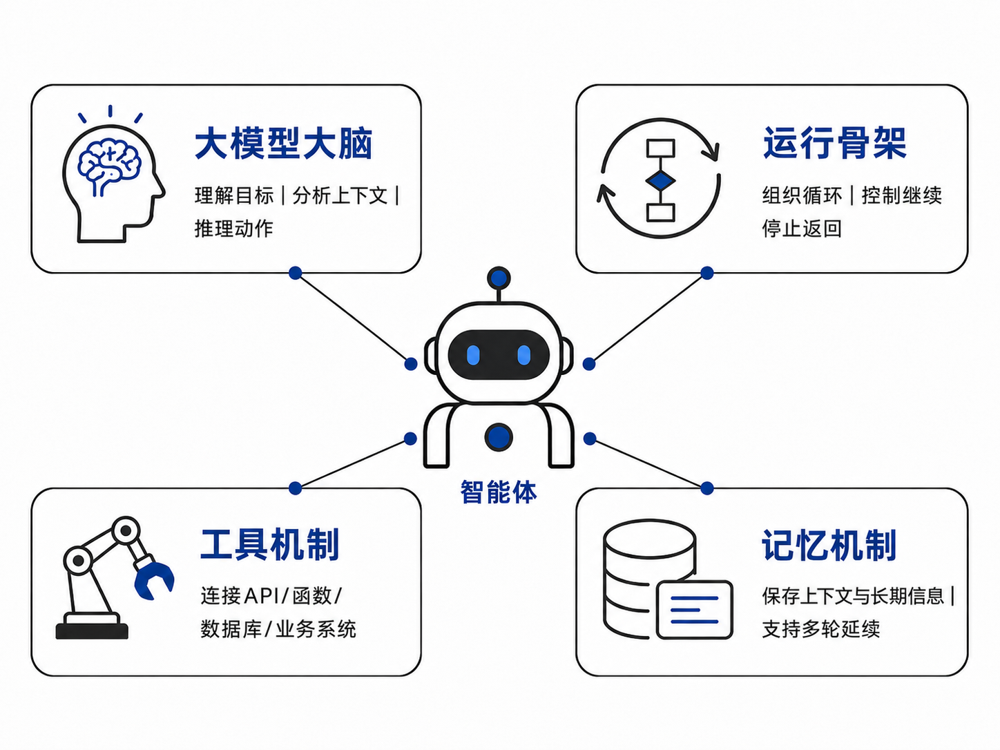

*Figure 4-1. Core modules of an LLM-driven agent*

The execution structure receives the user's goal and invokes the LLM to understand and decide. It reads memory or calls a tool when needed. Tool feedback returns to the structure and drives the next decision. The rest of this chapter examines the execution structure, tools, and memory. Chapter 5 packages these capabilities into a more reliable, controllable service.

## Agent Execution Structures

An execution structure organizes the LLM, tools, and memory into a sustainable process. Rather than calling the model once, an agent repeatedly judges, acts, observes, and adjusts. ReAct explains how feedback drives a current task, while plan-and-solve explains how a complex task first forms an overall route and then executes it.

### The ReAct Agent Loop

ReAct (Reason and Act)<sup>[1](#ref-yao2023react)</sup> combines reasoning and action. In Figure [4-2](#fig-react-agent-loop), a user asks what the Apple Remote originally controlled. Instead of answering from memory, the agent searches for Apple Remote, observes its relationship to Front Row, searches Front Row, then concludes from sufficient evidence that it was Apple's media-center software. The agent reasons, acts, and adjusts from observations.

The loop has three stages. During **thought**, the model uses the goal, history, and observations to identify missing information and choose the next step. During **action**, the system turns that decision into a tool call, user question, material read, or final result. During **observation**, it records a tool result, user response, or execution state and sends it into the next model call. The cycle continues until the task is complete.

<a id="fig-react-agent-loop"></a>

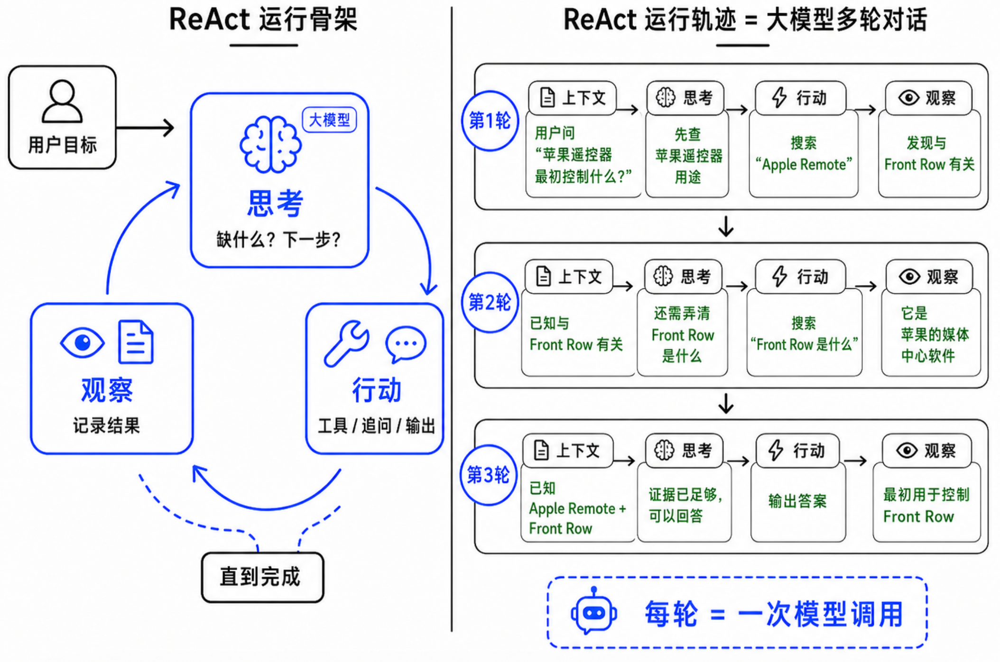

*Figure 4-2. Thought, action, and observation in the ReAct execution structure*

Technically, a ReAct trace is a multi-turn LLM conversation. Each round receives the goal, completed steps, tool results, and necessary memories. The model produces an action, the runtime executes it, and the result becomes a new observation. The system thereby moves from answering to advancing a task.

This lets the model query current information, delegate precise arithmetic to a calculator, verify doubtful results, or ask the user to clarify an ambiguous goal. ReAct suits research, APIs, code execution, files, and debugging. Many coding and general-purpose agents follow a similar loop.

ReAct also resembles the classic OODA loop[^1] of observe, orient, decide, and act. In an LLM agent, the model performs semantic understanding and decisions, tools perform external actions, and observations return to context.

ReAct does not guarantee correctness. It makes execution observable, traceable, and adjustable. Engineering still requires maximum rounds, timeouts, budgets, termination conditions, access control, audit logs, tool allowlists, and human confirmation to prevent endless searches and unsafe actions.

### Plan-and-Solve

ReAct adjusts actions from current observations. Plan-and-solve first creates an overall plan and then follows it. It suits clear goals that decompose into dependent steps, such as research reports, travel plans, data analysis, and small software projects. General agent products such as Manus[^2] use this visible planning style. A system may collect material, analyze it, produce a document or web page, and then inspect the result. A visible route clarifies the goal and progress for both system and user.

Figure [4-3](#fig-plan-and-solve) shows two stages. Planning decomposes the goal into ordered subtasks, each with a problem, inputs, possible tools, and expected deliverable. Execution completes the tasks, records results in state, and combines them into the final output.

<a id="fig-plan-and-solve"></a>

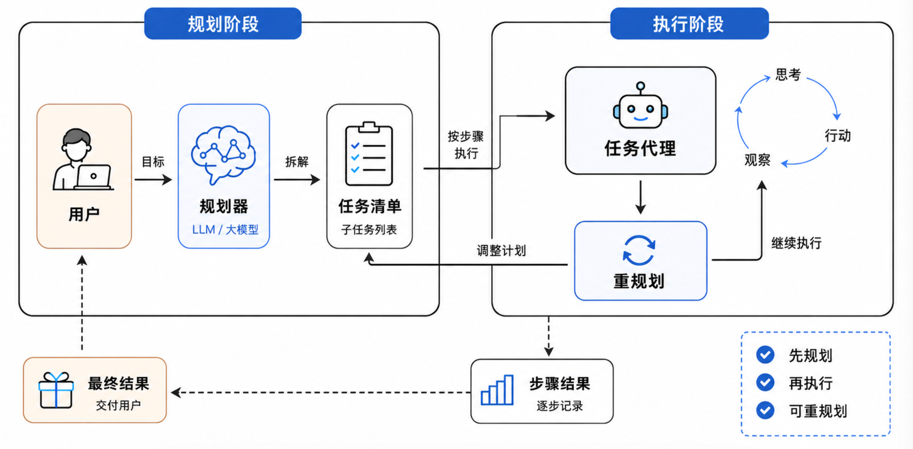

*Figure 4-3. The Plan-and-Solve agent structure*

Planning provides a global view. Without a route, local information can distract an agent or produce many actions that do not approach the goal. Visible plans also let users correct direction and systems track progress.

Plans can be wrong, and environments can change. Mechanically following an initial plan may continue in the wrong direction. Real systems often combine planning with ReAct: a planner creates subtasks, each subtask runs in a ReAct loop, and important observations can trigger replanning.

The two modes are complementary. Planning supplies the upper-level route; ReAct handles feedback within the current step. Simple tasks may use ReAct directly, while complex tasks plan first. Planning itself can be exposed as a tool that the agent calls when needed.

## Tool Mechanisms

The execution structure decides continuously; tools turn decisions into executable actions. The model proposes an action, the program validates permissions and rules, executes it, and returns the result for the next decision.

### How Does an LLM Use a Tool?

An LLM cannot directly execute a Python function or access an enterprise system. Function Calling or Tool Calling asks the model to emit a **structured request**. The program parses it, validates parameters and permissions, performs the real call, and returns the result.

JSON commonly expresses these requests. It is easier for a program to parse than natural language. Instead of saying “check tomorrow's Shenzhen weather,” the model can produce:

```text
{
  "tool": "get_weather",
  "arguments": {
    "city": "深圳",
    "date": "明天"
  }
}
```

APIs use different field names and may support several tool calls in one response, but the principle is the same: the model first emits a machine-readable request rather than a final answer.

<a id="fig-tool-calling-workflow"></a>

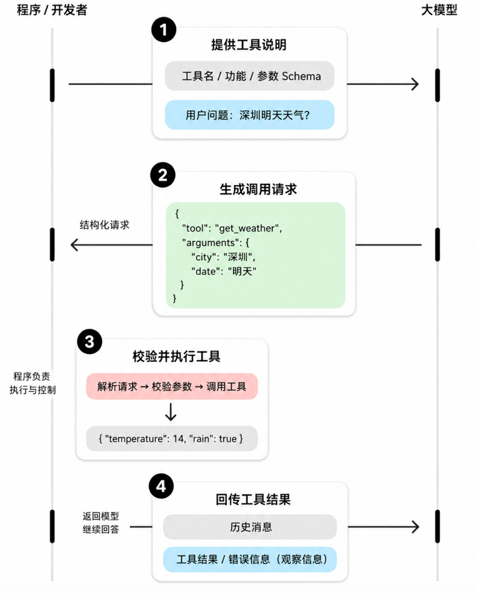

*Figure 4-4. Basic workflow for LLM tool use*

Figure [4-4](#fig-tool-calling-workflow) has four stages:

1. **Provide tool definitions.** Expose the name, description, and parameter Schema, usually through an API `tools` field rather than executable function code.
2. **Generate a request.** The model decides whether a tool is needed, selects it, and fills structured arguments.
3. **Validate and execute.** The program checks types, required fields, permissions, and risk before calling the external system.
4. **Return the result.** Success or failure becomes an understandable observation. The model answers or selects another action.

The boundary remains essential: the model understands and decides; the program executes and controls.

### How Should a Tool Be Defined?

A definition tells the model when to use a tool and how to fill its parameters. It needs a name, capability description, and parameter Schema. Actual execution remains in a function, API adapter, or MCP Server.

```text
{
  "name": "query_order",
  "description": "根据订单号查询订单状态、物流节点和预计送达时间。只用于查询已创建订单，不处理退款或改地址。",
  "parameters": {
    "type": "object",
    "properties": {
      "order_id": {
        "type": "string",
        "description": "订单号，例如 SO202607060001"
      }
    },
    "required": ["order_id"]
  }
}
```

`name` should identify one stable action and object. `description` states both capability and boundary. `properties` defines fields and `required` marks mandatory ones. The same Schema guides model generation and program validation.

Clear, single-purpose tools are less easily misused. An order query should not process refunds, a pricing tool should not place an order, and a ticket creator should not promise an outcome. Clear boundaries simplify selection, permissions, and auditing.

### Common Tool Types and Boundaries

More tools do not automatically produce a better agent. Tools should supply capabilities that the model lacks, performs inaccurately, or should not perform directly. Reliable systems expose layered capabilities with controls proportional to risk.

<a id="fig-common-tools"></a>

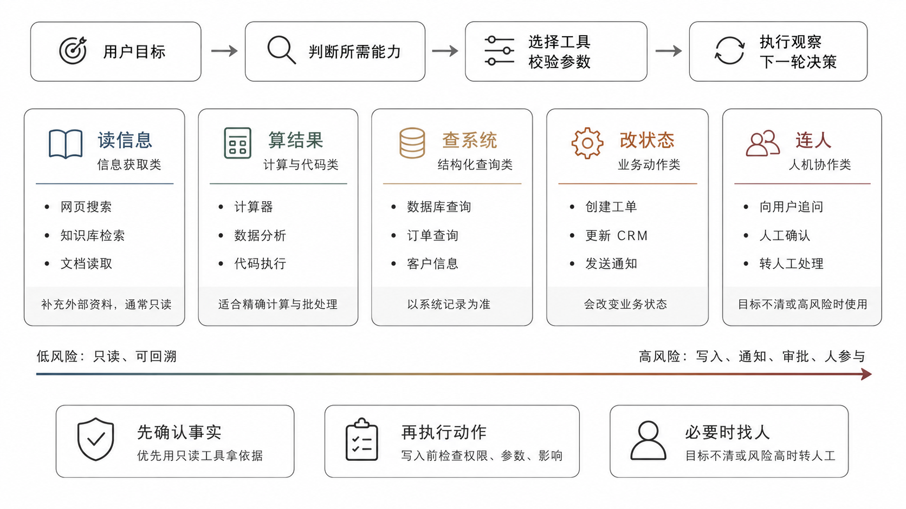

*Figure 4-5. Common agent tool types and capability boundaries*

Figure [4-5](#fig-common-tools) groups tools into reading information, calculating results, querying systems, changing state, and involving people. Moving right generally increases the need for permissions, confirmation, and logs.

**Information tools** retrieve web pages, knowledge, and documents. They are generally read-only but must respect source authority, recency, and permissions. Search results are not automatically facts.

**Calculation and code tools** handle arithmetic, analysis, and constrained code execution. Exact amounts and statistics should use tools rather than model mental arithmetic. Code must run in a sandbox with file, network, and time limits.

**Structured query tools** read live orders, customers, inventory, or databases. They should be preferred over guessing from conversations, but require identity-based field filtering and masking.

**Business action tools** create tickets, update CRM records, send notifications, submit approvals, or draft contracts. They create value and risk because they change external state. Validate parameters, permissions, impact, and human confirmation before high-risk actions.

**Human collaboration tools** ask users, request confirmation, or hand off a task when information is missing, goals are unclear, or risk is too high. Sometimes the best next action is not another API call but a focused question or a structured handoff.

A useful order is to confirm facts with read-only tools, obtain precise results through calculation or queries, and only then write to systems or involve people. This creates evidence before action, boundaries during execution, and traceability after failure.

### MCP: A Standard Tool Communication Protocol

As tools expand from local functions to file systems, databases, search engines, Feishu, and GitHub, applications need a shared way to discover, describe, and invoke them. Model Context Protocol (MCP) is an open standard for this purpose[^3]. It is a common connection layer between AI applications and data or tool services.

<a id="fig-mcp"></a>

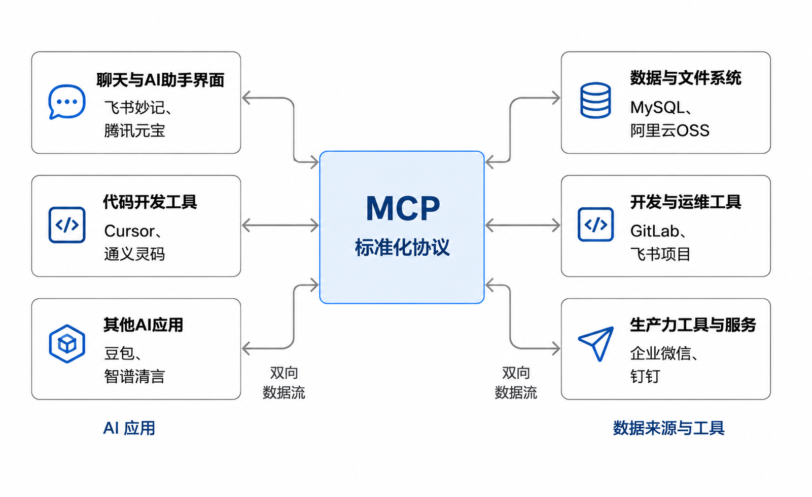

*Figure 4-6. The role of MCP in standardizing tool communication*

An agent product is the Host. MCP Clients inside it connect to MCP Servers. A Server exposes capabilities such as files, database queries, and business APIs with standardized names, descriptions, and input Schemas. The Client discovers these definitions and the Host presents them to the model. When the model requests a tool, the Host sends its name and arguments through the Client to the Server. The Server executes and returns a result. The model never executes the tool directly; Host and Server retain validation and control.

Adopt MCP progressively. Learn definitions, validation, and result return with local functions. Organize project tools in a consistent registry. Use MCP Servers when integrating a reusable ecosystem. This chapter focuses on Tools; Resources and Prompts can be explored afterward.

### Common Tool Problems and Mitigations

**Unclear boundaries.** Generic descriptions make selection ambiguous. State applicable and inapplicable scenarios and retain one responsibility per tool.

**Insufficient validation.** Structured JSON can still omit required fields or use the wrong type. Validate against the Schema. Correct only certain, minor issues automatically; otherwise return a clear error so the model asks or retries.

**Unrecoverable failure messages.** “Call failed” gives no next step. Return the reason, whether retry is possible, and a suggested action such as correcting a parameter, requesting permission, or escalating.

**Unclear permissions.** Queries are lower risk than writes, deletions, sends, payments, and approvals. High-risk tools need access checks, human confirmation, and logs. An agent cannot bypass existing security processes.

A sound tool mechanism does not maximize API count. It exposes clear, validatable, recoverable, auditable interfaces. The model understands and decides; the program executes and controls; results support the next decision.

## Memory Mechanisms

An LLM does not automatically preserve history. If a later call does not receive earlier information, it cannot use it. An agent needs memory to maintain continuity across multi-turn tasks, long-term interaction, and sustained execution.

Memory is the system's ability to save, organize, and use past information: conversation, preferences, task state, tool results, environmental feedback, experience, and effective methods. Research commonly analyzes memory by representation, function, and dynamics<sup>[2](#ref-hu2026memorysurvey)</sup>. Here, memory is a readable, writable, updatable module, not the entire chat log inserted back into a prompt.

Figure [4-7](#fig-agent-memory-lifecycle) shows a lifecycle. Tasks create experiences; formation extracts and stores valuable information; evolution consolidates, compresses, updates, and forgets it; retrieval selects relevant memory for a new context.

<a id="fig-agent-memory-lifecycle"></a>

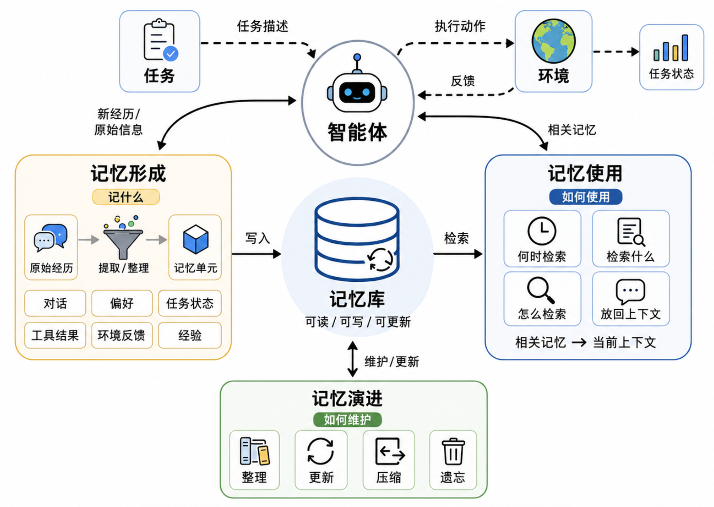

*Figure 4-7. Agent memory lifecycle: formation, evolution, and use*

Memory addresses three questions:

- **What to remember:** Which information deserves persistence?
- **How to maintain it:** How should it be consolidated, updated, and forgotten?
- **How to use it:** How can relevant memory be found when needed?

### Memory Types and Functions

By time horizon, short-term memory supports the current task, while long-term memory retains information useful across tasks. By function, factual memory records what the agent knows, experiential memory records what it did and which methods worked, and working memory records what it is processing now.

<a id="fig-memory-types"></a>

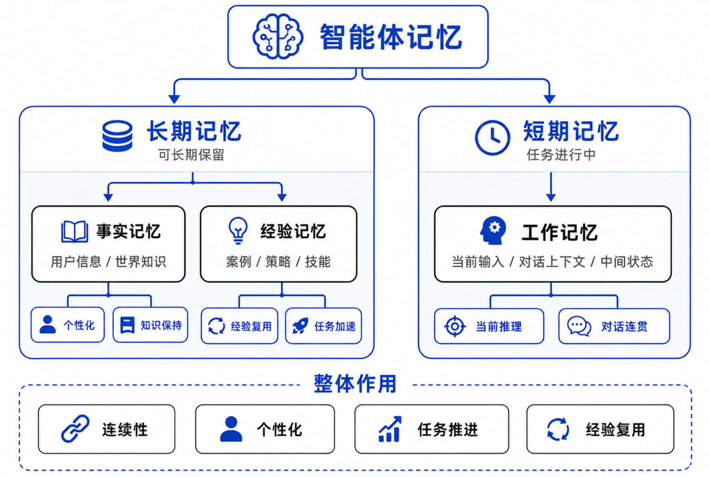

*Figure 4-8. Short- and long-term memory, and factual, experiential, and working memory*

#### Short-Term Memory

Short-term memory holds temporary information for the current task and supports selection, compression, updates, and rewriting. It is the agent's active workbench. In engineering, it often overlaps with working memory and includes conversation history, task state, plan drafts, and critical context-window information.

A travel-planning agent must retain dates, destinations, budget, and accommodation preferences. A customer-service agent handling policy cancellation must track identity, policy type, explained terms, unresolved questions, and the next tool. These details may not deserve permanent storage but are essential to finish the current task.

Because context windows are limited, short-term memory needs summaries, compression, or selective retention. Long conversations can become a concise task state; completed subtasks can collapse into summaries while the current step remains detailed. The goal is not to show the model everything, but what it needs for the next action.

#### Long-Term Memory

Long-term memory retains information valuable across tasks so an agent can learn about users, accumulate experience, and reuse it. It selectively stores stable preferences, personal facts, and effective methods rather than every historical detail. Its content can be divided into factual and experiential memory.

**Factual memory** records relatively stable, explicit information about users, tasks, or environments, such as a preference for code examples, primary use of Python, or an organization's current process. It preserves consistency and reduces repeated questions. Facts must remain updateable and carry source, time, and scope because preferences and processes change and weak sources may need removal.

**Experiential memory** records what happened during earlier tasks, which methods worked, and which steps can be reused. A customer-service agent may learn that classifying a complaint before generating a solution is more stable than replying immediately. This is experience formed by the agent's own operation, not external knowledge.

Experience may range from case memory containing one task's trace, inputs, tools, and result, to strategy memory abstracting recurring methods into rules or templates, and skill memory turning successful methods into functions, scripts, tool definitions, or MCP interfaces. It reduces repeated trial and error, improves planning and tool selection, and adapts execution to a specific setting.

### Memory Formation

Memory formation extracts new memory from task experience. Saving everything creates storage pressure and noise, so the system must identify long-term value.

<a id="fig-memory-formation"></a>

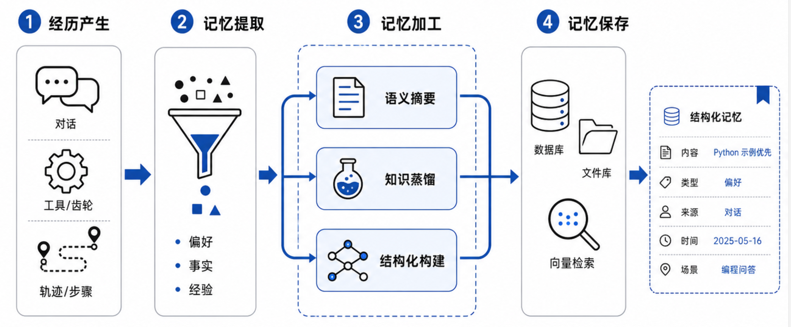

*Figure 4-9. Formation of agent memory*

#### Formation Process

Figure [4-9](#fig-memory-formation) shows four stages:

1. **Experience:** Conversations, tool results, and traces arise during a task.
1. **Extraction:** A model or rules identify preferences, important facts, and effective experience.
1. **Processing:** Raw information is summarized, compressed, and structured.
1. **Storage:** The processed memory enters persistent storage.

Repeated requests for Python examples, for instance, can become “User preference: prioritize Python examples in technical answers.”

#### Common Approaches

Formation extracts rather than copies. Semantic summaries compress long conversations and observations. Knowledge distillation extracts facts, intentions, failure causes, and successful strategies. Structured construction converts scattered text into key-value records, tags, tables, trees, or graphs.

A simple structured text format is a good starting point. Each memory can include content, type, source, time, and applicable scenario:

- Content: The user prefers Python examples in technical answers.
- Type: User factual memory.
- Source: Multi-turn conversation on July 7, 2026.
- Applicable scenarios: Technical explanations, code examples, and teaching materials.

#### Engineering Implementation

Memory storage resembles a knowledge base and may use files, relational databases, or vector stores. Files make content visible; databases manage users, tasks, and time; vector stores support semantic retrieval at scale. Begin with files or a relational database. Even when vectors are added, retain structured fields. Stable systems commonly combine structured filters with semantic search.

### Memory Evolution

As memory accumulates, unmaintained records become repetitive, conflicting, or obsolete. Memory evolution consolidates and updates them.

<a id="fig-memory-evolve"></a>

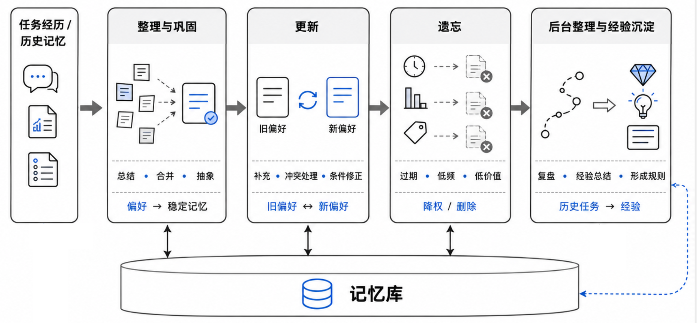

*Figure 4-10. Evolution of agent memory*

#### Consolidation

Consolidation summarizes, merges, and abstracts memories. Records that a user liked Python examples on July 1, requested more code on July 5, and wanted practical cases on July 20 can become: “User preference: technical explanations should include code and practical cases.”

Abstraction must be balanced. Too little leaves duplicates; too much erases exceptions. A general Python preference must not override an explicit Java request in the current task. Consolidated memories should retain conditions and, where useful, representative evidence.

#### Updating Memory

New information may extend or conflict with old memory. If a user who preferred detailed explanations repeatedly requests concise answers, update the memory to reflect a recent preference for brevity while retaining necessary detail for complex topics.

Updates prevent old memory from locking behavior. Business facts such as customer records, approvals, and contract versions should not be overwritten solely by model judgment. Use trusted tool results and record provenance for permissions and audits.

#### Forgetting

Forgetting adjusts retention by importance rather than indiscriminately deleting. Long-unused information can lose weight, repeated information can gain importance, and obsolete information can be replaced or removed. Strategies include time-based expiry, access-frequency decay, and importance retention. Privacy-sensitive data must support user-directed deletion and mandatory cleanup. An agent that only remembers eventually becomes slower and less stable under noise.

#### Background Consolidation and Experience Distillation

Some systems review experience while idle: historical tasks become summaries and then new rules. If this experience changes tool selection, planning, or execution, it forms an initial self-improvement loop. This chapter needs no complex self-evolution. Distilling key facts, effective steps, and failure causes into reusable memory is sufficient.

### Retrieving and Using Memory

Memory ultimately supports execution. Like RAG, an agent retrieves relevant items rather than inserting all memory into context. A basic flow is: current task → determine whether memory is needed → construct a query → retrieve and filter → add to context → generate. For a new technical proposal, the agent might retrieve the user's preferred format and methods that worked on similar tasks.

#### Key Questions

- **When to retrieve:** Every turn, at task start, when intent changes, under uncertainty, or when personalization is needed.
- **What to retrieve:** Rewrite vague input into a focused memory query. “Use my earlier style” might become “the user's tutorial writing preferences.”
- **How to retrieve:** Use keywords in simple systems and vectors, structured filters, or hybrid search as memory grows.
- **How to return it to context:** Rank, deduplicate, filter, and compress results instead of sending every similar item.

#### Relationship Between Memory and Knowledge

Memory and knowledge retrieval can both use keyword, vector, or hybrid methods; see [Chapter 3, Section 3.3](../chapter3_rag/README-en.md#sec-ch3-knowledge-retrieval). Their sources and functions differ.

<a id="tab-knowledge-memory-diff"></a>

*Table 4-2. Knowledge and memory in an agent system*

| Dimension | Knowledge | Memory |
| --- | --- | --- |
| Source | External material | The agent's own experience |
| Function | Provide factual evidence | Maintain continuity and accumulate experience |
| Update | Maintained through sources or business systems | Updated by interactions, tools, and task results |
| Examples | Product documents, technical material, policies | User preferences, task state, successes, and failures |

Knowledge helps an agent understand the external world; memory helps it understand what happened to itself and its users. An insurance agent might retrieve policy terms from knowledge, read a user's earlier policy type and communication preference from memory, and query the current state through a tool. The answer then has both evidence and continuity.

Memory also creates risk. Incorrect memory repeats errors, obsolete memory obscures change, and private memory creates compliance concerns. Items entering context should carry source, time, and confidence. In high-risk work, memory is auxiliary; databases, approval systems, and user confirmation remain authoritative.

## Hands-On Practice: Build an Agent Digital Employee with Tools and Memory

This project extends the preceding ChatBot and RAG systems with ReActAgent, a tool registry, and long-term memory. The employee can select tools, observe results, and retain valuable experience.

Learners configure, run, and observe the companion system rather than rebuild it. One scenario connects all steps: customer C001 wants eight months of short-term medical insurance for a three-year-old female cat. An insurance staff member uses the Insurance Business Assistant as an administrator. The agent retrieves available insurance material, recognizes knowledge boundaries, performs a teaching-only premium calculation, and submits a product outline, calculation basis, and risk warning for staff verification.

The first run shows tool configuration and ReAct selection. After completion, customer requirements and the design process enter diaries. Consolidation turns clearly identified facts and reusable design experience into core memories. On a later inquiry, `memory_search` retrieves them. Figure [4-11](#fig-pet-insurance-practice-flow) shows the closed loop.

<a id="fig-pet-insurance-practice-flow"></a>


*Figure 4-11. Tool and memory loop for the insurance assistant's pet-insurance task*

<a id="tab-agent-practice-theory-code"></a>

*Table 4-3. Mapping the practice flow to companion code*

| Stage | Core Question | Implementation | What to Observe |
| --- | --- | --- | --- |
| ReAct structure | How does the agent loop across reasoning, action, and observation? | `ReactRunner.run()` reads recent history and calls the model for up to `max_steps`. | The assistant identifies missing information before choosing a tool or drafting a product. |
| Tool definitions | How does the model know tools and parameters? | `ToolConfig`, `ReActAgentTool`, `parameters_schema`, and `tool_schemas()`. | The administrator binds search, calculator, and memory with parameter boundaries. |
| Tool calling | How is a request executed safely and returned? | The model emits `tool_calls`; `Draft7Validator` validates; `execute_tool()` executes and returns an observation. | The agent retrieves sources and calculates a teaching premium; invalid arguments return errors. |
| Memory formation | How does a successful task leave a trace? | A background task calls `update_daily_diaries()` for global and employee diaries. | C001's needs and the assistant's process enter different scopes. |
| Memory evolution | How do diaries become a small set of lasting information? | `consolidate_memories()` creates, updates, or deletes `CoreMemory` from diary increments. | Customer facts retain the identifier; methods become employee experience. |
| Memory use | How does a later task recover history? | `memory_search` filters scope and combines keyword, vector, and recency scores. | A later inquiry retrieves C001's needs and product-design experience. |

Install and start the companion project:

```bash
cd {本章项目代码目录}
pip install -r requirements.txt
uvicorn app.main:app --reload
```

Open `http://127.0.0.1:8000`. FastAPI serves APIs and static pages; SQLite stores employees, sessions, tools, diaries, and core memories. Configure an OpenAI-compatible model that supports native `tools` and `tool_calls`. Embedding is optional; without it, knowledge and memory retrieval fall back to keywords.

### Step 1: Configure ReActAgent and Its Tools

Edit the preset Insurance Business Assistant, set its type to ReActAgent, and bind `knowledge_search`, `calculator`, and `memory_search`. Bind `plan` only for tasks with dependent steps; a simple query or calculation does not need the extra model call.

Figure [4-12](#fig-agent-practice-config) shows tool and memory settings. The tool list defines available external capabilities, and maximum rounds prevent endless loops. Update Diary After Task controls formation after success, while `memory_search` controls later retrieval. Disabling one does not disable the other or delete existing memory.

<a id="fig-agent-practice-config"></a>

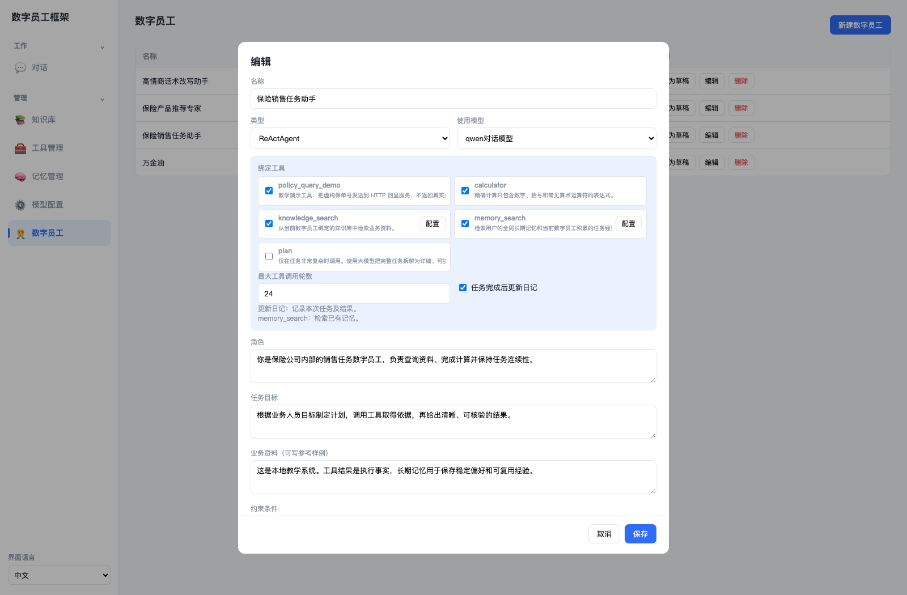

*Figure 4-12. Tool bindings and diary settings for the insurance assistant*

The program converts tool names, descriptions, and JSON Schemas into OpenAI-compatible Tool Calling definitions. It validates returned arguments again before execution.

```python
tools = available_tools(db, agent)
schemas = tool_schemas(tools)
content, calls, assistant_message = complete_with_tools(
    agent, messages, schemas
)

Draft7Validator(tool["parameters"]).validate(arguments)
execution = execute_tool(db, agent, tools, call["name"], arguments)
```

The model chooses a tool and prepares arguments; the program verifies binding and Schema and performs the function or HTTP call. Valid JSON alone is not sufficient. Wrong names, missing fields, and incorrect types become explicit observations.

### Step 2: Observe the ReAct Tool Loop

Publish the employee, create a session, and use this task:

```text
客户 C001 希望为一只 3 岁母猫购买一款为期 8 个月的短期宠物医疗险。
请作为保险业务助手形成产品设计草案。
先检索知识库中可参考的保障、等待期和理赔资料，
资料不充分时要明确说明。教学报价按下面的假设估算：
基础月费 100 元，共 8 个月；两次优惠各 9 元；
附加服务费 1 元。最后给出产品框架、保费和风险提示。
```

This is an internal staff task based on customer needs. The agent should retrieve available references, avoid claiming that generic insurance material is an actual pet policy, convert the teaching assumptions into `1+100*8-9*2`, and ask `calculator` for RMB 783. This result is not a real product price.

Figure [4-13](#fig-agent-practice-trace) shows thought, execution, and observation for the calculation. Retrieved source passages appear separately under Sources.

<a id="fig-agent-practice-trace"></a>

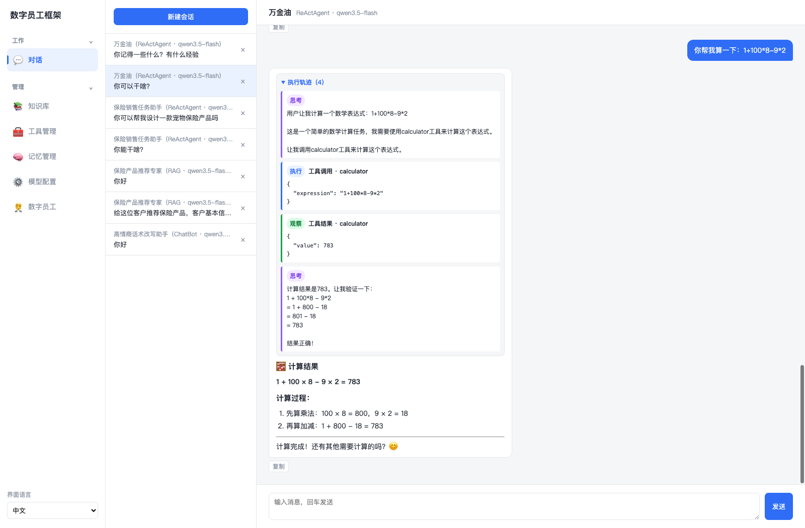

*Figure 4-13. Calculator trace for the teaching pet-insurance quote*

The central loop in `app/runners/react.py` is:

```python
for step in range(1, max_steps + 1):
    content, calls, assistant_message = complete_with_tools(
        agent, messages, schemas
    )
    messages.append(assistant_message)

    if not calls:
        yield {"kind": "text", "content": content}
        return

    for call in calls:
        arguments = json.loads(call["arguments"])
        execution = execute_tool(
            db, agent, tools, call["name"], arguments
        )
        messages.append({
            "role": "tool",
            "tool_call_id": call["id"],
            "content": json.dumps({
                "ok": execution.ok,
                "result": execution.result,
            }),
        })
```

Each model call either produces no `tool_calls`, making its text the final answer, or requests a tool. The program must execute the request and return the result with the original `tool_call_id` before the model continues. At the maximum round count, tools are removed and the model summarizes completed and unfinished work. This preserves the loop while enforcing a boundary.

Test an unsupported calculator request such as a function call. The calculator accepts only numbers, parentheses, and common arithmetic through a restricted abstract syntax tree. Its error returns as an observation. Check whether the agent adjusts, explains the limitation, or falsely claims success.

### Step 3: Observe How Experience Forms Diaries

Keep Update Diary After Task enabled and add customer context and staff requirements, clearly separating the customer from the administrator:

```text
补充客户 C001 的需求：投保对象是 1 只 3 岁母猫，
客户希望保障期限为 8 个月左右。
我作为保险业务人员，希望以后给产品草案时，
先写适用对象和保障范围，再列保费假设与风险提示。
```

After the answer, inspect today's entries under Memory Management. Figure [4-14](#fig-memory-practice-diary) shows global and employee diaries. The Insurance Business Assistant diary records C001's needs, tools, and design process; the global diary may record a stable staff requirement. Diaries store what happened in Markdown without yet classifying facts and experience.

<a id="fig-memory-practice-diary"></a>

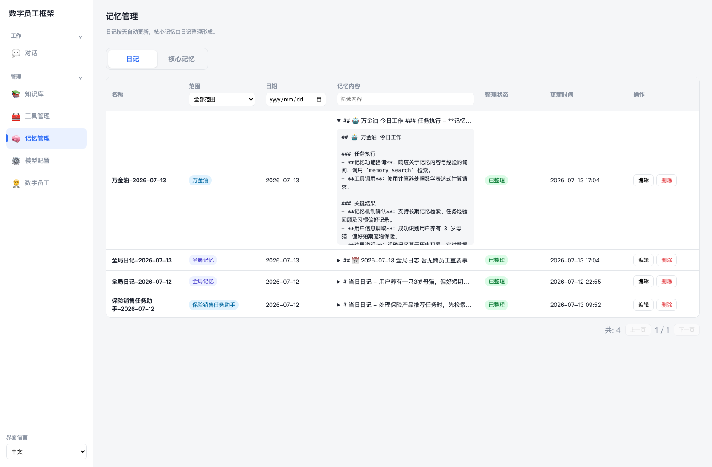

*Figure 4-14. Global and employee diaries created after the insurance task*

The conversation route persists the answer, trace, and state, then updates diaries in a background task only after a ReActAgent succeeds with memory enabled.

```python
diary_task = {
    "enabled": agent.agent_type == "react_agent"
        and agent.memory_enabled,
    "completed": False,
    "agent_id": agent.id,
    "user_input": user_input,
}

if diary_task["enabled"]:
    background_tasks.add_task(
        _update_diaries_in_background, diary_task
    )

if completed:
    diary_task.update(answer=answer, trace=trace, completed=True)
```

The model receives the input, answer, trace, and existing daily diaries and returns updated global and employee versions in one call. A unique scope, employee, and date key updates one diary throughout the day instead of creating fragments. Failed diary updates are logged without changing the already delivered answer, separating memory formation from the main conversation.

### Step 4: Consolidate Diaries into Core Memory

Diaries contain daily experience and accumulate repetition. Under Core Memories, select global memory or a ReActAgent and click Consolidate. The system reads unconsolidated diaries and diaries updated since consolidation, combines them with existing core memories, and generates validated create, update, or delete actions.

Figure [4-15](#fig-memory-practice-core) shows the result. C001's animal and eight-month requirement are facts. Product-design conventions and a recommendation process are reusable employee experience. The RMB 783 calculation depends on temporary assumptions and should not become core memory.

Subject and scope differ. Customer facts must retain the customer identifier rather than become a vague “user preference.” This teaching system has global and employee scopes, so C001's information remains under the insurance employee. Stable administrator formatting requirements may be global, while design methods belong to the employee. A multi-user production system would also need tenant, user, or customer scopes.

<a id="fig-memory-practice-core"></a>

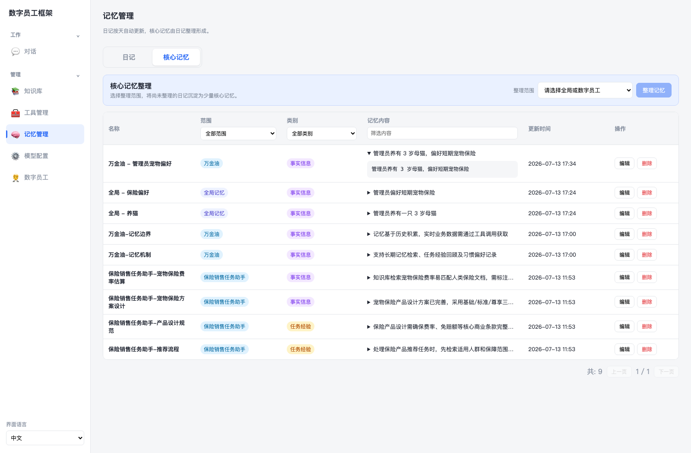

*Figure 4-15. Classification of customer facts and employee task experience*

Only diary increments are processed:

```python
diaries = diary_query.filter(
    or_(
        Diary.consolidated_at.is_(None),
        Diary.updated_at > Diary.consolidated_at,
    )
).all()

actions = _parse_json_array(complete_chat(agent, messages))
for action in actions:
    if action["action"] == "create":
        db.add(CoreMemory(...))
    elif action["action"] == "update":
        update_core_memory(...)
    elif action["action"] == "delete":
        db.delete(target)

for diary in diaries:
    diary.consolidated_at = datetime.now()
db.commit()
```

Creates and updates require a name, category, and content. Categories are only `fact` and `experience`; updates and deletions cannot target another scope. Any invalid action rolls back the transaction. The same `consolidate_memories()` logic runs from the page and from a daily in-process scheduler, which performs a startup catch-up and then checks at 2:00 a.m. local server time. It does not run while the application is stopped.

Global memory must be useful across employees; employee memory must be reusable in that employee's future work. One task's details and different people's preferences should not be merged simply because their text is similar.

### Step 5: Retrieve and Use Memory in a New Session

Create another session with the Insurance Business Assistant and enter:

```text
客户 C001 再次咨询之前的宠物保险方案。
请先说明已知的投保对象和保障期限需求，
再按照保险业务人员的工作要求，列出下一步需要核实的产品信息。
```

The historical reference should lead the model to call `memory_search`. The employee can see global staff requirements and its own customer facts and design experience. It should continue analysis while reminding staff to verify actual terms, rates, and underwriting rules.

Figure [4-16](#fig-memory-practice-retrieval) shows results in a new session. Verify that the trace actually calls `memory_search`, results refer to C001, and the final answer treats memory only as historical assistance. Another ReActAgent can see global and its own employee memory, but not the insurance employee's customer facts.

<a id="fig-memory-practice-retrieval"></a>

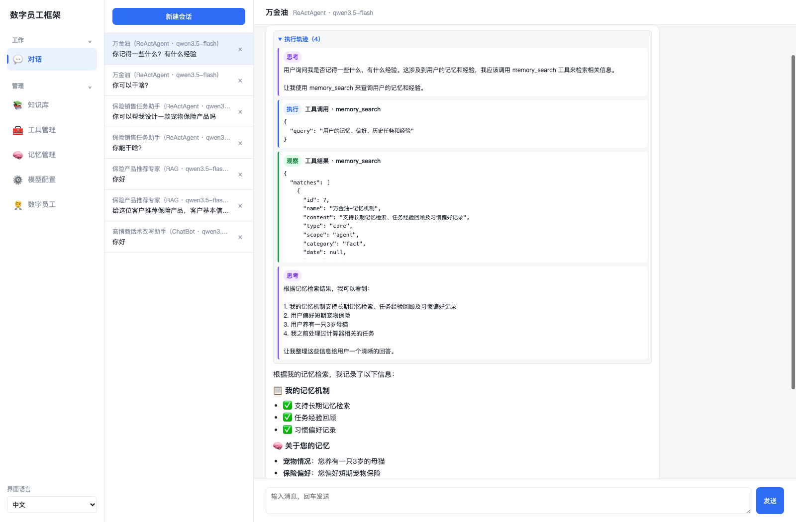

*Figure 4-16. Retrieving customer needs and task experience in a new session*

Visibility and scoring are implemented as follows:

```python
diary_visible = or_(
    Diary.scope == "global",
    (Diary.scope == "agent")
        & (Diary.agent_config_id == agent_config_id),
)
core_visible = or_(
    CoreMemory.scope == "global",
    (CoreMemory.scope == "agent")
        & (CoreMemory.agent_config_id == agent_config_id),
)

score = semantic_score * 0.7 + keyword_score * 0.3
diary_score = score / (1 + age_days / 30)
```

With embedding, results combine 0.7 vector similarity and 0.3 keyword score; otherwise they use keywords. Diaries decay with age because they record dated experience, while consolidated core memory does not currently decay. Only a few top results return as observations.

This completes the memory loop: the decision to call `memory_search` answers when to retrieve, arguments define what to retrieve, visibility and scoring define how, and tool observations define how memory reenters context.

### Step 6: Compare Configurations and Analyze Boundaries

Copy the assistant for two controlled experiments. First disable diary updates, modify C001's deductible, and check whether the diary changes. Second enable updates but unbind `memory_search`, then ask about the animal and duration. Do not delete memory, or missing retrieval capability will be confused with missing data.

Ask the calculator to execute `round(783/8, 2)` and observe rejection of function calls. A reliable agent reformulates the arithmetic or explains the limitation rather than fabricating success. Knowledge boundaries also remain: historical memories of a waiting period or quote cannot replace the latest knowledge base, business database, or human confirmation.

### Practice Tasks

1. Configure and publish the Insurance Business Assistant with knowledge search, calculator, and memory search, and explain their responsibilities and boundaries.
1. Complete a draft for C001's pet-insurance requirement and record retrieval, calculation, observations, and final answer.
1. Add C001's needs and the administrator's work requirements, observe global and employee diaries, and explain why diaries do not yet distinguish facts and experience.
1. Consolidate both scopes and inspect customer facts, administrator requirements, design experience, names, and scopes.
1. Continue C001's case in a new session, then retrieve with another ReActAgent and compare global sharing with employee isolation.
1. Use an invalid calculation or insufficient sources to analyze tool errors and why rates, terms, and underwriting still require authoritative systems or people.

### Expected Outcomes

Submit a working ReActAgent and a brief report containing its tools, C001's execution trace, global and employee diaries, consolidated core memories, and cross-session retrieval. Explain why arguments require program validation, why diaries use date and scope, and why core memory separates facts from experience. Include one tool failure or insufficient-source case and identify whether the problem occurred in selection, validation, execution, retrieval, or generation.

The system boundary should be clear: ReActAgent can loop within controlled tools and form and reuse long-term memory, but it still depends on model service and a local process and cannot replace business permissions, current fact verification, or human confirmation.

## Assignments and Questions

1. Explain the capability differences among a ChatBot, RAG digital employee, and autonomous agent.
1. Using the pet-insurance trace, divide Tool Calling responsibilities between model and program and explain Schema validation.
1. Extract one fact and one experience from C001's diary, giving each a name, scope, and content, and explain why the temporary quote should not enter core memory.
1. Compare global and employee memory. Explain why customer identifiers must be retained and why merging different customers into one global preference causes errors.
1. Compare disabling diary updates with unbinding `memory_search`, and draw the full flow from experience to core memory to later use.
1. Choose a sales or service task and distinguish information that memory may support, facts that must be queried again, and operations requiring human confirmation.

## References

1. <a id="ref-yao2023react"></a>Shunyu Yao, Jeffrey Zhao, Dian Yu, Nan Du, Izhak Shafran, Karthik Narasimhan, et al. ReAct: Synergizing Reasoning and Acting in Language Models. International Conference on Learning Representations (ICLR). 2023.

2. <a id="ref-hu2026memorysurvey"></a>Yuyang Hu, Shichun Liu, Yanwei Yue, Guibin Zhang, et al. Memory in the Age of AI Agents: A Survey, Forms, Functions and Dynamics. arXiv preprint arXiv:2512.13564. 2026.

[^1]: <https://en.wikipedia.org/wiki/OODA_loop>
[^2]: <https://manus.im>
[^3]: <https://modelcontextprotocol.io/docs/getting-started/intro>

---

[← Previous Chapter](../chapter3_rag/README-en.md) | [Back to Contents](../README-en.md) | [Next Chapter →](../chapter5_harness/README-en.md)
