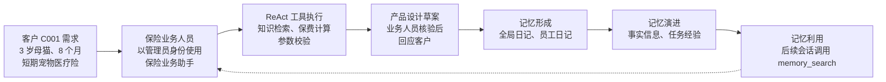

[← 上一章](../chapter3_rag/README.md) | [返回总目录](../README.md) | [下一章 →](../chapter5_harness/README.md)

> 本章配套代码：[进入 code 目录](./code/)

# 配备工具和记忆的Agent数字员工

前面几章已经完成了从基础概念到 ChatBot 数字员工、RAG 数字员工的递进。ChatBot 让系统能够围绕角色和上下文进行多轮对话，RAG 让系统能够结合外部知识给出更可靠的回答。但在真实业务中，数字员工往往不能只停留在“会回答”的层面，还需要查询系统、调用接口、记录状态，并根据执行反馈继续推进任务。也就是说，它需要从回答系统进一步走向能够做事的智能体。

本章围绕“工具、记忆和自主循环”展开，说明智能体数字员工如何在目标约束下进行多轮决策。我们会先解释智能体相对于 ChatBot、RAG 和大模型工作流的关键差异，再介绍 ReAct 与规划执行两类运行骨架，随后讨论工具机制如何把模型的动作意图转化为真实调用，最后说明记忆机制如何维持任务连续性并积累可复用经验。本章重点是建立一个清晰、可实现的最小智能体框架，为下一章进一步讨论可靠、可控、可部署的智能体服务打基础。

完成本章后，你应该能够：

1. 理解从问答系统到目标驱动智能体的能力变化。
1. 说明 ReAct、规划执行、工具调用和记忆机制的基本作用。
1. 实现一个具备工具调用和基础记忆能力的自主智能体。

## 智能体的本质

### 自主智能体的关键范式革新

聊天机器人让系统能够围绕角色和上下文进行多轮回答，RAG 让系统能够从外部知识库中检索资料并减少凭空编造。二者解决的重点仍然是“如何更好地回答”：聊天机器人强调对话上下文和角色设定，RAG 强调把外部资料带入回答过程。
在工程实践中，聊天机器人和 RAG 还可以继续向前延伸，和工具调用、格式化输出等步骤串成大模型工作流（LLM workflow）。所谓工作流，是把多个步骤按预设顺序组织起来，例如先识别意图，再检索知识库，再调用价格查询工具，最后生成回复。工作流可以多步执行，也可以调用工具，但它的关键路径通常由开发者事先写好。
模型可以参与每一步的理解和生成，却不一定拥有“下一步该做什么”的动态决策权。

<a id="tab-chatbot-rag-agent-diff"></a>

*表 4-1　聊天机器人、RAG、大模型工作流与智能体的核心区别*

| 维度 | 聊天机器人（ChatBot） | 检索增强生成（RAG） | 大模型工作流 | 自主智能体（Agent） |
| --- | --- | --- | --- | --- |
| 核心目标 | 对话回答 | 检索后回答 | 预设流程执行 | 目标驱动执行 |
| 外部信息 | 对话上下文 | 知识库与文档 | 流程状态与工具结果 | 环境状态与工具反馈 |
| 行动能力 | 生成文本 | 引用资料 | 固定步骤调用工具 | 主动选择并调用工具 |
| 决策方式 | 被动响应 | 检索增强响应 | 开发者预先编排 | 动态判断下一步 |
| 典型限制 | 上下文有限 | 主要解决知识问题 | 多步但不自主 | 需控制权限与风险 |

因此，智能体的关键范式革新，不是把问答链路做得更复杂，而是把大模型从回答系统推进为目标驱动的执行系统。结合表[4-1](#tab-chatbot-rag-agent-diff)可以看到，聊天机器人侧重对话，RAG 侧重引入知识，工作流侧重预设编排，而大模型驱动的智能体能够在给定目标、权限和边界后，持续观察状态、动态决定下一步、调用工具完成动作，并根据反馈调整任务推进方向。它的核心在于目标驱动、多步决策、工具执行和状态延续。

### 核心组成模块

如图[4-1](#fig-llm-agent-core-modules)所示，大模型驱动智能体可以先理解为四个核心模块的组合：大模型大脑、运行骨架、工具机制和记忆机制。大模型大脑负责理解目标、分析上下文、推理下一步动作。运行骨架负责把一次次模型调用组织成循环，控制何时继续、何时停止、何时返回结果。工具机制相当于智能体的“手脚”，负责连接 API、函数、数据库或业务系统，让智能体能够真正执行动作。记忆机制负责保存当前任务上下文和必要的长期信息，让智能体能够延续多轮任务，而不是每一步都从零开始。

<a id="fig-llm-agent-core-modules"></a>


*图 4-1　大模型驱动智能体的核心组成模块*

本章后续内容围绕这几个模块展开。先讲运行骨架，说明智能体如何形成“思考、行动、观察、再决策”的循环。再讲工具机制，说明智能体如何对外执行动作。最后讲记忆机制，说明系统如何保留任务上下文、用户偏好和可复用经验。用户目标进入运行骨架后，运行骨架调用大模型大脑进行理解和决策，根据需要读取记忆或调用工具。工具执行后产生环境反馈，反馈再回到运行骨架，推动下一轮决策。下一章会进一步讨论如何把这些能力封装成更可靠、可控、可部署的智能体服务。

## 智能体运行骨架

智能体运行骨架负责把大模型、工具和记忆组织成一个可持续执行的过程。对智能体来说，关键不是只调用一次大模型，而是让系统能够围绕目标反复判断、行动、观察和调整。常见的运行骨架可以从两个层次理解：ReAct 关注围绕目标任务如何根据反馈继续推进，规划与执行模式关注复杂任务如何先形成整体路线，再分步完成。

### ReAct 智能体循环

ReAct（Reason and Act）框架<sup>[1](#ref-yao2023react)</sup>是当前使用非常广泛的自主智能体运行骨架，核心思想是把推理和行动结合起来。可以先结合图[4-2](#fig-react-agent-loop)中的例子理解它。用户询问苹果遥控器最初控制什么，普通聊天机器人可能直接根据已有知识生成回答，而 ReAct 智能体会先判断自己缺少事实依据，于是搜索 Apple Remote。工具返回结果后，它观察到 Apple Remote 与 Front Row 有关，但仍不清楚 Front Row 的含义，于是继续搜索 Front Row。第二次观察表明 Front Row 是苹果的媒体中心软件，智能体再结合前两轮上下文判断证据已经足够，最终输出答案。这个过程体现的正是边思考、边行动、边根据观察结果调整下一步。

ReAct 循环通常可以概括为思考、行动、观察三个环节，如图[4-2](#fig-react-agent-loop)（左）所示。思考环节中，模型根据用户目标、历史上下文和已有观察，判断当前缺少什么信息，以及下一步应该做什么。行动环节中，系统把模型决定的动作转化为工具调用、追问用户、读取资料或生成最终结果。观察环节中，系统把工具返回值、用户回复或执行状态记录下来，再送回下一轮模型调用。只要任务还没有完成，智能体就继续进入下一轮思考。

<a id="fig-react-agent-loop"></a>


*图 4-2　ReAct 智能体运行骨架的思考、行动、观察循环*

从技术实现角度看，ReAct 的运行轨迹本质上就是和大模型多轮对话的过程，如图[4-2](#fig-react-agent-loop)（右）所示。它并不是让大模型一次性输出完整答案，而是把复杂任务组织成多轮大模型调用。每一轮都像一次带状态的对话：系统把用户目标、已完成步骤、工具结果和必要记忆放入上下文，大模型基于最新状态生成下一步动作。运行骨架解析动作、调用工具，再把工具返回结果追加为新的观察。这样循环下去，智能体就从回答问题转变为推进任务。

这个机制的价值在于，模型不再完全依赖训练时记住的知识。需要实时信息时，它可以查询资料。需要精确计算时，它可以调用计算器或代码解释器。发现结果不可靠时，它可以换一种方式继续验证。发现用户目标不明确时，它可以先追问。因此，ReAct 特别适合查询资料、调用 API、执行代码、读写文件、排查错误等任务。许多编码智能体和通用任务智能体虽然具体实现不同，但都能看到类似的循环运行思路。

ReAct 循环也可以和经典的 OODA 循环[^1]放在一起理解。OODA 强调观察、判断、决策、行动，ReAct 同样强调在环境反馈中不断修正行动。区别在于，在大模型智能体中，大模型主要承担语义理解、判断和决策，工具机制承担外部行动，观察结果再回到上下文中，推动下一轮决策。

需要注意的是，ReAct 不是正确性的保证。它只是把智能体从一次性回答变成了可观察、可追踪、可调整的执行循环。工程实现中还必须设置最大轮数、超时时间、成本预算和终止条件，避免智能体在重复搜索、无效工具调用或不明确目标中无限循环。实际产品还需要结合权限控制、日志审计、工具白名单和人工确认等机制。下一章讨论智能体服务化时，会进一步说明如何把这些控制点封装进更可靠的系统。

### 规划与执行（Plan-and-Solve）模式

ReAct 强调根据当前观察持续调整下一步动作，规划与执行（Plan-and-Solve）模式则强调先形成整体规划，再按照规划推进任务。它适合目标相对明确、任务可以拆解、步骤之间存在依赖关系的场景，例如撰写调研报告、规划旅行方案、完成数据分析、生成一个小型软件项目等。一些通用智能体产品会采用这种思路（如Manus[^2]）。用户给出复杂目标后，系统先生成一组任务步骤，例如先收集资料，再分析信息，再生成文档或网页，最后检查结果。这种先把任务路线显性化，再逐步执行的形态，就是规划与执行思路在产品中的直观体现。它的好处是目标更清晰，过程更容易检查，用户也更容易知道智能体正在推进哪一步。

如图[4-3](#fig-plan-and-solve)所示，规划与执行模式通常分为两个阶段。第一阶段是规划阶段，智能体先不急着调用工具或给出最终答案，而是把用户目标拆成若干个有顺序的子任务。一个好的任务规划不仅要列出步骤，还要说明每一步要解决什么问题、需要哪些输入、可能使用哪些工具，以及最终要交付什么结果。第二阶段是执行阶段，智能体按照规划逐步完成任务，并把每一步结果记录到状态中，供后续步骤使用。最后，系统再把各步骤结果合并成用户需要的最终答案或交付物。

<a id="fig-plan-and-solve"></a>


*图 4-3　规划与执行（Plan-and-Solve）模式的智能体运行骨架*

规划与执行模式的优势在于全局性。对于复杂任务，如果智能体一开始没有整体路线，很容易在执行过程中被局部信息带偏，或者完成了许多动作却没有接近最终目标。先规划可以让模型先看清任务结构，再逐步处理细节。这也是很多智能体产品会向用户展示规划列表、任务进度和待办步骤的原因。规划一旦显性化，用户可以提前发现方向是否正确，系统也可以根据规划追踪任务进度。

不过，规划与执行模式也不是万能的。规划本身可能不准确，任务环境也可能在执行过程中发生变化。如果智能体只是机械执行最初规划，就可能在发现新信息后仍然沿着错误方向前进。因此，在真实系统中，规划与执行模式往往会和 ReAct 循环结合起来。常见做法是先由规划器生成任务规划，再把每个子任务交给 ReAct 循环执行。执行某个子任务时，智能体仍然可以思考、调用工具、观察结果并调整动作。如果观察结果表明原规划不合适，系统还可以触发重新规划。

因此，规划与执行模式和 ReAct 并不冲突。规划与执行更像上层的任务路线图，解决整体上先做什么、后做什么的问题。ReAct 更像底层的执行循环，解决当前这一步如何根据反馈继续推进的问题。许多智能体产品会融合这两种模式：简单任务直接使用 ReAct，复杂任务先规划，再执行。规划也可以被设计成一个工具，在需要时由智能体主动调用。

## 工具机制

运行骨架决定智能体的持续决策过程，工具机制则负责把这个决定转化为可执行动作。它的核心分工很简单：模型提出动作意图，程序在权限和规则约束下完成真实调用，并把结果带回下一轮决策。

### 工具如何被大模型使用？

大模型不能直接执行 Python 函数，也不能直接访问企业系统。很多平台所说的 Function Calling 或 Tool Calling，本质上是让模型在需要外部能力时，输出一段**结构化的工具调用请求**。程序读取这段请求，完成参数校验、权限检查和真实调用，再把工具结果返回给模型。

这里的“结构化”通常指 JSON 一类格式。JSON 用键值对表达数据，例如 `"city": "深圳"` 表示字段名是 `city`，字段值是“深圳”；用对象表达一组相关字段，用数组表达一组列表。和自然语言相比，JSON 更容易被程序解析。模型如果只说“我想查一下广州明天的天气”，程序还要猜测工具名和参数；如果模型输出下面这种结构，程序就可以直接识别工具名和参数。

```text
{
  "tool": "get_weather",
  "arguments": {
    "city": "深圳",
    "date": "明天"
  }
}
```

实际 API 的字段名称可能不同。有的平台把工具名、参数和调用编号拆成多个字段，有的平台把一次回答中的多个工具调用放入列表。但核心思想一致：模型不要直接给出最终回答，而是先生成一个可被程序解析的调用请求。

<a id="fig-tool-calling-workflow"></a>


*图 4-4　大模型使用工具的基本流程*

如图[4-4](#fig-tool-calling-workflow)所示，工具调用可以理解为四个连续环节。

第一，提供工具说明。工具注册不是把函数代码交给模型执行，而是把工具名称、功能描述和参数 Schema 放入模型可见的上下文中。早期做法常写进系统提示词，较新的模型 API 通常通过 `tools` 字段传入。

第二，生成调用请求。模型根据用户问题、对话上下文和工具说明，一次性判断是否需要工具、选择哪个工具，并填写结构化参数。例如用户问“明天去深圳拜访客户要不要带伞”，模型可以生成调用 `get_weather` 的请求，并填入城市和日期。

第三，校验并执行工具。程序解析模型输出，检查参数类型、必填项、权限和风险等级，确认无误后再调用外部系统。

第四，回传工具结果。工具无论成功还是失败，都应返回可理解的结果或错误信息。程序把它作为观察信息交回模型，模型再生成回答或继续下一轮调用。这个边界要始终明确：模型负责理解和决策，程序负责执行和控制。

### 工具如何清晰定义？

工具定义的作用，是让模型知道“什么时候用这个工具”和“参数应该怎么填”。因此，定义不宜复杂，但必须清楚。一个工具至少需要三类信息：工具名、功能描述和参数 Schema。真正的执行逻辑不交给模型，而由程序中的函数、API 适配器或 MCP Server 完成。

下面是一个简化的订单查询工具定义。它采用 JSON 表达，接近许多模型 API 使用的工具 Schema 形式。

```text
{
  "name": "query_order",
  "description": "根据订单号查询订单状态、物流节点和预计送达时间。只用于查询已创建订单，不处理退款或改地址。",
  "parameters": {
    "type": "object",
    "properties": {
      "order_id": {
        "type": "string",
        "description": "订单号，例如 SO202607060001"
      }
    },
    "required": ["order_id"]
  }
}
```

这个例子体现了工具定义的主干逻辑。`name` 用来稳定标识工具，最好采用“动作加对象”的形式，例如 `query_order`。`description` 面向模型说明工具边界，既要说明能做什么，也要说明不能做什么。`parameters` 描述输入结构，其中 `properties` 列出字段，`required` 标明必填项。模型根据这些信息生成调用参数，程序再根据同一套 Schema 做校验。

工具越清晰，模型越不容易误用。比如订单查询工具只负责查询订单状态，不应顺手处理退款或修改地址；价格计算工具只负责报价，不应直接创建订单；工单创建工具只负责记录问题，不应承诺最终处理结果。这样的边界设计，能让工具选择、权限控制和日志审计都更简单。

### 常见工具类型与能力边界

理解工具调用以后，还需要进一步回答一个更实际的问题：智能体通常会调用哪些工具？初学时容易把工具理解成一长串 API 列表，似乎接入得越多，智能体就越强。实际上，工具的价值不在数量，而在是否刚好补上模型自身做不到、做不准或者不应直接做的部分。一个可靠的数字员工，往往不是把所有接口都暴露给模型，而是把工具按能力类型分层，并为不同风险等级设置不同控制方式。

<a id="fig-common-tools"></a>


*图 4-5　智能体常见工具类型与能力边界*

如图[4-5](#fig-common-tools)所示，可以把常见工具先理解为五类：读信息、算结果、查系统、改状态和连人。这五类工具从左到右，逐渐从只读能力走向写入业务系统和引入人工协作。越靠左，通常越适合让智能体自动调用；越靠右，越需要权限控制、人工确认和操作日志。

**信息获取类工具。**主要解决“模型不知道最新资料或外部资料”的问题，例如网页搜索、知识库检索和文档读取。销售数字员工在回答客户问题前，可以先检索产品说明、服务条款或历史方案；客服数字员工在处理投诉时，也可以读取制度文档和常见问题库。它们通常是只读工具，风险相对较低，但仍要注意资料来源、时间和权限范围。模型不应把未经确认的搜索结果直接当成最终事实。

**计算与代码类工具。**主要解决“模型会推理但不适合心算和批量处理”的问题，例如计算器、数据分析脚本和受限代码执行环境。模型可以解释计算思路，但具体金额、比例、排名和统计结果最好交给工具完成。例如，销售智能体可以调用计算工具估算保费区间，客服智能体可以对一批工单按处理时长做统计。代码执行工具能力很强，但也要放在沙箱中运行，限制文件访问、网络访问和执行时间。

**结构化查询类工具。**主要解决“业务状态必须以系统记录为准”的问题，例如数据库查询、订单查询、客户信息查询和库存查询。与文档检索不同，这类工具通常面向实时结构化数据。客户问“我的订单到哪了”或者“保单现在是什么状态”，正确做法是查询业务系统，而不是让模型根据历史对话猜测。结构化查询一般也属于只读能力，但会涉及隐私和权限，因此需要按用户身份过滤字段，并对敏感信息做脱敏处理。

**业务动作类工具。**会真正改变外部系统状态，例如创建工单、更新 CRM 记录、发送通知、提交审批或生成合同草稿。这类工具让智能体从“能查”进一步变成“能办”，也是数字员工产生业务价值的重要部分。但它的风险明显更高，因为一次错误调用可能带来误通知、错录信息、重复提交甚至合规问题。因此，高风险业务动作不应只由模型一句话直接触发，而应经过参数校验、权限判断、影响提示和必要的人工确认。

**人机协作类工具。**用于在系统无法可靠判断时把人重新接入流程，例如向用户追问、请求人工确认或转人工处理。很多任务失败并不是因为模型不会回答，而是因为关键信息缺失、用户目标不清或动作风险过高。此时最好的工具不是继续调用更多 API，而是让智能体主动问清楚，或者把当前上下文整理好交给人工。例如，客户要求修改保单受益人时，智能体可以先说明需要人工核验身份，再把已收集的信息转给人工坐席。

从工具选择的角度看，可以遵循一个简单顺序：先用只读工具确认事实，再用计算或查询工具得到精确结果，最后才考虑写入业务系统或触发人工协作。这样设计的好处是，智能体在行动前有依据，在执行时有边界，在出错时也更容易追踪原因。当工具数量继续增加，如何统一描述、发现和调用这些工具就会成为新的工程问题，这正是下一节 MCP 标准化工具通信协议要解决的重点。

### MCP 标准化工具通信协议

当工具从几个本地函数扩展到文件系统、数据库、搜索引擎、飞书、GitHub 等外部系统时，困难不只在于“调哪个 API”，还在于如何让不同智能体应用用同一种方式发现、描述和调用这些能力。MCP（Model Context Protocol）就是面向这一问题的开放标准[^3]。如图[4-6](#fig-mcp)所示，它可以理解为 AI 应用与数据源、工具服务之间的通用连接层，使工具不必为每个应用重复适配。

<a id="fig-mcp"></a>


*图 4-6　MCP（Model Context Protocol）标准化工具通信协议的作用*

MCP 的基本原理可以这样理解。用户实际使用的智能体产品称为 Host，Host 内部通过 MCP Client 连接一个或多个 MCP Server。Server 暴露文件读取、数据库查询、业务 API 等能力，并用统一格式提供工具名、描述和输入 Schema。Client 先获取这些说明，Host 再把可用工具提供给模型。模型生成工具调用后，Host 通过 Client 把工具名和参数发给对应 Server，Server 执行真实操作并返回结果。需要注意，模型不直接运行工具，权限控制、参数校验和结果回传仍由 Host 和 Server 共同完成。

实际使用时，可以按三层递进。学习阶段，先用本地函数理解工具定义、参数校验和结果回传。项目阶段，把多个工具整理成统一注册表，保持名称、描述和参数 Schema 一致。需要接入现成生态或复用自研工具时，再在 Host 中配置 MCP Server，通过工具发现获得可用能力，通过工具调用完成真实操作。本章讨论工具机制，重点关注 MCP Server 暴露的 Tools。Resources 和 Prompts 可在理解工具调用后再进一步学习。

### 工具相关常见问题与规避

工具接入以后，真正影响可靠性的往往不是“能不能调用”，而是边界、校验、失败处理和权限控制是否清楚。

**工具边界不清。**模型依赖工具名称、描述和参数说明来选择工具。如果多个工具都写成“查询信息”，模型就容易误选。实践中应为每个工具写清适用场景和不适用场景，并保持单一职责。例如订单查询只负责查询订单状态，不顺带处理退款或改地址。

**参数校验不足。**模型输出 JSON 参数，并不意味着参数一定正确。它可能漏掉必填字段，也可能写错类型或格式。程序应在真实调用前按 Schema 校验参数；能够确定的小问题可以自动修正，不能确定的问题应返回明确错误，让模型追问用户或重新组织参数。

**失败信息不可恢复。**工具失败时，如果只返回“调用失败”，模型无法判断下一步该重试、补充信息，还是转人工。更好的做法是返回失败原因、是否可重试以及建议动作，例如参数不合法、权限不足或业务系统暂时不可用。

**权限边界不清。**查询类工具风险较低，写入、删除、发送、扣款和审批类工具风险较高。高风险工具应加入权限检查、人工确认和操作日志。智能体可以提出动作建议，但不能绕过业务系统原有的安全流程。

总结而言，做好工具机制，不是尽可能多地接入 API，而是把外部能力封装成边界清楚、参数可校验、失败可恢复、权限可审计的接口。模型负责理解和决策，程序负责执行和控制，工具结果再回到上下文中支持下一轮判断。这个闭环稳定以后，智能体才具备可靠做事的基础。

## 记忆机制

大语言模型本身并不会自动保存历史状态。一次模型调用结束后，如果下一次调用没有重新提供相关信息，模型就无法利用之前的交互内容。因此，一个基础的大语言模型更像是即时响应系统，而智能体要在多轮任务、长期交互和持续执行中保持连续性，就必须引入记忆机制。

智能体记忆可以理解为系统保存、整理和利用过去信息的能力。它不仅包括保存用户历史对话，也包括记录用户偏好、任务状态、工具调用结果、环境反馈、执行经验以及曾经有效的方法。近期关于智能体记忆的综述通常会从记忆的承载形式、功能作用和动态过程三个角度来分析这一能力<sup>[2](#ref-hu2026memorysurvey)</sup>。本书把智能体记忆看成一个可读、可写、可更新的系统模块，而不是简单把所有聊天记录塞回提示词。
如图[4-7](#fig-agent-memory-lifecycle)所示，从整体流程看，智能体记忆可以看作一个不断循环的生命周期。智能体在执行任务过程中产生新的经历，通过记忆形成机制提取其中有价值的信息并保存。随着运行时间增加，系统进一步对已有记忆进行整理、压缩、更新和遗忘。当新的任务到来时，再通过检索机制选择相关记忆，将其放回当前上下文，辅助模型理解目标、选择工具和生成结果。

<a id="fig-agent-memory-lifecycle"></a>


*图 4-7　智能体记忆生命周期：形成、演进与使用*

因此，记忆机制并不是简单地保存所有历史信息，而是围绕三个核心问题展开：

- **记什么：** 哪些信息值得长期保存；
- **如何维护：** 如何整理、更新和遗忘已有信息；
- **如何使用：** 如何在需要时找到并利用相关记忆。

### 记忆的类型与作用

从时间范围看，智能体记忆通常可以分为短期记忆和长期记忆。短期记忆主要服务于当前任务，帮助智能体维持正在进行的对话、推理过程和任务状态。长期记忆则保存跨任务仍然有价值的信息，使智能体能够积累经验并保持长期连续性。从作用角度看，还可以把记忆理解为事实记忆、经验记忆和工作记忆。事实记忆回答智能体知道什么，经验记忆回答智能体过去做过什么以及哪些方法有效，工作记忆则回答智能体当前正在处理什么。这个划分比单纯说短期和长期更贴近智能体系统的实际设计。

<a id="fig-memory-types"></a>


*图 4-8　记忆的类型与作用，分为短期记忆和长期记忆，还可以把记忆理解为事实记忆、经验记忆和工作记忆*

#### 短期记忆

短期记忆用于保存当前任务过程中的临时信息，并且要支持选择、压缩、更新和重写这些信息，可以理解为智能体当前正在使用的操作台。短期记忆强调时间范围较短，所谓工作记忆则更强调当前信息能否被有效操作。对工程实现来说，二者经常交织在一起，通常对应对话历史、任务状态、计划草稿和上下文窗口中的关键信息。

例如，用户要求智能体制定一次旅行计划，在多轮交流过程中，智能体需要记住：用户计划出行的时间、已经确定的目的地、用户对于预算和住宿的要求。
这些信息并不一定需要永久保存，但如果在当前任务中丢失，智能体就无法继续完成任务。
又如一个客服智能体正在处理退保咨询，它需要在当前会话中维护客户身份、保单类型、已经解释过的条款、还没有确认的问题以及下一步要调用的工具。这里的重点不是永久记住客户每一句话，而是让当前任务的状态始终清楚。

在工程实现中，短期记忆通常对应：对话历史、当前任务状态、大模型上下文窗口。
由于大模型上下文窗口存在长度限制，短期记忆通常还需要进行摘要、压缩或者选择性保留。例如，当历史对话过长时，系统可以将多轮交流总结成一段更短的任务状态，再提供给模型。对于长任务，也可以把已经完成的子任务折叠成摘要，只保留当前子任务的细节。这样做的目的不是让模型看到全部历史，而是让模型看到完成下一步所必需的信息。

#### 长期记忆

长期记忆（Long-term Memory）用于保存跨任务仍然有价值的信息，使智能体能够逐渐了解用户、积累经验，并在未来任务中复用。
长期记忆通常不会保存所有历史内容，而是选择其中具有长期价值的信息。
例如：用户长期偏好、稳定的个人信息、过去任务中的有效经验。
根据内容不同，长期记忆可以进一步分为事实记忆和经验记忆。事实记忆偏向稳定事实，经验记忆偏向可复用的方法。二者都可能长期保存，但使用方式不同。

**事实记忆。**
事实记忆保存相对稳定、可以明确表达的信息，回答关于用户、任务或环境我知道什么。
例如：用户喜欢技术回答包含代码示例、用户主要使用 Python 进行开发、某个企业当前使用的业务流程。

事实记忆的价值在于保持一致性和减少重复询问。对于用户，它可以保存身份、长期偏好、常用格式和历史承诺。对于环境，它可以保存业务系统状态、文档版本、工具能力和团队协作中的共享事实。事实记忆通常变化较慢，适合长期保存，并在相关任务中直接调用。

需要注意，事实记忆必须允许更新。用户偏好可能改变，业务流程可能调整，之前保存的事实也可能因为来源不可靠而需要删除。一个可靠的记忆系统不只是会写入事实，还要能标记来源、时间和适用范围，避免旧事实干扰新任务。

**经验记忆。**
经验记忆保存智能体过去执行任务过程中形成的经验，回答过去发生了什么、什么方法更加有效、哪些步骤可以复用。
例如，一个客服智能体经过多次任务后发现：处理客户投诉时，先识别问题类型，再生成针对性的解决方案，通常比直接生成回复更稳定。
这种信息并不是外部知识，而是智能体自身运行过程中积累的经验。

经验记忆可以有不同抽象层次。最底层是案例记忆，保存某次任务的轨迹、输入、工具调用和结果，便于以后遇到相似任务时参考。更高一层是策略记忆，把多个案例中反复出现的有效做法总结成规则、模板或流程。再进一步是技能记忆，把成功经验沉淀成可调用的函数、脚本、工具说明或 MCP 接口，使智能体不仅知道该怎么做，还能更稳定地执行。

经验记忆是智能体区别于普通问答系统的重要能力。通过不断积累经验，智能体可以减少重复试错，改进任务规划，优化工具选择，并逐渐形成更适合特定场景的执行方式。

### 记忆的形成

记忆形成描述智能体如何从任务经历中产生新的记忆。并不是所有交互内容都应该保存。如果简单记录全部历史，不仅会造成存储压力，也会引入大量无关信息。因此，智能体需要判断哪些内容具有长期价值，并将其提取出来。

<a id="fig-memory-formation"></a>


*图 4-9　记忆的形成示意图*

#### 形成流程

如图[4-9](#fig-memory-formation)所示，一个典型的记忆形成流程包括：

1. **经历产生：** 智能体在执行任务过程中产生对话、工具调用结果和执行轨迹；
1. **记忆提取：** 模型或规则判断其中的重要信息，例如用户偏好、关键事实或有效经验；
1. **记忆加工：** 对原始信息进行总结、压缩和结构化；
1. **记忆保存：** 将处理后的结果写入持久化存储。

例如，用户连续多次要求代码示例使用 Python，智能体可以将多次交互总结为“用户偏好：技术回答优先提供 Python 示例。”然后保存为长期记忆。

#### 常见做法

记忆形成的关键在于抽取，而不是复制。常见做法包括三类。第一类是语义摘要，把较长的对话、观察或工具结果压缩成简短说明。第二类是知识蒸馏，从任务轨迹中提取事实、用户意图、失败原因或成功策略。第三类是结构化构建，把零散文本整理成键值对、标签、表格、树或图，便于后续检索和更新。

在实践中，可以先采用最简单的结构化文本。有了这些字段，系统后续才能判断这条记忆是否相关、是否过时、是否应该被覆盖。例如每条记忆至少包含内容、类型、来源、时间和适用场景。这样做虽然朴素，但已经能够支持很多实际需求：

- 内容：用户偏好技术回答附带 Python 示例；
- 类型：用户事实记忆；
- 来源：2026年7月7日的多轮对话；
- 适用场景：技术解释、代码示例、教学材料编写。

#### 工程实现

从实现角度看，记忆存储方式与知识库具有一定相似性，通常也会使用数据库、文件系统或者向量数据库等技术。
例如，文件可以保存结构化记忆文档，关系数据库适合保存用户、任务等结构化信息，向量数据库支持基于语义相似度的记忆检索。

实际使用中，推荐先从文件或关系数据库开始。文件便于观察记忆内容，关系数据库便于按用户、任务和时间管理记录。向量数据库适合在记忆数量较多、表达方式变化较大的情况下使用，但它不应该取代基本的结构化字段。一个稳定的系统往往同时使用结构化过滤和语义检索。

### 记忆的演进

智能体长期运行后，记忆数量会不断增加。如果只保存而不维护，记忆可能出现重复、冲突或者过时的问题。因此，智能体需要具备记忆演进能力，对已有记忆进行整理和更新。

<a id="fig-memory-evolve"></a>


*图 4-10　记忆的演进*

#### 记忆整理与巩固

记忆整理指对已有记忆进行总结、合并和抽象，使其更加稳定。

例如，智能体最初记录：

- 7月1日：用户喜欢 Python 示例；
- 7月5日：用户要求增加代码；
- 7月20日：用户希望提供实践案例。

经过整理后，可以形成“用户偏好：技术解释应包含代码示例和实际案例”。
这种过程类似人类对经历的总结，可以减少冗余记忆，提高后续检索效率。

记忆巩固需要控制抽象程度。抽象太弱，系统仍然会保留大量重复片段。抽象太强，又可能把特殊情况抹平。例如用户通常喜欢 Python 示例，但某次明确要求用 Java，系统不能因为已有偏好就忽略这次任务的特殊约束。因此，巩固后的记忆最好保留适用条件，必要时保留少量典型案例作为证据。

#### 记忆更新

记忆更新用于处理新信息与旧信息之间的关系。当新信息只是补充旧信息时，系统可以扩展原有记忆。当新信息与旧信息冲突时，系统需要判断谁更可信、谁更新、谁更适用于当前场景。

例如，系统原来记录用户偏好详细解释。后来用户多次要求回答更加简洁，此时不应继续把详细解释作为默认偏好。
更合理的做法是更新为“用户近期更偏好简洁回答，在复杂技术解释中仍可保留必要细节”。

更新机制可以避免智能体被旧记忆锁死。对业务系统来说，更新还涉及权限和审计。例如客户资料、审批状态、合同版本等记忆不能只凭模型判断随意覆盖，而应依赖可信工具返回的事实，并记录修改来源。

#### 记忆遗忘

人类不会永久保存所有经历，智能体同样需要遗忘机制。遗忘并不意味着简单删除，而是根据记忆的重要程度动态调整保存策略。
例如：长期未使用的信息逐渐降低权重，重复出现的信息提高重要程度，已经过时的信息被更新或者删除。

通过遗忘机制，智能体可以避免长期积累大量无效信息。常见策略包括按时间过期、按访问频率降权、按重要性保留。对于隐私敏感数据，还应支持用户主动删除和系统强制清理。一个智能体如果只会记住、不会整理和忘记，长期运行后反而会被噪声拖慢，并可能在错误记忆的影响下做出不稳定判断。

#### 后台整理与经验沉淀

一些智能体系统会在用户没有主动请求时进行后台整理。其核心思想是，智能体不只在任务过程中被动写入记忆，也可以在空闲阶段回顾过去经历，对记忆进行重新组织。
例如：历史任务 → 经验总结 → 新规则形成。通过这种方式，智能体可以从过去任务中提炼更高层次的经验，并用于未来任务。

进一步地，如果这些经验能够影响智能体的工具选择、任务规划或者执行策略，就形成了初步的自我改进能力。对本章的实践系统来说，不需要实现复杂的自我进化，只要能在任务结束后把关键事实、有效步骤和失败原因整理成可复用记忆，就已经具备了记忆机制的基本闭环。

### 记忆的检索与使用

记忆最终需要服务于任务执行。与知识检索增强生成（RAG）类似，智能体通常不会将所有记忆直接输入模型，而是在任务开始或者执行过程中，根据当前需求选择相关信息。
一个基本流程是：当前任务 → 判断是否需要记忆 → 构造检索查询 → 检索与筛选 → 加入上下文 → 模型生成。举例而言，用户再次请求生成技术方案时，智能体可以检索：用户过去偏好的回答形式、之前完成类似任务的方法、与当前任务相关的历史经验。

#### 关键问题

一个更完整的记忆检索过程通常包含四个问题。

- 第一，什么时候检索。系统可以每轮都检索，也可以只在任务开始、用户意图变化、模型不确定或需要个性化时检索。
- 第二，检索什么。用户原始问题未必直接适合作为查询，系统可以把问题改写成更明确的记忆查询，例如把“继续按我之前的风格写”改写为“用户对教程写作风格的偏好”。
- 第三，怎么检索。简单系统可以使用关键词匹配，记忆数量增加后可以使用向量检索、结构化过滤或混合检索。
- 第四，如何放回上下文。检索结果需要排序、去重、过滤和压缩，不能把相似但无关的内容一股脑交给模型。

#### 记忆与知识的关联

从技术实现看，记忆检索和知识检索具有类似之处，都可能使用关键词匹配、向量检索或者混合检索，可以参见[第 3 章 3.3 节](../chapter3_rag/README.md#sec-ch3-knowledge-retrieval)。
不过，记忆与知识的来源和作用不同，如表[4-2](#tab-knowledge-memory-diff)。

<a id="tab-knowledge-memory-diff"></a>

*表 4-2　知识与记忆在智能体系统中的区别*

| 维度 | 知识 | 记忆 |
| --- | --- | --- |
| 来源 | 外部资料 | 智能体自身经历 |
| 作用 | 提供事实依据 | 保持连续性与积累经验 |
| 更新方式 | 通常由资料维护或业务系统更新 | 随交互、工具反馈和任务结果持续更新 |
| 例子 | 产品文档、技术资料、制度条款 | 用户偏好、历史任务状态、成功经验和失败教训 |

因此，知识帮助智能体知道外部世界，记忆帮助智能体了解自己和用户过去发生过什么。二者可以共享类似的存储和检索技术，但承担不同的功能。实际系统中经常会同时使用二者。例如保险客服智能体可以从知识库检索产品条款，从记忆中读取用户之前咨询过的保单类型和沟通偏好，再结合工具查询最新业务状态。这样生成的回答既有事实依据，也能保持连续性和个性化。

记忆使用还要注意风险控制。错误记忆会让智能体重复犯错，过期记忆会让智能体忽略新情况，隐私记忆会带来合规风险。因此，进入模型上下文的记忆最好带有来源、时间和置信度。高风险任务中，记忆只能作为辅助信息，最终事实仍应以数据库、审批系统或用户确认结果为准。

## 动手实践：实现带工具和记忆的智能体数字员工

本章实践在前两章系统的基础上继续扩展。第 2 章的 ChatBot 数字员工已经能够按照角色提示词进行多轮对话，第 3 章的 RAG 数字员工进一步获得了检索外部知识的能力。本章加入 ReActAgent、工具注册表和长期记忆服务，使数字员工不仅能够回答问题，还能根据任务选择工具、观察执行结果，并把有长期价值的经历保存下来。

本节不要求学习者重新开发整套系统，而是通过配置、运行和观察配套代码，理解理论如何落实为程序。为了让各步骤前后连贯，本节统一使用一个具体任务：客户 C001 希望为一只 3 岁母猫购买为期 8 个月的短期宠物医疗保险。保险业务人员收到需求后，以管理员身份登录系统，构建并使用“保险业务助手”ReActAgent。Agent 需要检索已有保险资料，识别知识边界，完成教学用保费估算，再向业务人员提交产品框架、计算依据和风险提示，由业务人员核验后回应客户。

这个任务会贯穿整个实践。第一次执行时，学习者观察管理员如何配置工具，以及 ReActAgent 如何选择知识检索和计算工具。任务结束后，客户需求和本次产品设计过程进入日记。经过整理，带有明确客户标识的事实和可复用的产品设计经验成为核心记忆。客户再次咨询时，Agent 通过 `memory_search` 找回相关信息，辅助业务人员继续处理需求。图[4-11](#fig-pet-insurance-practice-flow)给出了这条从客户需求到任务执行，再到记忆复用的场景主线。

<a id="fig-pet-insurance-practice-flow"></a>



*图 4-11　保险业务助手处理客户宠物保险需求的工具与记忆闭环*

从理论角度看，这条主线同时覆盖 ReAct 运行骨架、工具配置定义、工具调用、记忆形成、记忆演进和记忆利用。表[4-3](#tab-agent-practice-theory-code)给出了六个环节的核心问题、代码实现和场景现象。后续六个步骤再依次展开操作与观察。

<a id="tab-agent-practice-theory-code"></a>

*表 4-3　本章实践主干与配套代码的对应关系*

| 实践环节 | 核心问题 | 代码实现 | 场景中的观察重点 |
| --- | --- | --- | --- |
| ReAct 运行骨架 | Agent 如何在推理、行动和观察之间循环 | `ReactRunner.run()` 读取最近会话，按 `max_steps` 循环调用模型 | 保险业务助手先判断信息缺口，再决定调用工具或生成产品草案 |
| 工具配置定义 | 模型如何知道有哪些工具及其参数 | `ToolConfig`、`ReActAgentTool`、`parameters_schema` 和 `tool_schemas()` | 管理员为 Agent 绑定知识检索、计算器和记忆检索，并配置参数边界 |
| 工具调用 | 一次工具请求如何安全执行并回到循环 | 模型返回 `tool_calls`，程序用 `Draft7Validator` 校验，再由 `execute_tool()` 执行并回填观察 | Agent 检索保障资料并计算教学保费；非法参数作为错误观察返回 |
| 记忆形成 | 一次成功任务如何留下可追溯经历 | 后台任务调用 `update_daily_diaries()`，更新当天全局日记和员工日记 | 客户 C001 的需求和保险业务助手的处理过程进入不同作用域的日记 |
| 记忆演进 | 日记如何压缩为少量长期信息 | `consolidate_memories()` 根据日记增量创建、更新或删除 `CoreMemory` | 客户事实保留客户编号，产品设计方法沉淀为员工任务经验 |
| 记忆利用 | 后续任务何时、如何取回历史信息 | `memory_search` 过滤作用域并混合计算关键词、向量和时间得分 | 客户再次咨询时，Agent 找回 C001 的需求和自己的产品设计经验 |

进入配套代码目录后，安装依赖并启动服务。

```bash
cd {本章项目代码目录}
pip install -r requirements.txt
uvicorn app.main:app --reload
```

启动后访问 `http://127.0.0.1:8000`。系统使用 FastAPI 提供接口和静态页面，使用 SQLite 保存数字员工、会话、工具、日记和核心记忆。学习者可以先直接使用预置的“保险业务助手”，也可以在此基础上复制一份配置进行实验。开始实践前，应在“模型配置”页面填写支持 OpenAI 兼容接口的模型。ReActAgent 使用原生 Tool Calling，因此模型还必须支持 `tools` 和 `tool_calls` 协议。

如果需要体验向量检索，还应在 `.env` 中配置 embedding 模型。没有配置 embedding 时，知识检索和记忆检索都可以退化为关键词检索。这种降级不会阻止学习者理解工具与记忆的主干流程，只是检索排序主要依赖字面匹配。

### 第一步：配置 ReActAgent 与可用工具

进入“数字员工”页面，编辑“保险业务助手”。确认数字员工类型为 ReActAgent，并绑定 `knowledge_search`、`calculator` 和 `memory_search`。在本案例中，知识检索用于查找可参考的保障责任、等待期和理赔资料，计算器用于完成教学保费估算，记忆检索用于读取带有明确主体的历史需求和产品设计经验。如果任务包含多个相互依赖的步骤，还可以绑定 `plan`。简单检索或计算不需要先调用计划工具，否则会增加不必要的模型调用。

图[4-12](#fig-agent-practice-config)展示了 ReActAgent 的工具和记忆配置。工具列表决定模型当前能够选择哪些外部能力，最大工具调用轮数用于防止模型在工具之间无限循环。“任务完成后更新日记”控制成功任务结束后是否形成日记，而 `memory_search` 控制后续任务能否检索已有记忆。这两个开关作用不同：关闭日记更新不会删除已有记忆，解绑 `memory_search` 也不会阻止系统继续形成新的日记。

<a id="fig-agent-practice-config"></a>


*图 4-12　保险业务助手的工具绑定与日记更新配置*

工具并不是一段只给人阅读的说明文字。程序会把工具名称、能力描述和参数 JSON Schema 转换成 OpenAI 兼容的 Tool Calling 结构，再交给模型进行选择。模型返回参数以后，程序仍要按照 Schema 再校验一次。下面的代码保留了工具加载和执行的关键路径。

```python
tools = available_tools(db, agent)
schemas = tool_schemas(tools)
content, calls, assistant_message = complete_with_tools(
    agent, messages, schemas
)

Draft7Validator(tool["parameters"]).validate(arguments)
execution = execute_tool(db, agent, tools, call["name"], arguments)
```

这里体现了前文讨论的工具边界。模型负责判断是否需要工具以及准备调用参数，程序负责检查工具是否已绑定、参数是否符合 Schema，并执行真正的函数或 HTTP 请求。即使模型输出的是合法 JSON，也不能跳过程序校验。名称错误、字段缺失和类型不符都应变成明确的错误观察，而不是直接进入外部系统。

### 第二步：观察 ReAct 工具调用循环

保存并发布数字员工后，进入“对话”页面新建会话，可以使用下面的任务进行测试。

```text
客户 C001 希望为一只 3 岁母猫购买一款为期 8 个月的短期宠物医疗险。
请作为保险业务助手形成产品设计草案。
先检索知识库中可参考的保障、等待期和理赔资料，
资料不充分时要明确说明。教学报价按下面的假设估算：
基础月费 100 元，共 8 个月；两次优惠各 9 元；
附加服务费 1 元。最后给出产品框架、保费和风险提示。
```

这段文字是保险业务人员根据客户需求向 Agent 发出的内部任务，不是客户直接配置或操作系统。任务同时需要业务资料、精确计算和边界判断。模型应先调用 `knowledge_search`，确认知识库能提供哪些设计依据。若知识库只有通用保险资料而没有宠物保险条款，Agent 应当把它们作为产品设计参考，不能声称已经查询到真实宠物险条款。随后，模型把报价假设转换为 `1+100*8-9*2`，交给 `calculator` 得到 783 元。这个数字只是教学场景中的估算结果，不是真实产品定价。

图[4-13](#fig-agent-practice-trace)截取了产品设计任务中的保费计算子步骤。轨迹把一次调用拆成思考、执行和观察三个阶段。思考表示模型为什么需要计算工具，执行记录工具名称和表达式，观察则是程序真实返回的 783 元结果。完整任务中的知识检索轨迹采用相同结构，命中的原始片段还会出现在“引用资料”中，便于检查产品框架是否有依据。

<a id="fig-agent-practice-trace"></a>


*图 4-13　宠物保险教学报价中的计算器调用轨迹*

核心循环位于 `app/runners/react.py`。下面的代码省略了页面事件和异常信息，只保留模型调用、工具执行和观察回填三部分。

```python
for step in range(1, max_steps + 1):
    content, calls, assistant_message = complete_with_tools(
        agent, messages, schemas
    )
    messages.append(assistant_message)

    if not calls:
        yield {"kind": "text", "content": content}
        return

    for call in calls:
        arguments = json.loads(call["arguments"])
        execution = execute_tool(
            db, agent, tools, call["name"], arguments
        )
        messages.append({
            "role": "tool",
            "tool_call_id": call["id"],
            "content": json.dumps({
                "ok": execution.ok,
                "result": execution.result,
            }),
        })
```

每一轮模型调用都有两种结果。如果没有 `tool_calls`，当前文本就是最终回答。如果模型请求工具，程序执行后必须使用原来的 `tool_call_id` 回填结果，再让模型依据新的观察继续判断。达到最大轮数后，程序停止提供工具，并要求模型总结已经获得的结果和未完成部分。这样既保留了 ReAct 的循环能力，也给执行过程设置了明确边界。

实践时还可以输入一个超出计算器能力的请求，例如要求计算器执行函数调用。计算器使用受限的抽象语法树，只接受数字、括号和常见算术运算符。非法表达式会产生工具错误，错误信息继续作为观察返回给模型。此时应检查 Agent 是调整参数、说明限制，还是错误地宣称工具已经成功执行。

### 第三步：观察任务经历如何形成日记

完成产品初稿后，保持“任务完成后更新日记”处于开启状态，再补充以后仍可能使用的客户背景和工作要求。这里必须明确区分客户与系统管理员。客户是保险需求的主体，管理员是使用 Agent 的保险业务人员。例如：

```text
补充客户 C001 的需求：投保对象是 1 只 3 岁母猫，
客户希望保障期限为 8 个月左右。
我作为保险业务人员，希望以后给产品草案时，
先写适用对象和保障范围，再列保费假设与风险提示。
```

回答完成后进入“记忆管理”页面，在“日记”页查看当天记录。如图[4-14](#fig-memory-practice-diary)所示，列表同时展示全局日记和不同 ReActAgent 的员工日记。其中，“保险业务助手”的员工日记记录客户 C001 的需求、工具执行和产品设计过程，全局日记可以记录管理员对产品草案的稳定工作要求。日记以 Markdown 保存当天发生的任务、重要结果和必要上下文，不在这一阶段区分事实和经验。此时它只记录“发生了什么”，是否值得长期保留要交给后续整理过程判断。

<a id="fig-memory-practice-diary"></a>


*图 4-14　保险业务助手处理客户需求后形成的全局日记和员工日记*

形成日记的入口位于对话路由。程序先把最终回答、工具轨迹和执行状态持久化，再在响应结束后的后台任务中更新日记。只有 ReActAgent 成功完成任务且开启日记更新时，当前经历才会进入日记整理流程。

```python
diary_task = {
    "enabled": agent.agent_type == "react_agent"
        and agent.memory_enabled,
    "completed": False,
    "agent_id": agent.id,
    "user_input": user_input,
}

if diary_task["enabled"]:
    background_tasks.add_task(
        _update_diaries_in_background, diary_task
    )

if completed:
    diary_task.update(answer=answer, trace=trace, completed=True)
```

后台任务把本轮输入、最终回答和工具轨迹连同当天已有日记一起交给模型。模型通过一次调用同时返回更新后的全局日记和员工日记。全局日记记录可能对多个数字员工都有价值的当天事件，员工日记记录当前数字员工完成的任务和结果。数据库使用“作用域、员工标识和日期”生成唯一键，因此同一个员工在同一天多次完成任务时会持续更新同一份日记，而不是为每轮对话新增一条零散记录。

这种实现对应前文的记忆形成过程。原始经历来自对话、回答和工具轨迹，模型负责提取和压缩，SQLite 负责持久化。日记更新失败只写入后端日志，不改变已经发送给用户并保存到数据库的回答，从而把对话主流程和长期记忆形成解耦开来。

### 第四步：把日记整理为核心记忆

日记保留的是当天经历，随着日期增加仍会产生重复和临时信息。切换到“核心记忆”页，先在整理范围中选择“全局记忆”或某个 ReActAgent，再点击“整理记忆”。系统会读取该范围中尚未整理，或者整理后又被更新的日记，并结合已有核心记忆生成受控的创建、更新或删除动作。

图[4-15](#fig-memory-practice-core)展示了本案例整理后的核心记忆。与日记不同，每条核心记忆都有名称，并明确分为事实信息和任务经验。“客户 C001 的投保对象为 1 只 3 岁母猫”和“客户 C001 希望保障 8 个月左右”属于事实信息。“产品设计规范”和“推荐流程”属于保险业务助手可复用的任务经验。783 元报价依赖本次临时假设，不应直接成为长期核心记忆。

事实主体和记忆作用域是两个不同概念。客户事实必须在名称和内容中保留客户编号，不能写成含义不清的“用户偏好”。本教学系统只有全局和员工两种作用域，因此客户 C001 的投保信息先保存在保险业务助手的员工范围中，避免被无关员工直接使用。管理员对输出格式的稳定工作要求可以作为全局事实。产品设计方法主要服务于当前业务员工，也应保存在保险业务助手的员工范围。若系统以后支持多个业务人员和大量客户，还应增加租户、用户或客户级作用域，不能把不同客户的信息合并为一条记忆。

<a id="fig-memory-practice-core"></a>


*图 4-15　客户事实与保险业务助手任务经验的分类结果*

核心整理只处理日记增量。下面的条件表示日记从未整理，或者日记在上次整理后再次发生了更新。

```python
diaries = diary_query.filter(
    or_(
        Diary.consolidated_at.is_(None),
        Diary.updated_at > Diary.consolidated_at,
    )
).all()

actions = _parse_json_array(complete_chat(agent, messages))
for action in actions:
    if action["action"] == "create":
        db.add(CoreMemory(...))
    elif action["action"] == "update":
        update_core_memory(...)
    elif action["action"] == "delete":
        db.delete(target)

for diary in diaries:
    diary.consolidated_at = datetime.now()
db.commit()
```

模型动作会在提交前接受程序校验。创建和更新动作必须包含名称、类别和内容，类别只能是 `fact` 或 `experience`，更新和删除也不能引用当前作用域以外的核心记忆。任一动作不合法时，当前事务整体回滚，避免只执行一半而留下不一致状态。

除了页面按钮，系统还实现了每日自动整理。应用启动后会补跑一次，之后默认按照服务器本地时间在每天凌晨 2 点检查日记增量。自动任务与页面按钮都调用 `consolidate_memories()`，因此使用相同的筛选、提示词、动作校验和事务逻辑。二者只是触发方式不同，不是两套记忆整理机制。教学项目使用进程内定时任务，应用停止运行时不会在后台独立执行。

整理时还必须区分作用域。全局核心记忆应当对整个系统和不同数字员工都有持续价值，员工核心记忆则应当对该员工未来的同类工作普遍有用。某次任务的具体步骤不一定适合全局保存，不同人员的偏好和背景也不能因为内容相近而合并。

### 第五步：在新会话中检索并利用记忆

日记和核心记忆只有在后续任务中被正确取回，才能真正影响数字员工行为。新建一个使用“保险业务助手”的会话，模拟客户再次咨询，然后输入：

```text
客户 C001 再次咨询之前的宠物保险方案。
请先说明已知的投保对象和保障期限需求，
再按照保险业务人员的工作要求，列出下一步需要核实的产品信息。
```

“客户 C001 再次咨询”指向历史任务，模型应判断当前问题需要长期记忆，并调用 `memory_search`。保险业务助手能够看到全局范围中的管理员工作要求，也能够看到自己员工范围内的客户事实和产品设计经验，因此可以延续需求分析，同时提醒业务人员继续核实真实条款、费率和承保规则。

图[4-16](#fig-memory-practice-retrieval)展示了同一保险业务助手在新会话中的检索结果。检查时要关注三点：执行轨迹中是否真的出现 `memory_search`，结果是否准确指向客户 C001，最终回答是否只把记忆当作历史辅助信息。若换成其他 ReActAgent，它只能读取全局记忆和自己的员工记忆，不能取得保险业务助手的客户事实与产品设计经验。

<a id="fig-memory-practice-retrieval"></a>


*图 4-16　保险业务助手在新会话中检索客户需求与任务经验*

检索服务同时读取日记和核心记忆，但只允许访问全局内容和当前 ReActAgent 的专属内容。其他员工的日记和核心记忆不会进入候选集合。

```python
diary_visible = or_(
    Diary.scope == "global",
    (Diary.scope == "agent")
        & (Diary.agent_config_id == agent_config_id),
)
core_visible = or_(
    CoreMemory.scope == "global",
    (CoreMemory.scope == "agent")
        & (CoreMemory.agent_config_id == agent_config_id),
)

score = semantic_score * 0.7 + keyword_score * 0.3
diary_score = score / (1 + age_days / 30)
```

配置 embedding 时，系统按 0.7 的向量相似度和 0.3 的关键词得分进行混合排序。embedding 不可用时会退回关键词得分。日记主要反映具体日期发生的经历，因此还会随时间衰减；核心记忆已经经过整理，暂不做时间衰减。得分最高的少量结果会作为工具观察回填 ReAct 循环，模型再结合当前问题生成回答，而不是把全部历史一次性塞进上下文。

这一步对应前文记忆检索的四个问题。是否调用 `memory_search` 回答了什么时候检索，工具参数回答了检索什么，混合评分和作用域过滤回答了怎么检索，工具观察回填则回答了如何放回当前上下文。由此，记忆的形成、演进和使用构成了一个完整闭环。

### 第六步：比较不同配置并分析能力边界

完成主流程后，可以复制“保险业务助手”，进行两组对照实验。第一组关闭“任务完成后更新日记”，让它继续修改客户 C001 方案中的免赔额，再检查当天日记是否变化。第二组保持日记更新开启，但解绑 `memory_search`，再询问客户 C001 的投保对象和保障期限需求。前者验证记忆写入开关，后者验证记忆检索能力。实验时应避免直接删除已有记忆，否则会把“没有检索工具”和“没有可检索数据”混为一谈。

还可以要求计算器执行 `round(783/8, 2)`，观察函数调用被受限表达式校验拒绝后的处理。可靠的 Agent 应当调整为计算器支持的算术表达式，或者明确说明限制，不能伪造工具成功。另一个边界是知识库可能没有真实宠物险条款。知识库中的产品条款属于外部业务事实，应通过 `knowledge_search` 获取；日记和核心记忆主要保存历史经历、稳定偏好和可复用经验。即使记忆中曾出现某个等待期或报价，也不能替代最新知识库、业务数据库和人工确认。

### 实践任务设计

1. 以保险业务人员身份配置并发布“保险业务助手”，绑定知识检索、计算器和记忆检索工具，说明三个工具在宠物保险产品设计中的职责和边界。
1. 根据客户 C001 的 3 岁母猫短期保险需求完成一次产品初稿，记录知识检索、保费计算、观察回填和最终回答的完整轨迹。
1. 补充客户 C001 的需求和管理员的工作要求，观察同一天的全局日记和员工日记如何形成，并解释日记为什么不区分事实和经验。
1. 分别整理全局和员工范围的核心记忆，检查客户事实、管理员工作要求、产品设计经验、记忆名称和作用域是否合理。
1. 新建会话继续处理客户 C001 的咨询，再换用另一个 ReActAgent 检索记忆，比较全局信息共享和员工信息隔离的结果。
1. 使用非法计算表达式或资料不足案例，分析 Agent 如何处理工具错误，以及费率、条款和承保结论为什么仍需业务系统或人工确认。

### 预期成果

完成后，学习者应提交一个能够辅助保险业务人员处理宠物保险需求的 ReActAgent，以及一份简要实践报告。报告应包括保险业务助手的工具配置、客户 C001 产品设计过程中的工具执行轨迹、全局与员工日记、整理后的核心记忆和跨会话记忆检索截图，并结合代码说明工具参数为什么需要程序校验，日记为什么按日期和作用域维护，核心记忆为什么需要区分事实与经验。

测试案例还应包含一次工具失败或资料不足的情况。学习者需要说明问题发生在模型选择、参数校验、工具执行、记忆检索还是最终生成阶段。最终应能说清楚当前系统的能力边界：ReActAgent 可以在受控工具范围内循环执行任务，也可以从历史经历中形成和利用长期记忆，但它仍然依赖模型服务和本地进程，不能替代业务权限、最新事实核验和必要的人工确认。

## 作业与思考

1. 说明聊天机器人、RAG 数字员工和自主智能体数字员工之间的能力差异。
1. 结合宠物保险报价的执行轨迹，说明 Tool Calling 中模型和程序分别承担什么职责，为什么模型返回参数后仍要进行 Schema 校验。
1. 从客户 C001 的宠物保险产品设计日记中分别提取一条事实信息和一条任务经验，给出名称、作用域和内容，并说明为什么临时报价不应直接进入核心记忆。
1. 分析全局记忆与员工记忆的区别。讨论为什么客户事实需要保留客户编号，以及把不同客户的偏好合并为一条全局记忆可能产生哪些错误。
1. 比较“关闭日记更新”和“解绑 `memory_search`”对系统行为的影响，并画出本章系统从任务经历到核心记忆再到新任务利用的完整流程。
1. 选择一个销售或客服任务，说明哪些信息可以由记忆辅助判断，哪些事实必须重新查询业务系统，哪些操作必须加入人工确认节点。

## 参考文献

1. <a id="ref-yao2023react"></a>Shunyu Yao, Jeffrey Zhao, Dian Yu, Nan Du, Izhak Shafran, Karthik Narasimhan, 等. ReAct: Synergizing Reasoning and Acting in Language Models. International Conference on Learning Representations (ICLR). 2023.

2. <a id="ref-hu2026memorysurvey"></a>Yuyang Hu, Shichun Liu, Yanwei Yue, Guibin Zhang, 等. Memory in the Age of AI Agents: A Survey, Forms, Functions and Dynamics. arXiv preprint arXiv:2512.13564. 2026.

[^1]: <https://en.wikipedia.org/wiki/OODA_loop>
[^2]: <https://manus.im>
[^3]: <https://modelcontextprotocol.io/docs/getting-started/intro>

---

[← 上一章](../chapter3_rag/README.md) | [返回总目录](../README.md) | [下一章 →](../chapter5_harness/README.md)
