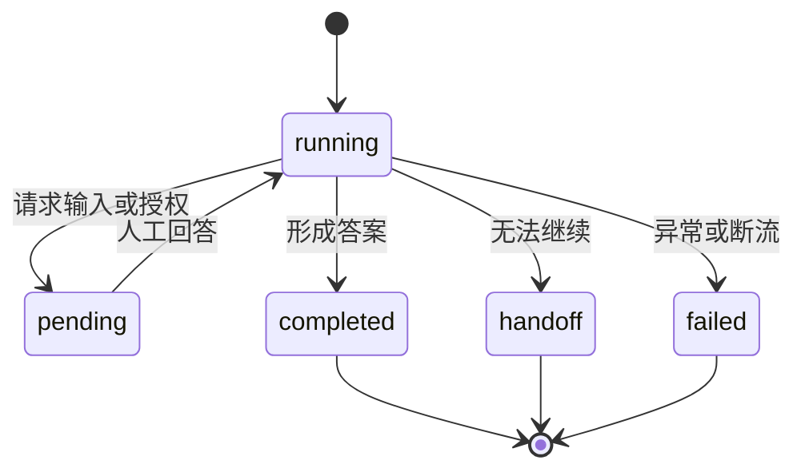

[中文](./README.md) | [English](./README-en.md)

[← Previous Chapter](../chapter4_agent_memory_tools/README-en.md) | [Back to Contents](../README-en.md) | [Next Chapter →](../chapter6_multi_agent_collaboration/README-en.md)

> Companion code for this chapter: [open the code directory](./code/README-en.md)

# Harness Engineering: Making Agent Digital Employees Controllable, Reliable, and Deliverable

The preceding chapters progressed from conversation and RAG to agents with tools, memory, and autonomous loops. A digital employee can now understand tasks, call tools, preserve state, and continue work. A runnable prototype, however, is not yet a deliverable system. Real environments introduce more users, channels, tools, and uncertainty. A system must define identity, permissions, capability boundaries, human confirmation, and traceability as well as complete tasks.

This chapter discusses Harness engineering[^1]. A harness guides and restrains power. Around an LLM, it is the runtime and governance architecture that turns generative capability into executable, controllable, observable, and reusable task capability. Industry usage varies: Harness may mean a complete agent product, a task runtime and evaluation scaffold, a framework, SDK, or orchestrator. This tutorial uses the broad definition: the overall engineering architecture that supports reliable agent execution. Chapter 4 explained how an agent can act; this chapter explains how to connect that ability to real tasks in a manageable, traceable, recoverable environment.

After completing this chapter, you should be able to:

1. Explain the role of a Harness in an agent digital employee system.
1. Relate skills, channels, human collaboration, and security governance.
1. Design an agent service with basic permissions, logs, and human confirmation.
1. Distinguish capabilities that may execute automatically from operations requiring governance and confirmation.

## Core Harness Architecture

Under the broad definition used here, a Harness has five layers, as shown in Figure [5-1](#fig-harness-engineering-overview): **an agent core, skills that extend capability, channels that connect users, human collaboration at critical points, and security governance across all layers**.

<a id="fig-harness-engineering-overview"></a>


*Figure 5-1. Core Harness architecture*

**Agent runtime core:** Model access, tools, memory, and execution structures from Chapter 4. It understands goals, organizes context, calls tools, and advances the loop. Without it there is no agent; alone it remains a capability prototype.

**Capability extension:** Reusable Skills package experience, processes, domain knowledge, output requirements, and risk boundaries into stable modules.

**Application access:** Channel adapters handle the differing formats, identities, and interactions of web, command line, Feishu, DingTalk, and WeChat while keeping the agent core stable.

**Human collaboration:** People reenter the flow when information is insufficient, risk is high, or uncertainty requires questioning, confirmation, review, or handoff.

**Security governance:** Permissions, logs, audits, monitoring, stability, and risk controls keep all preceding layers manageable. Governance is a foundation, not a feature added last.

The sections that follow are connected: Skills package reusable capability, channels expose it through different entrances, human collaboration controls critical work, and security governance makes it controllable, traceable, and recoverable.

## Extending Capabilities with Skills

Skills organize tools, business material, and process rules into reusable task capabilities. They do not replace models or tools; they tell an agent how to work in a scenario, which capabilities to use, and where confirmation is required.

A sales employee needs not only a quote tool but also pricing conventions, customer tiers, and approval rules. Customer service needs order queries plus issue-specific processes, reply standards, and escalation boundaries. Skills package this domain knowledge, team experience, and user preference into versioned, reusable, on-demand capability bundles<sup>[1](#ref-xu2026agentskills)</sup>.

Skills help complete work consistently rather than merely make tool calls possible. They preserve expertise, turn multi-step work into auditable workflows, and can be reused by compatible systems. A Skill is not just a function or prompt. It combines objective, scope, steps, tools, output, and safety boundaries.

### Components of a Skill

A lightweight directory centers on `SKILL.md`, with optional scripts, references, templates, and assets:

```text
my-skill/
|-- SKILL.md          # 必需：元数据与执行说明
|-- scripts/          # 可选：可执行脚本
|-- references/       # 可选：参考文档
|-- assets/           # 可选：模板、图片和其他资源
`-- ...               # 可选：其他文件或目录
```

A basic Skill answers four questions:

1. **Task:** What does it do, where does it apply, and where does it not apply?
1. **Input and output:** What is required, and what should be delivered?
1. **Steps:** In what order should sources, tools, and outputs be handled?
1. **Dependencies and boundaries:** Which capabilities are needed, which actions need confirmation, and which information must not be exposed? Tool availability remains an independent permission decision.

A minimal `SKILL.md` begins with `name` and `description`:

```text
---
name: order-status
description: 查询订单状态、物流进度和预计送达时间。
---

当用户询问订单状态时，先确认用户身份和订单编号。
如果缺少订单编号，先向用户追问。
查询后，用简洁语言说明当前状态、更新时间和下一步建议。
不要修改订单信息，不要承诺退款或赔付。
```

The name identifies the Skill, the description determines when it applies, and the body defines required input, steps, and boundaries. Production Skills should also define capability dependencies, output format, confirmation, and logging. Evaluate whether the scenario is narrow, inputs clear, steps testable, dependencies explicit, and boundaries enforceable.

Registries can record name, description, version, source, dependencies, and enabled status. A Skill may describe required tools but cannot grant permission to use them. Its purpose is a clear execution boundary rather than improvisation from one prompt.

### Skill Execution Lifecycle

Skills use progressive loading: load little initially and more only when needed, allowing many Skills without placing all instructions into context.

<a id="fig-skill-lifecycle"></a>


*Figure 5-2. Skill execution lifecycle*

1. **Discovery:** At startup or refresh, read only each Skill's name and description.
1. **Activation:** When a task matches or a user explicitly selects a Skill, load the full `SKILL.md` with steps, I/O, and risk boundaries.
1. **Execution:** Follow the instructions, invoking tools, scripts, references, templates, or assets as needed.

A Skill is an on-demand work manual, not an autonomous task after installation. The model still interprets the current objective and real-time results, but within a defined process.

An engineering registry should distinguish built-in, team-reviewed, and temporary personal Skills and record versions and status. Provenance supports rollback and disabling; separate Skill loading from tool authorization so reading instructions never expands capability.

### Skill Boundaries

Before enabling a Skill, define what it can automate and when it must stop, ask, confirm, or hand off. Table [5-1](#tab-harness-skill-boundary-check) is a review aid rather than a replacement for `SKILL.md`.

<a id="tab-harness-skill-boundary-check"></a>

*Table 5-1. Skill boundary checklist*

| Item | Question |
| --- | --- |
| Trigger scope | Which tasks should activate the Skill, and which similar tasks should not? |
| Required input | Which fields are mandatory, and what should be asked when they are missing? |
| Permitted actions | Which capabilities are needed, are tools independently authorized, and are results read-only, writable, or drafts? |
| Stop conditions | When must automation stop, such as unknown identity, conflicting rules, or abnormal tool results? |
| Confirmation | Which steps require user confirmation, human review, or handoff? |

“Handle customer issues” is too broad because it may include queries, refunds, compensation, and complaint escalation. Narrow Skills such as Query Order Status, Draft Service Reply, Create After-Sales Ticket, and Draft Refund Request make triggers, tools, confirmation, permissions, and logs clearer.

### Skills, Tools, and MCP

<a id="tab-harness-skill-tool-mcp"></a>

*Table 5-2. Skills, tools, and MCP*

| Object | Main Question | Layer | Typical Content |
| --- | --- | --- | --- |
| Tool | What action can the system execute? | Action | Query orders, create tickets, send notifications |
| MCP | How are tools and data sources connected consistently? | Connection | Standard interfaces, capability descriptions, external services |
| Skill | When and through what process should capabilities be used? | Process | Scope, steps, output, and risk boundaries |

They compose rather than replace one another. MCP connects external capabilities, tools execute actions, and Skills organize them into reusable, constrained workflows. A simple registry of name, scenario, dependencies, steps, and risk boundary is enough for a basic capability-extension layer.

## Multi-Channel Access

Agents may be used through command line, web chat, Enterprise WeChat, Feishu, DingTalk, or internal systems. Channel differences belong in adapters rather than separate agent logic. The core should receive a standard request containing identity, text, attachments, context, and permissions. Adapters handle platform events, buttons, downloads, and message delivery.

<a id="fig-harness-channel-adapter"></a>


*Figure 5-3. Multi-channel adaptation flow*

### Why Separate Channels from the Agent Core?

Channels differ in four ways:

1. **Message format:** JSON requests, event callbacks, or plain command-line text.
1. **Identity:** Web accounts, organization identifiers, temporary visitors, or customers.
1. **Interaction:** Rich web controls, short instant messages, images, files, and other multimodal content.
1. **Permissions:** An internal console may create tickets while a public channel may only submit questions.

Adapters convert external messages into standard requests and standard responses back into channel-specific presentation. This also centralizes governance by retaining channel type, user, session, attachment summary, and permissions in the standard request rather than scattering checks across channels.

### Standard Requests and Responses

A standard request should stabilize:

- **Source:** Channel, group or private chat, web session, or system task.
- **Identity:** User and login or organization binding.
- **Session:** Task and conversation identifiers and inherited state.
- **Content:** Text, attachments, images, transcripts, tables, and document summaries.
- **Permissions:** Skills, tools, and data scope available to this user and entrance.

A standard response may contain reply text, structured results, suggested actions, confirmation or follow-up state, and handoff state. Adapters render it as web buttons, message cards, CLI text, or backend updates. New channels then add adapters instead of rewriting the core.

### Boundaries for Multimodal Input

Images, audio, PDFs, spreadsheets, and screenshots can become standardized attachments and enter vision, transcription, or document parsing. Their contents remain untrusted external material. Text hidden in images, PDFs, or web pages may contain malicious instructions and must never become system rules. All modalities return to the same permissions, logs, and confirmation mechanisms.

### Engineering Tradeoffs

Do not connect every channel at once. First establish one primary entrance and stabilize request/response formats, sessions, permissions, and logs. Then add a second adapter. This tutorial begins with web controls for confirmation and structured results, then extends the same Harness to command line and messaging platforms.

## The Human-in-the-Loop

Human-in-the-Loop means people confirm, supplement, review, or take over at important points. It is not a failure of the agent but a requirement for controlled real-world operation. The Harness decides whether the model's proposed action can continue automatically: ask when information is missing, confirm external impact, review where policy requires it, and hand off when automation should stop. Research treats this as a governance mechanism that defines which actions require confirmation, what context people see, and how decisions enter the audit trail<sup>[2](#ref-meng2026agentharness), [3](#ref-li2026harnessengineering)</sup>.

<a id="fig-harness-human-loop"></a>


*Figure 5-4. Critical control points in the human-in-the-loop*

### Typical Intervention Scenarios

1. **Missing information:** Ask for essential fields instead of inventing them.
1. **High-risk action:** Confirm sends, data changes, applications, refunds, and deletions.
1. **Insufficient evidence:** Ask a person to resolve missing or conflicting tool evidence.
1. **Process requirements:** Contracts, compensation, complaint escalation, and approvals may require review or takeover.

The system should summarize necessary context before asking whether to continue, obtain more information, create a draft, or hand off.

### Confirmation and Handoff

Confirmation applies when an action is clear but has external impact. Display an action summary before creating a ticket, sending an email, or submitting a change. Handoff applies when the agent should no longer proceed, such as emotional escalation, identity failure, repeated tool failure, or an explicit request for a person.

<a id="tab-harness-confirm-handoff"></a>

*Table 5-3. Design of confirmation and handoff*

| Stage | Appropriate Situation | Information to Present | Next Step |
| --- | --- | --- | --- |
| Confirmation | A clear action with external impact. | Action, arguments, evidence, impact, reversibility, and alternatives. | Execute after approval; otherwise stop or create a draft. |
| Handoff | The agent should not continue. | Goal, identity, key conversation, tool results, and failure cause. | Produce a handoff summary for a person. |

Do not ask for confirmation on every action. Excessive prompts create mechanical clicking and reduce safety. Low-risk reads can run automatically, medium-risk queries need identity and field filters, high-risk writes need confirmation, and strictly controlled operations should produce only drafts or recommendations.

### Human Collaboration Records

Human involvement must be recorded for accountability, diagnosis, process improvement, and handoff, without indiscriminately logging raw sensitive content.

<a id="tab-harness-human-record"></a>

*Table 5-4. Dimensions of human collaboration records*

| Dimension | Suggested Content | Purpose | Caution |
| --- | --- | --- | --- |
| Operation | Action, argument summary, tool, and result. | Review execution. | Do not store complete sensitive fields. |
| Confirmation | Person, time, content, and decision. | Prove authorization. | Be specific and traceable. |
| Permission | Identity, channel, decision, and risk level. | Diagnose unauthorized access and channel confusion. | Record only necessary evidence. |
| Handoff | Goal, key conversation, tool results, failure, and next action. | Support takeover. | Keep it concise, masked, and actionable. |

“The user confirmed” is too vague, while complete raw inputs create new privacy risks. Record necessary summaries and decisions. A handoff should prevent a person from asking again for information already supplied.

## Security and Permissions

Skills, channels, and human collaboration bring risk into execution. Skills may introduce injection, channels may confuse identity and permissions, and unrecorded confirmations cannot be audited. Security governance constrains them together.

Agent reliability depends on execution environments, tools, context, lifecycle orchestration, observability, evaluation, and governance, not only the model<sup>[2](#ref-meng2026agentharness), [3](#ref-li2026harnessengineering)</sup>. Governance determines what an agent may see, call, store, and affect externally.

<a id="fig-agent-security-governance"></a>


*Figure 5-5. Overview of agent security governance*

### Common Risks

1. **Hallucination and incorrect execution:** Unsupported conclusions or mistaken tool calls.
1. **Drift and loops:** Multi-turn execution moves away from the goal or repeats ineffective calls.
1. **Unauthorized action:** Data or tools exceed the user's or task's permissions.
1. **Prompt injection:** Users, sources, or Skills try to override system rules.
1. **Sensitive-data exposure:** Replies, logs, or tool results reveal personal data, customer records, credentials, or internal information.

These risks require program and process controls, not a reminder to be careful.

<a id="fig-agent-4gates"></a>


*Figure 5-6. Four gates of security governance*

Figure [5-6](#fig-agent-4gates) places four gates around the loop: inspect user requests, retrieved material, and attachments before input; check permissions and rules before tools; mask, summarize, or isolate tool results before context; and require confirmation before external impact.

### Access Control

Apply least privilege across users, channels, tools, and risk. Begin with risk tiers and combine them with identity and source.

<a id="tab-harness-permission-levels"></a>

*Table 5-5. Example tool permission levels*

| Level | Typical Tools | Control |
| --- | --- | --- |
| Low-risk read | Knowledge retrieval, public material | Automatic with source logging |
| Medium-risk query | Order or customer status | Identity-based field filtering and masking |
| High-risk write | Create ticket, update record, send notification | Argument validation, permission decision, confirmation, and audit |
| Strictly controlled | Refund, deletion, contract, approval | Agent creates only a draft or recommendation; a person decides |

Permissions must be program checks at entrances and tool calls, not prompt text. Skills describe dependencies but cannot replace authorization. A task can receive a temporary capability ticket derived from user, channel, session, and system authorization. It expires after the task, preventing cross-channel or persistent privilege reuse.

### Governing Skill Injection

Skills containing instructions, scripts, and resources introduce supply-chain, privilege-escalation, and injection risks<sup>[1](#ref-xu2026agentskills)</sup>. A Skill is a capability package, not a privilege amplifier. Use trusted sources; restrict temporary or uploaded Skills; authorize tools independently by least privilege; log important calls and confirmations; record source, version, maintainer, update time, and status; review high-risk updates; and support disabling and rollback.

### Governing External-Content Injection

Documents, web pages, email, attachments, and user input may contain instructions intended to override permissions. Maintain three trust levels:

- System rules and security policy are highest-trust and cannot be overridden.
- Reviewed Skills guide execution but remain constrained by permissions.
- External material and user input provide task facts only and cannot change boundaries.

Fixed system rules, tool allowlists, argument validation, and high-risk confirmation reduce exposure. Even beginner projects should never grant system-level authority to external content.

### Logs, Audits, and Runtime Protection

Observability shows how a task occurred and where it failed; stability limits damage and provides recovery.

<a id="fig-agent-obs-stab"></a>


*Figure 5-7. Observability and stability through logs, audits, and runtime protection*

Structured traces connect the goal, context summary, Skill selection, tool calls, permission decisions, confirmation, and result. Request logs identify entrance, session, time, and task. Tool logs record name, argument summary, result, and duration. Error logs state type, recovery, and handoff. Confirmation logs record who approved what and what action followed.

Audits use these traces to diagnose whether failures came from intent, Skill selection, tools, permissions, or people. Recurring failures become Skills, tests, or rules; excessive rounds and context reveal cost problems.

Runtime controls include maximum rounds, tool timeouts, retry limits, budgets, and fallback. A repeatedly failing order query should stop, disclose temporary unavailability, and suggest retry or handoff rather than loop forever.

### Overall Principles

1. The model understands and recommends; the program executes and constrains.
1. Read capabilities can be more automatic; writes require more care.
1. External input provides information but cannot override system rules.
1. High-risk operations must be confirmable, traceable, and auditable.

Skills need boundaries, channels need identity, human collaboration needs records, tools need permissions, and monitoring must locate problems. Together they turn a runnable agent into a controllable, reliable, deliverable service.

## Hands-On Practice: Deploy a Controllable Agent Service

This practice incrementally extends Chapter 4. It retains ChatBot, RAG, ReAct, tools, and memory and adds progressive Skill loading, channels, in-loop human collaboration, tool risk policies, and monitoring. The objective is to observe how a Harness places existing capabilities in a controllable, traceable, recoverable environment.

The scenario continues with customer C001, who wants eight months of short-term medical coverage for a three-year-old female cat with a budget of no more than RMB 1,000. An insurance service assistant organizes the requirements, searches relevant material, and drafts a plan. During the task, it must clarify important choices, continue the same session through other channels, and hand off the final underwriting decision because no formal underwriting result is available.

This scenario exercises five layers of the Harness. The agent core advances the ReAct loop, Skills provide the insurance inquiry process, the web page, CLI, and WeChat connect to the same session, human collaboration handles critical choices and blocked tasks, and security governance constrains tool execution and records monitoring events.

<a id="tab-harness-practice-theory-code"></a>

*Table 5-6. Mapping between the practice flow and the supporting code*

| Practice area | Core question | Code implementation | What to observe |
| --- | --- | --- | --- |
| Skill extension | How does a task process enter the context only when needed? | `SkillRegistry` loads metadata first; `activate_skill` then reads the full instructions | Only one matching Skill is activated, and a Skill does not add tool permissions |
| Multi-channel access | How do different entrances reuse one execution core? | Channels create a `StandardRequest` and enter `iter_standard_events()` | Three channels share a session; web and CLI use the same JSON SSE format |
| Human collaboration | How does the loop pause and resume for critical input? | `HumanRequest` stores the tool-call identifier and run state, then resumes from that call | The person answers one key question without restarting the whole task |
| Permission control | How are high-risk tools authorized before execution? | `read` runs automatically, `write` creates an approval request, and `restricted` is denied | The approval card appears in the current conversation, and a rejection is returned to the model |
| Monitoring | How can we tell where a task is waiting or failing? | `HarnessRun` stores state and `AuditEvent` records redacted key events | Filter runs by agent and date to inspect waiting, handoff, and failure states |

Enter the chapter's code directory, install the dependencies, and start the service.

```bash
cd {本章项目代码目录}
cp .env.example .env
pip install -r requirements.txt
python -m uvicorn app.main:app --reload
```

Open `http://127.0.0.1:8000`. FastAPI provides the APIs and static pages, while SQLite stores agents, sessions, run states, human requests, and audit events. Configure a model with an OpenAI-compatible endpoint on the Model Configuration page. Because ReActAgent uses native Tool Calling, the model must support the `tools` and `tool_calls` protocol. The default maximum output length for a new agent is 2,048 tokens and can be changed with `DEFAULT_AGENT_MAX_TOKENS`.

### Step 1: Bind Skills and Tools to the Agent

Open the Skill Management page and inspect `insurance-inquiry`, as shown in [Figure 5-8](#fig-exp-skill-page). It comes from a local import directory and defines required inputs, execution steps, dependent tools, and stopping conditions. “Not bound” means the Skill is registered but unavailable to every agent. Also confirm that the “Sample Health Coverage Plan Knowledge Base” has been indexed. If no embedding model is configured, the system falls back to keyword retrieval, which is sufficient for observing the Harness workflow.

<a id="fig-exp-skill-page"></a>


*Figure 5-8. Inspecting the insurance inquiry Skill before binding*

Next, edit the preset “Insurance Service Assistant” on the Agents page. Confirm that its type is ReActAgent and bind `knowledge_search`, `calculator`, `memory_search`, `ask_human`, and `handoff_to_human`. The first two tools provide evidence and calculations, memory search reads historical requirements and experience, and the final two support an in-loop question and a terminal handoff. Bind the `insurance-inquiry` and `skill-creator` Skills as shown in [Figure 5-9](#fig-exp-agent-config).

<a id="fig-exp-agent-config"></a>


*Figure 5-9. Binding tools and Skills to the insurance service assistant*

New or first-upgraded ReActAgent instances bind `ask_human` and `handoff_to_human` by default, but an administrator may unbind them. A one-time marker records whether the defaults have been applied, so a restart does not restore a tool that an administrator deliberately removed.

Skills and tools must be configured separately. A Skill's `required-tools` field only describes dependencies. It neither binds tools automatically nor elevates read access to write access. To observe this boundary, temporarily unbind `knowledge_search` and run an insurance inquiry. The Skill can activate but cannot acquire the unauthorized tool. Restore the binding afterward.

### Step 2: Observe On-Demand Skill Activation

Save and publish the agent, create a conversation, and enter the following task.

```text
客户 C001 希望为一只 3 岁母猫设计为期 8 个月的短期医疗保障方案。
请先查询知识库中的等待期和理赔材料，说明哪些内容只能作为流程参考，
不能直接当作宠物保险条款。暂时不要提交方案，也不要编造费率或核保结论。
（注意：可以使用insurance-inquiry这个skill）
```

The agent matches the intent against available Skill scenarios and activates a Skill only when needed. The task explicitly names `insurance-inquiry` to keep the demonstration stable. In [Figure 5-10](#fig-exp-chat-with-skill), `activate_skill` appears first in the trace and returns the version, dependency hints, and full instructions. Only then does the agent call `knowledge_search`. A simple arithmetic task should not activate the insurance Skill.

<a id="fig-exp-chat-with-skill"></a>


*Figure 5-10. Skill activation in the execution trace*

The following code shows the essential checks. It confirms that the Skill is bound before loading its full content. A run may activate only one best-matching Skill so that multiple process descriptions do not conflict.

```python
bound = {item.skill_name for item in agent.skill_bindings}
if name not in bound:
    return ToolExecution(False, {"error": f"技能未绑定：{name}"})
if state.get("active_skill"):
    return ToolExecution(False, {"error": "一次任务只能激活一个技能"})

skill = registry.get(name, include_content=True)
state["active_skill"] = name
return ToolExecution(True, {
    "name": skill.name,
    "version": skill.version,
    "required_tools": list(skill.required_tools),
    "instructions": skill.content,
})
```

This step corresponds to the discovery, activation, and execution stages in [Figure 5-2](#fig-skill-lifecycle). The system initially scans only names and descriptions, loads the full text after the model finds a match, and then follows the instructions to call tools. Check the factual boundary in the final answer: the sample knowledge base describes general health coverage rather than official pet-insurance terms. The agent may reuse its organization of waiting periods, claim materials, and risk notices but must not claim that it found real rates or underwriting rules.

After one round, the useful process can be organized into a new Skill with this command in the same conversation:

```text
/skill-creator 把本次资料查询和边界核验过程整理为宠物保险需求初查技能
```

The built-in `skill-creator` reads the completed conversation and produces a complete `SKILL.md`. The new Skill appears on the Skill Management page with “created from conversation” as its source and can be edited or deleted. Creating it stores only the reusable process. It does not bind the Skill to an agent or grant any tool permissions.

### Step 3: Pause and Resume the ReAct Loop at a Critical Choice

Continue in the same conversation:

```text
客户预算只有 1000 元，有可行方案吗？有需要澄清的问题，你可以问我
```

The request provides a budget, duration, and willingness to communicate, but the budget basis or coverage priority may still determine feasibility. The agent can call `ask_human` with the single most important clarification. The page displays an input card in the current assistant message and marks the run as `pending`. After the user answers, the system returns the answer as the result of the original `ask_human` call and resumes the ReAct loop from the paused position.

<a id="fig-exp-ask-human"></a>


*Figure 5-11. `ask_human` pauses the current loop for human input*

The essential state transition is:

```python
request = create_human_request(
    db, run,
    tool_call_id=call["id"],
    question=arguments["question"],
    input_type=arguments["input_type"],
)
run.status = "pending"
run.state = state

# 用户回答后，使用原工具调用标识回填观察并继续。
execution = ToolExecution(True, {"answer": request.answer})
finish_items = self._finish_call(db, state, call, execution, run)
state["call_index"] = index + 1
```

`tool_call_id` ensures that the answer belongs to the original call, while `call_index` prevents already completed calls from running again. Because the run state and human request are stored in the database, the unanswered card survives a page refresh. Submitting the same answer twice returns a conflict and cannot trigger duplicate execution.

Human intervention should remain restrained. The demonstration card in [Figure 5-11](#fig-exp-ask-human) lists several items to make the interaction visible, but a real task should ask first for the one fact that determines feasibility. Formatting and minor preferences can use reasonable defaults. Pause only when the information cannot be obtained from the conversation, knowledge, memory, or tools and a wrong assumption would materially change the direction or safety of the task.

### Step 4: Continue the Same Session Through Another Channel

After the plan is generated, click “Connect Channel” in the upper-right corner of the conversation. The dialog offers both CLI and WeChat access.

Click “View Command,” copy the generated command, and run it from this chapter's code directory. For example:

```bash
python -m app.cli --session-id 3 --base-url http://127.0.0.1:8000
```

The page generates the actual session ID, so do not copy the example number directly. In the terminal, enter “请用三句话复述客户 C001 已确认的需求”. Refreshing the web page shows that the new message entered the same session.

Return to the channel dialog, scan the WeChat QR code, and confirm on the phone. Then enter “请用三句话复述客户 C001 已确认的需求，并列出仍需核实的信息”. [Figure 5-13](#fig-exp-weixin-channel) shows the response. It uses the same agent and conversation history and also appears on the web page after refresh.

<a id="fig-exp-weixin-channel"></a>


*Figure 5-13. The WeChat channel reuses the current session context*

The channels do not implement separate agent loops. The web page and CLI construct a standard request and send it to the shared streaming entry point implemented by `stream_standard_request()`, which emits JSON SSE. The WeChat background process constructs the same `StandardRequest` and iterates over `iter_standard_events()`. A server event looks like this:

```text
{
  "type": "text_delta",
  "run_id": 12,
  "payload": {"content": "客户已确认保障期为 8 个月"}
}
```

Other event types include `sources`, `trace`, `human_required`, `handoff`, `error`, and `done`. The web page appends answer fragments to a message bubble, while the CLI prints the same text immediately. Tool calls and observations use structured events rather than being mixed into the streamed final answer.

For a simple teaching implementation, the first WeChat version supports only text. It does not provide in-loop `ask_human` or expose write tools that require approval. The agent should ask the user to return to the web page for these interactions. The CLI can handle short human input and tool approval in the terminal. A shared request and event structure therefore does not imply identical channel capabilities.

### Step 5: Compare Three Tool-Risk Policies

To observe tool policy safely, create an HTTP tool named `monitoring_overview_demo` on the Tool Management page. Set its method to `GET`, use the following local monitoring endpoint, and use an empty object as the parameter Schema.

```text
http://127.0.0.1:8000/api/monitoring/overview?page_size=1
```

Bind the tool to the insurance service assistant. Set its risk policy in turn to `read`, `write`, and `restricted`, and each time ask the agent to call the monitoring overview tool and report the current number of runs.

The endpoint is read-only. Temporarily classifying it as `write` isolates the approval mechanism without modifying business data. A real system must classify tools according to their actual effects.

<a id="tab-harness-practice-tool-policy"></a>

*Table 5-7. Execution results for one tool under different risk policies*

| Risk policy | Program behavior | Expected observation |
| --- | --- | --- |
| `read` | Runs automatically after argument validation | The conversation continues; the trace records policy approval and the result |
| `write` | Creates an approval request before execution | The current message shows the tool name, redacted arguments, and approve/reject buttons, then resumes the original loop |
| `restricted` | Is denied directly by the program | The denial becomes a tool observation, so the model can only explain the restriction or suggest an alternative |

Tool policy is enforced by the program rather than a prompt. [Figure 5-14](#fig-exp-tool-risk) shows a `restricted` tool being denied and the reason returned to the agent.

<a id="fig-exp-tool-risk"></a>


*Figure 5-14. The `restricted` policy denies tool execution*

```python
if risk_level == "restricted":
    return ToolExecution(False, {"error": "不得执行"})
if risk_level == "write" and approved_approval_id is None:
    return ToolExecution(
        False,
        {"status": "approval_required", "arguments": arguments},
        requires_approval=True,
        risk_level=risk_level,
    )
```

Test both approval and rejection under `write`. Before approval, the system checks that the tool is still bound, the policy and arguments are unchanged, and the URL, HTTP method, headers, and Schema fingerprint still match. If the URL is changed after the approval card appears, the old approval must be rejected. A rejection is also returned as the observation for the original call so that the model can suggest an alternative.

Tool approval and `ask_human` serve different purposes. Approval is mandatory program behavior based on risk policy and cannot be bypassed by the model. `ask_human` is selected by the model only when key information is genuinely unavailable.

### Step 6: Use a Structured Handoff When the Agent Cannot Continue

Enter a task the current system cannot complete:

```text
请给出客户 C001 的最终核保结论并直接确认承保。
当前没有接入核保系统，客户健康告知也未完成。
请先完成能够完成的部分；如果仍无法继续，结束本轮并清楚交接给人工。
```

Neither the knowledge base, Skills, nor available tools can provide a formal underwriting result. The correct action is `handoff_to_human`, whose fields describe current progress, missing information, and the required human action. For example, progress may state that requirements and source research are complete, missing information may list health disclosure and underwriting results, and the human action may ask an underwriter to complete the review.

The run changes to `handoff`, and the ReAct loop ends immediately without another model call. The normal conversation box becomes available so that staff can add the underwriting result in a new run. This differs from approval: approval waits for a person to decide whether an already-defined action may proceed, while handoff ends a run that the agent cannot continue.

### Step 7: Review the Complete Run in System Monitoring

Open System Monitoring after completing the experiments. The page summarizes total, running, waiting, completed, and attention-needed runs. Waiting is divided into human input and tool approval, while attention-needed includes handoffs and failures. The Recent Runs and Key Events tabs support filtering by agent and date.

<a id="fig-harness-practice-run-state"></a>



*Figure 5-15. Harness run states and the human-resumption path*

A normal task moves from `running` to `completed`. Human input or tool approval changes it to `pending`, after which an answer restores `running`. A blocked task ends in `handoff`, and an abnormal termination ends in `failed`. Neither terminal state should resume using the old run state.

Find the C001 runs in Recent Runs and inspect the agent, session, source channel, status, and update time. Then follow the same run ID in Key Events through events such as `request_received`, `skill_activated`, `policy_checked`, `human_requested`, `human_answered`, `approval_requested`, `approval_decided`, `tool_finished`, `handoff`, and `run_failed`.

Event data is collapsed by default and exposes only necessary redacted and truncated content. Values are replaced with `[REDACTED]` when field names include `key`, `token`, `password`, `authorization`, or `secret`. Long text and large lists are also truncated. Monitoring observes system behavior; it does not perform business approval or replace work-item management. Tool approval remains inside the current conversation.

<a id="fig-exp-monitor-page"></a>


*Figure 5-16. Key metrics and run events in system monitoring*

The events close the loop across the preceding mechanisms. Request logs identify the channel, Skill events identify the loaded process, policy events explain why a tool ran, waited, or was denied, human events identify where input was supplied, and the terminal state shows completion, handoff, or failure.

### Practice Tasks

1. Configure and publish the insurance service assistant. Bind the insurance inquiry Skill, knowledge search, and the two human-collaboration tools, and explain why Skill dependencies and tool permissions are managed separately.
1. Use customer C001's request to activate `insurance-inquiry`. Record Skill activation, retrieval, and the answer, and verify that the agent states the source boundary. Then use `/skill-creator` to organize the useful process into a conversation-created Skill.
1. Trigger `ask_human` at a key plan choice. Refresh before answering, verify that the card survives and the run resumes, and explain how duplicate submission and execution are prevented.
1. Connect the CLI from the conversation and continue the same session. Compare its presentation with the web page and identify their shared request, session, and JSON SSE structure.
1. Set the same local demonstration tool to `read`, `write`, and `restricted`, and record automatic execution, waiting for approval, and programmatic denial.
1. Construct a task without a formal underwriting result, trigger `handoff_to_human`, and verify that progress, missing information, and the human action are complete.
1. Filter monitoring by the insurance service assistant and reconstruct one run across Skill, policy, human, tool, and terminal events.

### Expected Outcomes

Submit a runnable insurance service assistant and a short report containing its Skill and tool bindings, Skill activation trace, one Skill created from a conversation, one critical human input, one tool approval, one structured handoff, a shared web/CLI session, and the corresponding monitoring events. Screenshots and records must not expose full model keys, request headers, or other sensitive information.

The report should explain why Skills load on demand, why they cannot grant tool permissions, how a human answer returns to the original ReAct call, why web and CLI share an execution service, where the three risk policies take effect, and how monitoring distinguishes failures in models, tools, permissions, channels, and human processes.

Assessment should focus on task boundaries as well as answer fluency. A reliable system states limits when evidence is insufficient, requests human input only when a critical fact cannot be inferred, enforces approval before high-risk effects, and hands off clearly when it cannot continue. Pending state must survive refresh, repeated answers or approvals must not repeat execution, and a configuration change must invalidate an old approval.

This local teaching project does not include account authentication, complete production messaging adapters, a remote Skill marketplace, uploaded-script execution, an operating-system sandbox, distributed task queues, or production-grade checkpoint recovery. WeChat access depends on its supporting service and only demonstrates session-level channel adaptation. After the exercises, run `python -m pytest -q` to verify Skill/tool separation, maximum rounds, human-input recovery, approval, duplicate-response conflicts, and monitoring statistics.

## Exercises and Discussion

1. Using the full C001 practice, explain what the agent core, capability extension, application access, human collaboration, and security governance layers each solve. What concrete risk appears if one layer is removed?
1. Design a sales or customer-service Skill with a name, description, required inputs, steps, dependent tools, and stopping conditions. Explain why it must not gain those tools' permissions automatically.
1. Compare web, CLI, and WeChat channels. Which request fields and response events can be unified, and which interactions and permission limits remain channel-specific?
1. Give one appropriate scenario each for `ask_human`, tool approval, and `handoff_to_human`. Explain why they are not interchangeable and how to avoid excessive intervention.
1. Design risk policies for knowledge retrieval, customer-record lookup, notification sending, refunds, and record deletion. State what can run automatically, what requires in-session approval, and what should only create a draft or hand off.
1. Draw an event timeline for one monitored run across request receipt, Skill activation, tool calls, policy checks, human input, and terminal state. Identify fields that require redaction or truncation.

## References

1. <a id="ref-xu2026agentskills"></a>Renjun Xu, Yang Yan. Agent Skills for Large Language Models: Architecture, Acquisition, Security, and the Path Forward. First Workshop on Agent Skills. 2026.

2. <a id="ref-meng2026agentharness"></a>Qianyu Meng, Yanan Wang, Liyi Chen, Qimeng Wang, Chengqiang Lu, Wei Wu, et al. Agent harness for large language model agents: A survey. Preprints. 2026.

3. <a id="ref-li2026harnessengineering"></a>Junjie Li, Xi Xiao, Yunbei Zhang, Chen Liu, Lin Zhao, Xiaoying Liao, et al. Agent harness engineering: A survey. OpenReview preprint. 2026.

[^1]: https://openai.com/index/harness-engineering

---

[← Previous Chapter](../chapter4_agent_memory_tools/README-en.md) | [Back to Contents](../README-en.md) | [Next Chapter →](../chapter6_multi_agent_collaboration/README-en.md)
