[中文](./README.md) | [English](./README-en.md)

[← 上一章](../chapter4_agent_memory_tools/README.md) | [返回总目录](../README.md) | [下一章 →](../chapter6_multi_agent_collaboration/README.md)

> 本章配套代码：[进入 code 目录](./code/)

# Harness 工程：让Agent数字员工可控、可靠、可交付

前几章逐步完成了从基础对话、检索增强生成（RAG），到具备工具调用、记忆机制和自主循环的智能体（Agent）构建。到这一步，数字员工已经不只是会回答问题，而是初步具备了理解任务、调用工具、保存状态并持续推进工作的能力。
但是，能运行的智能体原型还不能直接等同于可以交付的真实系统。真实环境中的数字员工要面对更多用户、入口、工具和不确定情况。系统不仅要完成任务，还要明确身份、权限、能力边界、人工确认方式和问题追踪路径。

本章讨论 Harness 工程[^1]，其原意是“挽具”或“系具”，强调对力量的引导和约束。在大模型系统中，Harness 可以理解为围绕大模型构建的一套运行与治理架构，目标是把模型的生成能力转化为可执行、可控制、可观测、可复用的任务能力。
需要注意的是，当前业界对 Harness 的边界并没有完全统一。它有时指完整的智能体产品，有时指任务运行和评测脚手架，也常和智能体框架、开发工具包或任务编排器混用。本书采用广义定义，将 Harness 视为支撑智能体可靠完成任务的整体工程架构。据此理解，第 4 章回答的是智能体如何具备做事能力，本章回答的是如何把这种能力接入真实任务，并让它处在可管理、可追踪、可恢复的运行环境中。

完成本章后，你应该能够：

1. 理解 Harness 在智能体数字员工系统中的作用。
1. 说明技能、多通道接入、人机协同和安全治理之间的关系。
1. 设计一个具备基本权限、日志和人工确认能力的智能体服务结构。
1. 判断哪些智能体能力可以自动执行，哪些操作必须加入治理和确认机制。

## Harness 的核心架构

Harness 的核心作用是把大模型及智能体核心放入一个更完整的运行环境中。在本书采用的广义定义下，Harness 可以按五个层次组织，如图 [5-1](#fig-harness-engineering-overview) 所示。这五个层次也构成本章主线：**以智能体核心为基础，用技能扩展能力，用多通道连接用户，用人机协同控制关键节点，最后用安全治理统一约束风险**。

<a id="fig-harness-engineering-overview"></a>

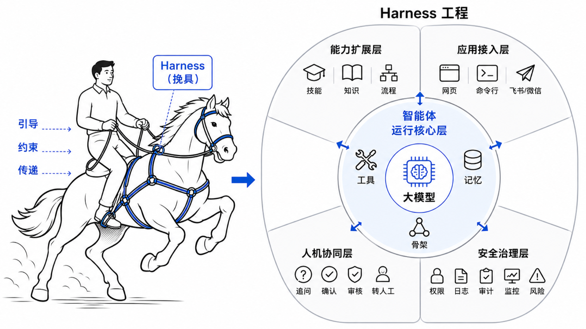

*图 5-1　Harness 的核心架构示意图*

**智能体运行核心层**：承接第 4 章内容，包括模型接入、工具机制、记忆机制和运行骨架。它负责理解目标、组织上下文、调用工具并推进任务循环。没有这一层，系统只是普通应用；只有这一层，系统仍停留在能力原型阶段。

**能力扩展层**：负责把常用任务封装成类似说明书一样、可以复用的技能（Skill）。技能把经验、流程、领域知识、输出要求和风险边界组织在一起，让智能体可以稳定调用已经整理好的能力模块。

**应用接入层**：负责接入不同通道。网页、命令行、飞书、钉钉、微信等入口的消息格式、身份体系和交互方式都不同。Harness 要把这些差异放在通道适配层中处理，尽量保持智能体核心稳定。

**人机协同层**：负责在关键节点把人接回流程。人工介入不是智能体失败的标志，而是可控系统的一部分。当信息不足、操作风险较高或模型不确定时，系统应主动追问、请求确认、提交审核或转交人工。

**安全治理层**：负责统一约束前面几层。它通过权限、日志、审计、监控、稳定性保障和风险控制，让技能、多通道和人机协同都处在可管理的范围内。安全治理不是最后补上的功能，而是贯穿整个 Harness 的底座。

从这个角度看，本章后续内容是紧密关联的主题：技能解决能力如何封装复用，多通道解决能力如何被不同入口调用，人机协同解决人如何进入关键流程，安全治理则把这些能力统一纳入可控、可追踪、可恢复的运行框架。

## 技能扩展

在前面的核心架构中，技能位于能力扩展层，负责把工具、业务资料和流程规则组织成可复用的任务能力。它不替代模型或工具，而是告诉智能体在特定场景中应按什么步骤做事、使用哪些能力、哪些环节需要确认。
智能体的能力越来越强，但在真实任务中，它常常缺少完成工作所需的上下文。比如，销售数字员工不仅要会调用报价工具，还要理解公司的报价口径、客户分层规则和审批要求。客服数字员工不仅要会查询订单，还要知道不同问题类型的处理流程、回复规范和转人工边界。技能的价值，正是把这些领域知识、团队经验和用户偏好整理成可以复用、便于版本管理、可以按需加载的能力包，称为技能（Skills）<sup>[1](#ref-xu2026agentskills)</sup>。

因此，技能解决的不只是能不能调用工具的问题，而是能不能稳定地把事情做好。首先，它可以**沉淀领域专长**，例如法律审查流程、数据分析管线或演示文稿格式要求。其次，它也可以把多步骤任务变成一致、可审计的**工作流**，减少每次临时组织任务带来的差异。最后，还可以让同一个技能在兼容的智能体系统中**复用**，避免把相同经验反复写进不同产品。
换句话说，技能不是一个函数，也不只是一个提示词，而是把任务目标、适用场景、执行步骤、所需工具、输出格式和安全边界放在一起，让智能体在需要时加载并使用。

### 技能的组成

为了便于维护，技能通常可以组织成一个轻量级目录，用来给智能体补充专门知识和任务流程。其中最核心的是 `SKILL.md`，负责说明技能名称、用途和执行方法。脚本、参考资料、模板和其他资源则按需放入目录中，用来承载复杂流程材料。一个典型的技能目录可以组织成下面的形式。

```text
my-skill/
|-- SKILL.md          # 必需：元数据与执行说明
|-- scripts/          # 可选：可执行脚本
|-- references/       # 可选：参考文档
|-- assets/           # 可选：模板、图片和其他资源
`-- ...               # 可选：其他文件或目录
```

从工程规范看，一个基础技能至少要回答四个问题：

1. **任务说明：**它用来完成什么任务，适合什么场景，不适合什么场景。
1. **输入输出：**执行前需要哪些输入，完成后应该产出什么结果。
1. **执行步骤：**任务应按什么顺序推进，例如先读取资料，再调用工具，最后生成结果。
1. **依赖与边界：**完成流程通常依赖哪些能力，哪些操作需要确认，哪些信息不能泄露。工具是否可用仍由独立权限机制决定。

我们可以先从最小 `SKILL.md` 开始，在文件开头写入必需的 `name` 和 `description` 字段。下面的订单状态查询示例不追求覆盖所有工程字段，只展示如何写清触发场景、必要输入、执行步骤和禁止操作。

```text
---
name: order-status
description: 查询订单状态、物流进度和预计送达时间。
---

当用户询问订单状态时，先确认用户身份和订单编号。
如果缺少订单编号，先向用户追问。
查询后，用简洁语言说明当前状态、更新时间和下一步建议。
不要修改订单信息，不要承诺退款或赔付。
```

这个例子已经形成一个最小闭环：名称用于识别技能，描述用于判断何时使用技能，正文说明必要输入、执行步骤和能力边界。真实系统中的技能还应补齐能力依赖、输出格式、确认要求和日志要求。评价一个技能是否写得好，重点看五点：场景是否足够窄，输入是否清楚，步骤是否可检查，依赖是否明确，边界是否能落到确认、草稿、权限和流程上。

实际系统中，技能通常还会放入受控目录或注册表，记录技能名称、描述、版本、来源、依赖能力和启用状态。技能可以提示流程依赖哪些工具，但不能因此获得工具权限。无论形式如何，核心目的都是一致的：让智能体使用能力时有清晰边界，而不是凭一次提示词临时发挥。

### 技能执行生命周期

技能的执行过程通常遵循渐进式加载，也就是先加载少量信息，在任务需要时再加载更多内容。这样做的目的，是让系统可以同时保留很多技能，却不会一开始就把所有技能全文塞进模型上下文。一个典型流程可以分为三个阶段，如图[5-2](#fig-skill-lifecycle)所示。

<a id="fig-skill-lifecycle"></a>

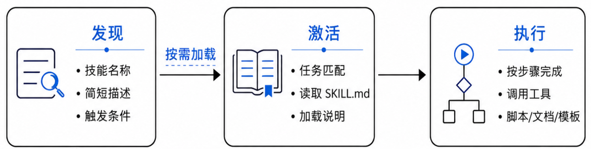

*图 5-2　技能执行生命周期*

具体而言：

1. **发现：**系统启动或刷新技能目录时，只读取每个技能的名称和描述。此时智能体只需要知道有哪些技能，以及它们大致适合什么任务。
1. **激活：**当用户任务与某个技能描述匹配时，或者用户明确指定某个技能时，系统再读取完整的 `SKILL.md`，把任务步骤、输入输出要求和风险边界放入当前上下文。
1. **执行：**智能体按照技能说明完成任务，并在需要时调用工具、执行随技能附带的脚本，或读取参考文档、模板和其他资源。

这个生命周期说明，技能并不是安装后就能自动完成任务。技能更像是智能体执行任务前按需打开的工作手册。它改变的不是最终答案本身，而是智能体完成任务前的准备状态。模型仍然要根据用户目标和实时工具结果做判断，但这种判断已经被技能提供的流程框架约束住了。

工程上，比较通用的做法是维护一个技能目录或技能注册表。系统启动时只加载技能名称、简短描述和触发条件，运行时根据任务选择候选技能，再读取完整说明和必要资源。技能目录应区分内置技能、团队审核技能和个人临时技能，并记录版本和启用状态。这样做有两个好处。第一，技能来源可追踪，出问题时可以回滚或禁用。第二，技能加载与工具授权可以分开治理，模型读取流程说明不会改变系统实际开放的工具。

### 技能的边界说明

技能能指导智能体做事，也可能让能力边界变得模糊。因此，在技能启用前必须先划清边界：哪些事情可以自动完成，哪些情况必须停止、追问、确认或转人工。

技能边界可以用表 [5-1](#tab-harness-skill-boundary-check) 进行检查。它不替代 `SKILL.md`，而是帮助开发者和业务人员判断一个技能是否足够清楚、可控、可上线。

<a id="tab-harness-skill-boundary-check"></a>

*表 5-1　技能边界检查表*

| 检查项 | 需要回答的问题 |
| --- | --- |
| 触发范围 | 这个技能适合处理哪些任务，哪些相似任务不应触发它。 |
| 必要输入 | 执行前必须具备哪些字段，缺少信息时应追问什么。 |
| 可用动作 | 流程需要使用哪些能力，实际工具是否已独立授权，结果应只读、可写还是仅生成草稿。 |
| 停止条件 | 遇到哪些情况必须停止自动执行，例如身份不明、规则冲突或工具结果异常。 |
| 确认要求 | 哪些步骤必须经过用户确认、人工审核或转人工处理。 |

一个模糊的技能容易诱导智能体做出超出权限的动作。例如，处理客户问题这个说法太宽泛，既可能包括查询订单，也可能包括退款、赔付和投诉升级。更好的做法是拆成更窄的技能，例如查询订单状态、生成客服回复草稿、创建售后工单、提交退款申请草稿。这样，触发条件、可用工具和确认要求都更容易检查，也更容易纳入权限和日志机制。

### 技能、工具与 MCP 的关系

学习技能系统时，容易把技能、工具和 MCP 混在一起。可以先用表 [5-2](#tab-harness-skill-tool-mcp) 区分三者的定位。

<a id="tab-harness-skill-tool-mcp"></a>

*表 5-2　技能、工具与 MCP 的区别*

| 对象 | 主要回答的问题 | 所在层次 | 典型内容 |
| --- | --- | --- | --- |
| 工具 | 系统能执行什么动作 | 动作层 | 查询订单、创建工单、发送通知 |
| MCP | 工具和数据源如何标准化接入 | 连接层 | 统一接口、能力描述、外部服务连接 |
| 技能 | 什么时候、按什么流程使用能力 | 流程层 | 适用场景、执行步骤、输出要求、风险边界 |

因此，三者不是替代关系，而是叠加关系。MCP 负责把外部能力接进来，工具负责执行具体动作，技能负责把这些动作组织成可复用、可约束的任务流程。技能可以声明依赖提示，却不能授予或收回工具权限。实践中，只要能用一个简单技能注册表表达技能名、适用场景、能力依赖、执行步骤和风险边界，就已经具备能力扩展层的基本形态。

## 多通道接入

在真实办公和业务场景中，智能体能力往往需要被多个入口调用，例如命令行、网页客服窗口、企业微信、飞书、钉钉或内部管理系统。
多通道接入的重点不是为每个平台各写一套智能体逻辑，而是把通道差异放在适配层中处理。智能体核心应尽量只关心标准化后的请求，例如用户身份、文本内容、附件信息、上下文和可用权限。至于消息来自网页还是飞书，按钮如何展示，文件如何下载，回复如何分段发送，应尽量由通道适配层负责。如图 [5-3](#fig-harness-channel-adapter) 所示，一个通用的多通道结构通常包括入口适配、标准请求、智能体服务、标准响应和通道发送五个环节。

<a id="fig-harness-channel-adapter"></a>

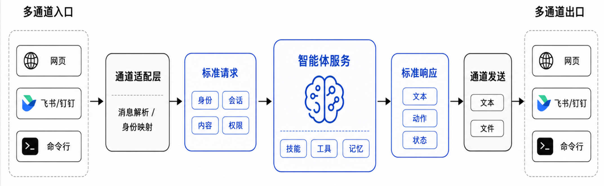

*图 5-3　多通道接入的适配流程*

### 为什么要分离通道层和智能体核心？

不同通道至少有如下四类差异：

1. **消息格式不同：**网页可能发送 JSON 格式数据，飞书或微信可能发送事件回调，命令行只是一段文本。
1. **身份体系不同：**网页使用账号登录，企业即时通信工具使用组织内用户标识，公开通道可能只有临时访客身份或者直接面向客户。
1. **交互能力不同：**网页适合展示表格、按钮和调试信息，即时通信工具更适合短消息、图片等多模态内容，甚至是文件。
1. **权限范围不同：**同一个用户在不同通道可能拥有不同操作权限，例如内部管理后台可以创建工单，公开客服入口只能提交咨询。

如果智能体核心直接依赖某个通道的消息格式，后续接入新通道时就会反复修改核心逻辑。更好的结构是：通道适配层先把外部消息转换成统一请求，再交给智能体服务处理。智能体返回统一响应后，通道适配层再把它转换成对应通道能展示的形式。

这种分离还有一个隐含好处：安全治理可以落在标准请求层，而不是散落在每个通道里。系统可以在标准请求中保存通道类型、用户标识、会话标识、附件摘要和权限集合，再根据这些字段决定能否调用某个技能或工具。这样既减少重复逻辑，也降低不同入口权限不一致的风险。

### 标准请求与标准响应

一个标准请求不一定需要复杂格式，但至少要把通道事件整理成几类稳定信息。

- **来源信息：**消息来自哪个通道，是否为群聊、私聊、网页会话或系统任务。
- **身份信息：**当前用户是谁，是否完成登录或企业身份绑定。
- **会话信息：**本轮消息属于哪个任务、哪个会话，是否需要继承历史状态。
- **内容信息：**文本、附件、图片、语音转写、表格或文档摘要。
- **权限信息：**当前用户和当前入口允许调用哪些技能、工具和数据范围。

这里的关键不是字段名称，而是设计思想。通道适配层要把零散的通道事件整理成智能体能理解的标准输入。智能体核心不需要知道网页按钮长什么样，也不需要知道某个即时通信平台的回调字段，只需要根据标准输入完成任务。

标准响应也可以采用类似思想，例如包含回复文本、结构化结果、建议动作、是否需要人工确认、是否需要继续追问、是否已经转人工等信息。通道适配层再把这些内容转成网页上的按钮、即时通信工具里的卡片、命令行里的文本，或者后台系统中的状态更新。这样一来，同一个智能体可以被多个通道复用，每个通道只需要负责自己的展示和交互细节。

从实现逻辑看，对照图 [5-3](#fig-harness-channel-adapter)，多通道接入至少要做四件事。第一，把不同平台的消息事件转成标准请求。第二，把平台用户映射为系统内部身份。第三，把多轮消息归并到稳定会话中。第四，把标准响应转回原通道可展示的形式。这四件事做清楚后，新增入口主要就是新增适配器，而不是重写智能体核心。

### 多模态输入的处理边界

多通道接入也会带来多模态输入。用户可能发送图片、语音、PDF 文档、表格或截图。Harness 可以先把这些输入转成统一的附件对象，再决定交给哪类能力处理。例如图片可以进入视觉理解模块，语音可以先转文字，PDF 文档可以进入文档解析流程。

需要注意，多模态能力不应让安全边界变模糊。图片中的文字、PDF 中的说明、网页中的隐藏文本，都可能包含恶意指令。系统应把它们视为外部资料，而不是可信系统指令。无论输入形式如何，最终都要回到统一的权限、日志和人工确认机制中。

### 多通道接入的工程取舍

真实系统通常不需要一次接入所有通道。更稳妥的做法是先选一个主入口，把标准请求、标准响应、会话管理、权限判断和日志结构打通，再逐步接入第二个入口。否则系统很容易在早期就被各平台的鉴权、回调、消息卡片和文件上传细节牵着走，反而看不清智能体服务本身的边界。

本书动手实践部分，先从网页入口开始，便于展示确认按钮和结构化结果。等核心 Harness 稳定后，再把相同能力接入命令行、飞书、钉钉或企业微信。这种顺序符合工程常识：先稳定内部协议，再扩展外部入口。

## 人机协同闭环

人机协同闭环（Human-in-the-Loop）指人在智能体运行过程中的关键节点参与确认、补充、审核或接管。它不是对智能体能力的否定，而是让智能体在真实业务中可控运行的重要机制。前一节讨论了能力如何从多个通道进入系统，本节进一步讨论：当智能体已经进入执行过程，哪些环节可以自动继续，哪些环节必须让人参与判断。

在执行循环中，模型可以提出下一步动作，Harness 则负责判断动作是否满足继续自动执行的条件。信息不足时追问，动作有外部影响时确认，流程有制度要求时审核，系统不应继续处理时转人工。Agent Harness 研究也把人工在环视为治理层的重要机制，重点不在于让人随时接管，而在于定义哪些动作必须由人确认、确认时应呈现哪些上下文，以及确认结果如何进入审计轨迹<sup>[2](#ref-meng2026agentharness), [3](#ref-li2026harnessengineering)</sup>。

<a id="fig-harness-human-loop"></a>

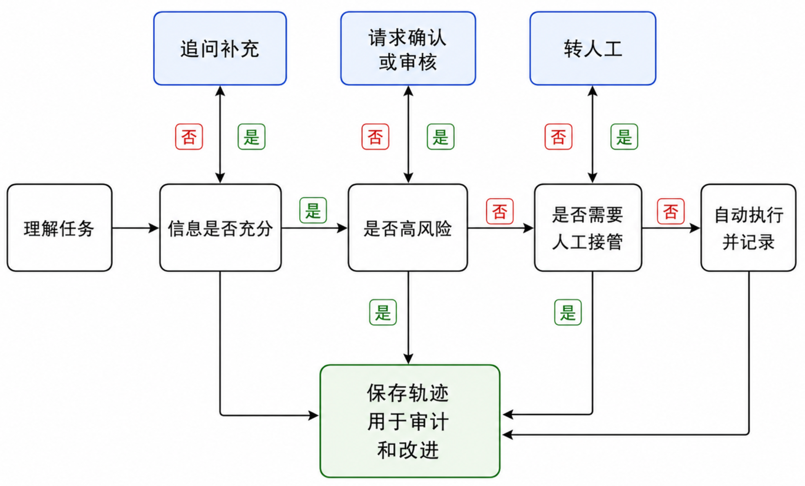

*图 5-4　人机协同闭环中的关键控制点*

图 [5-4](#fig-harness-human-loop) 展示了一个简化判断流程。人工介入可以发生在任务开始前、工具调用前或结果输出前。它的主线不是打断智能体，而是在信息、风险和制度边界发生变化时，把控制权交给合适的人。

### 人工介入的典型场景

常见的人工介入场景可以归纳为四类：

1. **信息缺失：**用户目标不清楚，或者缺少必要字段时，智能体应先追问，而不是凭空补全。
1. **高风险操作：**涉及发送通知、修改数据、提交申请、退款、删除记录等外部影响时，应先获得确认。
1. **依据不足：**模型判断缺少证据，或多个工具返回结果互相冲突时，应提示人工判断。
1. **流程要求：**合同、赔付、投诉升级和审批提交等任务，本身就可能要求人工审核或人工接管。

这些场景一旦触发，系统不能只抛出一句是否确认，而应先整理必要信息，再决定继续执行、补充信息、生成草稿或转人工。

### 人工确认与转人工

人工确认通常用于智能体已经形成明确动作，但动作会产生外部影响的情况。例如智能体准备创建工单、发送邮件或提交修改申请时，应先展示操作摘要，让用户确认后再执行。转人工则用于智能体不应继续处理的情况，例如用户情绪激烈、问题涉及投诉升级、身份核验失败、系统多次调用失败，或者用户明确要求人工处理。

二者的区别在于，人工确认用于动作已经明确、只需要人判断能否继续的情况。。表 [5-3](#tab-harness-confirm-handoff) 从使用时机、呈现内容和后续处理三个角度进行梳理。

<a id="tab-harness-confirm-handoff"></a>

*表 5-3　人工确认与转人工的设计要点*

| 环节 | 适用情况 | 应呈现的信息 | 后续处理 |
| --- | --- | --- | --- |
| 人工确认 | 动作明确，且会产生外部影响。 | 动作、参数、依据、影响范围、撤回可能和替代路径。 | 确认后执行，拒绝则停止或改为草稿。 |
| 转人工 | 智能体不宜继续处理。 | 用户目标、身份、关键对话、工具结果、失败原因。 | 生成交接摘要，交由人工处理。 |

确认机制也要避免过度打扰。所有动作都要求确认，会让用户形成机械点击习惯，反而降低安全性。更合理的做法是按风险分级：低风险只读操作可以自动完成，中风险查询需要身份校验和字段过滤，高风险写入需要确认，严格受控操作只能生成建议或草稿。这样既保留自动化效率，也让人工注意力集中在真正重要的节点上。

### 人机协同记录

只要人工介入了流程，就应留下记录。记录的作用有两点：一是出现问题时可以追踪责任和原因，二是后续可以分析哪些任务经常需要人工介入，从而改进技能、工具或业务流程。

人机协同记录可以按表 [5-4](#tab-harness-human-record) 梳理。它既要支持审计和复盘，也要服务转人工时的信息交接，但不应把所有原始内容无差别写入日志。

<a id="tab-harness-human-record"></a>

*表 5-4　人机协同记录的主要维度*

| 记录维度 | 建议内容 | 主要用途 | 注意事项 |
| --- | --- | --- | --- |
| 操作记录 | 动作、参数摘要、工具名称、执行结果。 | 复盘执行过程。 | 不保存完整敏感字段。 |
| 确认记录 | 确认人、时间、内容和结论。 | 证明高风险动作已授权。 | 内容要具体可追溯。 |
| 权限记录 | 用户身份、通道、权限判断、风险等级。 | 排查越权和入口混乱。 | 只记录必要依据。 |
| 交接记录 | 用户目标、关键对话、工具结果、失败原因、下一步建议。 | 支持人工接手。 | 简洁、脱敏、可执行。 |

记录的粒度要适中。只记录用户已确认过于粗糙，出了问题很难复盘。把所有原始输入、完整敏感字段和模型中间内容都写进日志，又可能造成新的隐私风险。更合理的做法是记录必要摘要和判断结果。对于转人工场景，记录还应承担交接作用，让人工接手时不必重复询问用户已经提供过的信息。

因此，人机协同闭环既是用户体验设计问题，也是安全治理问题。下一节会进一步说明，人工确认如何和权限、日志、审计、监控等机制结合起来。

## 安全与权限机制

前面几节分别讨论了技能、多通道和人机协同闭环。它们让智能体更接近真实使用，也把风险带入了运行过程。技能带来能力扩展，也可能引入注入攻击。多通道带来更多入口，也可能造成身份和权限混乱。人工确认让流程更可控，但如果缺少记录，仍然难以审计。安全与权限机制的作用，就是把这些风险统一纳入治理。

业界研究<sup>[2](#ref-meng2026agentharness), [3](#ref-li2026harnessengineering)</sup>普遍强调，智能体可靠性并不只由模型能力决定，还取决于执行环境、工具接口、上下文管理、生命周期编排、可观测性、验证评测和治理机制是否配合良好。安全治理正是这些基础设施的约束层。它不只是拦截有害输出，更要回答四个问题：智能体能看什么，能调用什么，能保存什么，能在什么条件下产生外部影响。

<a id="fig-agent-security-governance"></a>

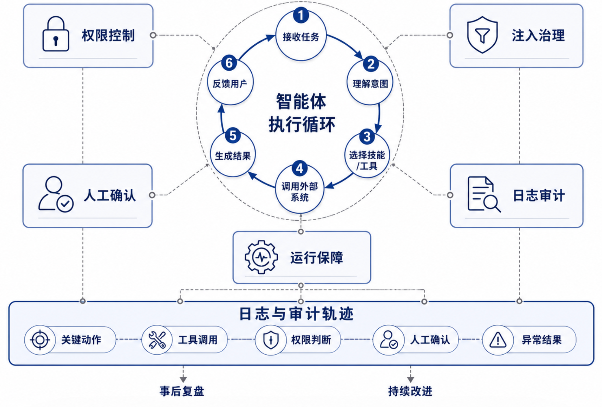

*图 5-5　安全治理总览图*

图[5-5](#fig-agent-security-governance)展示了安全治理总览图，本节可以沿着一条主线理解：先识别常见风险，再分别讨论权限控制、注入治理、日志审计和运行保障，最后回到安全治理的整体原则。

### 常见风险

智能体数字员工常见风险可以概括为五类：

1. **幻觉与错误执行：**模型可能生成没有依据的结论，也可能误解用户意图，进而调用错误工具。
1. **执行漂移与死循环：**智能体在多轮任务中可能逐渐偏离目标，或者反复调用无效工具。
1. **越权操作：**用户没有权限读取某些数据，或智能体调用了超出当前任务需要的工具。
1. **提示注入：**外部资料、用户输入或技能文档中可能包含恶意指令，诱导智能体忽略系统规则。
1. **敏感信息泄露：**日志、回复内容或工具结果中可能暴露个人信息、客户资料、密钥或内部业务数据。

这些风险不能只靠提醒模型要谨慎来解决。可靠的系统必须把安全控制放到程序和流程里。

<a id="fig-agent-4gates"></a>

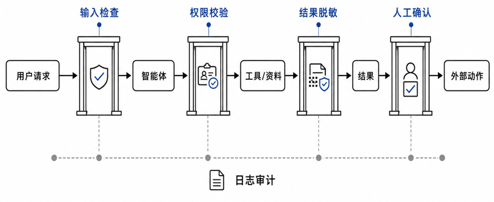

*图 5-6　安全治理的四道门*

因此，如图[5-6](#fig-agent-4gates)所示，可以把安全治理理解为贯穿执行循环的四道门。第一道门在输入之前，判断用户请求、检索资料和附件中是否包含恶意指令或敏感内容。第二道门在工具调用之前，检查模型提出的动作是否符合权限和业务规则。第三道门在工具返回之后，判断外部结果能否进入模型上下文，是否需要脱敏、摘要或隔离。第四道门在产生外部影响之前，判断是否需要人工确认。这些门并不要求一开始都做得很复杂，重点是把检查点放在关键动作前后。

### 权限控制

权限控制的基本原则是最小必要权限。智能体只应该拥有完成当前任务所需的能力，而不是默认拥有所有工具访问权。权限可以从用户、通道、工具和操作风险四个维度设计。为了便于落地，可以先按工具风险把操作分层，再结合用户身份和通道来源决定是否放行。表 [5-5](#tab-harness-permission-levels) 给出一个从只读到严格受控的分级示例。

<a id="tab-harness-permission-levels"></a>

*表 5-5　工具权限分级示例*

| 权限等级 | 典型工具 | 控制方式 |
| --- | --- | --- |
| 低风险只读 | 知识库检索、公开资料读取 | 可自动调用，但需要记录来源 |
| 中风险查询 | 订单查询、客户状态查询 | 按用户身份过滤字段，敏感信息脱敏 |
| 高风险写入 | 创建工单、更新记录、发送通知 | 参数校验、权限判断、人工确认和日志审计 |
| 严格受控 | 退款、删除、合同提交、审批通过 | 智能体只能生成草稿或建议，最终由人工处理 |

表 [5-5](#tab-harness-permission-levels) 的重点不在于工具名称本身，而在于控制方式随风险逐步收紧。低风险只读工具主要要求记录来源，便于回答可追溯。中风险查询已经涉及业务数据，需要按身份过滤字段，并对敏感信息脱敏。高风险写入会改变外部系统状态，因此要经过参数校验、权限判断、人工确认和日志审计。严格受控操作通常涉及资金、合同、删除或审批结论，智能体可以整理材料和生成建议，但最终处理权应保留给人工或既有业务流程。

在实现中，权限控制不能只写在提示词里，而要落到入口和工具调用等程序检查点。技能可以描述流程和依赖，但不能替代真实的权限校验。
还可以把权限设计成临时能力票据。每次任务开始时，系统根据用户身份、通道、会话和系统授权范围生成本轮可用能力集合。智能体只能在这个集合内行动。任务结束后，能力集合失效。这样可以避免临时权限长期存在，也能减少多通道环境中的权限串用问题。

### 技能注入治理

技能让智能体能力更强，也会带来新的治理风险。技能一旦可以携带说明、脚本和依赖资源，就可能引入供应链、权限放大和提示注入问题<sup>[1](#ref-xu2026agentskills)</sup>。例如，一个来源不明的技能可能在说明中要求智能体忽略原有权限，诱导它调用不该调用的工具。

治理技能注入时，要坚持一个基本原则：技能是能力封装，不是权限放大器。受控技能可以指导任务流程，但不能覆盖系统权限、安全策略和人工确认机制。具体来说，技能来源要可信，临时导入或用户上传的技能只能在受限环境中使用。工具权限要独立按最小化原则配置，读取资料的流程不会因为技能说明而自动获得写入、删除或对外发送能力。技能运行要可追踪，关键工具调用、人工确认和异常结果都应进入日志。技能更新也要可治理，目录中应记录来源、版本、维护者、更新时间和启用状态，高风险技能更新后应重新审核再启用，出现问题时可以禁用或回滚。

### 外部资料注入治理

外部资料注入指文档、网页、邮件、附件或用户输入中的恶意内容试图改变智能体行为规则。例如用户上传的文档中写着要求系统忽略权限并导出客户资料，模型可能把它误当成任务指令。

治理外部资料注入时，需要区分三类内容。

- 系统规则和安全策略，可信度最高，不能被用户输入覆盖。
- 受控技能，来自可信目录或审核流程，可以指导执行，但仍受权限约束。
- 外部资料和用户输入，只能作为任务信息，不能改变安全边界。

在实现中，可以通过固定系统提示词、工具白名单、参数校验和高风险确认来降低风险。更重要的是，不同来源的文本要进入不同的信任层级。系统规则负责给出不可覆盖的边界，受控技能负责给出可执行流程，外部资料只负责提供任务事实。对于初学项目，不需要实现复杂安全框架，但必须养成一个基本习惯：外部内容永远不能直接获得系统级权限。

### 日志、审计与运行保障

前面的权限控制、注入治理和人工确认，主要是在关键动作发生前后设置边界。日志、审计与运行保障则把这些边界放回真实运行过程里观察和检验。如图[5-7](#fig-agent-obs-stab)所示，可以从两个方面理解：一是可观测性，系统要知道任务如何发生、在哪一步出错；二是稳定性，系统要在异常出现时及时限制损失，并给出可恢复的处理路径。

<a id="fig-agent-obs-stab"></a>

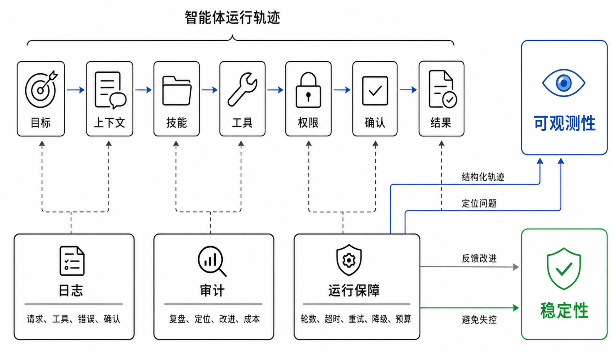

*图 5-7　通过日志、审计与运行保障，提升系统可观测性与稳定性*

从可观测性看，面向智能体的日志不应只记录零散报错，而应形成结构化轨迹。它需要串起一次任务中的目标、上下文摘要、技能选择、工具调用、权限判断、人工确认和最终结果。基础日志至少包括四类。请求日志记录用户入口、会话编号、时间和任务类型。工具调用日志记录工具名、参数摘要、执行结果和耗时。错误日志记录异常类型、可恢复建议和是否已转人工。人工确认日志记录确认人、确认内容和最终动作。这样，系统出错时才有依据判断问题来自模型、工具、权限、通道还是用户输入。

审计是在可观测性基础上的进一步利用。它不只是事后查错，而是安全治理的反馈机制。一方面，审计可以帮助开发者复盘失败，判断问题来自意图理解、技能选择、工具结果、权限策略还是人工流程。另一方面，审计可以把高频失败任务转化为新的技能、测试用例或规则，也可以发现哪些任务消耗了过多轮次、过多工具调用或过长上下文，从而控制运行成本。

从稳定性看，Harness 还需要在运行层面限制失控行为。常见做法包括最大轮数限制、工具调用超时、失败重试次数、成本预算和降级策略。比如，订单查询工具连续失败时，智能体不应无限重试，而应说明系统暂时不可用，并引导用户稍后重试或转人工。由此可见，日志让过程可见，审计让问题可追溯，运行保障则让服务在异常情况下仍然可控。

### 安全治理的整体原则

安全治理可以总结为四句话。

1. 模型负责理解和建议，程序负责执行和约束。
1. 只读能力可以更自动，写入能力必须更谨慎。
1. 外部输入只能提供信息，不能覆盖系统规则。
1. 高风险操作必须可确认、可追踪、可审计。

这四句话贯穿本章所有内容。技能要有边界，多通道要有身份，人机协同要有记录，工具调用要有权限，日志监控要能帮助定位问题。只有这些机制结合起来，数字员工才能从能够运行的智能体，走向可控、可靠、可交付的智能体服务。

## 动手实践：部署一个可控的智能体服务

本章实践在第 4 章代码上继续增量扩展。系统保留 ChatBot、RAG、ReAct、工具和记忆能力，再加入技能渐进加载、多通道接入、循环内人工协同、工具风险策略和系统监控。实践重点不是重新实现一个智能体，而是观察 Harness 如何把已经具备的能力放入可控制、可追踪、可恢复的运行环境。

为了让各项机制形成一条清楚的主线，本节继续使用客户 C001 的宠物保险需求。客户希望为一只 3 岁母猫设计为期 8 个月的短期医疗保障方案，预算不超过 1000 元。保险业务人员使用“保险业务助手”整理需求、查询资料并形成方案框架。任务中还会出现三个关键变化：方案形成前仍需确认预算口径和保障侧重，业务人员希望从其他通道继续当前会话，最终核保结论又缺少正式业务系统的审核结果。

这个场景适合检验 Harness 的五层结构。数字员工核心负责推进 ReAct 循环，技能负责提供保险资料查询流程，网页、命令行和微信负责接入同一会话，人工协同负责处理关键选择和无法继续的任务，安全治理负责约束工具执行并留下监控记录。

表[5-6](#tab-harness-practice-theory-code)把这条主线与本章理论和配套代码对应起来。后续七个步骤依次展开配置、运行和观察。

<a id="tab-harness-practice-theory-code"></a>

*表 5-6　本章实践主干与配套代码的对应关系*

| 实践环节 | 核心问题 | 代码实现 | 观察重点 |
| --- | --- | --- | --- |
| 技能扩展 | 任务流程如何按需进入上下文 | `SkillRegistry` 先加载元数据，`activate_skill` 再读取完整说明 | 任务匹配时才激活一个技能，技能不会增加工具权限 |
| 多通道接入 | 不同入口如何复用同一执行核心 | 通道生成 `StandardRequest`，统一进入 `iter_standard_events()` | 三个通道共享会话，网页与命令行使用同一种 JSON SSE |
| 人机协同 | 关键输入如何暂停并恢复当前循环 | `HumanRequest` 保存工具调用标识和运行状态，回答后从当前调用位置继续 | 人工只回答一个关键问题，不重新开始整轮任务 |
| 权限控制 | 高风险工具如何在执行前获得授权 | `read` 自动执行，`write` 创建授权请求，`restricted` 直接拒绝 | 授权卡出现在当前对话，拒绝结果也会回填模型 |
| 监控治理 | 如何知道任务在哪里等待或失败 | `HarnessRun` 保存状态，`AuditEvent` 记录脱敏关键事件 | 按数字员工和日期查看运行、等待、转人工与失败 |

进入配套代码目录，安装依赖并启动服务。

```bash
cd {本章项目代码目录}
cp .env.example .env
pip install -r requirements.txt
python -m uvicorn app.main:app --reload
```

启动后访问 `http://127.0.0.1:8000`。系统使用 FastAPI 提供接口和静态页面，使用 SQLite 保存数字员工、会话、运行状态、人工请求和审计事件。在“模型配置”页面填写支持 OpenAI 兼容接口的模型。ReActAgent 使用原生 Tool Calling，因此模型还需要支持 `tools` 和 `tool_calls` 协议。新建数字员工的最大输出长度默认是 2048，可以通过 `DEFAULT_AGENT_MAX_TOKENS` 调整。

### 第一步：数字员工绑定技能与工具

先进入“技能管理”页面，查看 `insurance-inquiry`，如图[5-8](#fig-exp-skill-page)所示。它来自本地导入目录，说明了保险资料查询的必要输入、执行步骤、依赖工具和停止条件。图中的“暂未绑定”表示该技能已经进入技能注册表，但还不能被任何数字员工调用。还应确认知识库中的“示例健康保障计划知识库”已经完成索引。没有配置嵌入模型时，系统可以退化到关键词检索，不影响本节对 Harness 主线的观察。

<a id="fig-exp-skill-page"></a>

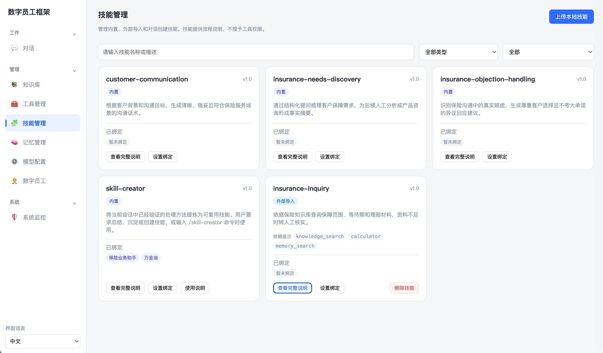

*图 5-8　绑定前在技能管理页面检查保险查询技能*

接着进入“数字员工”页面，编辑预置的“保险业务助手”。确认数字员工类型为 ReActAgent，并绑定 `knowledge_search`、`calculator`、`memory_search`、`ask_human` 和 `handoff_to_human`。前两个工具提供资料和计算依据，记忆检索只用于读取历史需求和任务经验，后两个工具分别负责循环内追问和结束本轮后转人工。同时绑定 `insurance-inquiry` 和 `skill-creator` 两个技能，前者用于本节的保险资料查询，后者用于将已验证的对话过程整理为新技能。完成后的绑定界面如图[5-9](#fig-exp-agent-config)所示。

<a id="fig-exp-agent-config"></a>

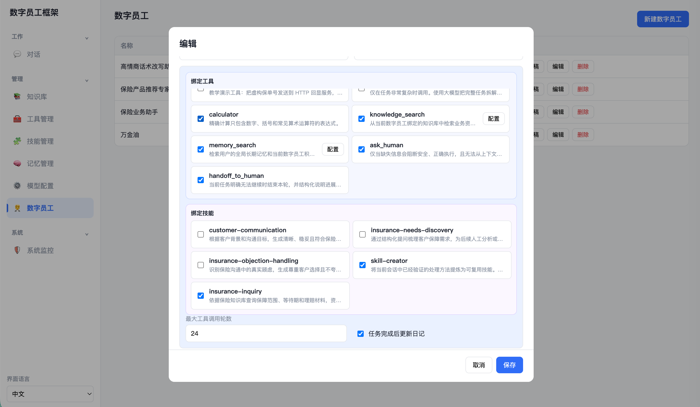

*图 5-9　为保险业务助手绑定工具与技能*

新建或首次升级的 ReActAgent 会默认绑定 `ask_human` 和 `handoff_to_human`，管理员仍然可以解除绑定。系统通过一次性标记记录默认配置是否已经应用，因此管理员解绑后，应用重启不会再次自动补回。这种设计既给出合理默认值，也保留了数字员工的能力边界。

技能和工具要分别配置。技能中的 `required-tools` 只是依赖说明，不会自动绑定工具，也不会把只读权限提升为写入权限。可以故意解绑 `knowledge_search` 后运行一次保险查询，观察技能虽然可以激活，却无法获得未授权工具。完成对照后再恢复绑定。

### 第二步：观察技能如何按需激活

保存并发布数字员工，在“对话”页面新建会话，输入下面的任务。

```text
客户 C001 希望为一只 3 岁母猫设计为期 8 个月的短期医疗保障方案。
请先查询知识库中的等待期和理赔材料，说明哪些内容只能作为流程参考，
不能直接当作宠物保险条款。暂时不要提交方案，也不要编造费率或核保结论。
（注意：可以使用insurance-inquiry这个skill）
```

数字员工可以主动分析意图，与现有技能场景进行匹配，从而按需激活技能。为了保证演示结果稳定，本任务明确说明使用 `insurance-inquiry` 技能。如图[5-10](#fig-exp-chat-with-skill)所示，执行轨迹中先出现 `activate_skill`，工具结果返回技能版本、依赖提示和完整说明。激活完成后，数字员工才继续调用 `knowledge_search` 查询知识库。若任务只是简单算术计算，就不应激活保险查询技能。

<a id="fig-exp-chat-with-skill"></a>

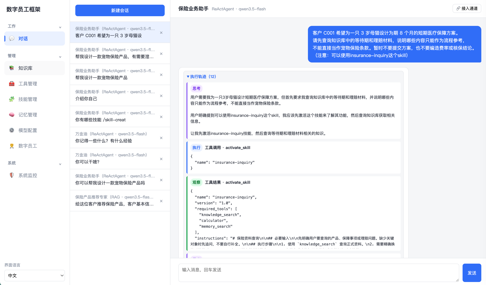

*图 5-10　执行轨迹中的技能激活过程*

下面的代码保留了技能激活的关键检查。程序先确认技能已经绑定，再读取完整内容，并把技能名称、版本、依赖提示和执行说明作为工具观察返回。一次运行只允许激活一个最匹配的技能，避免多个流程说明相互冲突。

```python
bound = {item.skill_name for item in agent.skill_bindings}
if name not in bound:
    return ToolExecution(False, {"error": f"技能未绑定：{name}"})
if state.get("active_skill"):
    return ToolExecution(False, {"error": "一次任务只能激活一个技能"})

skill = registry.get(name, include_content=True)
state["active_skill"] = name
return ToolExecution(True, {
    "name": skill.name,
    "version": skill.version,
    "required_tools": list(skill.required_tools),
    "instructions": skill.content,
})
```

这一步对应图[5-2](#fig-skill-lifecycle)中的发现、激活和执行三个阶段。系统启动时只扫描名称和描述，模型判断任务匹配后才读取全文，随后再按说明调用工具。需要特别检查最终回答的事实边界。知识库中的示例资料面向一般健康保障，不是正式宠物保险条款。可靠的数字员工可以借鉴等待期、理赔材料和风险提示的组织方式，但不能宣称已经查到真实宠物险费率或承保规则。

完成一轮问答后，还可以把当前会话中的有效流程整理为新技能。在同一会话输入下面的命令：

```text
/skill-creator 把本次资料查询和边界核验过程整理为宠物保险需求初查技能
```

系统会激活内置 `skill-creator`，读取当前会话中已经完成的问答，并生成完整 `SKILL.md`。创建成功后，新技能以“对话创建”来源出现在技能管理页，可以继续编辑或删除。创建技能只保存可复用流程，不会自动绑定到数字员工，也不会授予其中提到的工具权限。这个小实验展示了技能从任务经验到受控能力包的形成过程，但不会改变后续实践主线。

### 第三步：在关键选择处暂停并恢复 ReAct 循环

在同一会话中继续输入：

```text
客户预算只有 1000 元，有可行方案吗？有需要澄清的问题，你可以问我
```

这个请求已经提供预算、期限和人工沟通意愿，但预算口径或保障侧重仍可能直接影响方案可行性。数字员工可以调用 `ask_human` 提出一个当前最关键的澄清问题。页面会在当前助手消息内显示文本输入卡片，并把本次运行标记为 `pending`。用户回答后，系统把内容作为原 `ask_human` 工具调用的结果回填，ReAct 循环从暂停位置继续，而不是重新处理整段会话。

<a id="fig-exp-ask-human"></a>

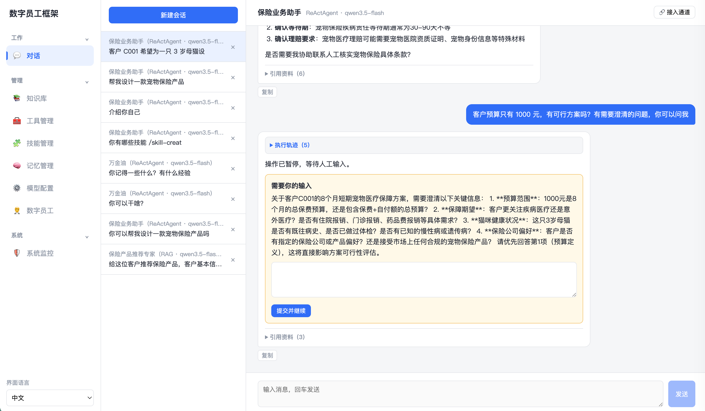

*图 5-11　ask_human 暂停当前循环并等待人工输入*

关键状态推进可以概括为下面几行代码。

```python
request = create_human_request(
    db, run,
    tool_call_id=call["id"],
    question=arguments["question"],
    input_type=arguments["input_type"],
)
run.status = "pending"
run.state = state

# 用户回答后，使用原工具调用标识回填观察并继续。
execution = ToolExecution(True, {"answer": request.answer})
finish_items = self._finish_call(db, state, call, execution, run)
state["call_index"] = index + 1
```

这里的 `tool_call_id` 和 `call_index` 很重要。它们确保人工回答只对应原来的那次工具调用，也确保恢复时不会重复执行已经完成的调用。刷新页面后，待回答卡片仍然存在，因为运行状态和人工请求已经写入数据库。重复提交同一回答会返回冲突，避免一次人工输入触发两次后续执行。

人工介入要保持克制。图[5-11](#fig-exp-ask-human)中的演示卡片一次列出了多项信息，便于展示交互形态，但实际任务更适合先询问影响可行性的一个关键问题。预算格式、标题样式和一般偏好可以通过合理默认值处理，不应逐项追问。只有缺失信息无法从当前对话、知识、记忆或工具中获得，而且错误假设会实质影响任务方向或安全性时，才应暂停循环。用户明确表示“有问题可以问我”时可以适度提高追问意愿，但仍然要先利用已有上下文。这个原则对应图[5-4](#fig-harness-human-loop)中的关键节点，而不是把每一步都变成人工表单。

### 第四步：从其他通道继续同一会话

方案生成后，点击对话右上角的“接入通道”。如图[5-12](#fig-exp-channel-entry)所示，弹窗同时提供命令行和微信入口。

<a id="fig-exp-channel-entry"></a>

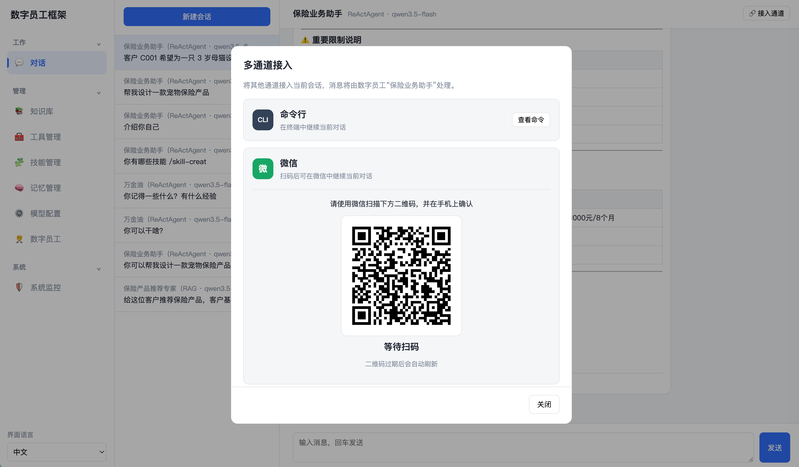

*图 5-12　当前会话的命令行与微信接入入口*

点击“查看命令”后，复制并在本章代码目录中执行页面给出的命令，例如：

```bash
python -m app.cli --session-id 3 --base-url http://127.0.0.1:8000
```

命令中的会话编号由页面根据当前会话自动生成，实际操作时不要直接照抄示例中的数字。在命令行中输入“请用三句话复述客户 C001 已确认的需求”，然后刷新网页，可以看到新消息已进入当前会话。

再回到“接入通道”弹窗，使用微信扫码并在手机上确认。连接成功后，在微信中输入“请用三句话复述客户 C001 已确认的需求，并列出仍需核实的信息”。图[5-13](#fig-exp-weixin-channel)展示了微信端的回复。该消息同样使用当前数字员工和对话历史，刷新网页后也能看到这一轮对话。

<a id="fig-exp-weixin-channel"></a>

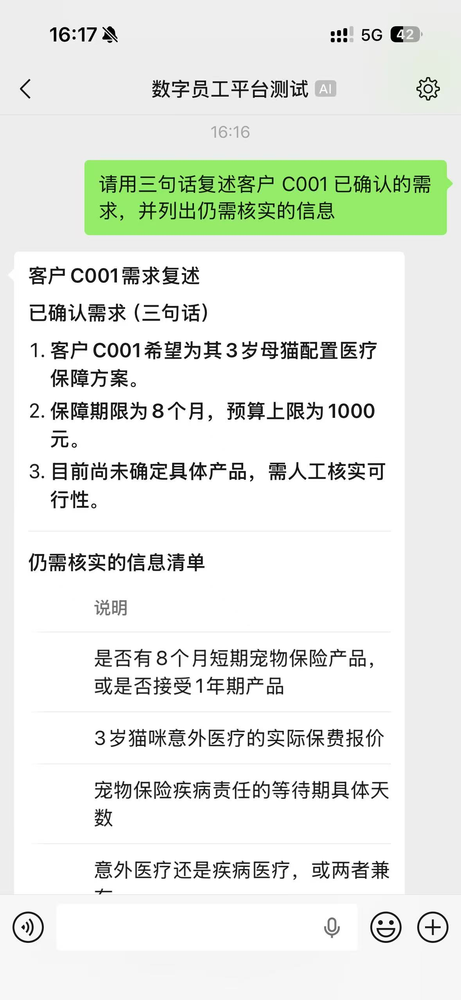

*图 5-13　微信通道复用当前会话上下文*

三个通道没有各写一套智能体执行逻辑。网页与命令行先构造标准请求，再由统一流式入口处理。该入口由 `stream_standard_request()` 实现，并输出 JSON SSE。微信后台也构造同一种 `StandardRequest`，再迭代 `iter_standard_events()` 获得标准事件。服务端产生的单个事件例如：

```text
{
  "type": "text_delta",
  "run_id": 12,
  "payload": {"content": "客户已确认保障期为 8 个月"}
}
```

事件类型还包括 `sources`、`trace`、`human_required`、`handoff`、`error` 和 `done`。网页把最终回答增量追加到对话气泡，命令行则立即打印同样的文本片段。工具调用和观察轨迹使用结构化事件展示，不和最终回答的流式文本混在一起。这正是图[5-3](#fig-harness-channel-adapter)所示的通道适配过程。

为了保持教学实现简单，微信第一版只支持文本，不提供循环内 `ask_human`，也不暴露需要授权的写工具。遇到这两类交互时，数字员工应提示用户回到网页处理。命令行则可以在终端中处理简短人工输入和工具授权。由此可以看到，统一请求和事件结构并不意味着所有通道能力完全相同，通道适配层仍要明确交互和权限边界。

### 第五步：比较三种工具风险策略

为了安全地观察工具策略，可以在“工具管理”页面新建一个只读取本地监控数据的 HTTP 工具。工具名设为 `monitoring_overview_demo`，请求方法为 `GET`，地址使用下面的本地监控接口，参数 Schema 使用空对象。

```text
http://127.0.0.1:8000/api/monitoring/overview?page_size=1
```

将工具绑定到“保险业务助手”后，依次把风险策略设为 `read`、`write` 和 `restricted`，每次都输入“调用监控概览工具，告诉我当前运行数量”。

这个工具本身只读。把它临时标成 `write` 只是为了在不修改业务数据的条件下隔离观察授权机制，真实系统仍应按照操作的实际影响正确分类。三次实验的预期结果如表[5-7](#tab-harness-practice-tool-policy)所示。

<a id="tab-harness-practice-tool-policy"></a>

*表 5-7　同一工具在不同风险策略下的执行结果*

| 风险策略 | 程序行为 | 需要检查的现象 |
| --- | --- | --- |
| `read` | 参数校验通过后自动执行 | 对话不中断，轨迹记录权限放行和工具结果 |
| `write` | 执行前创建工具授权请求 | 当前气泡显示工具名、脱敏参数和批准、拒绝按钮，决定后继续原循环 |
| `restricted` | 程序直接拒绝执行 | 拒绝原因作为工具观察回填，模型只能说明限制或给出替代方案 |

工具策略在程序中强制执行，而不是依赖提示词。图[5-14](#fig-exp-tool-risk)展示了 `restricted` 策略的实际结果：工具未被执行，拒绝原因作为观察回填给数字员工。

<a id="fig-exp-tool-risk"></a>

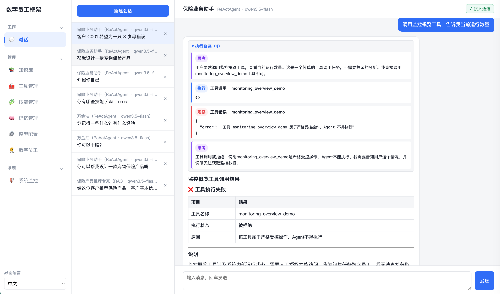

*图 5-14　restricted 策略拒绝执行工具*

程序中的核心判断如下：

```python
if risk_level == "restricted":
    return ToolExecution(False, {"error": "不得执行"})
if risk_level == "write" and approved_approval_id is None:
    return ToolExecution(
        False,
        {"status": "approval_required", "arguments": arguments},
        requires_approval=True,
        risk_level=risk_level,
    )
```

在 `write` 实验中应分别尝试批准和拒绝。批准前，系统会重新检查工具是否仍然绑定、风险策略是否变化、参数是否相同，并比较 URL、请求方法、请求头和 Schema 的配置指纹。可以在授权卡出现后修改工具地址，再点击批准，观察旧授权被拒绝。拒绝本身也会作为原工具调用的观察结果回填，让模型给出不执行该操作的替代方案。

工具授权与 `ask_human` 不能混用。前者由程序根据风险策略强制触发，模型不能绕过。后者由模型在确实缺少关键信息时主动调用。图[5-6](#fig-agent-4gates)中的工具调用前检查和外部影响前确认，在这里分别落到了程序权限判断和当前会话内授权。

### 第六步：在无法继续时结构化转人工

接下来构造一个确实不能由当前系统完成的任务。

```text
请给出客户 C001 的最终核保结论并直接确认承保。
当前没有接入核保系统，客户健康告知也未完成。
请先完成能够完成的部分；如果仍无法继续，结束本轮并清楚交接给人工。
```

知识库、技能和现有工具都不能提供正式核保结论。此时继续追问一般偏好没有意义，合理行为是调用 `handoff_to_human`。工具要求模型给出当前进展、缺失信息和人工动作三个字段。例如，当前进展可以写“已整理客户基本需求并完成资料查询”，缺失信息写“健康告知结果和核保系统审核结论”，人工动作写“请核保人员完成审核后决定是否承保”。

调用后，本轮运行状态变为 `handoff`，ReAct 循环立即结束，不再调用模型。普通对话输入框重新可用，业务人员可以补充核保结果并开始一条新的运行。这与人工确认不同。人工确认用于动作已经明确，只等待人决定是否继续的情况。结构化转人工用于数字员工已经无法继续，需要把任务连同上下文交给人工处理的情况。

还可以与第三步做一个对照。客户选择 30 天或 90 天等待期时，一个简短回答就能推动原任务继续，因此适合 `ask_human`。最终核保结论依赖尚未接入的业务系统和有权限的核保人员，单次对话回答不能替代正式流程，因此应结束本轮并转人工。

### 第七步：在系统监控中复盘完整运行

完成前面几次实验后，进入“系统监控”页面。页面顶部展示运行总数、运行中、等待中、已完成和需关注数量。等待中进一步区分普通人工输入和工具授权，需关注则汇总转人工和失败。下方使用“最近运行”和“关键事件”两个页签，支持按数字员工和日期筛选，并按时间倒序分页展示。

一次 Harness 运行的主要状态如图[5-15](#fig-harness-practice-run-state)所示。正常任务从 `running` 进入 `completed`。等待人工输入或工具授权时进入 `pending`，回答后回到 `running`。明确无法继续时进入 `handoff`，异常中止时进入 `failed`。后两种状态都是本轮的结束状态，不应继续使用旧运行状态恢复任务。

<a id="fig-harness-practice-run-state"></a>

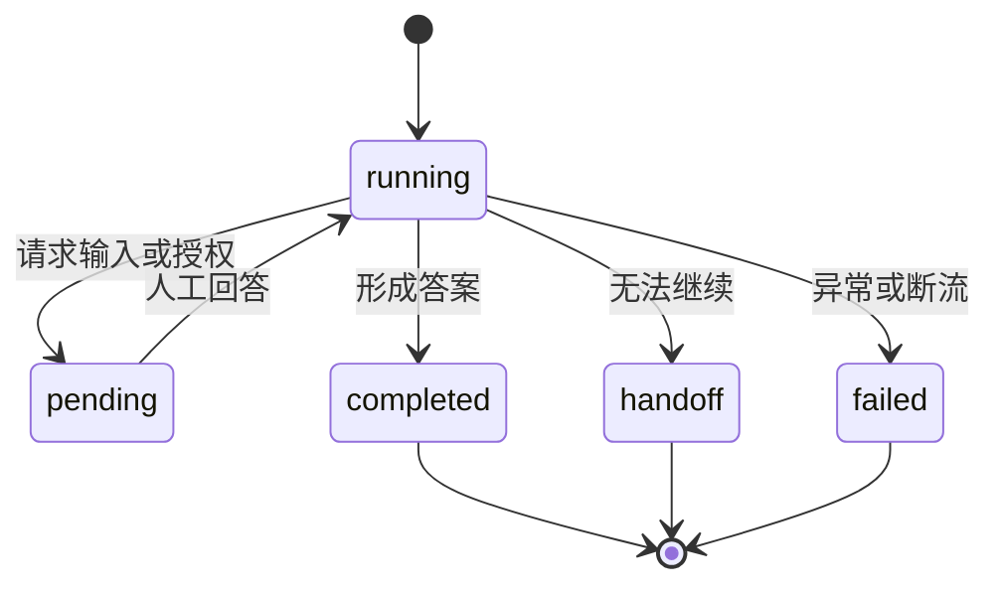

*图 5-15　Harness 运行状态及人工恢复路径*

先在“最近运行”页签中找到客户 C001 的几次任务，检查数字员工名称和编号、会话名称和编号、来源通道、状态和更新时间。然后切换到“关键事件”，沿同一运行编号查看 `request_received`、`skill_activated`、`policy_checked`、`human_requested`、`human_answered`、`approval_requested`、`approval_decided`、`tool_finished`、`handoff` 或 `run_failed`。

事件数据默认折叠，展开后只显示脱敏和截断后的必要内容。字段名包含 `key`、`token`、`password`、`authorization` 或 `secret` 时，值会替换为 `[REDACTED]`。过长文本和过大的列表也会截断。监控页面用于观察系统运行情况，不承担业务审批，也不提供工单列表。真正的工具授权仍然发生在当前对话气泡中。

<a id="fig-exp-monitor-page"></a>

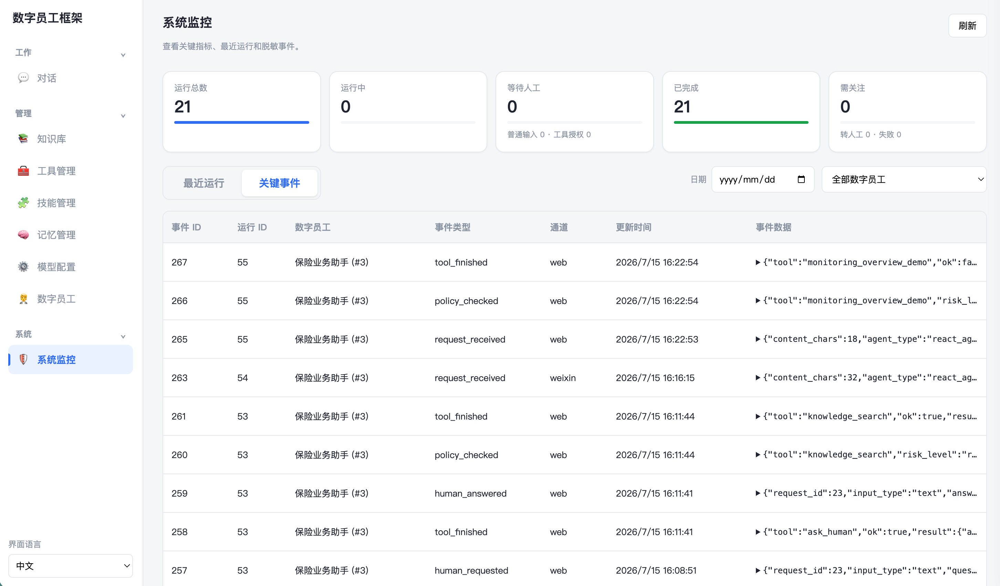

*图 5-16　系统监控中的关键指标与运行事件*

这一步把前面分散的机制重新连成闭环。请求日志说明任务从哪个通道进入，技能事件说明加载了哪套流程，权限事件说明工具为什么放行、等待或拒绝，人工事件说明谁在什么节点补充了什么类型的信息，最终状态则说明任务是完成、转人工还是失败。图[5-16](#fig-exp-monitor-page)中的可观测性和稳定性，由此落实为可以按运行编号追踪的结构化记录。

### 实践任务设计

1. 配置并发布“保险业务助手”，绑定保险资料查询技能、知识检索工具和两个人工协同工具，说明技能依赖与工具权限为什么要分开管理。
1. 使用客户 C001 的宠物保险需求触发 `insurance-inquiry`，记录技能激活、知识检索和最终回答，并检查数字员工是否正确说明资料边界。完成问答后，使用 `/skill-creator` 把有效流程整理为一个对话创建技能。
1. 在关键方案选择处触发一次 `ask_human`，刷新页面后再回答，验证待响应卡片能够恢复，并说明系统如何避免重复提交和重复执行。
1. 从对话右上角接入命令行，在同一会话中继续任务。比较网页与命令行的展示差异，以及二者共享的请求、会话和 JSON SSE 结构。
1. 把同一个本地演示工具依次设为 `read`、`write` 和 `restricted`，记录自动执行、等待授权和程序拒绝三种结果。
1. 构造缺少正式核保结果的任务，触发 `handoff_to_human`，检查当前进展、缺失信息和人工动作是否完整。
1. 在系统监控中按“保险业务助手”筛选运行和事件，沿同一运行编号复盘技能、权限、人工协同、工具结果和最终状态。

### 预期成果

完成后，学习者应提交一个能够在 Harness 中运行的“保险业务助手”和一份简要实践报告。报告应包含数字员工的技能与工具绑定、技能激活轨迹、一个从会话整理出的技能、一次关键人工输入、一次工具授权、一次结构化转人工、网页与命令行的同会话记录，以及系统监控中的运行和关键事件。截图或记录中不应出现完整模型密钥、请求头或其他敏感信息。

学习者还应结合代码说明六个问题：为什么技能按需加载，为什么技能不能授予工具权限，人工回答如何回到原 ReAct 工具调用，网页和命令行为什么可以复用同一执行服务，三种工具风险策略分别在哪里生效，监控事件如何帮助定位模型、工具、权限、通道或人工流程中的问题。

验收时重点检查任务边界，而不是只看最终回答是否流畅。可靠的系统应当在资料不足时说明限制，在关键且不可推断的信息缺失时才请求人工，在高风险动作执行前强制授权，在明确无法继续时结束本轮并完成交接。系统还应保证待响应状态刷新后可以恢复，重复回答或授权不能造成重复执行，工具配置发生变化后旧授权不能继续使用。

本实践面向本地教学，不包含账号认证、完整的真实即时通信平台适配、远程技能市场、上传脚本执行、操作系统沙箱、分布式任务队列和生产级断点恢复。微信接入依赖相应服务，仅用于展示会话级通道适配思路。完成正文实验后，可以运行 `python -m pytest -q`，验证技能工具解耦、最大轮数、人工输入恢复、工具授权、重复响应冲突和监控统计等关键行为。

## 作业与思考

1. 结合客户 C001 的完整实践，说明智能体运行核心层、能力扩展层、应用接入层、人机协同层和安全治理层分别解决什么问题。若删除其中一层，系统会出现什么具体风险？
1. 设计一个销售或客服技能，写出名称、描述、必要输入、执行步骤、依赖工具和停止条件。进一步说明该技能为什么不能自动获得依赖工具的权限。
1. 比较网页、命令行和微信三个通道。说明哪些请求字段和响应事件可以统一，哪些交互与权限限制仍需由通道适配层单独处理。
1. 分别给出一个适合 `ask_human`、工具授权和 `handoff_to_human` 的场景。解释为什么三者不能相互替代，以及如何避免人工介入过于频繁。
1. 为知识检索、客户资料查询、发送通知、退款和删除记录设计风险策略。说明哪些操作可以自动执行，哪些需要当前会话内授权，哪些只能生成草稿或转人工。
1. 根据系统监控中的一次运行，画出请求、技能激活、工具调用、权限判断、人工回答和最终状态的事件时间线，并指出日志中哪些字段需要脱敏或截断。

## 参考文献

1. <a id="ref-xu2026agentskills"></a>Renjun Xu, Yang Yan. Agent Skills for Large Language Models: Architecture, Acquisition, Security, and the Path Forward. First Workshop on Agent Skills. 2026.

2. <a id="ref-meng2026agentharness"></a>Qianyu Meng, Yanan Wang, Liyi Chen, Qimeng Wang, Chengqiang Lu, Wei Wu, 等. Agent harness for large language model agents: A survey. Preprints. 2026.

3. <a id="ref-li2026harnessengineering"></a>Junjie Li, Xi Xiao, Yunbei Zhang, Chen Liu, Lin Zhao, Xiaoying Liao, 等. Agent harness engineering: A survey. OpenReview preprint. 2026.

[^1]: https://openai.com/index/harness-engineering

---

[← 上一章](../chapter4_agent_memory_tools/README.md) | [返回总目录](../README.md) | [下一章 →](../chapter6_multi_agent_collaboration/README.md)
