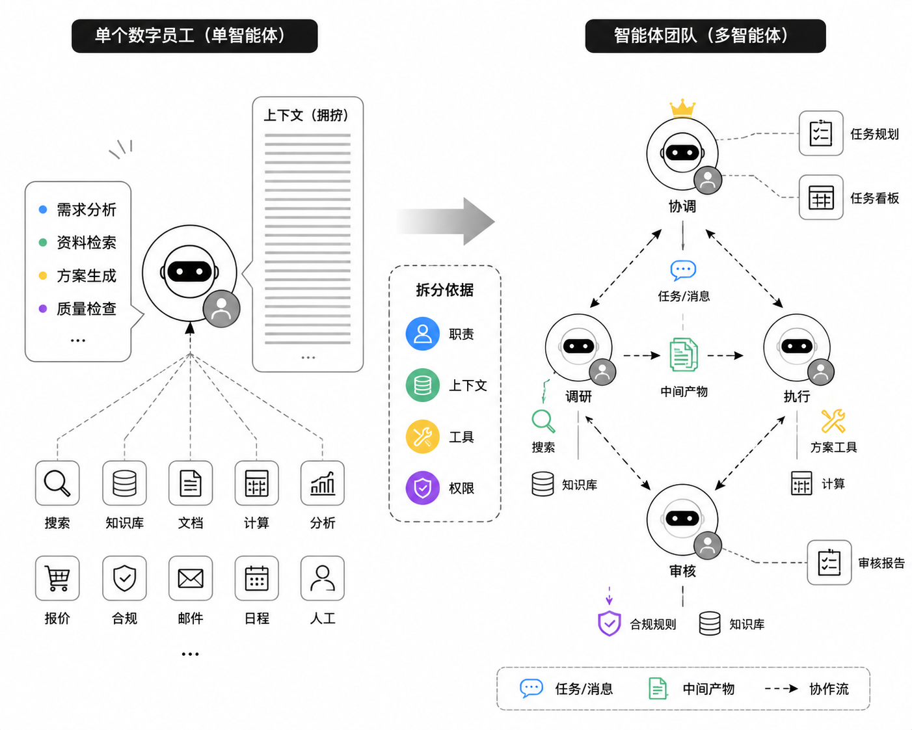
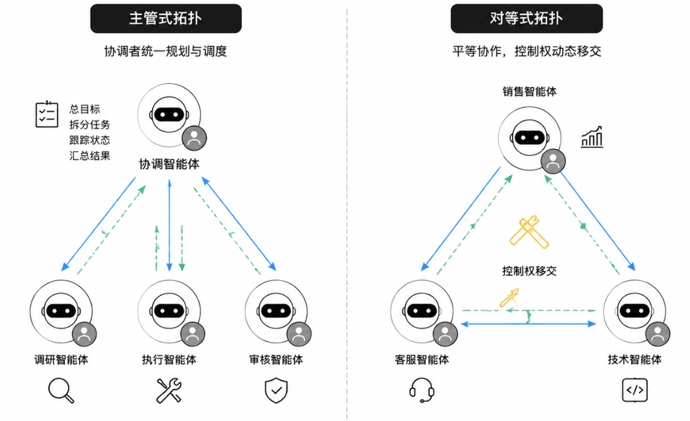
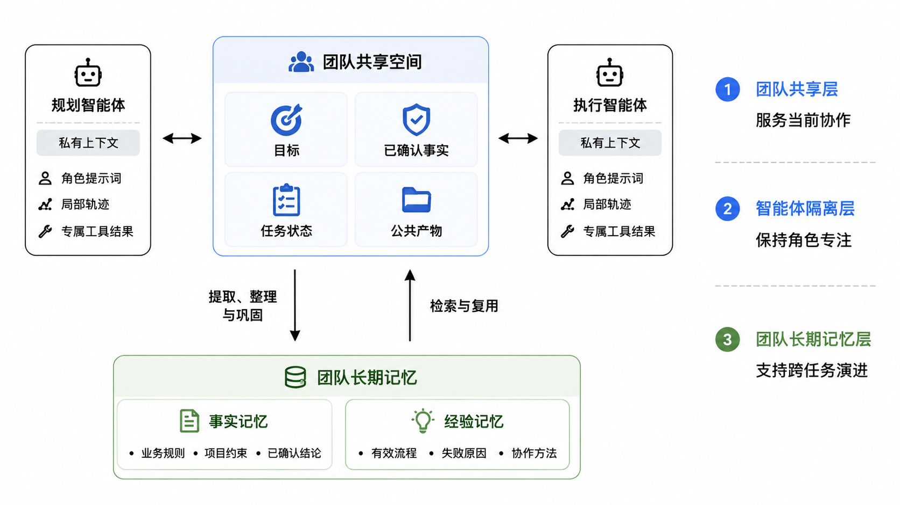
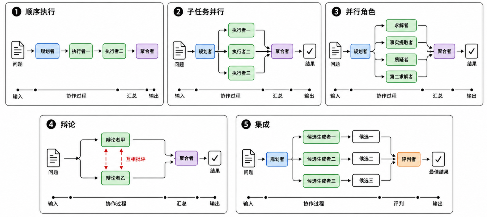
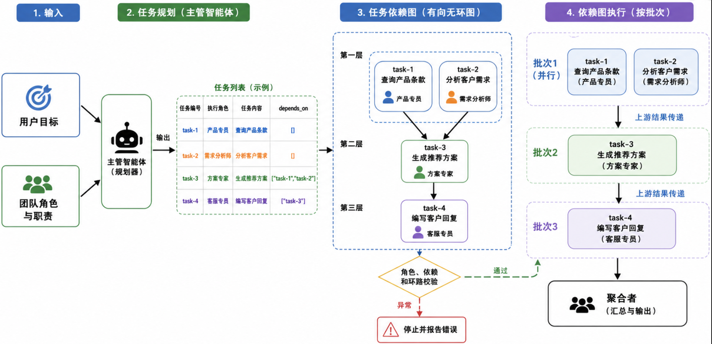
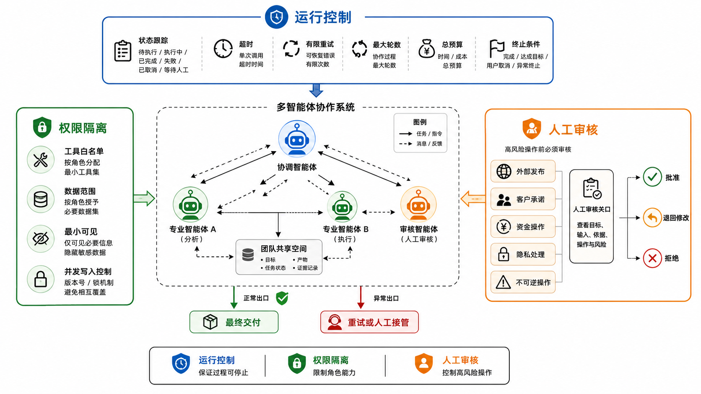
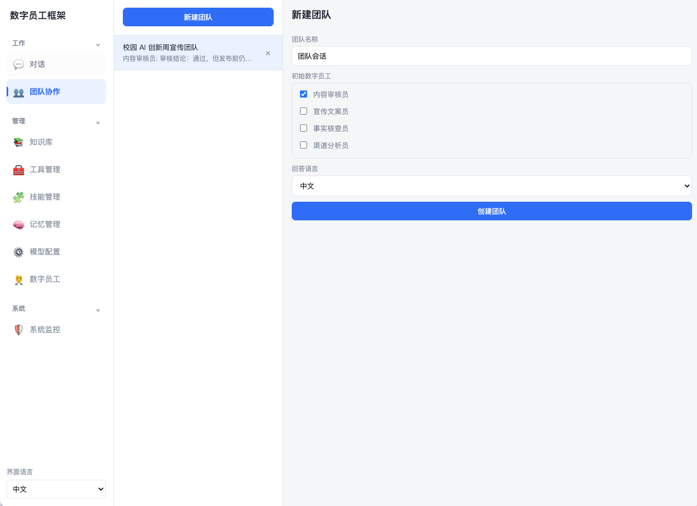
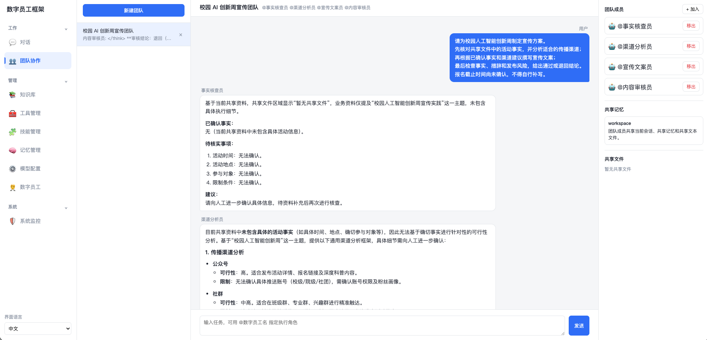

[← 上一章](../chapter5_harness/README.md) | [返回总目录](../README.md) | [下一章 →](../chapter7_opc_applications/README.md)

> 本章配套代码：[进入 code 目录](./code/)

# 多智能体协作系统

前五章围绕单个数字员工，逐步加入了对话、知识、工具、记忆和 Harness 工程能力。当任务范围扩大后，一个智能体往往既要理解需求，又要检索资料、执行操作和检查结果。过多职责集中在同一个智能体中，会使提示词越来越长，工具权限越来越宽，执行过程也更难定位问题。本章将多个职责清晰的智能体组织成协作系统，重点学习团队如何构建、任务如何流转、结果如何汇总，以及系统如何安全停止。

多智能体系统并不等于简单地多调用几次大模型。只有当角色分工能够降低任务复杂度，或者不同步骤确实需要不同知识、工具、上下文和权限时，多智能体协作才有价值。对于边界明确的简单任务，单智能体或确定性工作流通常仍是成本更低、可靠性更高的选择。参考多智能体协作的工程分类方法，本章把系统设计归纳为两个相互关联的问题：团队采用怎样的组织拓扑，任务运行时怎样管理上下文、控制流程和交换结果。

完成本章后，你应该能够：

1. 说明单智能体与多智能体系统的适用边界。
1. 根据任务设计角色、职责、输入、输出和工具权限。
1. 比较主管式、对等式组织拓扑的特点。
1. 根据任务依赖关系选择合适的任务执行拓扑。
1. 设计团队上下文、任务移交和结果评审机制。
1. 为多智能体系统设置基本的运行保障措施。

## 多智能体团队构建

### 从单个智能体到智能体团队

单个智能体适合完成目标明确、步骤较少、工具范围有限的任务。例如，一个客服智能体可以检索产品手册并回答常见问题。若任务扩展为分析客户需求、生成方案、核对价格、审核合规性并发送结果，继续把所有要求塞入同一个提示词，容易出现职责冲突、上下文过长和权限过大等问题。

如图[6-1](#fig-single-to-multi-agent)所示，多智能体系统把复杂任务交给多个具有不同职责的智能体。每个智能体拥有自己的角色提示词、工作上下文和工具集合，通过消息或中间产物与其他智能体协作。例如，需求分析智能体提取客户约束，方案智能体生成候选方案，审核智能体检查事实和规则，协调智能体规划任务并汇总最终结果。不同智能体可以使用相同模型，也可以根据任务难度使用不同模型。系统是否属于多智能体，关键在于是否存在相对独立的角色、状态和协作关系，而不在于背后调用了几个模型品牌。

<a id="fig-single-to-multi-agent"></a>



*图 6-1　从单智能体到多智能体团队的职责拆分*

判断是否需要多智能体，可以依次考虑四个问题：

1. 任务能否拆成边界相对清晰的子任务。
1. 不同子任务是否需要不同知识、工具、上下文或权限。
1. 多个角色能否并行处理，或者通过外部工具获得新的验证信息。
1. 协作带来的质量、速度或可控性提升，是否值得额外的模型调用与协调成本。

如果这些问题都没有明确答案，应先使用单智能体。研究表明，在总推理预算相同的多步推理任务中，多智能体架构并不必然优于单智能体，额外的消息传递还可能造成信息损失<sup>[1](#ref-tran2026singleagent)</sup>。因此，合理的比较不是“一个智能体和多个智能体谁更聪明”，而是比较它们在相同任务、相近预算和同一验收标准下的表现。
Anthropic 在多智能体研究系统的工程总结中指出，多智能体适合可并行搜索、信息量较大且需要调用多种工具的高价值任务，但其 token 消耗可能显著高于普通对话<sup>[2](#ref-anthropic2025multiagent)</sup>。

<a id="tab-single-vs-multi-agent"></a>

*表 6-1　单智能体与多智能体的选择参考*

| **判断维度** | **优先使用单智能体** | **可以考虑多智能体** |
| --- | --- | --- |
| 任务结构 | 步骤较少，目标和路径清楚 | 可拆成多个专业子任务或存在复杂依赖 |
| 上下文需求 | 一个上下文能够容纳必要信息 | 不同角色需要独立上下文，或总资料过大 |
| 工具与权限 | 工具数量少，权限范围接近 | 不同步骤需要明显不同的工具和权限 |
| 执行方式 | 任务必须沿一条路径连续完成 | 子任务可以并行，或需要多种独立视角 |
| 验证信息 | 主要依靠模型自身判断 | 可以引入检索、测试、计算或人工反馈 |
| 成本收益 | 任务价值较低，强调低延迟与低成本 | 任务价值较高，质量提升能够覆盖协作成本 |

### 角色与职责设计

角色设计的目标是建立清晰的责任边界，而不是机械模仿公司的岗位名称。一个可执行的角色定义至少包括目标、输入、输出、工具、上下文和停止条件。

- **目标:**说明该智能体负责解决什么问题，以及不负责什么。
- **输入:**说明它会接收哪些事实、约束和上游产物。
- **输出:**规定交付结果的字段、格式和质量要求。
- **工具:**限定它可以读取哪些数据、执行哪些操作。
- **上下文:**说明哪些团队信息可见，哪些工作记录保持隔离。
- **停止条件:**说明何时完成、何时重试、何时移交或转人工。

角色之间应尽量减少职责重叠。如果两个智能体接收相同输入、使用相同工具并生成相同结果，拆分通常没有实际意义。相反，当一个智能体负责生成，一个智能体能够调用测试或检索工具验证结果时，后者获得了生成阶段不存在的新信息，这类分工更容易产生实际价值。

协调角色与专业角色的设计重点不同。协调智能体主要保存总目标、任务计划、状态和产物索引，不应把所有原始资料都塞进自己的上下文。专业智能体只接收完成当前子任务所需的材料，并返回结构化结果。这样既能控制上下文长度，也便于单独测试和替换某个角色。

### 组织拓扑

组织拓扑描述控制权和信息在智能体之间如何流动。本章重点介绍主管式和对等式两种组织拓扑，如图[6-2](#fig-organization-topology)所示。它们回答的是“谁负责协调”，这也关联到后文的串行、并行、辩论等任务执行模式，即“任务怎样展开”。

<a id="fig-organization-topology"></a>



*图 6-2　两种基本组织拓扑*

**主管式拓扑。**由一个协调智能体理解总目标、拆分任务、选择执行角色、跟踪状态并汇总结果。其他智能体主要完成分配给自己的子任务。它的优点是责任清晰，便于控制预算和停止条件，适合具有明确交付目标的业务流程。局限是协调智能体可能成为瓶颈。如果它错误拆解了任务，后续角色即使能力很强，也可能沿着错误方向工作。

**对等式拓扑。**多个智能体地位相对平等，可以根据当前结果直接请求帮助、提出异议或移交任务。例如，销售智能体发现用户咨询的是技术故障，可以把控制权移交给客服智能体。对等式拓扑灵活，适合少量角色之间的讨论和动态交接，但消息关系更复杂，也更容易出现重复工作、责任不清和循环移交。教学实践应先掌握主管式，再尝试对等式。

<a id="tab-organization-topology"></a>

*表 6-2　主管式与对等式组织拓扑对比*

| **比较项** | **主管式** | **对等式** |
| --- | --- | --- |
| 控制中心 | 协调智能体统一规划和调度 | 没有固定中心，控制权随任务移交 |
| 主要优点 | 状态清楚，便于追踪、限额和汇总 | 灵活，专业角色可以直接协商和交接 |
| 主要风险 | 协调智能体成为瓶颈或单点故障 | 消息关系复杂，可能循环移交或责任模糊 |
| 适合场景 | 有明确负责人和交付流程的复杂任务 | 少量专业角色之间的动态分流与迭代 |

## 多智能体协作运行

### 多智能上下文管理

团队上下文管理包括团队共享、智能体隔离和团队长期记忆三项机制。它们分别服务于当前协作、角色专注和跨任务演进，在多智能体系统中可以同时存在。

<a id="fig-team-context-memory"></a>



*图 6-3　多智能体团队的共享、隔离与长期记忆机制*

#### 团队共享机制

团队共享空间保存任务目标、已确认事实、任务状态和公共产物。规划智能体发布子任务，执行智能体写回结果，评审智能体记录修改意见。团队成员由此可以基于一致的信息协作。

共享空间可由任务状态表、共享文件和消息总线组成。教学项目可以先用 Python 字典保存任务状态，用本地目录保存公共产物。
共享不等于公开全部执行轨迹。团队只应共享协作所需的信息，避免提示词、试错过程和无关工具结果造成上下文膨胀。

#### 智能体隔离机制

每个智能体应维护私有上下文，包括角色提示词、局部任务轨迹和专属工具结果。隔离可以缩短上下文，减少无关信息干扰，也便于并行执行和权限控制。

上下文隔离后，智能体通过明确接口交换信息。任务移交应包含目标、必要输入、约束、验收标准和产物位置，使下游智能体无需读取上游的完整轨迹也能继续工作。

#### 团队长期记忆演进

共享空间服务当前任务，团队长期记忆则保存跨任务仍然有效的信息，也称组织记忆。与第 4 章相同，它包括事实记忆和经验记忆。前者保存业务规则、项目约束和已确认结论，后者保存有效流程、失败原因和协作方法。
团队长期记忆按照“任务经历提取、团队记忆整理、后续任务检索复用”的过程演进。系统从任务记录中提取有持续价值的事实和经验，整理后写入长期存储，再在后续任务中按需检索。团队由此减少重复探索，并逐步改进协作方法。

组织记忆不应保存全部历史。每条记忆应记录来源、时间和适用范围，并支持合并、更新和淘汰。未经验证的判断不能作为团队事实，敏感信息还应限制访问范围。

### 任务执行拓扑

组织拓扑确定谁拥有控制权，任务执行拓扑则确定一次任务如何使用多个智能体展开。下面沿用同等推理预算研究中的实验分类，介绍顺序执行、子任务并行、并行角色、辩论和集成五种方式<sup>[1](#ref-tran2026singleagent)</sup>。它们都可以放在主管式组织中实现，也可以根据需要与对等移交结合。

<a id="fig-five-task-topologies"></a>



*图 6-4　五种任务执行拓扑示意*

**顺序执行。**规划者把问题拆成有先后依赖的步骤，总预算按步骤分配。前一个执行者的输出成为后一个执行者的输入，最后由聚合者综合所有中间结果。它适合“需求分析、资料检索、方案生成、质量审核”这类流水线任务。设计重点是为每一步定义明确产物，避免下游只能根据模糊自然语言猜测上游结论。

**子任务并行。**规划者提出少量近似独立的子任务，多个执行者同时完成工作，聚合者再处理重复、互补和冲突信息。例如调研一项产品时，可以分别调查用户需求、竞品、成本和法规。只有真正独立的子任务才适合并行，有前后依赖的步骤强行并行，反而会增加返工。

**并行角色。**每个专业角色都接收完整问题，但关注角度不同。可以设置第一求解者直接给出方案，事实提取者整理实体、约束和中间事实，质疑者寻找漏洞和其他解释，第二求解者独立给出另一份方案。聚合者利用这些互补结果形成最终答案。它与子任务并行的区别是，后者按问题组成部分拆分，前者按观察视角分工。

**辩论。**两个角色先独立回答，再阅读对方结果并提出批评，最后由聚合者综合候选答案和批评意见。辩论可以帮助暴露隐含假设，但不能把“说得更激烈”当成事实验证。若双方看到的资料完全相同，辩论可能只是消耗更多预算。因此，最好给角色提供不同证据来源、验证工具或明确评价维度。

**集成。**多个执行者彼此独立地生成候选结果，可以适当提高采样随机性来增加差异，再由评判者根据统一标准选择最佳候选。集成适合能够客观检查结果的任务，例如测试通过率、规则符合度或量化评分。若评判标准含糊，增加候选数量只会增加选择成本。

这五种拓扑没有固定的优劣顺序。顺序执行强调依赖关系，子任务并行强调工作拆分，并行角色强调专业视角，辩论强调相互批评，集成强调候选探索。选择时应先明确希望获得什么增量，是降低延迟、扩大信息覆盖、发现风险，还是生成更多候选方案，再决定是否值得增加智能体。

### 动态任务规划与执行

前述五种拓扑由系统预先定义，适合结构相对稳定的任务。面对步骤和依赖关系难以提前确定的复杂任务，主管智能体可以根据团队成员的职责动态拆解任务、分配角色并生成执行拓扑。这个过程包括任务规划和任务图执行两个阶段，见图[6-5](#fig-dynamic-task-dag)。

<a id="fig-dynamic-task-dag"></a>



*图 6-5　动态任务规划与依赖图执行*

#### 任务规划

任务规划以用户目标为起点。主管智能体读取团队成员及其职责，并结合近期对话、团队记忆和共享文件，将目标拆成边界明确的子任务。每个子任务至少包含任务编号、执行角色、任务内容和前置依赖。规划器可以使用下面的简化提示词：

```text
你是多智能体团队的任务规划器。

请根据用户目标和团队成员职责完成以下工作：
1. 将复杂任务拆成边界明确的子任务；
2. 为每个子任务选择一名合适的执行角色；
3. 使用 depends_on 标明前置任务；
4. 没有依赖的任务将 depends_on 设为空数组；
5. 依赖只能引用前面已经定义的任务。

只返回 JSON：
\{
  "tasks": [
    \{
      "agent_id": 1,
      "content": "任务内容",
      "depends_on": ["task-1"]
    \}
  ]
\}
```

系统按照任务出现顺序生成 `task-1`、`task-2` 等编号，`depends_on` 则记录前置任务。所有任务共同形成一个有向无环图。图中的节点代表子任务，从任务甲指向任务乙的边表示乙必须等待甲。没有前置依赖的节点可以同时执行。

例如，任务一负责查询产品条款，任务二负责分析客户需求，两者可以并行。任务三根据前两项结果生成推荐方案，任务四再根据任务三编写客户回复。对应的执行层次为“任务一、任务二”到“任务三”，再到“任务四”。规划完成后，系统还要校验执行角色是否存在、依赖编号是否合法、任务图是否有环，并限制任务数量和总预算。

#### 按照任务依赖图执行

执行器先找出所有没有前置依赖的任务，将它们作为第一批并行执行。一批任务结束后，系统保存执行结果，再找出依赖已经满足的下一批任务。下游智能体只接收自身任务和必要的上游结果，不需要读取其他任务的完整轨迹。

系统重复上述过程，直到所有节点执行完毕，再把结果交给聚合者。如果仍有任务未执行，却找不到依赖已经满足的节点，说明图中存在循环或未知依赖，执行器应停止并报告错误。这样既能保持任务顺序，又能让彼此独立的节点充分并行。

### 结果汇总与评审修改

多个智能体完成任务后，聚合者负责合并信息、删除重复内容、处理冲突并保留证据。存在多个候选结果时，评判者按统一标准进行选择。两者都不能补写缺乏依据的事实。

审核智能体根据检查清单验证事实、格式和业务规则。审核不通过时，应说明问题、证据和修改要求，再由原执行智能体修改。评审应尽量引入测试、重新计算、权威查询或页面渲染等外部反馈，并限制返工次数，超过限制后转交人工处理。

## 多智能体系统保障

多智能体系统包含多个角色、工具调用和信息交接，任一环节异常都可能影响最终结果。因此，系统既要保证协作过程能够稳定停止，也要限制角色权限，并为高风险操作保留人工决策入口。

如图[6-6](#fig-multi-agent-safeguards)所示，可以把基本保障概括为运行控制、权限隔离和人工审核。三者共同作用于多智能体协作过程，不依赖具体的组织拓扑或任务执行方式。

<a id="fig-multi-agent-safeguards"></a>



*图 6-6　多智能体系统的基本保障机制*

### 超时、重试与终止条件

每个子任务或智能体调用都应记录待执行、执行中、已完成、失败、已取消或等待人工等状态。协调者根据这些状态判断是否继续、重试或结束协作，避免任务长时间等待或角色之间循环移交。

系统应为单次调用设置超时时间，为可恢复错误设置有限的重试次数，并为整个协作过程设置最大轮数和总预算。重试要携带失败原因，避免原样重复。任务完成、目标达到或用户取消时，系统正常终止。预算耗尽、相同错误反复出现或缺少关键信息时，系统停止自动执行并转交人工。任务编号和幂等检查可以防止重试造成重复写入。

### 权限隔离与人工审核

不同智能体应按职责获得最小范围的工具和数据权限。例如，分析智能体只读取资料，执行智能体可以生成操作请求，但不能直接完成高风险写操作。角色拆分本身不会带来安全性，权限必须由系统实际校验。

共享空间也要遵循最小可见原则。公共目标、任务状态和非敏感产物可以对团队开放，个人信息、密钥和高权限工具结果只提供给必要角色。多个智能体修改同一份数据时，还应通过版本号或锁机制避免相互覆盖。

外部发布、客户承诺、资金操作、隐私数据处理和不可逆操作应设置人工审核节点。审核者查看任务目标、关键输入、依据、待执行操作和风险，再决定批准、拒绝或退回修改。系统应保存审核结果，并据此继续或终止任务。

<a id="tab-multi-agent-safeguards"></a>

*表 6-3　多智能体系统常见风险与基本保障*

| **风险** | **典型表现** | **基本保障** |
| --- | --- | --- |
| 任务无法终止 | 角色循环移交或反复修改 | 最大轮数、总预算、人工出口 |
| 错误级联传播 | 错误结果被后续角色继续使用 | 证据记录、阶段验证 |
| 并行结果冲突 | 多个角色给出矛盾结论 | 冲突检查、统一汇总 |
| 重复执行 | 重试导致重复发送或写入 | 任务编号、幂等检查 |
| 角色越权 | 访问无权使用的数据或工具 | 最小权限、人工审核 |

在理解三类保障机制后，还可以从常见故障出发检查系统设计。表[6-3](#tab-multi-agent-safeguards)给出了风险与保障措施的对应关系。

## 动手实践：搭建多智能体协作团队

本章实践在前五章配套系统上继续扩展，不再用普通函数模拟角色。学习者将在网页中创建真实的数字员工团队，观察共享上下文、角色隔离、动态任务规划和依赖图执行。实践场景是为“校园人工智能创新周”制定宣传方案。团队需要核对活动事实、分析传播渠道、撰写文案并完成发布前审核。

这项任务适合使用多智能体系统，因为事实核对和渠道分析可以并行，文案生成依赖前两项结果，最终审核又依赖文案。表[6-4](#tab-multi-agent-practice-map)给出了实践步骤与代码模块的对应关系。

<a id="tab-multi-agent-practice-map"></a>

*表 6-4　多智能体实践主线与代码模块*

| **实践环节** | **观察问题** | **主要代码** |
| --- | --- | --- |
| 团队构建 | 成员如何形成清晰的职责边界 | `models.py`、`group_chat/service.py` |
| 上下文管理 | 哪些信息共享，哪些执行记录隔离 | `group_chat/environment.py` |
| 任务规划 | 总目标如何形成任务依赖图 | `group_chat/tasks.py` |
| 任务执行 | 无依赖任务如何并行，上游结果如何传递 | `group_chat/executor.py` |
| 安全限制 | 团队任务如何避免高风险操作和不可恢复暂停 | `runners/react.py` |

### 第一步：准备系统与模型

进入本章代码目录。首次运行时先将 `.env.example` 复制为 `.env`，再安装依赖并启动服务。

```bash
cd {本章项目代码目录}
pip install -r requirements.txt
python -m uvicorn app.main:app --reload
```

启动后访问 `http://127.0.0.1:8000`。系统会在本地 SQLite 数据库中增加团队会话、团队成员、共享消息、共享记忆和共享文件五张表。已有的单聊、知识库、工具、记忆和 Harness 功能保持不变。

先在“模型配置”页面填写支持 OpenAI 兼容接口的模型，再完成连通测试。团队中的 ChatBot 和 RAG 数字员工使用各自绑定的模型。动态任务规划器使用独立配置，便于单独调整模型和预算。在 `.env` 中填写以下配置：

```text
GROUP_TASK_PLANNER_MODE=llm
GROUP_TASK_PLANNER_BASE_URL={模型服务地址}
GROUP_TASK_PLANNER_MODEL_NAME={模型名称}
GROUP_TASK_PLANNER_API_KEY={模型密钥}
GROUP_TASK_PLANNER_MAX_TOKENS=1024
```

配置修改后需要重启服务。若规划模型没有配置、调用失败或输出格式不合法，系统会自动回退到规则规划。规则规划能够处理 `@数字员工名` 和“根据上面结果”等依赖词，但不能像模型规划器一样理解复杂的角色关系。

### 第二步：创建专业角色与团队

在“数字员工”页面创建并发布四个数字员工。为了便于观察职责隔离，四个角色应使用不同的角色说明和输出要求，建议配置如表[6-5](#tab-multi-agent-practice-roles)所示。

<a id="tab-multi-agent-practice-roles"></a>

*表 6-5　校园活动宣传团队的角色配置*

| **角色** | **主要职责** | **输出要求** |
| --- | --- | --- |
| 事实核查员 | 从活动资料中提取时间、地点、对象和限制 | 输出已确认事实与待核实事项，不撰写宣传文案 |
| 渠道分析员 | 分析公众号、社群和校园海报的适用方式 | 输出渠道、目标受众和发布建议 |
| 宣传文案员 | 根据已确认事实和渠道建议形成宣传方案 | 输出标题、正文和渠道版本，不补写未知事实 |
| 内容审核员 | 检查事实、措辞、格式和发布风险 | 输出通过或退回，并列出具体修改意见 |

随后进入“团队协作”页面，点击“新建团队”，选择这四个数字员工，团队名称设为“校园 AI 创新周宣传团队”。团队成员必须处于已发布状态，同一成员不能重复加入。创建完成后，页面左侧显示团队会话，中间是共享消息流，右侧显示团队成员、共享记忆和共享文件。

<a id="fig-multi-agent-practice-team-setup"></a>



*图 6-7　创建包含四个专业角色的宣传协作团队*

### 第三步：准备团队共享上下文

团队共享空间保存当前协作必需的信息。本项目创建团队时会自动写入一条 `workspace` 记忆。实验中再通过接口加入活动规则和一份共享文本文件。将下面命令中的团队编号替换为页面实际编号。

```bash
curl -X POST http://127.0.0.1:8000/api/group-conversations/1/memories \
  -H "Content-Type: application/json" \
  -d '{"key":"发布规则","content":"未经确认的信息不得写入正式文案"}'

curl -X POST http://127.0.0.1:8000/api/group-conversations/1/files \
  -H "Content-Type: application/json" \
  -d '{"filename":"activity-brief.md","content":"活动名称：校园人工智能创新周\n时间：11月18日至22日\n地点：大学生活动中心\n对象：全校师生\n待核实：报名截止时间","content_type":"text/markdown"}'
```

刷新团队页面后，共享记忆和文件会出现在右侧。每个成员执行任务时都能读取这些内容，但不会获得其他成员的完整局部工具轨迹。程序通过 `environment_prompt` 生成团队共享环境，再由 `with_group_context` 将共享环境与当前角色提示词组合。这样，共享机制和隔离机制同时存在。

可以把 `activity-brief.md` 改成包含错误日期的版本，再观察事实核查员和内容审核员是否都受到影响。这个对照实验说明，共享空间能够减少重复传递，也会放大错误信息的影响，因此写入共享事实前仍需验证。

### 第四步：生成任务依赖图

在团队输入框中提交下面的总任务，不使用 `@` 指定成员，让规划器根据角色职责完成任务拆分和分配。

```text
请为校园人工智能创新周制定宣传方案。
先核对共享文件中的活动事实，并分析适合的传播渠道；
再根据已确认事实和渠道建议撰写宣传文案；
最后检查事实、措辞和发布风险，给出通过或退回结论。
报名截止时间尚未确认，不得自行补写。
```

规划器读取总目标、团队成员、近期消息、共享记忆和共享文件，并返回带 `depends_on` 的任务列表。理想的任务依赖图包含四个节点：事实核查和渠道分析没有依赖，可以并行；宣传文案依赖前两项结果；内容审核依赖宣传文案。系统还会检查执行角色、任务编号和依赖关系。未知角色、引用尚未定义的任务或非法 JSON 都会使模型规划结果失效，随后回退到规则规划。

```text
task-1 事实核查员：核对活动资料           depends_on=[]
task-2 渠道分析员：提出传播渠道建议       depends_on=[]
task-3 宣传文案员：生成宣传方案           depends_on=[task-1, task-2]
task-4 内容审核员：审核宣传方案           depends_on=[task-3]
```

任务编号由系统按返回顺序生成，不要求模型自行编号。`task-1`、`task-2` 等节点与 `depends_on` 共同组成有向无环图。若规划结果为空或校验失败，系统不会执行不可信任务图，而是采用规则规划生成可执行任务。

### 第五步：观察依赖图执行与结果传递

执行器先计算当前所有前置依赖已经完成的节点，再把这些节点放入同一批次并行运行。本例的执行批次为[^1]：

```text
[task-1, task-2] -> [task-3] -> [task-4]
```

每个批次最多使用 6 个工作线程。事实核查员和渠道分析员可以同时开始，二者都完成后才会运行宣传文案员。下游角色只接收自身任务、团队共享上下文以及必要的上游结果。例如，内容审核员会看到文案结果，不会直接获得与审核无关的其他局部执行轨迹。

页面会为每个任务创建独立回答区域，并流式显示回答、引用资料和 ReAct 工具轨迹。图[6-8](#fig-multi-agent-practice-execution)应同时保留两个并行角色的结果、宣传文案和审核结论，便于检查信息如何逐步汇合。

<a id="fig-multi-agent-practice-execution"></a>



*图 6-8　任务依赖图执行后的多角色结果与审核结论*

若要直接观察任务编号和依赖关系，可以使用 `curl -N` 调用消息接口。命名 SSE 中，`agent_start` 事件包含任务编号、执行角色、任务内容和 `depends_on`，`delta` 表示回答增量，`agent_done` 表示当前节点完成，最后以 `done` 结束整轮协作。

```bash
curl -N -X POST http://127.0.0.1:8000/api/group-conversations/1/messages \
  -H "Content-Type: application/json" \
  -d '{"content":"请核对事实并形成宣传方案，最后完成审核"}'
```

### 第六步：验证显式分配、回退与安全限制

完成动态规划实验后，再测试三项边界。

1. **显式分配：**输入“`@事实核查员 请列出已确认事实`”，系统只调用指定成员。输入多个 `@` 时，每段文字形成对应任务。
1. **规则回退：**将 `GROUP_TASK_PLANNER_MODE` 改为 `keyword` 并重启服务。再次发送带 `@` 的任务，检查系统是否仍能完成角色分配，并根据“根据上面结果”等词建立顺序依赖。
1. **权限限制：**把一个 ReActAgent 加入团队。团队执行时不向它提供写工具、`ask_human` 和技能创建能力，只保留只读工具、知识检索、记忆检索和结构化转人工说明。这样可以避免多个并行任务同时等待网页授权，或在缺少恢复状态时执行高风险操作。

最后运行本章新增的自动化测试：

```bash
python -m pytest -q tests/test_group_chat.py
```

测试覆盖显式分配、无指定成员时的任务规划、依赖图分批、未知依赖拒绝、上游结果传递、共享上下文、团队接口、SSE 消息持久化和 ReActAgent 团队权限限制。实践中不应只观察一次成功输出，还要通过测试确认系统边界能够重复成立。

### 实践任务与检查清单

1. 创建四个职责不同的数字员工，并说明每个角色的输入、输出和不负责事项。
1. 创建团队，写入一条共享规则和一份共享文本文件，检查所有成员能否读取相同内容。
1. 使用动态规划生成至少包含一个并行批次和一个下游依赖的任务图，记录任务编号、角色和 `depends_on`。
1. 对照最终回答检查事实核查、渠道建议、文案和审核结论是否形成有效的信息增量。
1. 使用显式 `@` 运行一次单角色任务，并检查系统是否避免编造报名截止时间。

### 预期成果

学习者应提交团队角色配置、共享上下文说明、任务依赖图、正常执行记录、一次规则回退记录和一次安全限制验证。报告中至少包含团队工作区和完整协作结果两张系统截图，并隐藏模型密钥等敏感信息。

报告还应回答三个问题：为什么事实核查和渠道分析适合并行，为什么宣传文案只应接收必要的上游结果，以及为什么团队中的 ReActAgent 不直接开放写工具和人工暂停能力。最终应能说明，多智能体系统的价值来自清晰分工、有效信息交换和可验证执行，而不是简单增加模型调用次数。

## 作业与思考

1. 为一个销售、客服或软件开发任务设计多智能体团队，说明使用多智能体而不是单智能体的理由。
1. 说明组织拓扑与任务执行拓扑的区别，并分别为主管式和对等式团队设计一个适用场景。
1. 结合本章代码说明团队共享空间、智能体私有上下文和团队长期记忆如何在同一系统中并存。
1. 给出一个至少包含四个节点的任务依赖图，标出并行批次、依赖关系和结果汇总节点。
1. 分析规划模型输出未知角色、错误依赖或循环依赖时，系统应如何校验、回退和终止。
1. 为团队中的工具调用设计最小权限与人工审核规则，说明哪些操作可以自动执行，哪些操作必须转人工。

## 参考文献

1. <a id="ref-tran2026singleagent"></a>Dat Tran, Douwe Kiela. Single-Agent LLMs Outperform Multi-Agent Systems on Multi-Hop Reasoning Under Equal Thinking Token Budgets. 2026. [DOI](https://doi.org/10.48550/arXiv.2604.02460).

2. <a id="ref-anthropic2025multiagent"></a>Anthropic. [How We Built Our Multi-Agent Research System](https://www.anthropic.com/engineering/multi-agent-research-system).

[^1]: 理想情况应该如上，但由于大模型的意图理解能力和随机性，可能规划处不同的方案，可以尝试多调整提示词。

---

[← 上一章](../chapter5_harness/README.md) | [返回总目录](../README.md) | [下一章 →](../chapter7_opc_applications/README.md)
