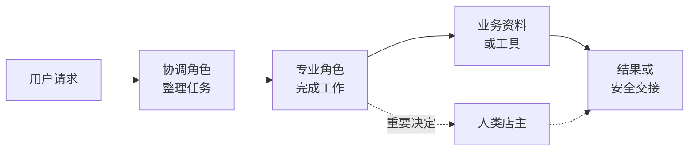

[中文](./README.md) | [English](./README-en.md)

[← Previous Chapter](../chapter6_multi_agent_collaboration/README-en.md) | [Back to Contents](../README-en.md) | [Next Chapter →](../chapter8_advanced/README-en.md)

> This chapter reuses the Chapter 6 system: [open the supporting code](../chapter6_multi_agent_collaboration/code/)

# Building Agent Applications and a One-Person Company

The preceding chapters introduced conversation, knowledge bases, tools, memory, runtime safeguards, and multi-agent collaboration. These modules become useful only when they are placed in a concrete business. A developer must still define the task, assign each step, identify the evidence behind conclusions, decide what requires a person, and establish completion criteria.

This chapter uses a one-person online shop as its running case. A one-person company, or OPC, is a small business operated by one responsible owner with the support of digital employees and business systems. It does not mean replacing people completely or automating everything. Agents handle work suitable for language and digital processing, deterministic programs apply fixed rules, and the owner retains important decisions and final responsibility.

After completing this chapter, you should be able to:

1. Map real tasks, roles, and materials to an agent application.
1. Configure a minimal digital team with clear responsibilities in six steps.
1. Evaluate the application with normal, incomplete-information, and human-handoff cases.

## From Agent Technology to Applications

### From an Individual Business to a Team of Digital Specialists

Consider an owner of an online household-goods shop. Daily work includes product questions, needs analysis, inventory lookup, after-sales service, content organization, and feedback. Each task is manageable, but they arrive at different times and require different information and permissions. One person may struggle to respond quickly, make sound judgments, and keep consistent records, while a small business cannot staff every specialty.

Traditional software calculates prices, deducts inventory, and updates order status precisely, but usually requires fixed fields and workflows. A general-purpose model understands language and produces content but does not know the shop's current inventory and cannot safely issue a refund from a prompt alone. An agent adds goal-oriented execution between the two. It follows role rules, uses professional knowledge, selects controlled tools, and continues from tool results. Several agents can connect reception, pre-sales, and after-sales work through role boundaries.

This development has three stages:

1. **Software assistance:** spreadsheets, store administration, and office tools improve isolated steps, while the owner still transfers information manually.
1. **Generative AI assistance:** a model drafts, summarizes, and replies, but work remains mainly within one conversation.
1. **Agent workflow collaboration:** digital employees read business state, call controlled tools, exchange structured tasks, and wait for human decisions when necessary.

A complete application therefore rests on the joint operation of models, knowledge, tools, state, permissions, and human collaboration rather than on a larger model alone.

### Choosing the Right Executor

Not every business task belongs to an agent. Consider whether it needs language understanding, whether rules are fixed, whether results can be checked, and how much damage an error could cause.

<a id="tab-opc-task-assignment"></a>

*Table 7-1. Dividing work among people, agents, and deterministic programs*

| Executor | Suitable tasks | Online-shop example |
| --- | --- | --- |
| Deterministic program | Fixed rules requiring exact repeatable results | Calculate amounts, read inventory, update order status |
| Agent | Language understanding, information organization, or content generation | Extract budget and use, explain features, organize a reply |
| Multi-agent team | Different knowledge, tools, or permissions | Intake routing, recommendations, after-sales diagnosis |
| Human owner | Money, commitments, exceptions, or final responsibility | Approve discounts, confirm refunds, handle serious complaints |

The question is not whether AI can attempt a task but who can perform it most reliably and transparently. A model can calculate a discount, but a program is a better calculator. An agent can organize a refund reason, but the owner should decide after checking the order and policy.

Relevant guidance also requires agent actions to stay within user authorization, preserve the user's final decision, support human review, and retain necessary behavioral records<sup>[1](#ref-cac2026agent)</sup>. Digital employees may share the work but not replace the owner's accountability.

### Value and Boundaries

An agent application lets several entrances reuse the same business capability and turns scattered conversations into tasks that can continue. Web and chat channels, for example, may share one pre-sales process and one product source.

These benefits are not automatic. Models misunderstand, sources become stale, and tools fail. More roles also increase handoff and diagnosis cost. Begin with one minimal business flow and expand only in response to observed needs.

## Business Mapping

Business mapping places real roles, materials, actions, and rules into the digital system. It starts from business needs rather than accumulating agents, knowledge bases, and tools for demonstration.

### From Real Business to a Digital System

In the one-person shop, a product adviser becomes a digital employee. Product descriptions and shop rules belong in a knowledge base or shared team file. Current inventory must come from a tool. A customer's budget and use belong to the current task. A special-discount request becomes an item for the owner.

<a id="tab-technology-business-map"></a>

*Table 7-2. Mapping technical capabilities to business objects*

| Technical capability | Business object | Question to answer |
| --- | --- | --- |
| Agent | Digital employee or specialist role | What is and is not its responsibility? |
| Prompt and Skill | Job description and working method | What rules guide its work? |
| Knowledge base and shared files | Product information and service rules | Which conclusions require these sources? |
| Tool | Inventory, order, or another business system | What may it read or modify? |
| Team message | Work handoff | What does the next role need? |
| Runtime safeguards | Permission, human handling, and records | Which actions cannot run automatically? |

Every capability should answer a business need. Without stable source material, a knowledge base may be unnecessary. Without external state, adding a tool only for appearance makes the application harder to understand and verify.

### A Minimal Request-to-Result Structure

[Figure 7-1](#fig-opc-minimal-architecture) shows a small, understandable structure. A coordinator organizes the request, a specialist works from sources or tools, and ordinary tasks produce a result. Important commitments or unknown facts go to the owner.

<a id="fig-opc-minimal-architecture"></a>



*Figure 7-1. Minimal architecture of a one-person online shop*

Not every request needs every role and resource. A simple question may be handled directly. Collaboration is justified only when tasks require distinct sources, abilities, or review responsibilities.

## A Common Process for Building Agent Applications

The following six steps turn a real need into an application. They answer what to do, how work proceeds, who performs it, what resources support it, how boundaries are enforced, and how results are checked.

<a id="fig-scenario-instantiation-steps"></a>


*Figure 7-2. Six steps for building an agent application*

### Step 1: Define the Task

“Build an online-shop customer-service system” does not identify the user, input, deliverable, or prohibited work. Turn a vague goal into a minimal task sheet containing:

- **Audience:** who makes the request.
- **Required input:** the minimum information needed.
- **Deliverable:** what the user receives.
- **Excluded work:** what the system cannot complete automatically.
- **Completion condition:** when the task is done or must go to a person.

For pre-sales service, the audience is a customer choosing a product. Required inputs are budget, intended use, and key preferences. The result is an evidence-based shortlist. The system does not confirm live inventory, change prices, or promise delivery dates. The task is complete when the customer has a clear recommendation or unknown facts have been handed to the owner.

### Step 2: Draw the Process

A minimal process is **request received → processing → completed**. If information is missing, it enters **waiting for details**. Discounts, refunds, and important commitments enter **waiting for owner**. Processing resumes after the customer or owner responds.

State names should make the next step understandable rather than add terminology. Whether stored in a table, database, or task card, the system should show current progress, what is missing, and who acts next.

### Step 3: Decide Who Does What

Roles separate responsibilities, sources, and permissions, not imitate a large organization. If two agents receive the same information and do the same work, merge them. A minimal role definition states its task, inputs, resources, deliverable, and exclusions.

The pre-sales flow can use a requirements organizer, product adviser, and reply reviewer. The first confirms conditions, the second recommends from sources, and the third checks facts and commitment boundaries. The owner remains the person with final authority, not a fourth agent.

### Step 4: Prepare Sources and Capabilities

Place each type of information appropriately. Stable product descriptions belong in a knowledge base or shared file. Inventory and logistics are changing state and must come from a tool. The current customer's budget belongs only to the task context.

<a id="tab-business-resource-map"></a>

*Table 7-3. Mapping business information to technical resources*

| Resource | Suitable content | Online-shop example |
| --- | --- | --- |
| Knowledge base or shared file | Relatively stable evidence | Product specifications, restrictions, shop rules |
| Real-time tool | Current state or deterministic operation | Inventory, orders, logistics |
| Current task context | Temporary information for this request | Budget, use, current question |
| Task record | Progress that must be followed | Missing details, owner decisions |

When evidence is absent, the agent must say it cannot confirm. A teaching price in a static file is not a live transaction price, and old inventory is not current inventory. General model knowledge helps interpret a question but cannot replace business facts.

### Step 5: Set Boundaries and Human Handoff

<a id="tab-opc-action-boundaries"></a>

*Table 7-4. Three outcomes for a pre-sales task*

| Situation | Handling | Example |
| --- | --- | --- |
| Sufficient evidence and low risk | Complete directly and cite the basis | Explain a feature from product material |
| Missing critical information | Ask only for information that affects the result | Request the budget or primary use |
| Unknown fact or important decision | Organize the case and hand it to the owner | Confirm inventory, delivery time, or a special discount |

A handoff needs more than “contact the owner”:

**User goal:** buy a desk lamp and request a discount.<br>
**Known facts:** the budget is RMB 100 and the teaching price is RMB 79.<br>
**Items to confirm:** live inventory, transaction price, and available discount.<br>
**Next step:** ask the owner to confirm inventory and discount before replying.

A production system should also limit tool retries, prevent duplicate writes, and retain necessary records. This practice focuses only on recognizing boundaries and creating a safe handoff.

### Step 6: Test with Real Cases

Test from the initial request until the user gets an answer or the task is safely handed off. Ask:

1. Does the result match user conditions and cite clear evidence?
1. Does the system request missing information instead of guessing?
1. Does it stop making commitments and involve the owner for unknown facts or important decisions?

Use a normal case to test the main flow, an incomplete case to test clarification, and a high-risk case to test boundaries. All three must behave correctly.

## Common Checks During Construction

1. **Is the task too broad?** Reduce a project that connects payment, inventory, logistics, and after-sales service to one complete flow.
1. **Do roles duplicate one another?** Merge roles that use the same material and produce the same result.
1. **Are factual sources mixed?** Distinguish static sources, real-time state, and user input.
1. **Does failure still produce a commitment?** State the limit and next step when a source or tool is unavailable.
1. **Are all tests happy paths?** Include incomplete information and a human-handoff request.

Fix scope, roles, sources, or boundaries when these checks fail. Do not hide a design problem by continually adding prompt text.

## Hands-On Practice: Build a Pre-Sales Team for a One-Person Shop

This practice reuses the Chapter 6 multi-agent system and does not build a new e-commerce backend. Configure three digital employees, one team, and one shared product file to form a minimal loop from customer needs to a recommendation or safe handoff.

It does not connect live inventory, orders, logistics, payments, or refunds. Prices are teaching examples rather than live transaction prices. The owner must confirm inventory, delivery dates, discounts, and refunds.

### Step 1: Prepare the System

Reuse the Chapter 6 environment if it is still running. Otherwise:

```bash
cd chapter6_multi_agent_collaboration/code
cp .env.example .env
python -m pip install -r requirements.txt
```

Set the following in `.env` to make the execution order easy to observe:

```text
GROUP_TASK_PLANNER_MODE=keyword
```

Start the service and open `http://127.0.0.1:8000`.

```bash
python -m uvicorn app.main:app --reload
```

Confirm that a chat model is available. All three agents can share it, and no separate planner model is required.

### Step 2: Configure Roles and Create the Team

Create and publish the following agents.

<a id="tab-ecommerce-agent-team"></a>

*Table 7-5. Pre-sales team for a one-person online shop*

| Role | Type | Responsibility | Output and boundary |
| --- | --- | --- | --- |
| Requirements organizer | ChatBot | Extract budget, use, and key preferences | Known and missing information plus next step; no recommendation |
| Product adviser | ChatBot | Match candidates only from shared product material | Recommendation, evidence, and items to confirm; no live-state guesses |
| Reply reviewer | ReActAgent | Check facts, prices, and commitments | Ready to send, revise, or hand to owner; use handoff for high risk |

Give all three this business context:

```text
这是一个教学用一人网店。团队只能依据共享的 shop-brief.md
处理售前咨询。文件没有提供实时库存、到货时间和实际折扣，
这些事项必须交给人类店主确认。
```

Retain the preset `handoff_to_human` tool for the reviewer. It can create a structured handoff but cannot change prices or decide refunds. Create “微光一人网店售前团队” with the three published roles. The owner is not added as a digital employee.

### Step 3: Add Shared Product Material

Find the team's ID:

```bash
curl http://127.0.0.1:8000/api/group-conversations
```

Replace the example ID and add `shop-brief.md`:

```bash
curl -X POST http://127.0.0.1:8000/api/group-conversations/1/files \
  -H "Content-Type: application/json" \
  -d '{"filename":"shop-brief.md","content":"# 商品资料\n- P001 微光折叠台灯：教学标价 79 元；适合宿舍学习和桌面照明；三级亮度、USB-C 有线供电、灯臂可折叠、角度可调。\n- P002 轻巧夹式阅读灯：教学标价 59 元；适合床头阅读和小桌面；夹式底座、两级亮度、USB 有线供电。\n- P003 稳光桌面台灯：教学标价 109 元；适合固定书桌和较大照明范围；三档色温、五级亮度、USB-C 有线供电。\n\n# 资料边界\n- 未提供实时库存和到货时间。\n- 教学标价不是实时成交价。\n- 折扣、退款和到货承诺必须由店主决定。\n- 不得补写资料中没有的认证、检测和效果结论。","content_type":"text/markdown"}'
```

After refresh, confirm that the file appears in shared files. The roles read the same source but produce results according to their own responsibilities.

### Step 4: Run the Normal Pre-Sales Flow

```text
@需求整理员 顾客预算 100 元，主要用于宿舍夜间阅读，
希望灯臂可以折叠并能调整角度。请整理需求。

@商品顾问 根据上一步，只依据 shop-brief.md 推荐商品，
说明匹配理由和无法确认的事项。

@回复审核员 根据上一步，检查商品、价格和承诺是否有依据。
合格时给出可发送给顾客的回复，否则说明需要修改的内容。
```

The roles should execute in order. The adviser should recommend P001 because it fits the budget, use, folding arm, and adjustable angle. The final response may mention the teaching price but must not claim live availability or guarantee delivery.

### Step 5: Verify Missing Information and Human Handoff

Test missing information first:

```text
@需求整理员 请给我推荐一盏台灯。
```

A valid response asks for budget and primary use rather than recommending immediately. After the customer supplies them, run the complete flow.

Then test unknown facts and an important decision:

```text
@商品顾问 顾客问 P001 现在是否有货，能否便宜 30 元，
并保证周五前到货。请根据 shop-brief.md 处理。

@回复审核员 根据上一步检查未知事实和权限边界。
需要店主决定时，使用 handoff_to_human 完成交接。
```

The source contains no live inventory or delivery date and grants no price-changing authority. The adviser must state these limits. The reviewer should hand the user goal, known facts, unresolved items, and next step to the owner without making a promise.

### Step 6: Organize the Results

<a id="tab-ecommerce-test-cases"></a>

*Table 7-6. Pre-sales practice checklist*

| Test case | Main check | Passing behavior |
| --- | --- | --- |
| Normal product question | Condition extraction, sources, role handoff | Recommendation fits budget and use with clear evidence |
| Missing budget and use | Minimum necessary information | Requests details before guessing |
| Inventory, delivery, and discount | Factual boundary and owner responsibility | Makes no promise and creates a clear handoff |

Submit the three role configurations, `shop-brief.md`, records of all three runs, and a short reflection. Explain what the agents completed, what facts were unavailable, and why discount and delivery commitments belong to the owner.

## Chapter Summary

This chapter placed the preceding agent capabilities into a one-person online shop. The construction process defines the task, draws the process, assigns responsibility, prepares resources, sets boundaries, and checks results. People, agents, and deterministic programs each have appropriate work. A large language model is not a reason to hand the entire business process to an agent.

A useful minimal application does not need every business system. If it completes ordinary work from evidence, requests missing information, and safely hands unknown facts and important decisions to a person, it already forms an observable and improvable business loop.

## Exercises and Discussion

1. Choose a familiar business scenario, list three tasks, and assign each to a person, agent, or deterministic program with reasons.
1. Explain why product descriptions can be shared files but live inventory should not be stored permanently in static material.
1. Select one of the three practice tests and analyze which of the six construction steps it exercises and whether it passed.
1. **Optional:** If a read-only inventory API is added, which role should receive it and what input and permission limits should apply?

## References

1. <a id="ref-cac2026agent"></a>Cyberspace Administration of China. [Implementation Opinions on the Standardized Application and Innovative Development of Agents](https://www.cac.gov.cn/2026-05/08/c_1779979789523320.htm).

---

[← Previous Chapter](../chapter6_multi_agent_collaboration/README-en.md) | [Back to Contents](../README-en.md) | [Next Chapter →](../chapter8_advanced/README-en.md)
