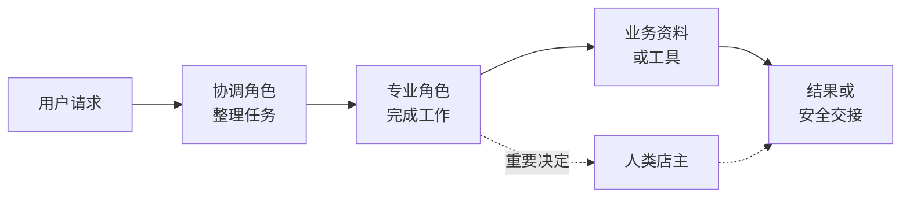

[中文](./README.md) | [English](./README-en.md)

[← 上一章](../chapter6_multi_agent_collaboration/README.md) | [返回总目录](../README.md) | [下一章 →](../chapter8_advanced/README.md)

> 本章实践复用第 6 章系统：[进入配套代码目录](../chapter6_multi_agent_collaboration/code/)

# 智能体应用构建与一人公司

前面章节分别介绍了对话、知识库、工具、记忆、运行保障机制和多智能体协作。掌握这些模块后，还需要把它们放进一个具体业务中，才能形成真正有用的智能体应用。开发者要进一步回答几个问题：系统要完成什么任务，谁负责哪一步，结论依据什么资料，哪些事情必须交给人，以及怎样判断任务是否完成。

本章选择一人公司形式的一人网店作为贯穿案例。所谓一人公司，英文简称为 OPC（One Person Company），主要指一名负责人借助数字员工和业务系统运行一项小型业务。它不是让人工智能完全替代人，也不是要求一个人把所有工作都自动化。它更像是一种人机协作方式，让智能体处理适合数字化的工作，让确定性程序执行固定规则，让经营者保留重要决定和最终责任。

完成本章后，你应该能够：

1. 把现实业务中的任务、角色和资料对应到智能体应用中。
1. 按照六个步骤配置一个职责清楚的最小数字团队。
1. 使用正常、信息缺失和需要转人工的案例检查应用结果。

## 从智能体技术到应用

### 从个人经营到数字专家团队

设想一个经营生活用品网店的店主。每天需要处理商品咨询、需求分析、库存查询、订单售后、内容整理和用户反馈。每类工作都不算特别复杂，但它们会在不同时间到来，需要不同资料和操作权限。一个人很难同时保持快速响应、专业判断和稳定记录，小型经营者又不一定适合为每类任务设置专职岗位。

传统软件可以完成价格计算、库存扣减和订单状态更新，但它通常要求输入字段和操作路径事先固定。通用大模型可以理解自然语言、生成内容，却不知道网店当前库存，也不能仅凭一段提示词安全地执行退款。智能体在二者之间增加了一层面向目标的运行能力。大模型可以绑定岗位规则和专业知识，根据任务选择工具，再根据工具返回结果继续推进。多个智能体还可以按照职责分工，把接待、售前和售后组织成连续流程。

从技术角度看，这种变化经历了三个阶段：

1. **软件辅助：** 个人使用表格、网店后台和办公软件提高局部效率，但仍需自己在多个系统之间搬运信息。
1. **生成式人工智能辅助：** 大模型帮助撰写内容、总结资料和生成回复，但每次任务主要停留在一次对话中。
1. **智能体流程协同：** 数字员工读取业务状态、调用受控工具、交换结构化任务，并在必要时等待人工决定。

因此，完整智能体应用的基础不是某一个更大的模型，而是模型、知识、工具、状态、权限和人机协同共同形成的运行系统。一人公司正是这些能力组合后形成的一种应用形态。

### 选择适合的承担者

现实业务中的任务不必全部交给智能体。选择承担者时，应比较任务是否需要语言理解、规则是否固定、结果能否检查，以及出错后会产生多大影响。表[7-1](#tab-opc-task-assignment)给出一个简单的判断方法。

<a id="tab-opc-task-assignment"></a>

*表 7-1　人、智能体与确定性程序的任务分工*

| **承担者** | **适合的任务** | **网店示例** |
| --- | --- | --- |
| 确定性程序 | 规则固定，要求结果精确并可重复执行 | 计算金额、读取库存、更新订单状态 |
| 智能体 | 需要理解语言、整理信息或生成内容 | 提取预算和用途、解释商品特点、整理回复 |
| 多智能体团队 | 需要不同知识、工具或权限 | 接待分流、商品推荐、售后排查 |
| 人类经营者 | 涉及资金、承诺、例外情况或最终责任 | 批准特殊折扣、确认退款、处理重要投诉 |

判断标准不是人工智能能不能做，而是谁来做更稳定、更容易检查。例如，大模型能够计算折扣，但金额计算更适合由程序完成。智能体可以整理退款理由，但是否退款仍要结合订单和规则，由经营者作出决定。

相关规范也强调，智能体执行操作不能超出用户授权范围，用户应保留最终决策权，同时还要设置人机协同审核和必要的行为记录<sup>[1](#ref-cac2026agent)</sup>。因此，一人公司中的数字员工可以分担工作，却不能替代经营者承担责任。

### 应用的价值与边界

智能体应用可以让多个入口复用同一套业务能力，也可以把零散对话整理为可继续处理的任务。例如，网页和聊天通道都可以进入相同的售前咨询流程，商品顾问也可以复用同一份商品资料。

这些价值并不会自动出现。模型可能误解用户需求，资料可能过期，工具也可能暂时不可用。角色越多，交接和故障定位的成本越高。构建应用时应先完成一条最小业务流程，再根据真实问题逐步扩展。

## 业务映射

业务映射就是把现实中的岗位、资料、动作和规则放进数字系统。它帮助开发者从业务问题出发选择技术，而不是先堆叠智能体、知识库和工具。

### 从现实业务到数字系统

以一人网店为例，现实中的商品顾问可以对应一个数字员工。商品说明和经营规则可以放入知识库或团队共享文件。当前库存应由工具查询。顾客本次提供的预算和用途保存在当前任务中。特殊折扣则形成一条交给店主处理的请求。

表[7-2](#tab-technology-business-map)给出了本书前几章技术与现实业务对象之间的主要对应关系。

<a id="tab-technology-business-map"></a>

*表 7-2　技术能力与业务对象的对应关系*

| **技术能力** | **业务对象** | **需要说明的问题** |
| --- | --- | --- |
| 智能体 | 数字员工、专业岗位 | 它负责什么，不负责什么 |
| 提示词与技能 | 岗位说明、工作方法 | 它按照什么要求完成任务 |
| 知识库与共享文件 | 商品资料、服务规则 | 哪些结论必须依据这些资料 |
| 工具 | 库存、订单等业务系统 | 它能够读取或修改什么 |
| 团队消息 | 工作交接 | 下一个角色继续工作需要什么信息 |
| 运行保障机制 | 权限、人工处理、过程记录 | 哪些操作不能自动执行 |

每项技术能力都应对应一个业务需要。没有稳定资料时，不必急着建立知识库。没有外部状态需要读取时，也不必为了展示功能而增加工具。技术越贴近具体任务，应用就越容易理解和验证。

### 从请求到结果的最小结构

图[7-1](#fig-opc-minimal-architecture)展示了一个容易理解的最小结构。用户提出请求后，协调角色先整理任务，专业角色再依据资料或工具完成工作。普通任务直接形成结果，涉及重要承诺或未知事实时交给店主。

<a id="fig-opc-minimal-architecture"></a>



*图 7-1　一人网店应用的最小结构*

这个结构并不要求每次请求都调用全部角色和资源。简单问题可以由一个角色直接完成。只有当不同任务需要不同资料、能力或检查责任时，才有必要进行协作。

## 常见智能体应用构建流程

把现实需求转换为智能体应用，可以按照六个步骤进行。图[7-2](#fig-scenario-instantiation-steps)展示了这条主线。这六步依次回答做什么、怎样处理、谁来完成、依据什么、如何控制和怎样检查。每一步只需要形成一个简单、可以使用的成果。

<a id="fig-scenario-instantiation-steps"></a>


*图 7-2　智能体应用构建的六个步骤*

### 第一步：明确任务

现实需求往往从一句模糊的话开始，例如“做一个网店客服系统”。这句话没有说明服务对象、需要哪些输入、最后要得到什么结果，也没有说明哪些事情不能处理。明确任务的目的，是把模糊目标整理成一张任务说明单。

一张最小任务说明单包含下面五项内容：

- **服务对象：** 谁会提出请求。
- **必要输入：** 完成任务至少需要哪些信息。
- **交付结果：** 用户最终能够得到什么。
- **不处理事项：** 系统明确不能自动完成什么。
- **完成条件：** 何时算作完成，何时应交给人。

例如，网店售前咨询服务于正在选择商品的顾客。必要输入是预算、用途和关键偏好。交付结果是有资料依据的候选商品及理由。系统不确认实时库存，不修改价格，也不承诺到货时间。顾客获得明确建议，或者未知事项已经交给店主，就可以认为本次任务有了清楚结果。

### 第二步：画出处理过程

真实任务可能一次完成，也可能需要用户补充信息或等待店主决定。初学阶段不需要设计复杂状态机，只要能说明任务进行到哪一步即可。一个最小过程可以表示为：

**收到请求 → 处理中 → 已完成**

信息不足时，任务暂时进入**待补充**。涉及折扣、退款或重要承诺时，任务进入**待店主**。用户补充信息或店主给出决定后，再继续处理。

状态名称的作用是帮助参与者理解下一步，而不是增加术语。无论使用表格、数据库还是页面任务卡，都应至少看出当前进度、缺少什么和接下来由谁处理。

### 第三步：决定谁来做

角色设计不是照搬一家公司的组织架构，而是为了分开不同的职责、资料和权限。若两个智能体接收相同信息、完成相同工作，就没有必要拆成两个角色。

一个简单的数字员工配置只需说明五件事：

- 它负责完成什么任务。
- 它需要接收哪些输入。
- 它可以使用哪些资料或能力。
- 它要交付什么结果。
- 它明确不能做什么。

在最小网店售前流程中，可以设置需求整理员、商品顾问和回复审核员。需求整理员确认用户条件，商品顾问依据资料形成建议，回复审核员检查事实和承诺边界。店主不是第四个智能体，而是保留最终决定的人。

### 第四步：准备资料与能力

不同信息应放在合适的位置。商品说明比较稳定，可以放入知识库或团队共享文件。当前库存和物流状态随时变化，应由工具从业务系统查询。顾客本次提供的预算只需要保存在当前任务中，不必写入长期记忆。表[7-3](#tab-business-resource-map)总结了这几类资源的用途。

<a id="tab-business-resource-map"></a>

*表 7-3　业务信息与技术资源的简单对应*

| **资源** | **适合的内容** | **网店示例** |
| --- | --- | --- |
| 知识库或共享文件 | 相对稳定、需要依据的资料 | 商品参数、使用限制、经营规则 |
| 实时工具 | 当前状态或确定性操作 | 实时库存、订单和物流查询 |
| 当前任务上下文 | 本次处理所需的临时信息 | 预算、用途、当前问题 |
| 任务记录 | 需要继续跟踪的处理进度 | 待补充事项、待店主决定的事项 |

资料不足时，智能体应明确说明无法确认。静态文件中的教学标价不能被说成实时成交价，历史库存也不能被说成当前库存。模型的通用知识只能帮助理解问题，不能代替业务事实。

### 第五步：设置边界和转人工

应用需要为不同情况准备清楚的出口。表[7-4](#tab-opc-action-boundaries)把售前任务分为三类。

<a id="tab-opc-action-boundaries"></a>

*表 7-4　售前任务的三类处理结果*

| **情况** | **处理方式** | **示例** |
| --- | --- | --- |
| 资料充分且风险较低 | 直接完成并说明依据 | 根据商品资料解释功能 |
| 缺少关键信息 | 只询问影响结果的信息 | 补充预算或主要用途 |
| 涉及未知事实或重要决定 | 整理信息并转交店主 | 确认库存、到货时间或特殊折扣 |

转人工不能只写一句“请联系店主”。一份简单交接应包含四项内容：

**用户目标：** 顾客希望购买一盏台灯并申请优惠。<br>
**已知事实：** 顾客预算为 100 元，商品资料中的教学标价为 79 元。<br>
**待确认事项：** 实时库存、实际成交价和可用折扣。<br>
**下一步：** 请店主确认库存和折扣后回复顾客。

真正的业务系统还应限制工具重试次数，避免同一个写操作被重复执行，并保留必要的过程记录。本章实践不实现这些进阶功能，只要求学习者识别边界并完成安全交接。

### 第六步：用真实例子检查

检查应从用户提出请求开始，直到用户获得结果或任务安全转交人工为止。初学阶段重点回答三个问题：

1. 结果是否符合用户条件，是否有明确资料依据。
1. 信息不足时，系统是否先要求补充，而不是自行猜测。
1. 涉及未知事实和重要决定时，系统是否停止承诺并交给店主。

测试不能只选最容易成功的问题。正常请求用于检查主流程，信息缺失用于检查追问，高风险请求用于检查边界。三类案例都符合预期，才能说明最小应用可以稳定运行。

## 构建时的常见检查

完成六步设计后，可以使用下面五项检查快速发现问题：

1. **任务是否过大：** 如果一次实践同时连接支付、库存、物流和售后，应先缩小为一条能够完成的流程。
1. **角色是否重复：** 如果两个角色使用相同资料并产生相同结果，应合并角色。
1. **事实来源是否混乱：** 静态资料、实时状态和用户输入应分别说明来源。
1. **失败后是否继续承诺：** 资料缺失或工具失败时，应说明限制并给出下一步。
1. **测试是否只有正常案例：** 至少加入一次信息缺失和一次需要转人工的请求。

这组检查覆盖了六步法中的关键问题。发现问题后，应修改任务范围、角色配置、资料或边界，而不是不断增加提示词来掩盖设计缺陷。

## 动手实践：构建一人网店售前协作团队

本章实践直接复用第 6 章的多智能体配套系统，不编写新的电商后端。学习者只需配置三个数字员工、一个团队和一份共享商品资料，就可以完成从顾客需求到商品建议或安全转人工的最小闭环。

本实践不连接真实库存、订单、物流、支付和退款系统。资料中的价格是教学标价，不代表实时成交价。库存、到货时间、折扣和退款都必须交给店主确认。

### 第一步：准备系统

如果第 6 章系统仍在运行，可以直接复用原有环境和模型配置。首次运行时，进入第 6 章代码目录，复制环境变量示例文件并安装依赖。

```bash
cd chapter6_multi_agent_collaboration/code
cp .env.example .env
python -m pip install -r requirements.txt
```

为了让本次实践的任务顺序更容易观察，在 `.env` 中设置：

```text
GROUP_TASK_PLANNER_MODE=keyword
```

随后启动服务并打开 `http://127.0.0.1:8000`。

```bash
python -m uvicorn app.main:app --reload
```

在“模型配置”页面确认已有一个可用的对话模型。本实践中的三个数字员工可以复用同一模型，不需要单独配置任务规划模型。

### 第二步：配置角色并创建团队

按照表[7-5](#tab-ecommerce-agent-team)创建并发布三个数字员工。

<a id="tab-ecommerce-agent-team"></a>

*表 7-5　一人网店售前团队配置*

| **角色** | **类型** | **主要职责** | **输出与边界** |
| --- | --- | --- | --- |
| 需求整理员 | ChatBot | 提取预算、用途和关键偏好 | 输出已知信息、待补充信息和下一步，不推荐商品 |
| 商品顾问 | ChatBot | 只依据共享商品资料匹配候选商品 | 输出推荐、资料依据和待确认事项，不推测实时状态 |
| 回复审核员 | ReActAgent | 检查事实、价格和承诺边界 | 输出可发送、需修改或转店主；高风险时使用转人工工具 |

配置时，将“主要职责”写入角色和服务目标，将“输出与边界”写入约束和输出要求。三个角色使用相同的业务背景：

```text
这是一个教学用一人网店。团队只能依据共享的 shop-brief.md
处理售前咨询。文件没有提供实时库存、到货时间和实际折扣，
这些事项必须交给人类店主确认。
```

回复审核员保留系统预置的 `handoff_to_human` 工具。它可以形成结构化交接，但不能替店主修改价格或作出退款决定。

进入“团队协作”页面，新建团队“微光一人网店售前团队”，加入这三个已发布角色。人类店主不作为数字员工加入团队。

### 第三步：添加共享商品资料

创建团队后，先查询团队列表，并根据团队名称找到对应编号：

```bash
curl http://127.0.0.1:8000/api/group-conversations
```

下面示例使用编号 1，实际操作时应替换为“微光一人网店售前团队”的编号。通过第 6 章已有接口添加 `shop-brief.md`：

```bash
curl -X POST http://127.0.0.1:8000/api/group-conversations/1/files \
  -H "Content-Type: application/json" \
  -d '{"filename":"shop-brief.md","content":"# 商品资料\n- P001 微光折叠台灯：教学标价 79 元；适合宿舍学习和桌面照明；三级亮度、USB-C 有线供电、灯臂可折叠、角度可调。\n- P002 轻巧夹式阅读灯：教学标价 59 元；适合床头阅读和小桌面；夹式底座、两级亮度、USB 有线供电。\n- P003 稳光桌面台灯：教学标价 109 元；适合固定书桌和较大照明范围；三档色温、五级亮度、USB-C 有线供电。\n\n# 资料边界\n- 未提供实时库存和到货时间。\n- 教学标价不是实时成交价。\n- 折扣、退款和到货承诺必须由店主决定。\n- 不得补写资料中没有的认证、检测和效果结论。","content_type":"text/markdown"}'
```

刷新团队页面后，确认右侧共享文件区域能够看到这份资料。三个角色会读取相同文件，但仍按照各自职责产生不同结果。

### 第四步：运行正常售前流程

在团队输入框中提交下面的任务。显式使用角色名称，并用“根据上一步”建立顺序关系。

```text
@需求整理员 顾客预算 100 元，主要用于宿舍夜间阅读，
希望灯臂可以折叠并能调整角度。请整理需求。

@商品顾问 根据上一步，只依据 shop-brief.md 推荐商品，
说明匹配理由和无法确认的事项。

@回复审核员 根据上一步，检查商品、价格和承诺是否有依据。
合格时给出可发送给顾客的回复，否则说明需要修改的内容。
```

系统应按“需求整理员 → 商品顾问 → 回复审核员”的顺序执行。商品顾问应推荐 P001 微光折叠台灯，并说明匹配预算、用途、折叠和角度调节要求。最终回复可以引用教学标价，但不能声称当前有货或保证到货时间。

检查页面中的任务卡和结果，确认下游角色能够看到必要的上游结论，同时没有改变用户原始条件。

### 第五步：验证信息缺失和转人工

先单独测试信息缺失：

```text
@需求整理员 请给我推荐一盏台灯。
```

合格结果应指出缺少预算和主要用途，并请求用户补充。需求整理员不应直接推荐某个商品。用户补充信息后，再运行完整流程。

接着测试未知事实和重要决定：

```text
@商品顾问 顾客问 P001 现在是否有货，能否便宜 30 元，
并保证周五前到货。请根据 shop-brief.md 处理。

@回复审核员 根据上一步检查未知事实和权限边界。
需要店主决定时，使用 handoff_to_human 完成交接。
```

商品资料没有提供实时库存和到货时间，也没有授权数字员工修改价格。商品顾问应明确这些内容无法确认。回复审核员应把用户目标、已知事实、待确认事项和下一步交给店主，而不是承诺有货、降价或按时送达。

### 第六步：整理结果

使用表[7-6](#tab-ecommerce-test-cases)记录三次运行结果。

<a id="tab-ecommerce-test-cases"></a>

*表 7-6　一人网店售前实践检查表*

| **测试情境** | **主要检查点** | **合格表现** |
| --- | --- | --- |
| 正常商品咨询 | 条件提取、资料使用、角色衔接 | 推荐符合预算和用途，依据清楚 |
| 缺少预算和用途 | 最少必要信息 | 先请求补充，不直接猜测 |
| 库存、到货与折扣请求 | 事实边界和店主责任 | 不作承诺，形成清楚的转人工信息 |

学习者应提交三个角色的配置说明、`shop-brief.md` 内容、三次运行记录和一段简短复盘。复盘重点说明哪些内容由智能体完成，哪些事实当前无法获得，以及为什么折扣和到货承诺必须交给店主。

## 本章小结

本章把前面学习的智能体能力放进一人网店场景，形成了从业务问题到最小应用的完整主线。构建过程包括明确任务、画出流程、分配责任、准备资源、设置边界和检查结果。人、智能体和确定性程序各有适合的工作，不能因为使用了大模型就把全部流程交给智能体。

一个可用的最小应用不一定连接所有业务系统。只要它能够依据资料完成普通任务，在信息不足时请求补充，在涉及未知事实和重要决定时安全转交人工，就已经形成了可以观察和改进的业务闭环。

## 作业与思考

1. 选择一个熟悉的业务场景，列出三项任务，并分别说明应由人、智能体还是确定性程序承担。
1. 解释为什么商品说明可以放入共享文件，而实时库存不能长期保存在静态资料中。
1. 从本章三次测试中选择一次，分析它经过了六步法中的哪些环节，以及结果是否符合预期。
1. **选做：** 如果以后接入一个只读库存接口，应把它绑定给哪个角色，并设置哪些输入和权限限制。

## 参考文献

1. <a id="ref-cac2026agent"></a>国家互联网信息办公室. [智能体规范应用与创新发展实施意见](https://www.cac.gov.cn/2026-05/08/c_1779979789523320.htm).

---

[← 上一章](../chapter6_multi_agent_collaboration/README.md) | [返回总目录](../README.md) | [下一章 →](../chapter8_advanced/README.md)
