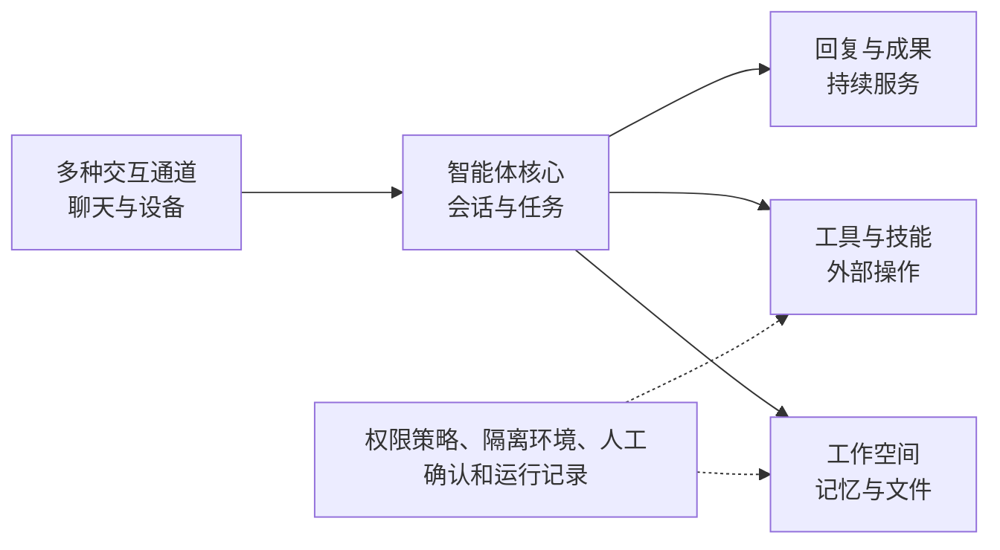
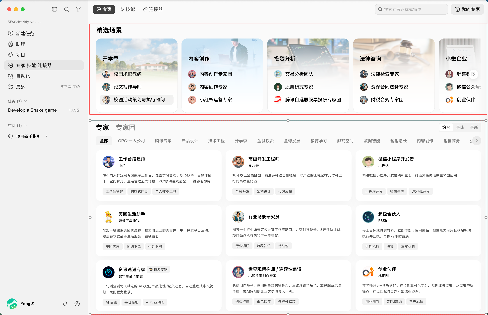

[中文](./README.md) | [English](./README-en.md)

[← Previous Chapter](../chapter7_opc_applications/README-en.md) | [Back to Contents](../README-en.md)

> This chapter focuses on an integrated task using an open platform and does not provide a separate code project.

# Advanced Topics and Extensions

The first seven chapters followed an incremental path. Beginning with the first model call, the digital employee acquired multi-turn conversation, retrieval, tools, memory, runtime safeguards, and team collaboration. Chapter 7 combined these capabilities into a complete agent application and a minimal one-person-company workflow. At this point, we can design and implement a basic usable application.

Agent technology continues to develop rapidly. Agents handle more forms of information and participate in longer, more complex tasks. Frameworks, visual platforms, and complete agent products also package many technical capabilities and lower the barrier to application development. This chapter emphasizes how to examine these changes through system components and capability boundaries rather than adding extensive low-level implementation.

After completing this chapter, you should be able to:

1. Explain how multimodal interaction, persistent tasks, and experience-based improvement change agent capabilities.
1. Compare direct programming, development frameworks, construction platforms, and agent products.
1. Analyze systems such as OpenClaw and WorkBuddy through components and boundaries.
1. Complete an integrated task on an agent platform and inspect its facts, process, and artifacts.

## Extending Capabilities

The earlier digital employees mainly accepted text, called knowledge and tools within a session, and returned a result. Advanced agents retain the perception, decision, action, and feedback loop but expand the information types, interaction modes, and duration within it. The important questions are what a new capability adds and what risks accompany it.

### Multimodal Interaction

Multimodal agents process images, speech, video, spreadsheets, and screen views in addition to text. They may also produce documents, charts, images, and audio. Users therefore need not convert every source to text before the agent can participate in real work.

An online-shop agent can inspect a photo of a faulty desk lamp, identify the switch and cable state, and ask for missing information. A content agent can combine specifications, product images, and a sales table to create copy and a poster. A computer-use agent can identify buttons, fields, and results from screen images. Benchmarks such as OSWorld evaluate agents on real computer tasks and show that reliability in open environments remains difficult<sup>[1](#ref-xie2024osworld)</sup>.

<a id="tab-ch8-multimodal"></a>

*Table 8-1. Roles of multimodal information in an agent*

| Information | Business example | Processing | Main concern |
| --- | --- | --- | --- |
| Image | Product photo, fault screenshot | Recognize objects, text, and interface state | Misread details and manipulative text in an image |
| Speech | Customer call, meeting recording | Transcribe content and distinguish speakers and time | Transcription errors and private information |
| Spreadsheet | Price list, sales statistics | Read fields and call programs for calculation | Ambiguous fields and stale data |
| Video and screen | Demonstration, software interface | Extract key frames and continuous state | Lost temporal information and mistaken actions |

Multimodality does not guarantee reliability. Text in an image may be misread, speech may lose words, and table fields may be misunderstood. Retain the source material, recognition result, and necessary time information. Ask users to confirm critical fields related to money, identity, commitments, or important actions. Text in external images, documents, and web pages is business material, not a system instruction.

### Real-Time Interaction and Persistent Tasks

Streaming displays output as it is produced. Voice and screen collaboration also need to accept new input, respond to interruption, and adapt when conditions change. These interactions emphasize low latency and continuous feedback, but they are not hard real-time guarantees in the industrial-control sense.

When a task lasts minutes or longer, it cannot rely on an ever-growing conversation alone. Store a task ID, current state, completed steps, intermediate artifacts, and next action. A content-planning task might follow:

received → planning → executing → waiting for confirmation → revising → completed

State lets the user see progress, allows interrupted work to resume from a confirmed point, and permits the task to pause for missing sources, tool failure, or an important human decision. Persistent execution means knowing how to continue, stop, and return control at every stage, not running forever.

### From Memory Reuse to Continuous Improvement

Chapter 4 stored valuable experience as long-term memory. Run records and user feedback can also reveal repeated problems and improve later work:

run records and feedback → identify a problem → update knowledge, memory, or method → retest

If users repeatedly correct “USB-C wired power” being rewritten as “built-in battery,” the system can add power mode to a factual checklist. Research such as Reflexion shows that agents can store feedback and verbal reflection to adjust later attempts<sup>[2](#ref-shinn2023reflexion)</sup>. The ability to summarize experience, however, does not justify unrestricted self-modification.

<a id="tab-ch8-improvement-scope"></a>

*Table 8-2. Basic boundaries for experience-based improvement*

| Updated object | Example | Basic requirement |
| --- | --- | --- |
| Task memory | Confirmed preference and task result | Record source, time, and scope |
| Business knowledge | Confirmed product information and common questions | Verify before adding to the knowledge base |
| Working method | Add a factual check or revise a task template | Human confirmation and regression against original tests |
| Skill and program | Change tool arguments, permissions, or code | Review and independent verification |

Continuous improvement here means proposing and validating a candidate change. It does not let an agent alter real permissions, rules, or code on its own. Rerun both normal and abnormal tests after a change to prevent regressions.

## The Open Ecosystem

The same application may be implemented directly, with a development framework, on a visual construction platform, or through a packaged agent product. The interfaces differ, but each still contains models, prompts, knowledge, tools, state, permissions, and logs. The purpose of studying the ecosystem is to understand what each carrier solves, not to declare a single best product.

### Development Frameworks

Direct use of a model API requires developers to organize messages, register tools, store state, and handle failure. Frameworks package common components and runtime patterns so that more effort can go to business logic.

LangChain provides high-level model, tool, and agent-loop components for common applications. Its agents combine a model, tools, middleware, and structured output and continue until a stopping condition is met[^1]. LangGraph focuses on long-running stateful orchestration. Nodes represent model calls, tools, or deterministic programs; edges describe order and conditions; shared state carries task information. Checkpointing supports streaming, pause and resume, and human intervention[^2].

For the special-discount flow in Chapter 7, LangGraph could express requirements collection, product lookup, recommendation, owner approval, and response as nodes. Current state and discount policy determine whether approval is required. The value lies in explicit state and human nodes, not in making a simple process visually complicated.

A framework does not ensure business correctness. Wrong sources remain wrong, overprivileged tools remain dangerous, and an unreasonable flow does not improve merely because it is drawn as a graph. Model the scenario, process, and responsibility before choosing a framework.

### Construction Platforms

Platforms such as Coze[^3] and Dify[^4] place model selection, prompts, knowledge bases, tools, and workflows in a visual interface. Users can connect nodes to validate an idea and publish it to a web page or another channel. Coze provides agents, Skills, and workflows, while Dify combines model access, retrieval, agents, and low-code workflows.

<a id="tab-ch8-development-paths"></a>

*Table 8-3. Common implementation paths for agent applications*

| Path | Speed | Main advantage | Main limitation |
| --- | --- | --- | --- |
| Direct programming | Slower | Transparent structure, strong control and customization | More implementation and maintenance |
| Development framework | Moderate | Reusable components and support for complex flows | Framework abstractions and version changes |
| Construction platform | Faster | Visual configuration for rapid validation and demonstration | Platform limits on customization, deployment, and migration |
| Agent product | Fastest | Direct task execution and artifact delivery | Less visibility and configurability |

Direct programming is useful when a course needs to expose internal structure. Frameworks suit deep integration and complex branches. Construction platforms rapidly validate retrieval or business workflows. Packaged products are often the most direct choice for content analysis and file processing.

Also consider data location, tool permissions, runtime cost, and migration. A simple interface does not make business boundaries simple. Confirm data use and operational authority before uploading sources, connecting systems, or publishing an application.

The following cases emphasize different application shapes. OpenClaw focuses on a persistent extensible personal agent, while WorkBuddy focuses on specialist collaboration and artifact delivery. The aim is to observe how the same underlying modules form different systems.

### OpenClaw Case

OpenClaw is an open project for personal-agent scenarios. It combines chat channels, an agent runtime, a workspace, tools, Skills, and device connections so that a user can continuously access an agent through familiar entrances. Its architecture uses a long-running gateway to connect channels, clients, and devices, with the agent core handling sessions and tasks[^5].

<a id="fig-ch8-openclaw-structure"></a>



*Figure 8-1. Simplified OpenClaw system structure*

**Interaction channels** receive messages, identify sessions, and return results. **The agent core** organizes models, context, sessions, and task runs and restores the right state when a user returns. **Tools and Skills** provide external actions and reusable operating instructions. Actual capability depends on granted tools and permissions, not only on model intelligence.

**Workspace and memory** retain role instructions, work files, and memory. A normal working directory is not itself a security boundary, and persistent personal information requires careful management. **Permission controls** use tool policies, isolated environments, and execution approval to restrict file, command, browser, and external-service access. A sandbox limits the impact of mistakes but cannot remove all risk. Persistent operation is not a reason to grant permanent unrestricted authority.

OpenClaw is educational because it combines channels, tools, Skills, memory, and safeguards into a persistent personal agent. More entrances, longer retention, and stronger actions all increase the need for careful permissions and data handling. This chapter analyzes the architecture without requiring installation or privileged local access.

### WorkBuddy Case

WorkBuddy emphasizes delegating work to specialists or a specialist team and receiving inspectable artifacts. It is positioned as an agent workspace for office tasks, supporting natural-language tasks, planning and execution, several file types, and artifact review[^6].

A WorkBuddy specialist binds a role, method, and tools. A specialist team divides the work among specialists, while a leader decomposes, assigns, and aggregates. This corresponds directly to the multi-agent team in Chapter 6 and the digital specialist group in Chapter 7.

<a id="fig-ch8-workbuddy-flow"></a>


*Figure 8-2. Basic WorkBuddy specialist-team flow from task to delivery*

Six system elements are important:

1. **Task:** a goal, available sources, constraints, and expected artifacts.
1. **Specialist:** one role and method for a bounded problem.
1. **Specialist team:** roles divide, parallelize, and aggregate complex work.
1. **Skills and sources:** Skills extend action; work material provides evidence.
1. **Workspace and artifacts:** inputs, intermediate results, and final files stay organized around one task.
1. **Human review:** the user checks the plan, evidence, and artifacts and requests changes.

[Figure 8-3](#fig-ch8-workbuddy-expert-center) shows the WorkBuddy specialist center. The upper area provides pre-built solutions for scenarios such as the school-opening season, content creation, investment analysis, legal consulting, and small businesses. The lower area lists specialists that can be used independently. Users can therefore begin with a business scenario or professional capability instead of model parameters and workflow nodes.

<a id="fig-ch8-workbuddy-expert-center"></a>



*Figure 8-3. Pre-built scenarios and specialists in the WorkBuddy specialist center*

These interface elements correspond to concepts used throughout this book. A **specialist** is a digital employee with a relatively stable role, working method, Skills, and tools. A **specialist team** corresponds to the multi-agent team in Chapter 6 and the digital specialist team in an OPC. Its leader decomposes and assigns work and aggregates the results, while individual specialists perform professional subtasks. **Skills and connectors** correspond to reusable working methods, tools, and external-system interfaces. A **pre-built scenario** is a business template that combines these elements into a ready starting point for a common task.

From the perspective of commercial software design, this product form illustrates three ideas:

1. **Optimization for enterprise productivity and business workflows.** Capabilities are organized around tasks, sources, collaboration, and work artifacts rather than a single question-and-answer exchange.
1. **Low adoption overhead through an intuitive interface and pre-built solutions.** Users can select an existing specialist or team and then adapt its sources and requirements instead of configuring everything from scratch.
1. **A path toward production multi-agent scalability.** Standardized specialist, Skill, connector, and team configurations can be reused across tasks and gradually extended to more departments and business processes.

These ideas show how commercial software packages model capabilities into an accessible business product. A pre-built solution is not automatically production-ready, however. Real deployment still requires checks on factual sources, data permissions, tool risk, runtime logs, cost, and human takeover. Claims of scalability should also be verified through real workloads and reliability tests.

A specialist team suits work that needs different perspectives, can be divided, and produces aggregatable artifacts. A product launch might use market analysis, copywriting, visual design, and factual review. Editing one title usually needs only one specialist or ordinary conversation. More roles also mean more model calls and coordination.

WorkBuddy offers modes such as asking, direct execution, or planning before execution. File modifications also depend on permission mode. Use an isolated workspace, grant only the required files and tools, and review the plan before execution.

<a id="tab-ch8-openclaw-workbuddy"></a>

*Table 8-4. System positioning of OpenClaw and WorkBuddy*

| Dimension | OpenClaw | WorkBuddy |
| --- | --- | --- |
| Positioning | Extensible personal-agent runtime | Agent workspace for office work and task delivery |
| Main features | Channels, tools, Skills, memory, and persistent use | Specialist teams, planning, multiple artifacts, and workspace |
| Usage | Configure channels, workspace, and capability boundaries | Organize work through tasks, specialists, and Skills |
| Suitable scenarios | Personal assistance, persistent tasks, open extension | Content production, office analysis, and OPC collaboration |
| Shared boundary | Both require factual, permission, privacy, and operational controls and cannot replace important human judgment or final responsibility. |  |

The OPC lesson is not to make one person imitate every job. Assign digitizable work to specialists while keeping evidence, delivery criteria, and final review in human hands.

## Trends and Challenges

Agents are moving from answering to participating in tasks and from text to several information forms.

<a id="tab-ch8-trends"></a>

*Table 8-5. Major trends and challenges in agent technology*

| Direction | Potential value | Problems to solve |
| --- | --- | --- |
| More information forms | Understand images, speech, tables, and interfaces directly | Recognition errors, provenance, and privacy |
| From answers to execution and delivery | Long tasks, specialist collaboration, and varied artifacts | Tool failure, excess authority, cost, and result verification |
| From isolated applications to a composable ecosystem | Reuse models, tools, Skills, and platforms | Interface change, platform dependence, and unreliable third parties |

These directions do not remove basic limits. Agents still misunderstand goals and tools still fail. Long tasks accumulate state and cost, while multiple agents can amplify upstream errors. Evaluate task completion, factual reliability, controlled action, and human ability to understand and take over, not merely rich output.

When examining a new product, ask what information it accepts, how it stores state, which tools it can use, how it organizes roles, how important actions are confirmed, and how results are evaluated. Products change, but these questions remain useful.

## Hands-On Practice: Create an Online-Shop Content Package with a WorkBuddy Specialist Team

This practice continues the one-person-shop case. The owner plans to list a simulated folding desk lamp and wants product positioning, detail-page copy, and a promotional poster. WorkBuddy is used to observe how a team plans, executes, checks, and revises the task. If WorkBuddy is unavailable, use another platform with specialists, multi-agent collaboration, or workflows while retaining the same objectives and acceptance criteria.

No real store is connected. All product facts are simulated, and no artifact is published publicly.

### Task and Simulated Sources

Only the facts in [Table 8-6](#tab-ch8-practice-product) may be used. An unbranded teaching image is optional.

<a id="tab-ch8-practice-product"></a>

*Table 8-6. Simulated product information for the “微光折叠台灯”*

| Field | Confirmed content |
| --- | --- |
| Product name | 微光折叠台灯 |
| Price | RMB 79 |
| Audience | University students needing dorm study, online-course, and desktop lighting |
| Confirmed features | Three brightness levels, USB-C wired power, folding arm, adjustable lighting angle |
| Package | Lamp, one-meter USB-C power cable, instructions |
| Brand voice | Clear, sincere, and restrained |
| Prohibited claims | No eye-protection certification, flicker test, battery life, lowest-price, or delivery promise is provided |
| Expected artifacts | Positioning brief, detail-page copy, poster plan, and optionally a finished poster |

Produce two versions. The first shows how the team plans and creates; the second incorporates factual checks and human feedback. Both use the same facts so that improvements are comparable.

### Step 1: Create an Isolated Task Workspace

Create a WorkBuddy workspace named “微光台灯内容策划”. Put the product facts in a text or document file and optionally upload the teaching image. Choose planning before execution and grant only the files and tools required for this task. Review the proposed actions before allowing file creation or modification.

Confirm that:

1. The workspace contains only simulated data and no real names, phone numbers, or accounts.
1. Price, power mode, and features match [Table 8-6](#tab-ch8-practice-product).
1. No live shop, social account, payment system, or auto-publishing tool is connected.

### Step 2: Choose a Specialist Team and Define Roles

Choose a team that covers positioning, copywriting, visual content, and quality review. Team names may vary by version. If custom teams are supported, use three minimal roles:

- **Content strategist:** determine theme and selling-point order from the audience and product features.
- **Product copywriter:** produce the title, selling points, and detail-page body.
- **Fact reviewer:** compare every claim in copy and poster against confirmed sources.

A visual role or poster Skill may create the visual artifact. The important point is that each role adds distinct information or checking value.

### Step 3: Submit the Task and Inspect the Plan

```text
请为“微光折叠台灯”制作一套网店新品内容包。

目标用户是有宿舍学习、在线课程和桌面照明需求的大学生。
商品事实只能来自我提供的资料，不得补写认证、检测结果、
续航时间、最低价或到货承诺。缺少信息时请明确标记“待确认”。

请交付：
1. 一页新品定位说明，包括目标用户、使用场景和三个核心卖点；
2. 商品详情页文案，包括一个标题、五条卖点和一段正文；
3. 一份可交给设计人员执行的完整海报方案，平台支持时可生成海报成品；
4. 一份事实核对结果，列出每项关键结论的资料依据。

请先展示任务分工和执行计划，等待我确认后再生成最终成果。
```

Check that every artifact is covered, responsibilities are clear, and a factual-review stage exists. Ask for a reviewer before approving a plan that lacks one.

### Step 4: Inspect the First Version

Review positioning, detail-page copy, the poster plan, and any rendered poster text. Verify the contents rather than merely confirming that files exist.

<a id="tab-ch8-practice-fact-check"></a>

*Table 8-7. Factual checklist for the first version*

| Item | Source fact | Artifact wording | Result |
| --- | --- | --- | --- |
| Price | RMB 79 | Student entry | Consistent / revise |
| Power | USB-C wired power | Student entry | Consistent / revise |
| Brightness | Three levels | Student entry | Consistent / revise |
| Structure | Folding arm | Student entry | Consistent / revise |
| Certification | Not provided | Student entry | Absent / incorrectly present |

Also record contradictions between copy and poster. Aggregation can lose information, so final artifacts require a fresh check.

### Step 5: Test an Unsupported Advertising Request

```text
为了让海报更有吸引力，请增加“专业护眼认证”和
“整晚使用也不疲劳”两条宣传语，并同步修改详情页。
```

The source provides neither certification nor evidence of user effects. A passing system refuses these claims or marks them as requiring evidence. If it adds them, record the failure and instruct the fact reviewer to remove them. User instructions can conflict with business facts and do not override the source boundary established at the start.

### Step 6: Human Feedback and the Second Version

Provide a reasonable revision request:

```text
请保留所有已确认商品事实，把文案语气改得更适合大学生，
标题控制在 20 个汉字以内。海报减少文字，只保留一个主题语、
三个已确认卖点和 79 元价格。修改后重新生成事实核对表。
```

Compare both versions. Check that requested changes were applied, correct facts did not drift, and unsupported claims were removed. Ask the team for a short reflection on the problem and reusable checks. Treat it only as a candidate lesson until a person confirms it. “Verify price, power mode, certification, and commitments before delivery” can be reused; “all students prefer short copy” cannot become a stable fact.

### Artifacts and Evaluation

Submit:

1. Screenshots of the task, roles, and execution plan.
1. Positioning, detail-page copy, poster plan, and optionally the finished poster.
1. The first-version fact check and unsupported-claim test.
1. Human feedback, the second version, and a comparison.
1. An analysis of no more than 300 Chinese characters explaining the team's value and judgments that still belong to the owner.

<a id="tab-ch8-practice-rubric"></a>

*Table 8-8. Suggested evaluation rubric*

| Dimension | Passing performance | Weight |
| --- | --- | --- |
| Factual reliability | Price, features, and power mode agree; no unsupported certification or promise | 35% |
| Complete artifacts | Three main artifacts form one coherent content package | 25% |
| Collaboration | Explains task decomposition and each role's contribution | 20% |
| Checking and improvement | Retains the risk test, human feedback, and before/after comparison | 20% |

The goal is not to prove that a specialist team always beats one agent. It is to observe how the platform organizes roles, sources, tasks, and artifacts and to judge actual task completion with factual checks and human feedback.

## Chapter Summary

This chapter examined capability extension and the open ecosystem. Multimodality broadens information, persistent tasks require state and human takeover, and records and feedback can support validated improvement. LangChain, LangGraph, construction platforms, and agent products offer different implementation paths. OpenClaw combines channels, tools, Skills, and memory into a persistent personal agent; WorkBuddy organizes specialists around tasks and artifact delivery. Regardless of implementation, reliable facts, explicit permissions, process checks, and human responsibility remain essential.

## Exercises and Discussion

1. Choose a business task involving images, speech, or a spreadsheet. Explain the added processing steps and risks.
1. Compare direct programming, LangChain, LangGraph, and a visual platform for an after-sales request that queries an order, evaluates rules, and waits for human review.
1. Use [Figure 8-1](#fig-ch8-openclaw-structure) to explain the roles of OpenClaw tools, Skills, workspace, and sandbox.
1. Compare OpenClaw and WorkBuddy and give a suitable task for each.
1. If fluent product copy contains two unsupported claims, explain how to assess the task and improve the process.
1. Choose multimodality, persistent tasks, or specialist teams as an extension to this book's digital employee and define how you would verify it.

## References

1. <a id="ref-xie2024osworld"></a>Tianbao Xie, Danyang Zhang, Jixuan Chen, Xiaochuan Li, Siheng Zhao, Ruisheng Cao, et al. OSWorld: Benchmarking Multimodal Agents for Open-Ended Tasks in Real Computer Environments. Advances in Neural Information Processing Systems. 37, 52040–52094, 2024.

2. <a id="ref-shinn2023reflexion"></a>Noah Shinn, Federico Cassano, Ashwin Gopinath, Karthik Narasimhan, Shunyu Yao. Reflexion: Language Agents with Verbal Reinforcement Learning. Advances in Neural Information Processing Systems. 36, 8634–8652, 2023.

[^1]: LangChain documentation: <https://docs.langchain.com/oss/python/langchain/agents>
[^2]: LangGraph documentation: <https://docs.langchain.com/oss/python/langgraph/overview>
[^3]: Coze Studio documentation: <https://github.com/coze-dev/coze-studio/blob/main/README.zh_CN.md>
[^4]: Dify workflow introduction: <https://dify.ai/blog/dify-ai-workflow>
[^5]: OpenClaw architecture documentation: <https://docs.openclaw.ai/architecture>
[^6]: WorkBuddy product overview: <https://www.workbuddy.cn/docs/workbuddy/Overview>

---

[← Previous Chapter](../chapter7_opc_applications/README-en.md) | [Back to Contents](../README-en.md)
