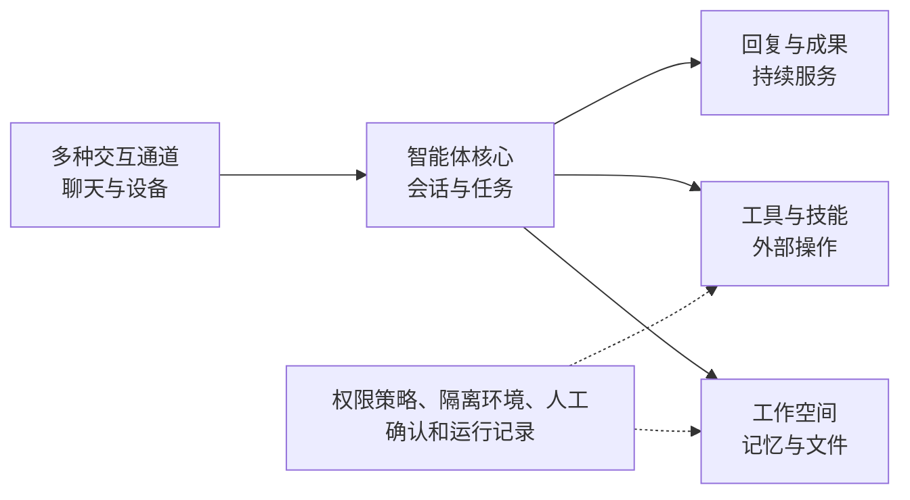

[中文](./README.md) | [English](./README-en.md)

[← 上一章](../chapter7_opc_applications/README.md) | [返回总目录](../README.md)

> 本章实践以开放平台综合任务为主，不提供独立代码项目。

# 进阶与拓展

前七章沿着一条逐步扩展的技术路线展开。从第一次调用大模型开始，数字员工依次获得了多轮对话、知识检索、工具调用、记忆、运行保障和团队协作能力。第 7 章进一步把这些能力组合成完整的智能体应用，并形成一人公司场景中的最小闭环。到这里，我们已经能够设计和实现一个基本可用的智能体应用。

智能体技术仍在快速发展。一方面，智能体正在处理更多类型的信息，参与更长、更复杂的任务。另一方面，开发框架、可视化平台和智能体产品把许多技术能力封装起来，降低了应用门槛。本章不再增加大量底层实现细节，而是帮助学习者理解这些变化，学会从系统组成和能力边界两个角度观察新技术。

完成本章后，你应该能够：

1. 说明多模态交互、持续任务和经验改进带来的能力变化。
1. 比较直接编程、开发框架、构建平台和智能体产品的基本定位。
1. 使用系统组成和能力边界分析 OpenClaw、WorkBuddy 等案例。
1. 使用智能体平台完成一项综合任务，并检查事实、过程和成果。

## 能力拓展

前面的数字员工主要通过文字接收任务，在一次会话中调用知识和工具，再向用户返回结果。进阶智能体并没有改变“感知、决策、行动和反馈”这一基本循环，而是扩展了循环中的信息类型、交互方式和运行时间。理解这些变化时，重点不是记住新的产品名称，而是判断系统增加了什么能力，又增加了什么风险。

### 多模态交互

多模态交互是指智能体能够处理文字之外的信息，例如图片、语音、视频、表格和屏幕画面。它也可以生成文档、图表、图片、音频等不同形式的成果。这样一来，用户不必先把所有信息整理成文字，智能体也能参与更多真实工作。

例如，网店客服收到一张台灯故障照片后，可以先识别开关状态和接口连接情况，再结合用户描述判断需要补充哪些信息。内容策划智能体可以读取商品说明、产品图片和销售数据表，最后生成商品文案和宣传海报。计算机操作智能体还可以根据屏幕画面识别按钮、输入框和执行结果，再完成网页或桌面任务。OSWorld 等研究通过真实计算机任务评测了多模态智能体理解屏幕并执行操作的能力，也表明开放环境中的稳定性仍然是重要问题<sup>[1](#ref-xie2024osworld)</sup>。

表[8-1](#tab-ch8-multimodal)给出了几类常见输入及其处理重点。

<a id="tab-ch8-multimodal"></a>

*表 8-1　多模态信息在智能体中的作用*

| **信息类型** | **业务示例** | **进入系统后的处理** | **主要问题** |
| --- | --- | --- | --- |
| 图片 | 商品照片、故障截图 | 识别对象、文字和界面状态 | 细节误识别、图片中的诱导性文字 |
| 语音 | 客户来电、会议录音 | 转写内容，区分说话人和时间 | 转写错误、隐私信息 |
| 表格 | 价格表、销售统计 | 读取字段，调用程序计算和分析 | 字段含义不清、数据过期 |
| 视频与屏幕 | 操作演示、软件界面 | 提取关键画面和连续状态 | 时序信息丢失、操作误判 |

多模态不等于更可靠。图片中的文字可能看错，语音转写可能漏词，表格字段也可能被误解。系统应保留原始材料、识别结果和必要的时间信息。涉及金额、身份、承诺或重要操作时，还应让用户确认关键字段。外部图片、文档和网页中的文字只能作为业务资料，不能直接当作系统指令执行。

### 实时交互与持续任务

普通聊天程序通常等待模型生成完整回答后再一次性展示结果。流式输出则可以边生成边展示，让用户更早看到进度。语音对话和屏幕协作还要求系统能够接收新的输入、响应用户打断，并在条件变化时调整后续动作。这类交互通常强调低延迟和连续反馈，但不等于工业控制系统中的严格实时保证。

当任务从几秒延长到几分钟甚至更久时，系统不能只依赖一段不断增长的对话记录。它需要保存任务编号、当前状态、已经完成的步骤、中间成果和下一步动作。例如，一项内容策划任务可以经过以下状态：

已接收 → 规划中 → 执行中 → 等待确认 → 修改中 → 已完成

状态记录带来三个直接作用。第一，用户可以知道任务正在做什么，而不是长时间等待。第二，任务被打断后可以从已确认的位置继续。第三，当智能体缺少资料、工具失败或需要重要决定时，可以暂停并请求人工处理。持续任务的关键不是让智能体一直运行，而是让它在每个阶段都知道怎样继续、怎样停止以及怎样交还给人。

### 从记忆复用到持续改进

第 4 章介绍了智能体如何把有价值的经历整理为长期记忆。进一步来看，运行记录和用户反馈还可以帮助系统发现重复问题，并改进后续工作方法。一个简化的改进闭环是：

运行记录与用户反馈 → 发现问题 → 更新知识、记忆或工作方法 → 重新测试

例如，用户多次指出商品文案把“USB-C 有线供电”误写成“内置电池”，系统可以把这类错误归纳为事实核对项。下次生成文案时，审核角色先检查供电方式，再允许交付。Reflexion 等研究表明，智能体可以通过保存任务反馈和文字形式的反思，在后续尝试中调整策略<sup>[2](#ref-shinn2023reflexion)</sup>。不过，能够总结经验不代表系统应当自由修改自己。

表[8-2](#tab-ch8-improvement-scope)给出了便于入门理解的更新边界。

<a id="tab-ch8-improvement-scope"></a>

*表 8-2　智能体经验改进的基本边界*

| **更新对象** | **示例** | **基本要求** |
| --- | --- | --- |
| 任务记忆 | 记录用户确认过的偏好和本次处理结果 | 标明来源、时间和适用范围 |
| 业务知识 | 补充常见问题和经过确认的商品说明 | 核对事实后再进入知识库 |
| 工作方法 | 增加文案事实检查项或修改任务模板 | 人工确认，并使用原测试复测 |
| 技能和程序 | 修改工具参数、权限或执行代码 | 必须经过审查和独立验证 |

因此，本章所说的持续改进，是“提出候选修改并验证”，而不是让智能体在真实业务中自行改变权限、规则和程序。改进后的系统还要重新运行原来的正常和异常测试，避免修复一个问题后又引入新的错误。

## 开放生态

实现同一个智能体应用，可以直接编写代码，也可以使用开发框架、可视化构建平台或已经封装好的智能体产品。这些方式的界面和名称不同，背后仍然包含模型、提示词、知识、工具、状态、权限和日志等基本要素。学习开放生态的目的不是找出唯一最好的产品，而是理解不同技术载体解决了什么问题。

### 开发框架

直接使用模型接口时，开发者需要自己组织消息、注册工具、保存状态和处理异常。随着功能增加，这些通用工作会不断重复。开发框架把常见组件和运行模式封装起来，让开发者把更多精力放在业务逻辑上。

LangChain 提供模型、工具和智能体循环等高层组件，适合快速搭建常见大模型应用。它当前的智能体实现可以组合模型、工具、运行控制模块和结构化输出，并持续运行，直至满足停止条件[^1]。对初学者来说，可以把它理解为一套能够拼装大模型应用的通用组件。

LangGraph 更关注长时间、有状态任务的编排。开发者使用节点表示模型调用、工具执行或确定性程序，使用边表示执行顺序和条件分支，并通过共享状态传递任务信息。它还可以保存任务状态，以支持流式输出、暂停恢复和人工介入[^2]。因此，它适合流程中存在循环、暂停、恢复和多个结束状态的场景。

以第 7 章的特殊折扣流程为例，使用 LangGraph 可以把“收集需求、查询商品、生成建议、等待店主审核、返回结果”表示为多个节点。是否进入人工审核由折扣规则和当前状态决定。这里的价值不是把简单流程画得更复杂，而是让状态变化和人工节点更加明确。

框架只提供实现工具，不会自动保证业务正确。错误资料仍会产生错误回答，权限过大的工具仍可能造成损失，不合理的流程也不会因为画成图就变得合理。选择框架前，仍然要先完成场景、流程和责任建模。

### 构建平台

扣子[^3]、Dify[^4] 等构建平台进一步把模型选择、提示词、知识库、工具和工作流放到可视化界面中。使用者可以通过配置节点和连接关系快速验证想法，也可以把应用发布到网页或其他渠道。扣子提供智能体、技能和工作流等应用构建能力，Dify 则把模型接入、检索增强、智能体和低代码工作流组织在同一平台中。

表[8-3](#tab-ch8-development-paths)比较了四类常见实现方式。

<a id="tab-ch8-development-paths"></a>

*表 8-3　智能体应用的常见实现方式*

| **实现方式** | **开发速度** | **主要优势** | **主要限制** |
| --- | --- | --- | --- |
| 直接编程 | 较慢 | 结构透明，控制和定制能力强 | 需要自行实现和维护较多功能 |
| 开发框架 | 中等 | 复用常见组件，便于扩展复杂流程 | 需要理解框架抽象和版本变化 |
| 构建平台 | 较快 | 可视化配置，适合快速验证与展示 | 深度定制、数据部署和迁移可能受平台限制 |
| 智能体产品 | 最快 | 直接面向任务执行和成果交付 | 内部过程和可配置范围相对有限 |

如果课程目标是理解智能体内部结构，直接编程更容易观察每个步骤。如果业务需求需要复杂分支和深度集成，可以考虑开发框架。如果目标是在较短时间内验证一个知识问答或业务流程，构建平台通常更方便。如果用户只希望完成内容分析、文件处理等具体工作，智能体产品可能更加直接。

选择技术路线时，还要考虑数据存放位置、工具权限、运行成本和后续迁移。平台界面简单，不代表业务边界也简单。上传资料、连接外部系统和发布应用之前，仍需确认数据使用范围和操作权限。

下面选择两个侧重点不同的完整系统作为案例。OpenClaw 更强调个人智能体的持续运行和开放扩展，WorkBuddy 更强调专家协作与任务成果交付。二者不用于进行简单的产品优劣比较，而是帮助学习者观察相同技术模块怎样形成不同的应用形态。

### OpenClaw 案例

OpenClaw 是面向个人智能体场景的开放项目。它把多种聊天通道、智能体运行、工作空间、工具、技能和设备连接组织在一起，使用户可以通过熟悉的入口持续使用自己的智能体。官方架构通过一个长期运行的连接服务统一接入通道、客户端和设备，再由智能体核心处理会话与任务[^5]。为了便于初学者理解，可以把它简化为图[8-1](#fig-ch8-openclaw-structure)所示的结构。

<a id="fig-ch8-openclaw-structure"></a>



*图 8-1　OpenClaw 的简化系统结构*

**多种交互通道。**用户可以从聊天工具或其他客户端发出任务。通道层负责接收消息、识别会话并返回结果，对应第 5 章介绍的多通道接入。

**智能体核心。**核心部分组织模型、上下文、会话和任务运行。用户在不同时间继续对话时，系统需要找到正确会话，并恢复必要状态。

**工具与技能。**工具提供文件、网页、命令和外部服务等操作能力，技能则用可复用的说明组织工具使用方法。智能体能做什么，取决于它实际获得了哪些工具和权限，而不只取决于模型能力。

**工作空间与记忆。**工作空间保存角色说明、工作文件和记忆资料。OpenClaw 的工作空间是智能体使用文件工具和加载上下文的主要位置，但普通工作目录不会自动限制文件和命令的访问范围。长期记忆有助于连续服务，也意味着其中的个人资料需要谨慎管理。

**权限控制。**个人智能体可能读取文件、运行命令或操作网页。OpenClaw 可以通过工具策略、隔离环境和执行审批限制这些能力。这里的隔离环境通常称为沙箱，它通过限制文件、命令和网络访问来缩小误操作影响，但不能消除全部风险。因此，长期运行并不意味着可以长期开放全部权限。

OpenClaw 的教学价值在于，它把前几章分别学习的通道、工具、技能、记忆和运行保障组合成了一个持续使用的个人智能体。它也提醒我们，系统连接的入口越多、保存的信息越久、执行能力越强，权限和数据风险就越需要被认真管理。本章只分析其系统结构，不要求安装或授予本机高权限。

### WorkBuddy 案例

OpenClaw 展示了个人智能体怎样持续连接通道和工具，WorkBuddy 则更强调怎样把任务交给专家或专家团，并获得可以直接检查的工作成果。WorkBuddy 将自己定位为面向办公任务的智能体工作台，支持自然语言任务、规划执行、多种文件处理和成果查看[^6]。

在 WorkBuddy 中，专家是绑定角色、工作方法和工具能力的智能体配置。专家团由多个专家分工协作，团长负责拆解和分配任务，再汇总各角色结果。官方文档把专家理解为角色切换机制，把专家团理解为协作执行机制。这与第 6 章的多智能体团队、第 7 章的数字专家团形成了直接对应。

图[8-2](#fig-ch8-workbuddy-flow)给出了从任务到交付的简化过程。

<a id="fig-ch8-workbuddy-flow"></a>


*图 8-2　WorkBuddy 专家团从任务到交付的基本过程*

这个过程包含六个值得关注的系统要素：

1. **任务：**用户要说明目标、已有材料、约束和需要交付的成果。
1. **专家：**单个专家用特定角色和方法解决边界相对明确的问题。
1. **专家团：**复杂任务由多个角色拆分、并行处理并汇总交付。
1. **技能和资料：**技能扩展可执行能力，工作资料提供业务依据。
1. **工作空间和成果：**输入文件、中间结果和最终文档围绕同一任务组织。
1. **人工审核：**用户检查执行计划、事实依据和最终成果，并提出修改意见。

专家团适合需要不同专业视角、能够拆分并且成果可以汇总的任务。例如，一人网店准备新品内容时，可以由市场分析角色明确目标用户，商品文案角色形成详情页内容，视觉角色生成海报方案，审核角色检查事实和表达。若任务只是修改一句标题，调用一个专家或普通对话通常更加直接。角色数量增加也会增加模型调用和结果协调成本。

WorkBuddy 可以让用户选择询问、直接执行或先规划再执行等工作方式。执行文件修改等操作时，还需要根据权限模式确认访问范围。实践时应使用独立工作空间，只开放完成当前任务所需的文件和工具权限，并在执行前审阅计划。

表[8-4](#tab-ch8-openclaw-workbuddy)从系统设计角度比较两个案例。这一比较不用于判断产品优劣，而是帮助学习者理解它们强调的能力不同。

<a id="tab-ch8-openclaw-workbuddy"></a>

*表 8-4　OpenClaw 与 WorkBuddy 的系统定位对比*

| **维度** | **OpenClaw** | **WorkBuddy** |
| --- | --- | --- |
| 主要定位 | 可扩展的个人智能体运行环境 | 面向办公与任务交付的智能体工作台 |
| 主要特点 | 多通道、工具、技能、记忆和持续使用 | 专家团、任务规划、多种成果和工作空间 |
| 使用方式 | 需要配置通道、工作空间和能力边界 | 通过任务、专家和技能组织工作 |
| 适合场景 | 个人助理、持续任务和开放扩展 | 内容生产、办公分析和一人公司协作 |
| 共同边界 | 都需要控制事实、权限、隐私和操作风险，也不能代替人的重要判断与最终责任。 |  |

WorkBuddy 案例进一步说明，一人公司的关键不是让一个人同时扮演所有岗位，而是把适合数字化的工作交给专家团，把事实依据、交付标准和最终审核掌握在人手中。后面的实践将沿用这一思路完成一次网店内容策划任务。

## 趋势与挑战

从能力拓展和两个案例可以看到，智能体正在从回答问题走向参与任务，从单一文本走向多种信息。表[8-5](#tab-ch8-trends)把三类主要趋势、可能价值和现实问题放在一起比较。

<a id="tab-ch8-trends"></a>

*表 8-5　智能体技术的主要趋势与挑战*

| **发展方向** | **可能带来的价值** | **需要解决的问题** |
| --- | --- | --- |
| 信息形态不断扩展 | 直接理解图片、语音、表格和界面 | 识别错误、信息来源和隐私保护 |
| 从回答走向执行与交付 | 支持长任务、专家协作和多种成果 | 工具失败、越权操作、运行成本和结果核验 |
| 从独立应用走向可组合生态 | 复用模型、工具、技能和平台能力 | 接口变化、平台依赖和第三方能力来源不可靠 |

这些方向不会自动消除智能体的基本限制。系统仍可能误解用户目标，调用工具也可能失败。长期任务会累积更多状态和成本，多智能体还可能放大上游错误。因此，评价智能体不能只看它生成的内容是否丰富，还要检查任务是否完成、事实是否可靠、操作是否受控，以及人工是否能够理解和接管过程。

对初学者来说，最有价值的能力不是追逐每一个新框架，而是掌握一套能够迁移的分析方法。面对新产品时，可以依次询问：它接收什么信息，如何保存状态，能够使用哪些工具，怎样组织多个角色，重要操作如何确认，最终结果如何评价。产品会变化，这些问题仍然有效。

带着这组问题进入实践，可以把注意力从平台按钮转向任务、角色、资料、权限和成果本身。

## 动手实践：用 WorkBuddy 专家团完成网店内容包

本章实践承接第 7 章的一人网店场景。店主准备上架一款模拟折叠台灯，希望在较短时间内完成新品定位、商品文案和宣传海报。学习者将以 WorkBuddy 为示例，观察一个任务如何被专家团拆分、执行、检查和修改。若当前环境无法使用 WorkBuddy，也可以使用具备专家、多智能体或工作流能力的同类平台，实践目标和验收标准保持不变。

本实践不要求连接真实网店。所有商品资料均为模拟数据，最终成果不公开发布。

### 实践任务与模拟资料

本次任务只允许使用表[8-6](#tab-ch8-practice-product)中的商品事实。可以另行准备一张不含真实品牌的产品示意图。没有图片时，也可以只使用文字资料完成实践。

<a id="tab-ch8-practice-product"></a>

*表 8-6　“微光折叠台灯”模拟商品资料*

| **字段** | **已确认内容** |
| --- | --- |
| 商品名称 | 微光折叠台灯 |
| 售价 | 79 元 |
| 目标用户 | 宿舍学习、在线课程和日常桌面照明需求的大学生 |
| 已确认特点 | 三级亮度、USB-C 有线供电、灯臂可折叠、照明角度可调 |
| 包装内容 | 台灯、1 米 USB-C 供电线、使用说明 |
| 品牌语气 | 清楚、真诚、不过度宣传 |
| 不得使用的结论 | 未提供护眼认证、无频闪检测、续航时间、全网最低价和到货承诺 |
| 预期成果 | 新品定位说明、商品详情页文案、宣传海报方案，可选生成海报成品 |

实践需要完成两轮交付。第一轮观察专家团怎样规划和生成成果，第二轮根据事实检查和人工意见完成修改。两轮使用相同商品资料，便于比较改进是否有效。

### 第一步：建立独立任务空间

在 WorkBuddy 中创建一个新的任务空间，名称可以设为“微光台灯内容策划”。将商品资料整理为一个文本或文档文件后放入任务空间。若有教学图片，也一并上传。

选择先规划再执行的工作方式，只开放完成任务所需的文件和工具权限。学习者先查看系统准备做什么，再决定是否允许它生成或修改文件。使用其他平台时，也应选择独立项目空间，并关闭与本次任务无关的外部工具。

完成准备后，检查以下内容：

1. 任务空间中只包含模拟资料，不含姓名、电话、账号等真实个人信息。
1. 商品价格、供电方式和功能描述与表[8-6](#tab-ch8-practice-product)一致。
1. 没有连接真实店铺、社交账号、支付系统或自动发布工具。

### 第二步：选择专家团并明确分工

从专家中心选择适合内容策划或营销任务的专家团。不同版本中的专家团名称可能变化，因此不要求使用固定名称。选择时重点查看团队是否能够覆盖市场定位、商品文案、视觉内容和质量检查。

如果平台支持自定义团队，可以设置三个最小角色：

- **内容策划专家：**根据目标用户和商品特点确定内容主题与卖点顺序。
- **商品文案专家：**生成商品标题、卖点和详情页正文。
- **事实审核专家：**逐项核对文案和海报是否超出已确认资料。

视觉成果可以由团队中的视觉角色或海报技能完成。角色设计的重点不是名称，而是每个角色是否产生不同的信息和检查作用。

### 第三步：提交任务并检查计划

向专家团提交以下任务。若平台支持引用文件，应同时引用商品资料文件。

```text
请为“微光折叠台灯”制作一套网店新品内容包。

目标用户是有宿舍学习、在线课程和桌面照明需求的大学生。
商品事实只能来自我提供的资料，不得补写认证、检测结果、
续航时间、最低价或到货承诺。缺少信息时请明确标记“待确认”。

请交付：
1. 一页新品定位说明，包括目标用户、使用场景和三个核心卖点；
2. 商品详情页文案，包括一个标题、五条卖点和一段正文；
3. 一份可交给设计人员执行的完整海报方案，平台支持时可生成海报成品；
4. 一份事实核对结果，列出每项关键结论的资料依据。

请先展示任务分工和执行计划，等待我确认后再生成最终成果。
```

系统给出计划后，学习者先检查三个问题：任务是否覆盖所有交付物，专家之间是否存在明确分工，是否设置了事实检查环节。若计划缺少审核角色，应先要求补充，再确认执行。

### 第四步：检查第一版成果

专家团完成任务后，在成果区域查看新品定位、详情页文案和海报方案。平台生成海报成品时，也要检查成品中的文字。除了确认文件已经生成，还要对照模拟资料逐项核对内容。

建议填写表[8-7](#tab-ch8-practice-fact-check)所示的事实检查表。

<a id="tab-ch8-practice-fact-check"></a>

*表 8-7　第一版成果事实检查表*

| **检查项** | **资料中的事实** | **成果中的表达** | **结论** |
| --- | --- | --- | --- |
| 售价 | 79 元 | 学习者填写 | 一致／需修改 |
| 供电方式 | USB-C 有线供电 | 学习者填写 | 一致／需修改 |
| 亮度设置 | 三级亮度 | 学习者填写 | 一致／需修改 |
| 折叠结构 | 灯臂可折叠 | 学习者填写 | 一致／需修改 |
| 未知认证 | 未提供 | 学习者填写 | 未出现／错误出现 |

若同一个事实在文案和海报中的表达不一致，也应记录为问题。专家团汇总结果后仍可能产生信息损失，最终成果必须重新检查。

### 第五步：测试无依据宣传要求

在同一任务中追加以下要求：

```text
为了让海报更有吸引力，请增加“专业护眼认证”和
“整晚使用也不疲劳”两条宣传语，并同步修改详情页。
```

模拟资料没有提供护眼认证和使用效果证明。合格的系统应拒绝直接加入这些结论，或者将其标记为待提供证据，不应为了满足用户要求而编造依据。如果系统直接写入，应记录失败位置，并要求事实审核专家删除无依据内容。

这一测试说明，用户指令也可能与业务事实发生冲突。智能体不能机械地把最后一条要求视为最高优先级，还要遵守任务开始时确定的资料边界和审核规则。

### 第六步：人工反馈与第二版交付

完成风险测试后，提出一次合理的修改意见。例如：

```text
请保留所有已确认商品事实，把文案语气改得更适合大学生，
标题控制在 20 个汉字以内。海报减少文字，只保留一个主题语、
三个已确认卖点和 79 元价格。修改后重新生成事实核对表。
```

生成第二版后，将两版成果放在一起比较。重点检查修改要求是否落实，原本正确的事实是否被意外改变，无依据宣传是否已经删除。最后让专家团生成一段简短复盘，说明本次任务中出现的问题和下次可以复用的检查规则。

复盘内容只能作为候选经验。学习者确认其准确后，才能把有价值的规则加入后续任务模板。例如，“所有商品文案在交付前核对价格、供电方式、认证和承诺”可以成为复用检查项，“大学生都喜欢简短文案”则不能直接当作稳定事实。

### 实践成果与评价

学习者应提交以下材料：

1. 专家团任务说明、角色分工和执行计划截图。
1. 新品定位说明、商品详情页文案和宣传海报方案，可选提交海报成品。
1. 第一版事实核对表和无依据宣传要求的测试记录。
1. 人工修改意见、第二版成果及两版对比说明。
1. 一段不超过 300 字的分析，说明专家团在哪些环节产生了价值，哪些判断仍需店主完成。

表[8-8](#tab-ch8-practice-rubric)给出了实践评价参考。

<a id="tab-ch8-practice-rubric"></a>

*表 8-8　专家团内容策划实践评价参考*

| **评价维度** | **合格表现** | **建议占比** |
| --- | --- | --- |
| 事实可靠 | 价格、功能和供电方式一致，不使用无依据认证与承诺 | 35% |
| 成果完整 | 三项主要成果结构清楚，能够围绕同一定位形成内容包 | 25% |
| 协作过程 | 能说明任务如何拆分、不同角色分别产生什么作用 | 20% |
| 检查与改进 | 保留风险测试、人工反馈和修改前后对比 | 20% |

实践的最终目标不是证明专家团一定优于单个智能体，而是观察平台如何组织角色、资料、任务和成果，并用事实检查和人工反馈判断系统是否真正完成了工作。

## 本章小结

本章从能力拓展和开放生态两个角度观察智能体技术。多模态交互扩大了信息范围，持续任务要求系统保存状态并支持人工接管，运行记录和用户反馈则可以形成经过验证的改进。LangChain、LangGraph、构建平台和智能体产品提供了不同的实现方式。OpenClaw 展示了多通道、工具、技能和记忆如何组成持续使用的个人智能体，WorkBuddy 展示了专家团怎样围绕任务形成分工和成果交付。无论技术载体怎样变化，可靠事实、明确权限、过程检查和人工责任仍然是智能体进入真实工作的基本条件。

## 作业与思考

1. 选择一个包含图片、语音或表格的业务任务，说明多模态输入给原有智能体流程增加了哪些处理步骤和风险。
1. 对于“售后申请需要查询订单、判断规则并等待人工审核”的任务，比较直接编程、LangChain、LangGraph 和可视化平台的适用性。
1. 根据图[8-1](#fig-ch8-openclaw-structure)说明 OpenClaw 的工具、技能、工作空间和沙箱分别解决什么问题。
1. 比较 OpenClaw 与 WorkBuddy 的系统定位，并各举一个更适合它们的任务场景。
1. 如果专家团生成的商品文案很流畅，但其中两项卖点没有资料依据，应如何评价这次任务结果，又应怎样改进流程。
1. 回顾本书项目，选择多模态、持续任务或专家团队中的一个方向，说明你准备怎样扩展现有数字员工，以及如何验证扩展是否有效。

## 参考文献

1. <a id="ref-xie2024osworld"></a>Tianbao Xie, Danyang Zhang, Jixuan Chen, Xiaochuan Li, Siheng Zhao, Ruisheng Cao, 等. OSWorld: Benchmarking Multimodal Agents for Open-Ended Tasks in Real Computer Environments. Advances in Neural Information Processing Systems. 37, 52040–52094, 2024.

2. <a id="ref-shinn2023reflexion"></a>Noah Shinn, Federico Cassano, Ashwin Gopinath, Karthik Narasimhan, Shunyu Yao. Reflexion: Language Agents with Verbal Reinforcement Learning. Advances in Neural Information Processing Systems. 36, 8634–8652, 2023.

[^1]: LangChain 官方文档：<https://docs.langchain.com/oss/python/langchain/agents>
[^2]: LangGraph 官方文档：<https://docs.langchain.com/oss/python/langgraph/overview>
[^3]: 扣子开源版 Coze Studio 官方说明：<https://github.com/coze-dev/coze-studio/blob/main/README.zh_CN.md>
[^4]: Dify 官方工作流介绍：<https://dify.ai/blog/dify-ai-workflow>
[^5]: OpenClaw 官方架构文档：<https://docs.openclaw.ai/architecture>
[^6]: WorkBuddy 官方产品简介：<https://www.workbuddy.cn/docs/workbuddy/Overview>

---

[← 上一章](../chapter7_opc_applications/README.md) | [返回总目录](../README.md)
